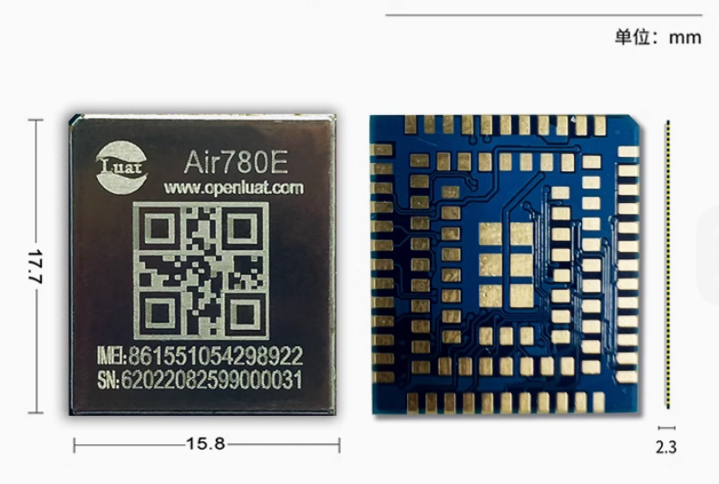

# 合宙Air780E模组资料中心

- [合宙Air780E模组AT资料中心](https://docs.openluat.com/air780e/at/)
- [合宙Air780E模组LuatOS资料中心](https://docs.openluat.com/air780e/luatos/)

## 选型合宙4G-Cat.1模组Air780E时，我应该注意什么？

Air780E是合宙低功耗4G-Cat.1模组经典型号之一，累计出货数量2000万+，广泛应用于物联网各行业。在此，特别感谢各位大佬的信任与支持。

### 写这篇文档的目的是什么呢？

从用户的角度，
解答大家对Air780E这款模组最关心的问题；

不深入探究技术细节，
更多从选型、应用等非技术维度展开。

阅读本篇文档之前，建议先详细阅读一遍合宙产品选型手册。

> 最新合宙产品选型手册下载：
> https://docs.openluat.com/product/

### 一、Air780E核心信息描述

模组正反照片

管脚透视图

- Air780E是一款面向国内的全网通模组，支持移动、电信、联通三大运营商；
- Air780E封装尺寸是16\*18\*2.3mm，仅比合宙Air700ECQ/Air700EAQ/Air700EMQ相对大一些；
- Air780E软件上既支持传统的AT指令，也支持合宙基于Lua脚本开发的嵌入操作系统LuatOS；
- Air780E硬件上支持丰富的外设管脚，比如：USB、UART、SPI、I2C、PWM、GPIO等；
- Air780E支持丰富的网络协议，比如：TCP/UDP、TCP-SSL/TCP-TLSMQTT、HTTP、WEBSOCKET、NTP等；
- Air780E不支持TTS语音播放，也不支持VoLTE语音通话，需要支持这两个功能的应用推荐选择合宙Air724UG；
- Air780E功耗表现在合宙现有模组中排名中等，低功耗模式下低于0.5mA；低功耗表现最好的模组型号是合宙Air780EPS。

### 二、Air780E实网功耗数据

合宙4G-Cat.1模组支持三种功耗模式：常规模式、低功耗模式、PSM+模式，可按实际开发需求选择。

**Air780E实网功耗数据如下：**

| Air780E                                                      | 常规模式                    | 低功耗模式                                   | PSM+模式                                                  |
| ------------------------------------------------------------ | --------------------------- | -------------------------------------------- | --------------------------------------------------------- |
| 4G在线状态                                                   | 在线，长连接                | 在线，长连接                                 | 离线，飞行模式                                            |
| 定时器唤醒                                                   | 支持                        | 支持                                         | 支持                                                      |
| 中断唤醒                                                     | 支持                        | 支持                                         | 支持                                                      |
| 串口唤醒                                                     | 支持                        | 支持，唤醒时波特率需先设置为9600bps          | 支持，唤醒时波特率需先设置为9600bps                       |
| 服务器4G唤醒                                                 | 支持，1秒内                 | 支持，1秒内                                  | 不支持                                                    |
| 上行发送                                                     | 1秒内响应                   | 1秒内响应                                    | 1.5秒内响应                                               |
| VEXT电源输出状态                                             | 保持输出                    | 不能保持输出，也不能保持关闭，间歇性输出状态 | 不能保持输出，也不能保持关闭，间歇性输出状态              |
| 所有GPIO管脚是否可以控制输出电平                             | 可以                        | 不可以                                       | 不可以                                                    |
| 常规GPIO管脚是否可以保持电平                                 | 可以                        | 不可以                                       | 不可以                                                    |
| 特殊AGPIO管脚是否可以保持电平                                | 可以                        | 可以                                         | 可以                                                      |
| RAM供电及唤醒后软件运行状态                                  | RAM供电，正常工作，满血状态 | RAM供电，唤醒后保持原状态运行                | RAM掉电，唤醒后程序从初始状态运行(PSM+状态前运行数据丢失) |
| 典型功耗表现                                                 | 较低(4.7mA)                 | 均衡(0.45mA)                                 | 极低(3uA)                                                 |

**测试环境：**

1. Air780E，供电电压3.8V，移动网络，频段B3，RSRP值-88附近，DRX 2.56秒，心跳间隔5分钟，心跳数据100Byte，TCP协议，合宙服务器，回环测试；
2. Air780E，同等环境下，低功耗模式，DRX 1.28秒时，平均电流0.65mA，DRX 0.64秒时，平均电流0.85mA；
3. Air780E，同等环境下，常规模式，DRX 1.28秒时，平均电流4.8mA，DRX 0.64秒时，平均电流4.9mA；
4. DRX，Discontinuous Reception，非连续接收，可简单理解为模块与基站之间保持心跳的间隔，一般为0.64秒/1.28秒/2.56秒，需要注意的是，DRX由基站根据网络实际情况而定，模组无法自行控制；
5. Air780E功耗表现在合宙现有模组中排名中等，低功耗模式下低于0.5mA，低功耗表现最好的模组型号是合宙Air780EPS；

### 三、780E之AT指令

合宙4G-Cat.1模组支持AT指令开发，AT指令核心功能一览表如下所示：

| 功能点        | Air700ECQ Air700EAQ Air700EMQ Air780EQ | Air780ER | Air780EP | Air780E Air780EX | Air780EPS | Air724UG | Air780EEN Air780EEU Air780EEJ | Air780EG | 备注说明                                                     |
| ------------- | -------------------------------------- | -------- | -------- | ---------------- | --------- | -------- | ----------------------------- | -------- | ------------------------------------------------------------ |
| 基础指令      | Y                                      | Y        | Y        | Y                | Y         | Y        | Y                             | Y        |                                                              |
| TCP/UDP       | Y                                      | Y        | Y        | Y                | Y         | Y        | Y                             | Y        |                                                              |
| HTTP          | Y                                      | Y        | Y        | Y                | Y         | Y        | Y                             | Y        |                                                              |
| MQTT          | Y                                      | Y        | Y        | Y                | Y         | Y        | Y                             | Y        |                                                              |
| FTP           | Y                                      | Y        | Y        | Y                | Y         | Y        | Y                             | Y        |                                                              |
| NTP           | Y                                      | Y        | Y        | Y                | Y         | Y        | Y                             | Y        | NetworkTimeProtocol,网络时间协议                             |
| SSL           | Y                                      | Y        | Y        | Y                | Y         | Y        | Y                             | Y        | TLS/SSL配置                                                  |
| FS            | Y                                      | Y        | Y        | Y                | Y         | Y        | Y                             | Y        | 建立文件,枚举文件,传输TLS/SSL证书                            |
| SMS           | Y                                      | Y        | Y        | Y                | Y         | Y        | Y                             | Y        | 短信功能，Air724UG支持移动联通电信， 其余型号仅支持移动联通，电信不支持 |
| WiFiScan      | Y                                      | Y        | Y        | Y                | Y         | Y        | Y                             | Y        | WiFi扫描,用于定位                                            |
| LBS           | Y                                      | Y        | Y        | Y                | Y         | Y        | Y                             | Y        | 基站定位                                                     |
| GPS           | N                                      | N        | N        | N                | N         | N        | N                             | Y        | 定位功能                                                     |
| TTS           | N                                      | N        | N        | N                | N         | Y        | N                             | N        | Text To Speech                                               |
| VoTLE         | N                                      | N        | N        | N                | N         | Y        | N                             | N        | 语音通话                                                     |
| PPP           | N                                      | Y        | N        | N                | N         | N        | N                             | N        | PPP拨号上网                                                  |
| USB_RNDIS_ECM | N                                      | Y        | N        | N                | N         | N        | N                             | N        | USB网络驱动                                                  |

### 四、Air780E之LuatOS

> 注意：合宙最近在针对技术文档做新一轮的梳理，LuatOS功能库持续开发和解锁中。

| 功能点                                 | Air780EQ      | Air700ECQ/Air700EAQ/Air700EMQ | Air780E       | Air780EG      | Air780EP             | Air780EPS            | Air724UG | 备注                        |
| -------------------------------------- | ------------- | ----------------------------- | ------------- | ------------- | -------------------- | -------------------- | -------- | --------------------------- |
| 总Flash                                | 4M            | 4M                            | 5MB           | 5MB           | 4MB                  | 8MB                  | 16M      |                             |
| 用户代码可用Flash （含脚本和脚本FOTA） | 1.4M          | 1.4M                          | >1.6MB        | >1.6MB        | <1.6MB               | <5MB                 | >4M      |                             |
| 总RAM                                  | 1M            | 1M                            | 2MB(SRAM)     | 2MB(SRAM)     | 2MB(SRAM)+2MB(PSRAM) | 2MB(SRAM)+2MB(PSRAM) | 8M(SRAM) |                             |
| TCP/UDP                                | 2路           | 2路                           | 6路           | 6路           | 6路                  | 6路                  | 8路      |                             |
| TCP-SSL/TCP-TLS                        | 1路           | 1路                           | 2路           | 2路           | 2路                  | 2路                  | 4路      |                             |
| MQTT                                   | Y             | Y                             | Y             | Y             | Y                    | Y                    | Y        | mqtt通信                    |
| HTTP                                   | Y             | Y                             | Y             | Y             | Y                    | Y                    | Y        | http通信                    |
| FTP                                    | Y             | Y                             | Y             | Y             | Y                    | Y                    | Y        | ftp通信                     |
| WEBSOCKET                              | Y             | Y                             | Y             | Y             | Y                    | Y                    | Y        | websocket通信               |
| NTP网络对时                            | Y             | Y                             | Y             | Y             | Y                    | Y                    | Y        | 时钟,必带                   |
| JSON                                   | Y             | Y                             | Y             | Y             | Y                    | Y                    | Y        | json                        |
| SMS短信                                | Y(不支持电信) | Y(不支持电信)                 | Y(不支持电信) | Y(不支持电信) | Y(不支持电信)        | Y(不支持电信)        | Y        | 短信功能                    |
| 阿里云/腾讯云/百度云/华为云            | Y             | Y                             | Y             | Y             | Y                    | Y                    | Y        | 各种云平台的密钥计算        |
| REPL控制台repl                         | N             | N                             | N             | N             | N                    | N                    | Y        | 控制台repl                  |
| PROTOBUF                               | N             | N                             | Y             | Y             | Y                    | Y                    | Y        | 谷歌PB编解码                |
| RSA加密                                | N             | N                             | Y             | Y             | Y                    | Y                    | Y        | RSA加密                     |
| XXTEA加密                              | N             | N                             | Y             | Y             | Y                    | Y                    | Y        | XXTEA加密                   |
| 国密算法                               | N             | N                             | Y             | Y             | Y                    | Y                    | Y        | 国密加密                    |
| 加密解密md5/sha1/aes                   | Y             | Y                             | Y             | Y             | Y                    | Y                    | Y        | 加密/解密,md5/sha1之类      |
| 64位数据处理                           | Y             | Y                             | Y             | Y             | Y                    | Y                    | N        | 64位数据的处理库            |
| ICONV字符集转换                        | Y             | Y                             | Y             | Y             | Y                    | Y                    | Y        | 字符编码转换                |
| ZBUFF(C内存数组)                       | Y             | Y                             | Y             | Y             | Y                    | Y                    | N        | c风格内存数组, tcp/udp需要  |
| PACK数据编解码                         | Y             | Y                             | Y             | Y             | Y                    | Y                    | Y        | 数据打包解包                |
| zlib解压                               | Y             | Y                             | Y             | Y             | Y                    | Y                    | Y        | zlib压缩                    |
| 内部WDT硬狗                            | Y             | Y                             | Y             | Y             | Y                    | Y                    | Y        | 硬狗,必带                   |
| PM功耗管理                             | Y             | Y                             | Y             | Y             | Y                    | Y                    | Y        | 功耗管理                    |
| 低功耗模式                             | Y             | Y                             | Y             | Y             | Y                    | Y                    | N        | 长连接低功耗模式            |
| 接口类                                 |               |                               |               |               |                      |                      |          |                             |
| GPIO                                   | Y(仅AONGPIO)  | Y                             | Y             | Y             | Y                    | Y                    | Y        | 复用较多,数量见具体硬件手册 |
| UART                                   | Y(2个)        | Y(2个)                        | Y(2个)        | Y(1个)        | Y(3个)               | Y(3个)               | Y(3个)   | 串口通信/485/少量传感器     |
| I2C                                    | N             | Y                             | Y             | Y             | Y                    | Y                    | Y        | 传感器居多                  |
| SPI                                    | N             | Y                             | Y             | Y             | Y                    | Y                    | Y        | 传感器/各种外设/SPI屏幕     |
| ADC                                    | N             | Y                             | Y             | Y             | Y                    | Y                    | Y        | 测外部电压/供电电压/CPU温度 |
| PWM                                    | N             | Y                             | Y             | Y             | Y                    | Y                    | Y        | 输出方波,驱动马达           |
| GPS定位                                | N             | N                             | N             | Y             | N                    | N                    | N        | GPS定位功能                 |
| WIFISCAN                               | Y(共用天线)   | Y(共用天线)                   | Y(共用天线)   | Y(共用天线)   | Y(共用天线)          | Y(共用天线)          | Y        | WiFi扫描,用于WiFi定位       |
| 音频类                                 |               |                               |               |               |                      |                      |          |                             |
| 音频播放(MP3)                          | N             | N                             | N             | N             | N                    | N                    | Y        | 播放AMR/MP3                 |
| 录音                                   | N             | N                             | N             | N             | N                    | N                    | Y        | 录音                        |
| TTS                                    | N             | N                             | N             | N             | N                    | N                    | Y        | TTS                         |
| VOLTE                                  | N             | N                             | N             | N             | N                    | N                    | Y        | VoLTE                       |
| UI类                                   |               |                               |               |               |                      |                      |          |                             |
| SPI串口屏                              | N             | N                             | N             | N             | N                    | N                    | Y        | SPI屏幕                     |
| 墨水屏                                 | N             | N                             | N             | N             | N                    | N                    | Y        | 墨水屏驱动                  |
| OLED单色屏                             | N             | N                             | N             | N             | N                    | N                    | Y        | OLED驱动                    |
| 中文字体                               | N             | N                             | N             | N             | N                    | N                    | Y        | 字体管理                    |
| LVGL                                   | N             | N                             | N             | N             | N                    | N                    | Y        | LVGL                        |
| 摄像头                                 | N             | N                             | N             | N             | N                    | N                    | Y        | 摄像头功能                  |
| 扫码                                   | N             | N                             | N             | N             | N                    | N                    | Y        |                             |

### 五、Air780E之常见咨询

1. **Air780E支持C-SDK开发吗？**

    Air780E不支持C-SDK开发，推荐您使用LuatOS开发方式：

    LuatOS基于Lua脚本语言开发，Demo功能库齐全，文档丰富，用户只需定义好业务逻辑便可快速开发；

    LuatOS专用调试工具LuaTools，具备项目代码维护、软件下载、查看运行Trace，快速定位问题等功能。

2. **Air780E支持FOTA功能吗？**

    Air780E支持FOTA功能；

    合宙IoT平台iot.openluat.com
    可以对个人账号下的每一片模组进行FOTA管理。

    Air780E支持差分升级，无论AT软件，还是LuatOS软件，都可以通过合宙IoT后台进行FOTA升级。

3. **Air780E支持数据透传吗？**

    Air780E支持数据透传功能；无论AT指令，还是LuatOS，Air780E都可以方便的实现数据透传功能。

    如果您想更快速的实现设备上网功能，可以使用合宙的DTU模组或整机。
    详见：[dtu.openluat.com](dtu.openluat.com)

4. **Air780EX与Air780E什么关系？**

    Air780EX与Air780E封装尺寸完全相同；Air780EX是LCC邮票孔封装，相对Air780E的LGA封装，更方便手动焊接；

    Air780EX与Air780E软件完全通用，但由于Air780EX只有外围一圈硬件管脚，所以Air780EX的硬件管脚相对Air780E较少，且在管脚排列布局上稍有不同，产品设计时请注意这一点。

5. **Air780EQ/Air780EP/Air780EPS，与Air780E什么关系？**

    Air780EQ/Air780EP/Air780EPS与Air780E封装尺寸完全相同；

    就AT指令功能来讲：Air780EQ/Air780EP/Air780EPS与Air780E之间可以完全替代，但功耗表现有差异；

    就LuatOS二次开发来讲：Air780EQ/Air780EP/Air780EPS与Air780E之间除了功耗表现有差异外，个别功能和个别管脚上也存在区别，但大部分相同，需详细阅读硬件资料进行选择。

6. **Air780ER与Air780E有什么关系？**

    Air780ER与Air780E封装尺寸完全相同；

    Air780ER与Air780E在产品功能定义上不同，Air780E主打AT和LuatOS，Air780ER主打USB上网功能；

    配合Windows/Linux/Android操作系统，结合Air780ER的RNDIS/PPP功能，可快速实现USB上网功能。

7. **Air780E可以支持海外市场吗？**

    Air780E频段支持：
    FDD：B1/3/5/8；
    TDD：B34/38/39/40/41；

    可以支持中国移动、电信、联通三大运营商；

    印度与中国的4G频段相同，理论上Air780E也可以支持印度，但印度运营商众多，建议出货前务必场测；

    东南亚诸国与中国的4G频段接近，但部分国家会略有不同，多集中在B7和B28的差异，贸然出货不排除在部份区域由于基站频段与Air780E频段的不匹配而导致无法通信。

    ~~~less
    如果需要海外模组，建议使用以下型号：
    
    Air780EEA/Air780EEN/Air780EEU/Air780EEJ，与Air780E封装兼容，可以支持海外不同的国家和区域。
    
    Air780EEA频段支持：
    FDD：B1/B3/B5/B7/B8/B28；
    TDD：B40/B41；
    主要面向东南亚区域诸国。
    
    Air780EEN频段支持：
    FDD：B2/B4/B5/B12/B13/B66/B71；
    主要面向北美区域，包括美国和加拿大。
    
    Air780EEU频段支持：
    FDD：B1/B3/B7/B8/B20/B28；
    主要面向欧洲区域。
    
    Air780EEJ频段支持：
    FDD：B1/B3/B8/B18/B19/B26/B28；
    TDD：B41；
    主要面向日本。
    ~~~

