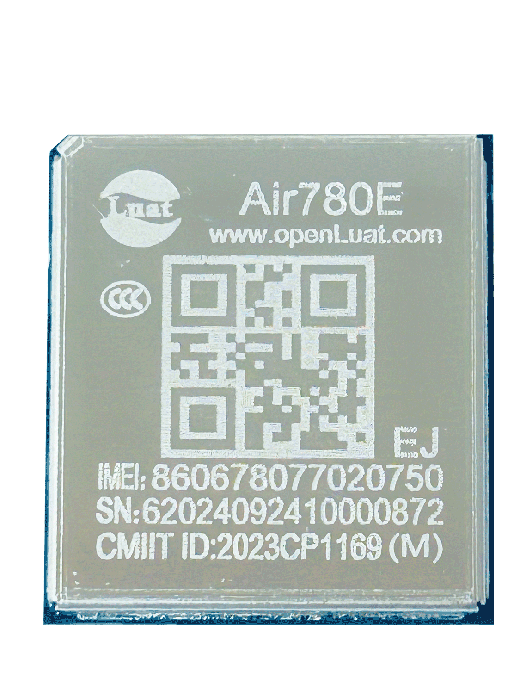

# Air780EEJ产品手册

| 模块名称  | 适用区域 | 频段                                       | 封装尺寸          |
| --------- | -------- | ------------------------------------------ | ----------------- |
| Air780EEJ | 日本     | FDD:B1/B3/B8/B18/B19/B26/B28 TDD: B41 | 17.7\*15.8\*2.3mm |

## 模块硬件资料

| 资料简介         | 相关链接                                                     |
| ---------------- | ------------------------------------------------------------ |
| 规格书           | [Air780EEJ_模块产品规格书_V1.0.0.pdf](https://cdn.openluat-luatcommunity.openluat.com/attachment/20240704150312533_Air780EEJ_%E6%A8%A1%E5%9D%97%E4%BA%A7%E5%93%81%E8%A7%84%E6%A0%BC%E4%B9%A6_V1.0.0.pdf) |
| 硬件设计相关手册 | [Air780EEJ_硬件设计手册_V1.0.4.pdf](https://cdn.openluat-luatcommunity.openluat.com/attachment/20241022174447607_Air780EEJ_硬件设计手册_V1.0.4.pdf) |
| 原理图及PCB封装  | [Air780ET封装（兼容Air780EEJ）](https://cdn.openluat-luatcommunity.openluat.com/attachment/20231201161306641_Air780ET&L%E5%B0%81%E8%A3%85.7z) [Air780ET AD格式（兼容Air780EEJ）](https://cdn.openluat-luatcommunity.openluat.com/attachment/20231205101545667_780ET&L_AD%E6%A0%BC%E5%BC%8F.zip) |

## 模块外形

| 正面                    | 反面                          |
| ----------------------- | ----------------------------- |
|  |  |

## 模块固件版本

[AT固件版本](https://docs.openluat.com/air780eej/at/firmware/)

## 认证证书

### FCC 证书

[FCC - 2AEGG-AIR780E, Grant-PCB.pdf](https://cdn.openluat-luatcommunity.openluat.com/attachment/20240603142151984_FCC%C2%A0-%C2%A02AEGG-AIR780E,%C2%A0Grant-PCB.pdf)

### CE 证书

[Air780E_CE_EU_Cert.pdf](https://cdn.openluat-luatcommunity.openluat.com/attachment/20240514145856564_Air780E_CE_EU_Cert.pdf)
