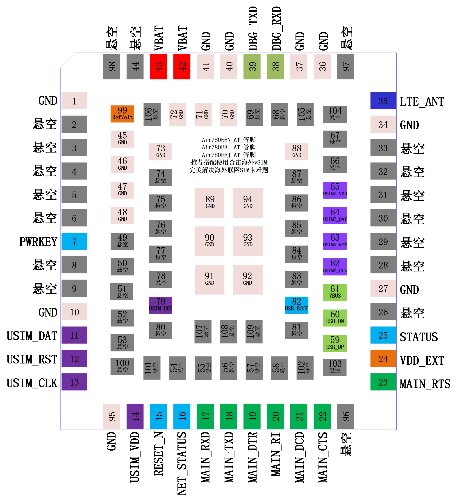

# 合宙Air780EEN模组资料中心

- [Air780EEN产品资料](https://docs.openluat.com/air780een/product/)
- [Air780EEN AT资料](https://docs.openluat.com/air780een/at/)

## 选型 Air780EEN/EEU/EEJ 时，我应该注意什么?

### 这篇文档的目的是什么

1. 从用户实际使用的角度，解答大家对 Air780EEN/EEU/EEJ 最关心的一些问题；
2. 本篇文档内容不深入探究技术细节，更多从选型、应用等非技术维度展开；
3. 阅读本篇文档之前，建议先详细阅读一遍"合宙产品选型手册"，有助于理解；

### Air780EEN/EEU/EEJ 核心信息描述

Air780EEN/EEU/EEJ 用于 AT 指令使用方式时的管脚图

1. Air780EEN/EEU/EEJ 是三款面向海外的 4G Cat.1 模组，其中，Air780EEN 面向北美区域，Air780EEU 面向欧洲/亚洲区域，Air780EEJ 面向日本区域；
2. Air780EEN/EEU/EEJ 封装尺寸是 16*18*2.3mm，仅比合宙 Air700ECQ/Air700EAQ/Air700EMQ 相对大一些，与 Air780E/Air780EQ/Air780EP/Air780EPS 等模组大小相同；
3. Air780EEN/EEU/EEJ 软件上只支持传统的 AT 指令，暂不支持 LuatOS 二次开发；
4. Air780EEN/EEU/EEJ 支持丰富的网络协议，比如 TCP/UDP、TCP-SSL/TCP-TLS、MQTT、HTTP、WEBSOCKET、NTP 等；
5. Air780EEN/EEU/EEJ 不支持 TTS 语音播放，也不支持 VoLTE 语音通话，需要支持这两个功能的应用推荐选择合宙 Air724UG(仅支持国内)；
6. Air780EEN/EEU/EEJ 功耗表现在合宙现有模组中排名中等，低功耗模式下 0.5mA，低功耗表现最好的模组型号是合宙 Air780EPS(仅支持国内)；

### Air780EEN/EEU/EEJ 实网功耗数据

| Air780EQAir780EEN/EEU/EEJ                                                                                                                                                                                                                                                                                                                                                                                                                                                                                                                                                                                                                                                    | 常规模式                    | 低功耗模式                                   | PSM+模式                                                  |
| ----------------------------------------------------------------------------------------------------------------------------------------------------------------------------------------------------------------------------------------------------------------------------------------------------------------------------------------------------------------------------------------------------------------------------------------------------------------------------------------------------------------------------------------------------------------------------------------------------------------------------------------------------------- | --------------------------- | -------------------------------------------- | --------------------------------------------------------- |
| 4G在线状态                                                                                                                                                                                                                                                                                                                                                                                                                                                                                                                                                                                                                                                  | 在线，长连接                | 在线，长连接                                 | 离线，飞行模式                                            |
| 定时器唤醒                                                                                                                                                                                                                                                                                                                                                                                                                                                                                                                                                                                                                                                  | 支持                        | 支持                                         | 支持                                                      |
| 中断唤醒                                                                                                                                                                                                                                                                                                                                                                                                                                                                                                                                                                                                                                                    | 支持                        | 支持                                         | 支持                                                      |
| 串口唤醒                                                                                                                                                                                                                                                                                                                                                                                                                                                                                                                                                                                                                                                    | 支持                        | 支持，唤醒时波特率需先设置为9600bps          | 支持，唤醒时波特率需先设置为9600bps                       |
| 服务器4G唤醒                                                                                                                                                                                                                                                                                                                                                                                                                                                                                                                                                                                                                                                | 支持，1秒内          | 支持，1秒内                                  | 不支持                                                    |
| 上行发送                                                                                                                                                                                                                                                                                                                                                                                                                                                                                                                                                                                                                                                    | 1秒内响应                   | 1秒内响应                                    | 1.5秒内响应                                               |
| VEXT电源输出状态                                                                                                                                                                                                                                                                                                                                                                                                                                                                                                                                                                                                                                            | 保持输出                    | 不能保持输出，也不能保持关闭，间歇性输出状态 | 不能保持输出，也不能保持关闭，间歇性输出状态              |
| 所有GPIO管脚是否可以控制输出电平                                                                                                                                                                                                                                                                                                                                                                                                                                                                                                                                                                                                                            | 可以                        | 不可以                                       | 不可以                                                    |
| 常规GPIO管脚是否可以保持电平                                                                                                                                                                                                                                                                                                                                                                                                                                                                                                                                                                                                                                | 可以                        | 不可以                                       | 不可以                                                    |
| 特殊AGPIO管脚是否可以保持电平                                                                                                                                                                                                                                                                                                                                                                                                                                                                                                                                                                                                                               | 可以                        | 可以                                         | 可以                                                      |
| RAM供电及唤醒后软件运行状态                                                                                                                                                                                                                                                                                                                                                                                                                                                                                                                                                                                                                                 | RAM供电，正常工作，满血状态 | RAM供电，唤醒后保持原状态运行                | RAM掉电，唤醒后程序从初始状态运行(PSM+状态前运行数据丢失) |
| 典型功耗表现                                                                                                                                                                                                                                                                                                                                                                                                                                                                                                                                                                                                                                                | 较低(7mA)                   | 均衡(0.5mA)                                  | 极低(3uA)                                                 |

**测试环境：**

1)Air780EEN/EEU/EEJ，供电电压3.8V，移动网络，频段B3，RSRP值-88附近，DRX 2.56秒，心跳间隔5分钟，心跳数据100Byte，TCP协议，合宙服务器，回环测试；

2)Air780EEN/EEU/EEJ，同等环境下，低功耗模式，DRX 1.28秒时，平均电流0.9mA，DRX 0.64秒时，平均电流1mA；

3)Air780EEN/EEU/EEJ，同等环境下，常规模式，DRX 1.28秒时，平均电流7mA，DRX 0.64秒时，平均电流7.2mA；

4)DRX，Discontinuous Reception，非连续接收，可简单理解为模块与基站之间保持心跳的间隔，一般为0.64秒/1.28秒/2.56秒，需要注意的是，DRX由基站根据网络实际情况而定，模组无法自行控制；

5)Air780EEN/EEU/EEJ功耗表现在合宙现有模组中排名中等，低功耗模式下平均电流0.5mA，低功耗表现最好的模组型号是合宙Air780EPS(仅支持国内)，请根据需要灵活选择； 

### Air780EEN/EEU/EEJ之AT指令

|    功能点    | Air700ECQ Air700EAQ Air700EMQ  Air780EQ | Air780ER | Air780EP | Air780E Air780EX | Air780EPS | Air724UG | Air780EEN Air780EEU Air780EEJ | Air780EG | 备注说明                                                                 |
| :-----------: | :----------------------------------------------------: | :------: | :------: | :-------------------: | :-------: | :------: | :-------------------------------------: | :------: | ------------------------------------------------------------------------ |
|   基础指令   |                           Y                           |    Y    |    Y    |           Y           |     Y     |    Y    |                    Y                    |    Y    |                                                                          |
|    TCP/UDP    |                           Y                           |    Y    |    Y    |           Y           |     Y     |    Y    |                    Y                    |    Y    |                                                                          |
|     HTTP     |                           Y                           |          |    Y    |           Y           |     Y     |    Y    |                    Y                    |    Y    |                                                                          |
|     MQTT     |                           Y                           |          |    Y    |           Y           |     Y     |    Y    |                    Y                    |    Y    |                                                                          |
|      FTP      |                           Y                           |          |    Y    |           Y           |     Y     |    Y    |                    Y                    |    Y    |                                                                          |
|      NTP      |                           Y                           |    Y    |    Y    |           Y           |     Y     |    Y    |                    Y                    |    Y    | NetworkTimeProtocol,网络时间协议                                         |
|      SSL      |                           Y                           |    Y    |    Y    |           Y           |     Y     |    Y    |                    Y                    |    Y    | TLS/SSL配置                                                              |
|      FS      |                           Y                           |          |    Y    |           Y           |     Y     |    Y    |                    Y                    |    Y    | 建立文件,枚举文件,传输TLS/SSL证书                                        |
|      SMS      |                           Y                           |          |    Y    |           Y           |     Y     |    Y    |                    Y                    |    Y    | 短信功能，Air724UG支持移动联通电信，``其余型号仅支持移动联通，电信不支持 |
|   WiFiScan   |                           Y                           |          |    Y    |           Y           |     Y     |    Y    |                    Y                    |    Y    | WiFi扫描,用于定位                                                        |
|      LBS      |                           Y                           |          |    Y    |           Y           |     Y     |    Y    |                    Y                    |    Y    | 基站定位                                                                 |
|      GPS      |                                                        |          |          |                      |          |          |                                        |    Y    | 定位功能                                                                 |
|      TTS      |                                                        |          |          |                      |          |    Y    |                                        |          | Text To Speech                                                           |
|     VoTLE     |                                                        |          |          |                      |          |    Y    |                                        |          | 语音通话                                                                 |
|      PPP      |                                                        |    Y    |          |           Y           |          |    N    |                    Y                    |    Y    | PPP拨号上网                                                              |
| USB_RNDIS_ECM |                                                        |    Y    |          |           Y           |          |    N    |                    Y                    |    Y    | USB网络驱动                                                              |

# Air780EEN/EEU/EEJ 常见咨询

1. Air780EEN/EEU/EEJ 支持的海外 vSIM 是什么意思？
   上海途鸽是一家专业的海外流量卡运营商，与世界多个国家的多个运营商建立了深入的合作；
   vSIM，即 virtual SIM，可以理解为虚拟卡，也可以理解为软 SIM，核心是：无需实体插拔卡，也不需要实体贴片卡，在模组内部通过软件实现了 SIM 卡的功能；
   途鸽 vSIM 的优势是，在世界上的任何地方，会自动动态选择最优运营商的卡资源，从而保证通信的稳定性；
   合宙与途鸽合作，在 Air780EEN/EEU/EEJ 三款海外模组中集成了途鸽 vSIM 功能，最大程度上解决了海外流量卡联网稳定性的问题；
2. Air780EEN/EEU/EEJ 支持 C-SDK 开发吗？
   Air780EEN/EEU/EEJ 不支持 C-SDK 开发，也不支持 LuatOS 开发方式；
3. Air780EEN/EEU/EEJ 支持 FOTA 功能吗？
   Air780EEN/EEU/EEJ 支持 FOTA 功能；
   合宙 IoT 平台(IOT.OPENLUAT.COM)可以对个人账号下的每一片模组进行 FOTA 管理；
   Air780EEN/EEU/EEJ 支持差分升级，无论 AT 软件，还是 LuatOS 软件，都可以通过合宙 IoT 后台进行 FOTA 升级；
4. Air780EEN/EEU/EEJ 支持数据透传吗？
   Air780EEN/EEU/EEJ 支持数据透传功能；
5. Air780EEN/EEU/EEJ 与 Air780E/Air780EQ/Air780EP/Air780EPS 什么关系？
   Air780EEN/EEU/EEJ 与 Air780E/Air780EQ/Air780EP/Air780EPS 封装尺寸完全相同；
   就 AT 指令功能来讲，Air780EEN/EEU/EEJ 与 Air780E/Air780EQ/Air780EP/Air780EPS 之间可以完全替代，但功耗表现有差异，面向的区域市场也不一样；
6.  Air780EEN，支持北美区域，比如美国、加拿大、墨西哥等，频段支持FDD:B2/B4/B5/B12/B13/B66/B71，其中，
B71频段是Air780EEN相对传统北美模组新增加的频段，T-moble重点新布基站，可以大大增加网络覆盖的密度，尤其是北美乡村郊区；

    Air780EEU，支持欧洲和亚洲区域，适用于欧洲，亚洲(日本除外)，频段支持FDD:B1/B3/B5/B7/B8/B20/B28；

    Air780EEJ，支持日本，频段支持FDD:B1/B3/B8/B18/B19/B26/B28和
TDD:B41，其中，B28/B41两个频段是Air780EEJ相对传统日本模组新增加的频段，NTT/SoftBank/KDDI三大运营商重点新布基站频段，保证模组稳定在线；

# 合宙模组更多资料

官网 [www.openluat.com](http://www.openluat.com)

资料 docs.openluat.com

样品 luat.taobao.com

公众号 HelloLuatOS