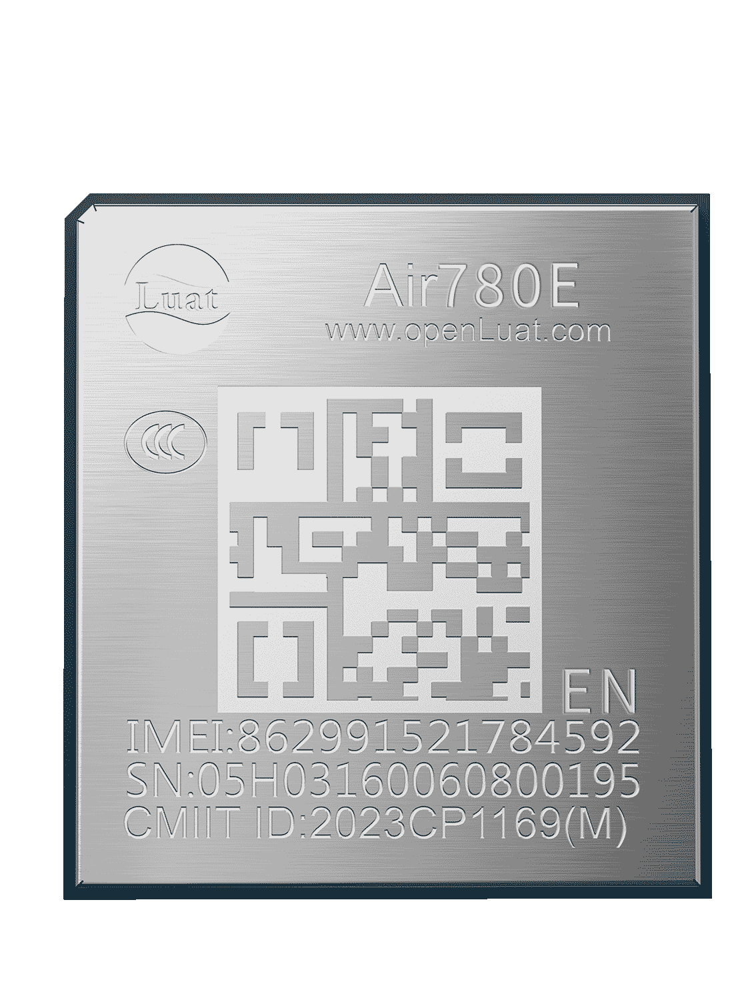

# Air780EEN产品手册

| 模块名称  | 适用区域 | 频段                         | 封装尺寸          |
| --------- | -------- | ---------------------------- | ----------------- |
| Air780EEN | 北美     | FDD:B2/B4/B5/B12/B13/B66/B71 | 17.7\*15.8\*2.3mm |

## 模块硬件资料

| 资料简介         | 相关链接                                                                                                                                                                                                                                                                                       |
| ---------------- | ---------------------------------------------------------------------------------------------------------------------------------------------------------------------------------------------------------------------------------------------------------------------------------------------- |
| 规格书           | [Air780EEN_模块产品规格书_V1.0.1.pdf](https://cdn.openluat-luatcommunity.openluat.com/attachment/20240709115153725_Air780EEN_%E6%A8%A1%E5%9D%97%E4%BA%A7%E5%93%81%E8%A7%84%E6%A0%BC%E4%B9%A6_V1.0.1.pdf)                                                                                          |
| 硬件设计相关手册 | [Air780EEN_硬件设计手册_V1.0.5.pdf](https://cdn.openluat-luatcommunity.openluat.com/attachment/20240923095334396_Air780EEN_%E7%A1%AC%E4%BB%B6%E8%AE%BE%E8%AE%A1%E6%89%8B%E5%86%8C_V1.0.5.pdf)                                                                                                     |
| 原理图及PCB封装  | [Air780ET封装（兼容Air780EEN）](https://cdn.openluat-luatcommunity.openluat.com/attachment/20231201161306641_Air780ET&L%E5%B0%81%E8%A3%85.7z) [Air780ET AD格式（兼容Air780EEN）](https://cdn.openluat-luatcommunity.openluat.com/attachment/20231205101545667_780ET&L_AD%E6%A0%BC%E5%BC%8F.zip) |

## 模块外形

| 正面                    | 反面                          |
| ----------------------- | ----------------------------- |
|  |  |

## 认证证书

### FCC 证书

[FCC - 2AEGG-AIR780E, Grant-PCB.pdf](https://cdn.openluat-luatcommunity.openluat.com/attachment/20240603142151984_FCC%C2%A0-%C2%A02AEGG-AIR780E,%C2%A0Grant-PCB.pdf)
