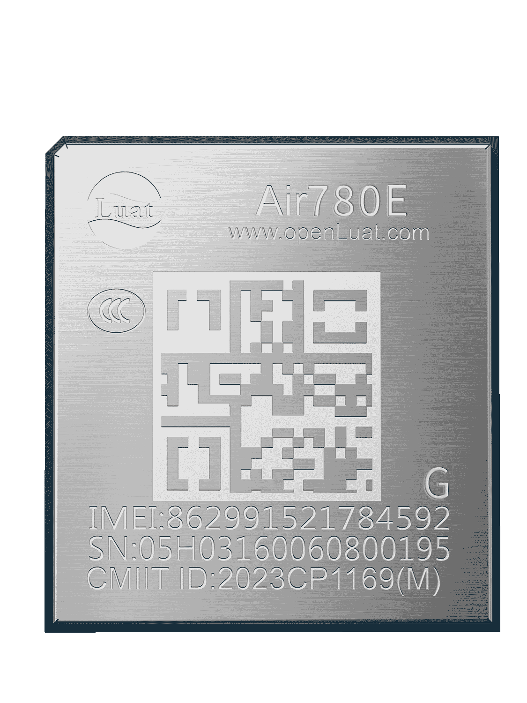

# Air780EG产品手册

| 模块名称 | 适用区域         | 频段                                            | 封装尺寸          |
| -------- | ---------------- | ----------------------------------------------- | ----------------- |
| Air780EG | 中国/印度/东南亚 | TDD：B34/B38/B39/B40/B41  FDD：B1/B3/B5/B8 | 17.7\*15.8\*2.3mm |

## 模块硬件资料

| 资料简介         | 相关链接                                                                                                                                                                                                                                                                                                                                                                                                                                                                                                                                                                        |
| ---------------- | ------------------------------------------------------------------------------------------------------------------------------------------------------------------------------------------------------------------------------------------------------------------------------------------------------------------------------------------------------------------------------------------------------------------------------------------------------------------------------------------------------------------------------------------------------------------------------- |
| 规格书           | [Air780EG_模块产品规格书_V1.0.6.pdf](https://cdn.openluat-luatcommunity.openluat.com/attachment/20240903103053097_Air780EG_模块产品规格书_V1.0.6.pdf)                                                                                                                                                                                                                                                                                                                                                                                                                              |
| 硬件设计相关手册 | [Air780EG_硬件设计手册_V1.1.2.pdf](https://cdn.openluat-luatcommunity.openluat.com/attachment/20240819170805106_Air780EG_硬件设计手册_V1.1.2.pdf) [Air780EG_GPIO_table_20240716.pdf](https://cdn.openluat-luatcommunity.openluat.com/attachment/20240716142205812_Air780E&Air780EG&Air780EX&Air700E_GPIO_table_20240716.pdf)                                                                                                                                                                                                                                                   |
| 原理图及PCB封装  | [Air780EG封装_AD.zip](https://cdn.openluat-luatcommunity.openluat.com/attachment/20221221141709035_Air780EG封装_AD.zip) [Air780EG封装_PADS9.5.zip](https://cdn.openluat-luatcommunity.openluat.com/attachment/20221221141723631_Air780EG封装_PADS9.5.zip)                                                                                                                                                                                                                                                                                                                      |
| 参考设计原理图   | [Air780EG参考设计V1.0.pdf](https://cdn.openluat-luatcommunity.openluat.com/attachment/20230824162602260_20221224160041758_Air780EG参考设计V1.0.pdf)                                                                                                                                                                                                                                                                                                                                                                                                                                |
| 开发板相关资料   | [开发板Core_Air780EG使用说明V1.0.1.pdf](https://cdn.openluat-luatcommunity.openluat.com/attachment/20230331173112806_开发板Core_Air780EG使用说明V1.0.1.pdf) [EVB_Air780X_V1.7.zip](https://cdn.openluat-luatcommunity.openluat.com/attachment/20221221141751177_EVB_Air780X_V1.7.zip) [EVB_Air780X_V1.8.pdf](https://cdn.openluat-luatcommunity.openluat.com/attachment/20231222160117780_EVB_Air780X_V1.8.pdf) [EVB_Air780X_V1.8.zip](https://cdn.openluat-luatcommunity.openluat.com/attachment/20230329163731051_EVB_Air780X_V1.8.zip)（兼容780EX，780EG,780E模块） |
| 轨迹展示小工具   | [定位展示小工具使用介绍](https://doc.openluat.com/article/4980 "DOC社区定位展示小工具使用介绍")                                                                                                                                                                                                                                                                                                                                                                                                                                                                                       |
| GPS调试工具      | [iNavTool-V4020.7z](https://cdn.openluat-luatcommunity.openluat.com/attachment/20240816143801749_iNavTool-V4020.7z)                                                                                                                                                                                                                                                                                                                                                                                                                                                                |

## 模块外形

| 正面                   | 反面                          |
| ---------------------- | ----------------------------- |
|  |  |

## 模块固件版本

[AT固件版本](https://docs.openluat.com/air780eg/at/firmware/)

[LuatOS固件版本](https://docs.openluat.com/air780eg/luatos/firmware/)
