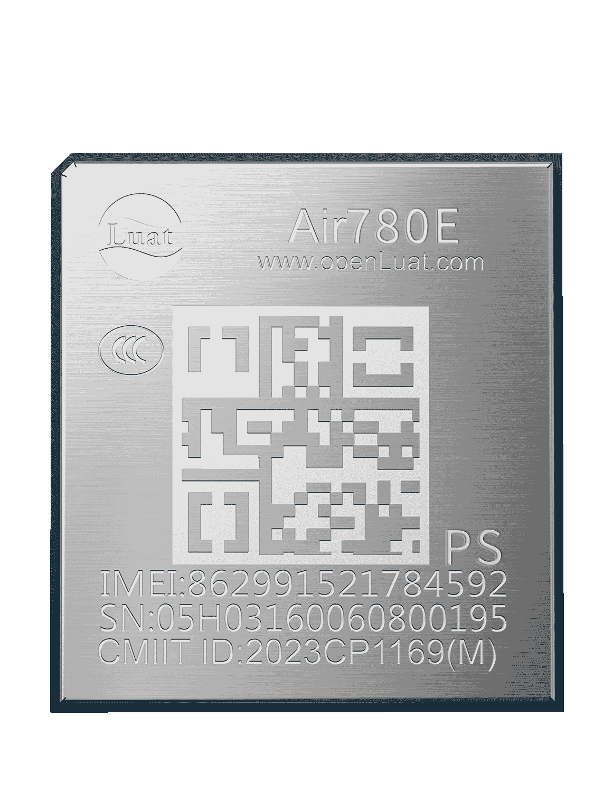

# Air780EPS产品手册

| 模块名称  | 适用区域         | 频段                                            | 封装尺寸         |
| --------- | ---------------- | ----------------------------------------------- | ---------------- |
| Air780EPS | 中国/印度/东南亚 | TDD：B34/B38/B39/B40/B41  FDD：B1/B3/B5/B8 | 17.7*15.8\*1.7mm |

## 模块硬件资料

| 资料简介         | 相关链接                                                                                                                                                                                                                                                                                                                                                      |
| ---------------- | ------------------------------------------------------------------------------------------------------------------------------------------------------------------------------------------------------------------------------------------------------------------------------------------------------------------------------------------------------------- |
| 规格书           | [Air780EPS_模块产品规格书_V1.0.1.pdf](https://cdn.openluat-luatcommunity.openluat.com/attachment/20240814171557653_Air780EPS_模块产品规格书_V1.0.1.pdf)                                                                                                                                                                                                          |
| 硬件设计相关手册 | [Air780EPS_硬件设计手册_V1.0.0.pdf](https://cdn.openluat-luatcommunity.openluat.com/attachment/20240719102529977_Air780EPS_硬件设计手册_V1.0.0.pdf)   [Air780EPS_GPIO_table_20240920.pdf](https://cdn.openluat-luatcommunity.openluat.com/attachment/20240920181658330_Air780EP&Air780EPS_GPIO_table_20240920.pdf)                                             |
| 原理图及PCB封装  | [Air780EPS_PADS.pcb](https://cdn.openluat-luatcommunity.openluat.com/attachment/20240304174515360_Air780EP_PADS.pcb) [Air780EPS_PADS.sch](https://cdn.openluat-luatcommunity.openluat.com/attachment/20240304174548538_Air780EP_PADS.sch) [780EPS_ad格式.zip](https://cdn.openluat-luatcommunity.openluat.com/attachment/20240424170844720_780ep_ad格式.zip) |
| 开发板相关资料   | [开发板Core_Air780EPS使用说明V1.0.0.pdf](https://cdn.openluat-luatcommunity.openluat.com/attachment/20240819094210124_开发板Core_Air780EPS使用说明V1.0.0.pdf)                                                                                                                                                                                                    |

## 模块外形

| 正面                  | 反面                        |
| --------------------- | --------------------------- |
|  |  |

## 模块固件版本

[AT固件版本](https://docs.openluat.com/air780eps/at/firmware/)

[LuatOS二次开发sdk和demo](https://docs.openluat.com/air780eps/luatos/firmware/)

### CCC 证书

[Air780E_CCC中文证书(2023).pdf](https://cdn.openluat-luatcommunity.openluat.com/attachment/20230601135402627_Air780E_CCC中文证书(2023).pdf)

[Air780E_CCC英文证书(2023).pdf](https://cdn.openluat-luatcommunity.openluat.com/attachment/20230601135417547_Air780E_CCC英文证书(2023).pdf)

### 入网许可证

[Air780E入网许可证-2023.pdf](https://cdn.openluat-luatcommunity.openluat.com/attachment/20231222165428617_Air780E入网许可证-2023.pdf)

### SRRC 证书

[Air780E型号核准证.pdf](https://cdn.openluat-luatcommunity.openluat.com/attachment/20230221104159741_Air780E型号核准证.pdf)

### ROHS 证书

[Air780E-ROHS证书.pdf](https://cdn.openluat-luatcommunity.openluat.com/attachment/20230313092434185_Air780E-ROHS证书.pdf)
