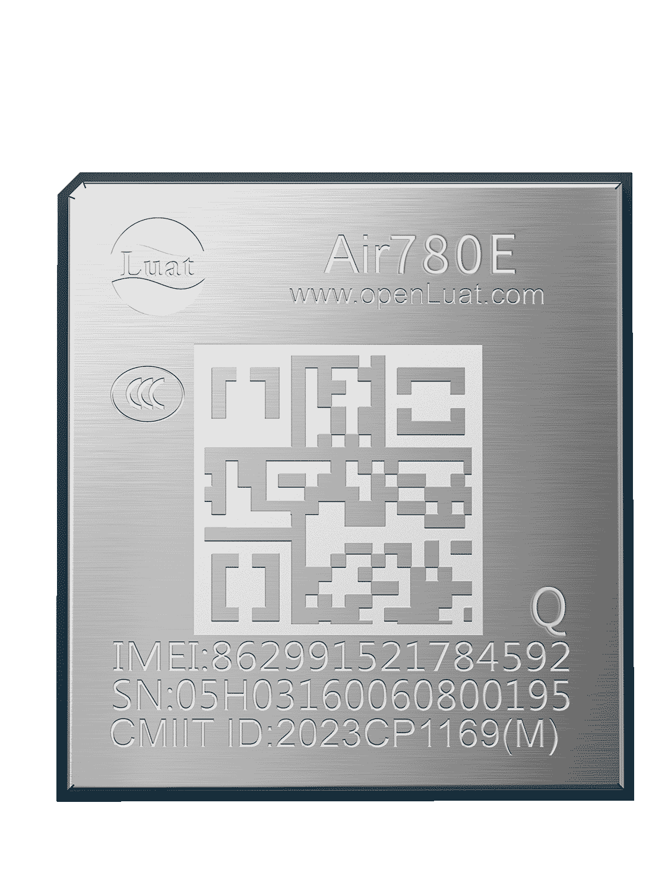

# Air780EQ产品手册

| 模块名称 | 适用区域         | 频段                                      | 封装尺寸      |
| -------- | ---------------- | ----------------------------------------- | ------------- |
| Air780EQ | 中国/印度/东南亚 | TDD:B34,B38,B39,B40,B41  FDD:1,3,5,8 | 16\*18\*2.3mm |

## 模块硬件资料

| 资料简介         | 相关链接                                                                                                                                                                                                                                                                                                                                                                                                                                                                                                                                                                                                                                                                                                                                                                                                                                    |
| ---------------- | ------------------------------------------------------------------------------------------------------------------------------------------------------------------------------------------------------------------------------------------------------------------------------------------------------------------------------------------------------------------------------------------------------------------------------------------------------------------------------------------------------------------------------------------------------------------------------------------------------------------------------------------------------------------------------------------------------------------------------------------------------------------------------------------------------------------------------------------- |
| 规格书           | [Air780EQ_模块产品规格书_V1.0.3.pdf](https://cdn.openluat-luatcommunity.openluat.com/attachment/20240813113700784_Air780EQ_模块产品规格书_V1.0.3.pdf)                                                                                                                                                                                                                                                                                                                                                                                                                                                                                                                                                                                                                                                                                          |
| 硬件设计相关手册 | [Air780EQ_硬件设计手册_V1.0.5.pdf](https://cdn.openluat-luatcommunity.openluat.com/attachment/20240820201959190_Air780EQ_硬件设计手册_V1.0.5.pdf)  [Air780EQ_GPIO_table_202406012.pdf](https://cdn.openluat-luatcommunity.openluat.com/attachment/20240612095831946_Air780EL&780ETGG&780ETG&700EL&700EY&700EC_GPIO_table_202406012.pdf) [EC716-IO-特性.pdf](https://cdn.openluat-luatcommunity.openluat.com/attachment/20240508154944217_EC716-IO-特性.pdf)                                                                                                                                                                                                                                                                                                                                                                            |
| 原理图及PCB封装  | [Air780EQ封装.7z](https://cdn.openluat-luatcommunity.openluat.com/attachment/20231201161306641_Air780ET&L封装.7z) [780EQ_AD格式.zip](https://cdn.openluat-luatcommunity.openluat.com/attachment/20231205101545667_780ET&L_AD格式.zip)                                                                                                                                                                                                                                                                                                                                                                                                                                                                                                                                                                                                      |
| 开发板相关资料   | [开发板Core_Air780EQ使用说明V1.0.4.pdf](https://cdn.openluat-luatcommunity.openluat.com/attachment/20230627145255005_开发板Core_Air780E使用说明V1.0.4.pdf) [Air780EQ开发板原理图和PCB(立创EDA)](https://oshwhub.com/luat/evb_air780x_v1-6 "780X开发板原理图和PCB(立创EDA)") [EVB_Air780X_V1.5_SCH.pdf](https://cdn.openluat-luatcommunity.openluat.com/attachment/20230705082334351_EVB_Air780X_V1.5_SCH.pdf) [EVB_Air780X_V1.5.zip](https://cdn.openluat-luatcommunity.openluat.com/attachment/20230705082416943_EVB_Air780X_V1.5.zip) [EVB_Air780X_V1.8.pdf](https://cdn.openluat-luatcommunity.openluat.com/attachment/20231222160117780_EVB_Air780X_V1.8.pdf) [EVB_Air780X_V1.8.zip](https://cdn.openluat-luatcommunity.openluat.com/attachment/20230329163731051_EVB_Air780X_V1.8.zip)（兼容780EX,780EG,780E,780EQ模块） |

## 模块外形

| 正面                   | 反面                          |
| ---------------------- | ----------------------------- |
|  |  |

## 模块固件版本

[AT固件版本](https://docs.openluat.com/air780eq/at/firmware/)

[LuatOS二次开发sdk和demo](https://docs.openluat.com/air780eq/luatos/firmware/) 

## 相关证书
### CCC 证书
[Air780E_CCC中文证书(2023).pdf](https://cdn.openluat-luatcommunity.openluat.com/attachment/20230601135402627_Air780E_CCC中文证书(2023).pdf)

[Air780E_CCC英文证书(2023).pdf](https://cdn.openluat-luatcommunity.openluat.com/attachment/20230601135417547_Air780E_CCC英文证书(2023).pdf)

### 入网许可证

[Air780E入网许可证-2023.pdf](https://cdn.openluat-luatcommunity.openluat.com/attachment/20231222165428617_Air780E入网许可证-2023.pdf)

### SRRC 证书
[Air780E型号核准证.pdf](https://cdn.openluat-luatcommunity.openluat.com/attachment/20230221104159741_Air780E型号核准证.pdf)

### ROHS 证书
[Air780E-ROHS证书.pdf](https://cdn.openluat-luatcommunity.openluat.com/attachment/20230313092434185_Air780E-ROHS证书.pdf)
