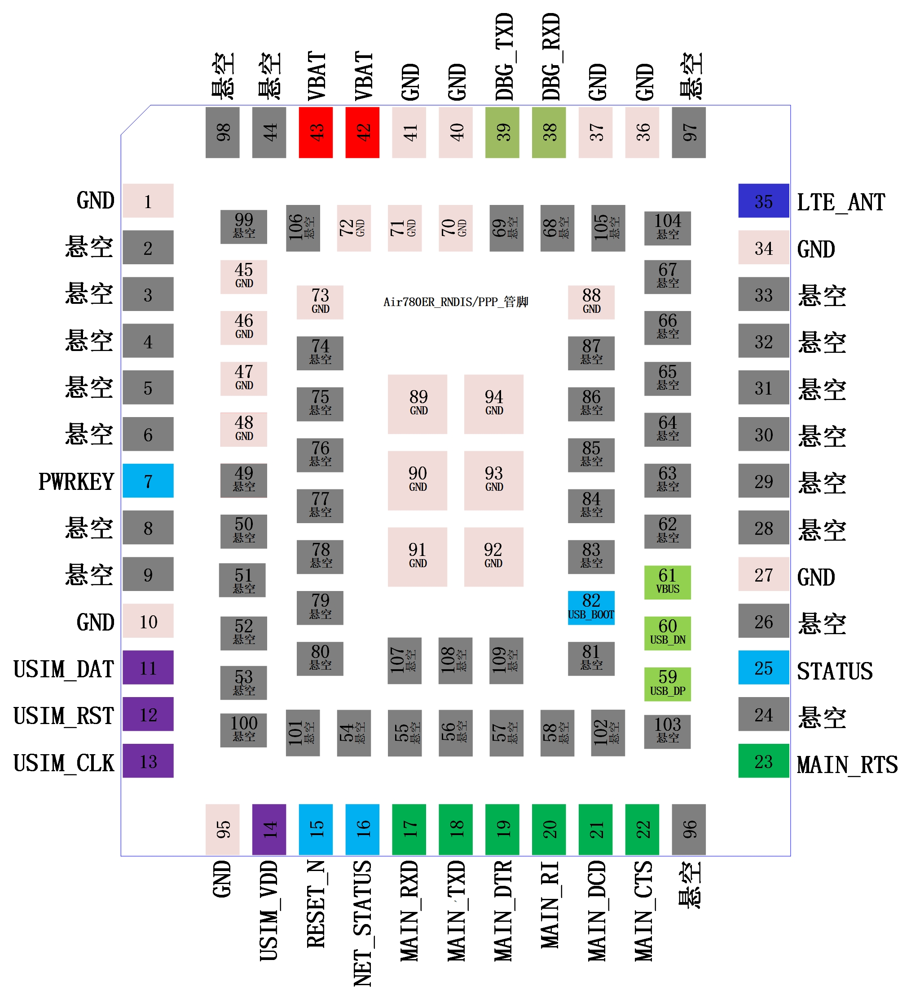

# 合宙Air780ER模组资料中心

- [Air780ER产品资料](https://docs.openluat.com/air780er/product/)
- [Air780ER USB上网](https://docs.openluat.com/air780er/at/)

## 选型Air780ER时，我应该注意什么？

### 这篇文档的目的是什么

1. 从用户的角度，解答大家对Air780ER这款模组最关心的问题；
2. 不深入探究技术细节，更多从选型、应用等非技术维度展开；
3. 阅读本篇文档之前，建议先详细阅读一遍"合宙产品选型手册"；

### Air780ER核心信息描述

Air780ER用于USB上网时的管脚图

1. Air780ER是合宙推出的一款专门面向USB上网场景的4G Cat.1模组，支持RNDIS/PPP协议，可搭配Windows/Linux/Android使用；
2. Air780ER封装尺寸16\*18\*2.3mm，是一款面向国内的全网通模组，支持移动、电信、联通三大运营商；
3. Air780ER软件上仅支持USB上网必须的精简AT指令，核心功能是RNDIS/PPP驱动协议；
4. Air780ER硬件上仅支持USB上网必须的外设管脚，比如USB、SIM、天线等；
5. Air780ER仅支持USB上网必须的网络协议，比如TCP/UDP、NTP、SSL等；
6. Air780ER功耗表现在合宙现有模组中排名中等，低功耗模式下0.5mA，低功耗表现最好的模组型号是合宙Air780EPS；

### Air780ER实网功耗数据

| Air780ER                                                                                                                                                                                                                                                                                                                                                                                                                                                                                                                                                                                                                                                    | 常规模式                    | 低功耗模式                                   | PSM+模式                                                  |
| ----------------------------------------------------------------------------------------------------------------------------------------------------------------------------------------------------------------------------------------------------------------------------------------------------------------------------------------------------------------------------------------------------------------------------------------------------------------------------------------------------------------------------------------------------------------------------------------------------------------------------------------------------------- | --------------------------- | -------------------------------------------- | --------------------------------------------------------- |
| 4G在线状态                                                                                                                                                                                                                                                                                                                                                                                                                                                                                                                                                                                                                                                  | 在线，长连接                | 在线，长连接                                 | 离线，飞行模式                                            |
| 定时器唤醒                                                                                                                                                                                                                                                                                                                                                                                                                                                                                                                                                                                                                                                  | 支持                        | 支持                                         | 支持                                                      |
| 中断唤醒                                                                                                                                                                                                                                                                                                                                                                                                                                                                                                                                                                                                                                                    | 支持                        | 支持                                         | 支持                                                      |
| 串口唤醒                                                                                                                                                                                                                                                                                                                                                                                                                                                                                                                                                                                                                                                    | 支持                        | 支持，唤醒时波特率需先设置为9600bps          | 支持，唤醒时波特率需先设置为9600bps                       |
| 服务器4G唤醒                                                                                                                                                                                                                                                                                                                                                                                                                                                                                                                                                                                                                                                | 支持，1秒内``        | 支持，1秒内                                  | 不支持                                                    |
| 上行发送                                                                                                                                                                                                                                                                                                                                                                                                                                                                                                                                                                                                                                                    | 1秒内响应                   | 1秒内响应                                    | 1.5秒内响应                                               |
| VEXT电源输出状态                                                                                                                                                                                                                                                                                                                                                                                                                                                                                                                                                                                                                                            | 保持输出                    | 不能保持输出，也不能保持关闭，间歇性输出状态 | 不能保持输出，也不能保持关闭，间歇性输出状态              |
| 所有GPIO管脚是否可以控制输出电平                                                                                                                                                                                                                                                                                                                                                                                                                                                                                                                                                                                                                            | 可以                        | 不可以                                       | 不可以                                                    |
| 常规GPIO管脚是否可以保持电平                                                                                                                                                                                                                                                                                                                                                                                                                                                                                                                                                                                                                                | 可以                        | 不可以                                       | 不可以                                                    |
| 特殊AGPIO管脚是否可以保持电平                                                                                                                                                                                                                                                                                                                                                                                                                                                                                                                                                                                                                               | 可以                        | 可以                                         | 可以                                                      |
| RAM供电及唤醒后软件运行状态                                                                                                                                                                                                                                                                                                                                                                                                                                                                                                                                                                                                                                 | RAM供电，正常工作，满血状态 | RAM供电，唤醒后保持原状态运行                | RAM掉电，唤醒后程序从初始状态运行(PSM+状态前运行数据丢失) |
| 典型功耗表现                                                                                                                                                                                                                                                                                                                                                                                                                                                                                                                                                                                                                                                | 较低(7mA)                   | 均衡(0.5mA)                                  | 极低(3uA)                                                 |

**测试环境：**

1)Air780ER，供电电压3.8V，移动网络，频段B3，RSRP值-88附近，DRX 2.56秒，心跳间隔5分钟，心跳数据100Byte，TCP协议，合宙服务器，回环测试；

2)Air780ER，同等环境下，低功耗模式，DRX 1.28秒时，平均电流0.9mA，DRX 0.64秒时，平均电流1mA；

3)Air780ER，同等环境下，常规模式，DRX 1.28秒时，平均电流7mA，DRX 0.64秒时，平均电流7.2mA；

4)DRX，Discontinuous Reception，非连续接收，可简单理解为模块与基站之间保持心跳的间隔，一般为0.64秒/1.28秒/2.56秒，需要注意的是，DRX由基站根据网络实际情况而定，模组无法自行控制；

5)Air780ER功耗表现在合宙现有模组中排名中等，低功耗模式下平均电流0.5mA，低功耗表现最好的模组型号是合宙Air780EPS，请根据需要灵活选择；

### Air780ER之AT指令

|    功能点    | Air700ECQ Air700EAQ Air700EMQ  Air780EQ | Air780ER | Air780EP | Air780E Air780EX | Air780EPS | Air724UG | Air780EEN Air780EEU Air780EEJ | Air780EG | 备注说明                                                                 |
| :-----------: | :----------------------------------------------------: | :------: | :------: | :-------------------: | :-------: | :------: | :-------------------------------------: | :------: | ------------------------------------------------------------------------ |
|   基础指令   |                           Y                           |    Y    |    Y    |           Y           |     Y     |    Y    |                    Y                    |    Y    |                                                                          |
|    TCP/UDP    |                           Y                           |    Y    |    Y    |           Y           |     Y     |    Y    |                    Y                    |    Y    |                                                                          |
|     HTTP     |                           Y                           |          |    Y    |           Y           |     Y     |    Y    |                    Y                    |    Y    |                                                                          |
|     MQTT     |                           Y                           |          |    Y    |           Y           |     Y     |    Y    |                    Y                    |    Y    |                                                                          |
|      FTP      |                           Y                           |          |    Y    |           Y           |     Y     |    Y    |                    Y                    |    Y    |                                                                          |
|      NTP      |                           Y                           |    Y    |    Y    |           Y           |     Y     |    Y    |                    Y                    |    Y    | NetworkTimeProtocol,网络时间协议                                         |
|      SSL      |                           Y                           |    Y    |    Y    |           Y           |     Y     |    Y    |                    Y                    |    Y    | TLS/SSL配置                                                              |
|      FS      |                           Y                           |          |    Y    |           Y           |     Y     |    Y    |                    Y                    |    Y    | 建立文件,枚举文件,传输TLS/SSL证书                                        |
|      SMS      |                           Y                           |          |    Y    |           Y           |     Y     |    Y    |                    Y                    |    Y    | 短信功能，Air724UG支持移动联通电信，``其余型号仅支持移动联通，电信不支持 |
|   WiFiScan   |                           Y                           |          |    Y    |           Y           |     Y     |    Y    |                    Y                    |    Y    | WiFi扫描,用于定位                                                        |
|      LBS      |                           Y                           |          |    Y    |           Y           |     Y     |    Y    |                    Y                    |    Y    | 基站定位                                                                 |
|      GPS      |                                                        |          |          |                      |          |          |                                        |    Y    | 定位功能                                                                 |
|      TTS      |                                                        |          |          |                      |          |    Y    |                                        |          | Text To Speech                                                           |
|     VoTLE     |                                                        |          |          |                      |          |    Y    |                                        |          | 语音通话                                                                 |
|      PPP      |                                                        |    Y    |          |           Y           |          |    N    |                    Y                    |    Y    | PPP拨号上网                                                              |
| USB_RNDIS_ECM |                                                        |    Y    |          |           Y           |          |    N    |                    Y                    |    Y    | USB网络驱动                                                              |

### Air780ER之LuatOS

1. Air780ER仅支持USB上网必须的RNDIS/PPP协议；
2. Air780ER仅只是USB上网必须的网络协议，比如TCP/UDP、NTP、SSL等；
3. Air780ER不支持LuatOS二次开发；

### Air780ER常见咨询

1. **合宙只有Air780ER这一款模组型号支持USB上网功能吗？**

   合宙历史上有多款模组型号支持USB上网功能，也就是RNDIS/PPP协议；

   如果您是新产品新项目使用，建议您选择合宙USB上网专用型号Air780ER；

2. **Air780ER支持FOTA功能吗？**

   Air780ER支持FOTA功能；

   合宙IoT平台(IOT.OPENLUAT.COM)可以对个人账号下的每一片模组进行FOTA管理；

   Air780ER支持差分升级，无论AT软件，还是LuatOS软件，都可以通过合宙IoT后台进行FOTA升级；

3. **Air780ER与Air780E有什么关系？**

   Air780ER与Air780E封装尺寸完全相同；

   Air780ER与Air780E在产品功能定义上不同，Air780E主打AT和LuatOS，Air780ER主打USB上网功能；

   配合Windows/Linux/Android操作系统，结合Air780ER的RNDIS/PPP功能，可快速实现USB上网功能；

4. **Air780ER可以支持海外市场吗？**

   Air780ER的频段(FDD:B1/3/5/8;TDD:B34/38/39/40/41)可以支持中国移动、电信、联通三大运营商；

   印度与中国的4G频段相同，理论上Air780E也可以支持印度，但印度运营商众多，建议出货前务必场测；

   东南亚诸国与中国的4G频段接近，但部分国家会略有不同，多集中在B7和B28的差异，贸然出货不排除在部份区域由于基站频段与Air780ER频段的不匹配而导致无法通信；

   Air780EEN/Air780EEU/Air780EEJ与Air780E封装兼容，可以支持海外不同的国家和区域。也可以支持USB上网功能；

   Air780EEN，频段支持FDD:B2/4/5/12/13/66/71;TDD:B40/41，主要面向北美区域；

   Air780EEU，频段支持FDD:B1/3/5/7/8/20/28;TDD:B40/41，主要面向欧洲亚洲区域；

   Air780EEJ，频段支持FDD:B1/3/8/18/19/26/28;TDD:B40/41，主要面向日本；

### 合宙模组更多资料

官网 [www.openluat.com](www.openluat.com)

资料 [docs.openluat.com](https://docs.openluat.com)

样品 [luat.taobao.com](luat.taobao.com)

公众号 HelloLuatOS
