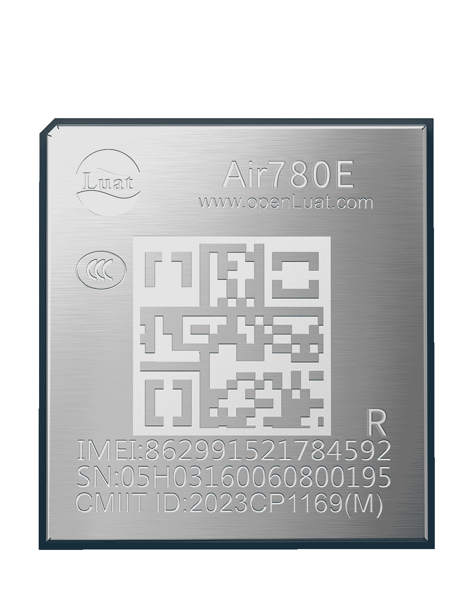

# Air780ER产品手册

| 模块名称 | 适用区域         | 频段                                            | 封装尺寸          |
| -------- | ---------------- | ----------------------------------------------- | ----------------- |
| Air780ER | 中国/印度/东南亚 | TDD：B34/B38/B39/B40/B41  FDD：B1/B3/B5/B8 | 17.7\*15.8\*2.3mm |

## 模块硬件资料

| 资料简介           | 相关链接 |
| ------------------ | -------- |
| 规格书             |          |
| 硬件设计相关手     |          |
| 原                 |          |
| 参考设计原理图     |          |
| 开发板相关资料     |          |
| 扩展板相关资料     |          |
| 内置模拟语音功能   |          |
| 低功耗全功能开发板 |          |

## 模块外形

| 正面                   | 反面                          |
| ---------------------- | ----------------------------- |
|  |  |

## 模块固件版本

[AT固件版本](https://docs.openluat.com/air780er/at/firmware/)

### CCC 证书

- [Air780E_CCC中文证书(2023).pdf](https://cdn.openluat-luatcommunity.openluat.com/attachment/20230601135402627_Air780E_CCC中文证书(2023).pdf)
- [Air780E_CCC英文证书(2023).pdf](https://cdn.openluat-luatcommunity.openluat.com/attachment/20230601135417547_Air780E_CCC英文证书(2023).pdf)

### 入网许可证

- [Air780E入网许可证-2023.pdf](https://cdn.openluat-luatcommunity.openluat.com/attachment/20231222165428617_Air780E入网许可证-2023.pdf)

### SRRC 证书

- [Air780E型号核准证.pdf](https://cdn.openluat-luatcommunity.openluat.com/attachment/20230221104159741_Air780E%E5%9E%8B%E5%8F%B7%E6%A0%B8%E5%87%86%E8%AF%81.pdf)

### ROHS 证书

- [Air780E-ROHS证书.pdf](https://cdn.openluat-luatcommunity.openluat.com/attachment/20230313092434185_Air780E-ROHS%E8%AF%81%E4%B9%A6.pdf)
