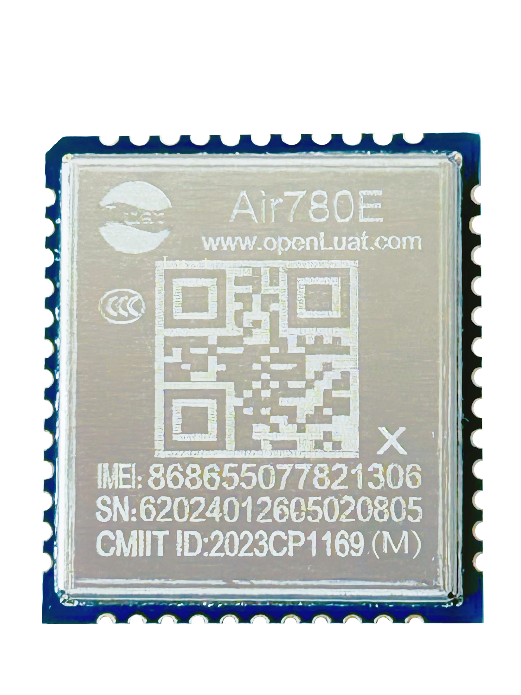
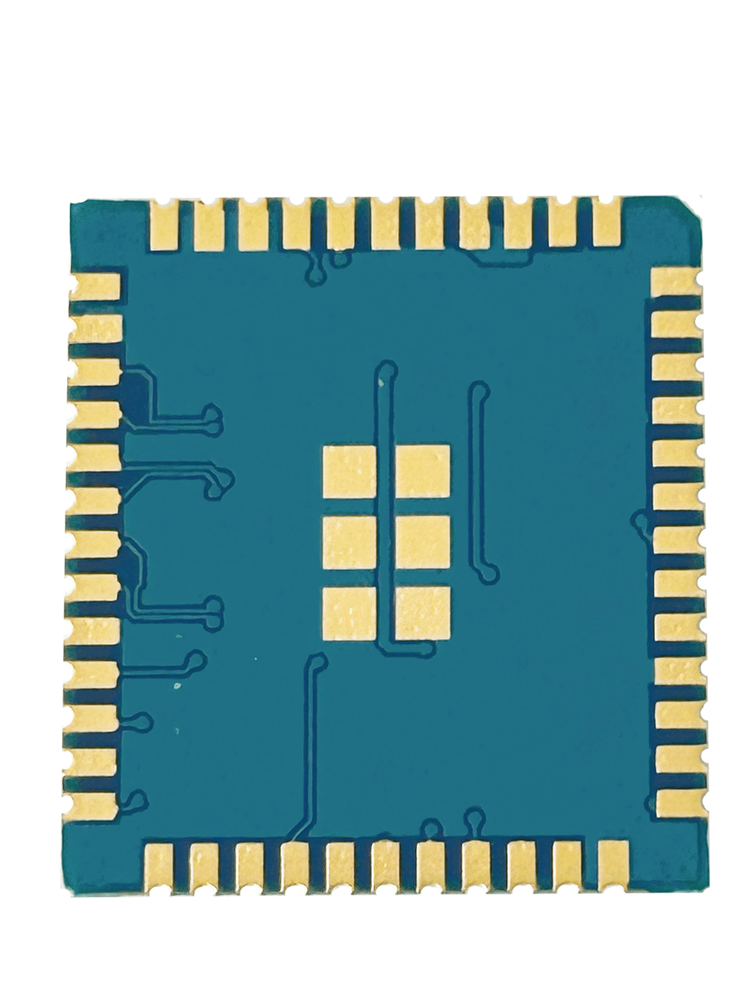

# Air780EX产品手册

| 模块名称 | 适用区域         | 频段                                            | 封装尺寸          |
| -------- | ---------------- | ----------------------------------------------- | ----------------- |
| Air780EX | 中国/印度/东南亚 | TDD：B34/B38/B39/B40/B41  FDD：B1/B3/B5/B8 | 17.7\*15.8\*2.3mm |

## 模块硬件资料

| 资料简介           | 相关链接                                                     |
| ------------------ | ------------------------------------------------------------ |
| 硬件设计相关手册   | [Air780EX_硬件设计手册_V1.3.3.pdf](https://cdn.openluat-luatcommunity.openluat.com/attachment/20240819170318674_Air780E_硬件设计手册_V1.3.3.pdf) [Air780EX_Hardware_Design_Manual_V1.2.4.pdf](https://cdn.openluat-luatcommunity.openluat.com/attachment/20240819170438346_Air780E_Hardware_Design_Manual_V1.2.4.pdf) [Air780EX开机GPIO引脚电平变化](https://doc.openluat.com/article/4996 "Air780EX开机GPIO引脚电平变化") [Air780EX_GPIO_table_20240812.pdf](https://cdn.openluat-luatcommunity.openluat.com/attachment/20240813172012124_Air780E&Air780EG&Air780EX&Air700E_GPIO_table_20240812.pdf) [Air780E&amp;Air780ET&amp;Air780EP的管脚对照表.pdf](https://cdn.openluat-luatcommunity.openluat.com/attachment/20240701144747559_Air780E&Air780ET&Air780EP的管脚对照表.pdf) |
| 原理图及PCB封装    | [Air780EX_PADS9.5.zip](https://cdn.openluat-luatcommunity.openluat.com/attachment/20230425103341377_Air780E&EA&EU_PADS9.5.zip) [Air780EX_ad格式.zip](https://cdn.openluat-luatcommunity.openluat.com/attachment/20230426145209155_Air780E&EA&EU_ad格式.zip) |
| 参考设计原理图     | [Air780EX_硬件参考设计_V1.0.6.pdf](https://cdn.openluat-luatcommunity.openluat.com/attachment/20230919101558193_Air780E_硬件参考设计_V1.0.6.pdf) [Air780EX_硬件参考设计.sch](https://cdn.openluat-luatcommunity.openluat.com/attachment/20230919101616743_Air780E_硬件参考设计.sch) |
| 开发板相关资料     | [开发板Core_Air780E使用说明V1.0.5.pdf](https://cdn.openluat-luatcommunity.openluat.com/attachment/20240419155721583_开发板Core_Air780E使用说明V1.0.5.pdf) [Air780E开发板原理图和PCB(立创EDA)](https://oshwhub.com/luat/evb_air780x_v1-6 "780X开发板原理图和PCB(立创EDA)") [EVB_Air780X_V1.5_SCH.pdf](https://cdn.openluat-luatcommunity.openluat.com/attachment/20230705082334351_EVB_Air780X_V1.5_SCH.pdf) [EVB_Air780X_V1.5.zip](https://cdn.openluat-luatcommunity.openluat.com/attachment/20230705082416943_EVB_Air780X_V1.5.zip) [EVB_Air780X_V1.6.zip](https://cdn.openluat-luatcommunity.openluat.com/attachment/20240513100446379_EVB_Air780X_V1.6.zip) [EVB_Air780X_V1.8.pdf](https://cdn.openluat-luatcommunity.openluat.com/attachment/20231222160117780_EVB_Air780X_V1.8.pdf) [EVB_Air780X_V1.8.zip](https://cdn.openluat-luatcommunity.openluat.com/attachment/20230329163731051_EVB_Air780X_V1.8.zip)（兼容780EX，780EG,780E模块） |
| 低功耗全功能开发板 | [Air780E_IO_V2.1.pdf](https://cdn.openluat-luatcommunity.openluat.com/attachment/20240913104512513_Air780E_IO_V2.1.pdf) [开发板EVB-Air780E-IO使用说明V1.2.0.pdf](https://cdn.openluat-luatcommunity.openluat.com/attachment/20231009103600243_开发板EVB-Air780E-IO使用说明V1.2.0.pdf) [Air780F_IO_V2.1_设计文件_20240521.rar](https://cdn.openluat-luatcommunity.openluat.com/attachment/20240913104648422_Air780F_IO_V2.1_设计文件_20240521.rar) |

## 模块外形

| 正面                   | 反面                       |
| ---------------------- | -------------------------- |
|  |  |

## 模块固件版本

[AT固件版本](https://docs.openluat.com/air780ex/at/firmware/)

[LuatOS固件版本](https://docs.openluat.com/air780ex/luatos/firmware/)

## 认证证书

### CCC 证书

- [Air780E_CCC中文证书.pdf](https://cdn.openluat-luatcommunity.openluat.com/attachment/20221129105209534_Air780E_CCC%E4%B8%AD%E6%96%87%E8%AF%81%E4%B9%A6.pdf)
- [Air780E_CCC英文证书.pdf](https://cdn.openluat-luatcommunity.openluat.com/attachment/20221129105227474_Air780E_CCC%E8%8B%B1%E6%96%87%E8%AF%81%E4%B9%A6.pdf)

### 入网许可证

- [Air780E入网许可证.pdf](https://cdn.openluat-luatcommunity.openluat.com/attachment/20230130113321541_Air780E%E5%85%A5%E7%BD%91%E8%AE%B8%E5%8F%AF%E8%AF%81.pdf)

### SRRC 证书

- [Air780E型号核准证.pdf](https://cdn.openluat-luatcommunity.openluat.com/attachment/20230221104159741_Air780E%E5%9E%8B%E5%8F%B7%E6%A0%B8%E5%87%86%E8%AF%81.pdf)

### ROHS 证书

- [Air780E-ROHS证书.pdf](https://cdn.openluat-luatcommunity.openluat.com/attachment/20230313092434185_Air780E-ROHS%E8%AF%81%E4%B9%A6.pdf)
