# Air780EP模块Lua开发阿里云应用指南

# 简介

>- 本文简单讲述了利用LuatOS-Air进行二次开发，采用一型一密、一机一密两种方式认证方式连接阿里云。整体结构如图
>
>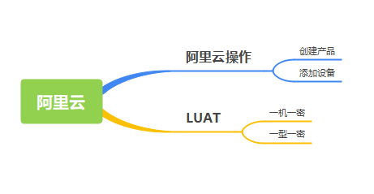
>
> - 关联文档和使用工具：
>
>   - [LuatOS固件获取](https://gitee.com/openLuat/LuatOS/releases) （页面Ctrl+F搜索780EP即可找到对应的固件）
>
>   - [示例demo获取](https://gitee.com/openLuat/LuatOS/tree/master/demo/aliyun)
>
>   - [LuatOS库](https://gitee.com/openLuat/LuatOS)
>
>   - [阿里云平台](https://www.aliyun.com/)

# 准备工作

1. Air780EP_全IO开发板一套，包括天线SIM卡，USB线

    .jpg)

2. PC电脑，串口工具

3. 准备设备证书及产品证书
   **注意：下方证书信息仅为本教程使用，用户需要使用自己的证书信息**

```lua
--设备证书
{
  "ProductKey": "k1hipglLdjU",
  "DeviceName": "868488076506128",
  "DeviceSecret": "fef32adf6dad46c2c7cbf335d3a7b021"
}
--产品证书
{
    "ProductSecret": "8LQwOYSZMwp3DFBd",
    "ProductKey": "k1hipglLdjU"
}
--公共实例ID
{
    "InstanceId"："iot-06z00ipoepm2g97"
}
```

# 阿里云介绍

```
物联网平台提供安全可靠的设备连接通信能力，支持设备数据采集上云，规则引擎流转数据和云端数据下发设备端。此外，也提供方便快捷的设备管理能力，支持物模型定义，数据结构化存储，和远程调试、监控、运维。阿里云物联网平台为设备提供安全可靠的连接通信能力，向下连接海量设备，支撑设备数据采集上云；向上提供云端API，服务端通过调用云端API将指令下发至设备端，实现远程控制。物联网平台消息通信流程图如下。
```

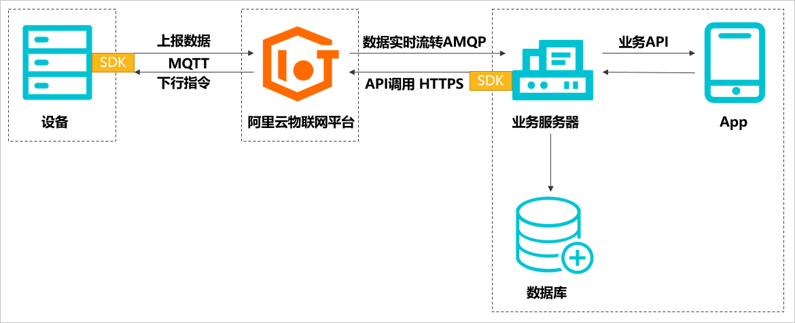

# API说明

| API接口                           | 功能描述                                 |
| --------------------------------- | ---------------------------------------- |
| aliyun.setup(tPara)              | 配置阿里云物联网套件的产品信息和设备信息 |
| aliyun.ready()                   | 判断阿里云物联网套件是否已经连接                        |
| aliyun.store(result)             | 获取或存储注册信息                             |
| aliyun.subscribe(topic,qos)      | 订阅主题                                 |
| aliyun.publish(topic,qos,payload,cbFnc,cbPara)        | 发布一条消息                             |
| aliyun.on(evt,cbFnc)        | 注册事件的处理函数                             |

详细的API介绍请参见[aLiYun章节](https://wiki.luatos.com/api/libs/aliyun.html)

# 实现流程

- 注册接入服务器结果回调函数

  在收到**true**时表示连接成功，本demo中去发布一条QOS为1的消息给阿里云。

- 设置地域

  配置为在阿里云创建项目时所用地区。每个地域完全独立。每个可用区完全隔离，但同一个地域内的可用区之间使用低时延链路相连。地域和可用区之间的关系如下图所示。

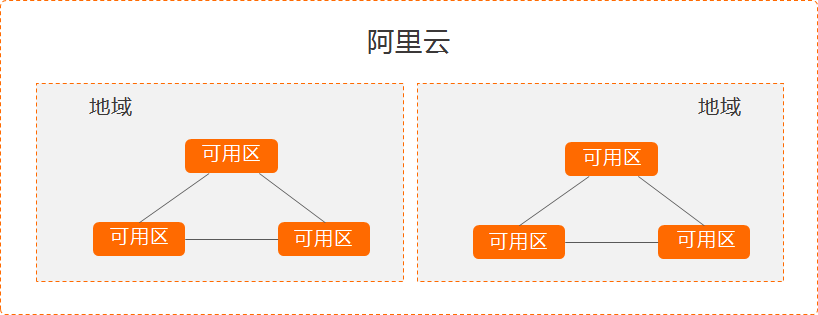

# 阿里云操作

## 产品操作

打开[阿里云平台](https://www.aliyun.com/)找到**物联网平台**，开通业务后进入**控制台**。

点开**设备管理**的**产品页面**，点击**新建产品**。根据需求和图示说明创建产品。

[具体详细介绍见阿里云页面](https://help.aliyun.com/document_detail/73728.html?spm=a2c4g.11174283.6.571.3a8b1668Vmv5CZ)


## 设备操作

创建产品完成后就可以进入设备页面添加设备，在对应产品页面进入设备管理，按照提示添加设备

**（在做正式产品时建议使用imei为devicename，方便后期维护）**

[阿里云设备创建](https://help.aliyun.com/document_detail/73729.html?spm=a2c4g.11186623.6.573.55977b7bAjX04B)


# 连接阿里云

## LuatOS-Air方式连接概述

```
LuatOS-Air连接相比AT更为简单，只需要简单的配置即可连接，还可以灵活的对数据进行处理。需要从官网或者github下载aliyun的脚本包，或者使用luatoolsv2会自动下载脚本资源，在工具根目录的\Luatools\resource\soc_script\v2024.06.25.16\demo\aliyun中脚本资源会随官网同步更新，具体版本可能和本文不同，不过功能都是一致的。
```

文档中用到的API接口见[aLiYun API](https://wiki.luatos.com/api/libs/aliyun.html?highlight=aliyun)章节。

## 一机一密LuatOS-Air方式连接

一机一密需要提前按照文档中[阿里云操作](#阿里云操作)章节事先建好产品并添加设备。

然后找到所使用的脚本版本进入demo目录找到**aliyun**文件夹打开**main.lua**，根据下方图示打开这三行的**require**（如果有被注释掉，将注释去掉），并将其他不相关的注释掉。


接着打开**testYjym.lua**，根据后面的操作修改三元组信息（**DeviceName**、**ProductKey**、**DeviceSecret**）和**InstanceId**信息。

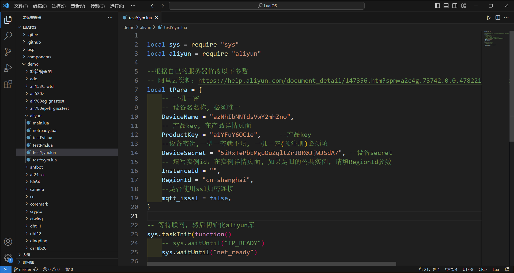

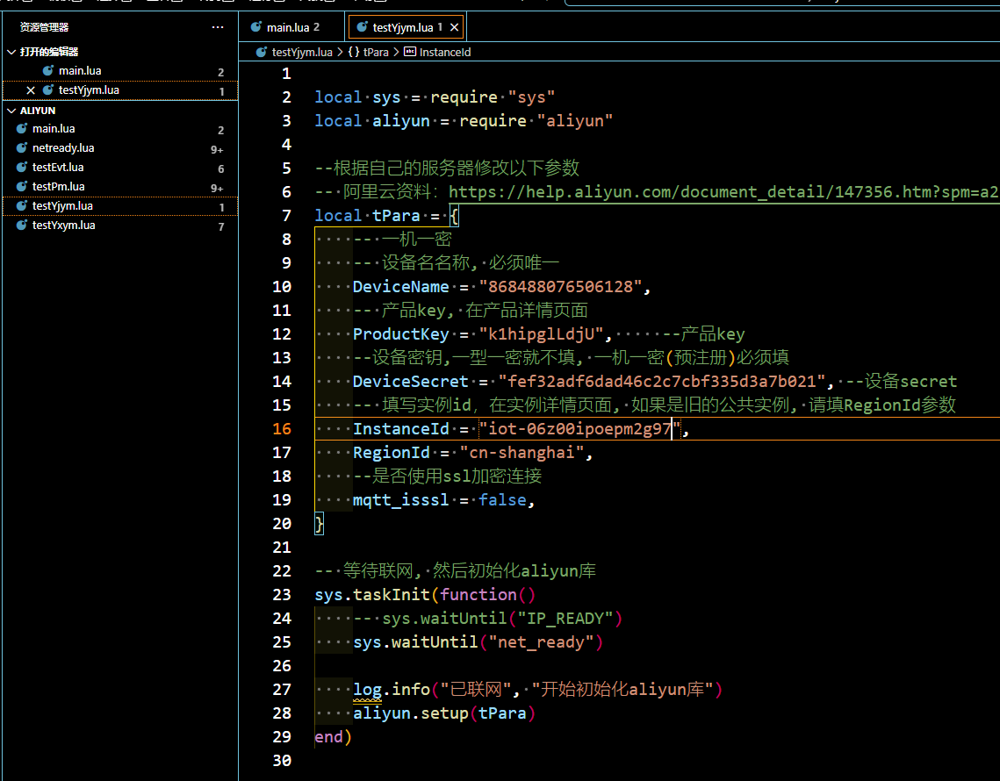

首先将**testYjym.lua**中的三元组信息（**DeviceName**、**ProductKey**、**DeviceSecret**）修改为自己项目中的三元组信息。通过下方图示可找到自己项目中的三元组信息。

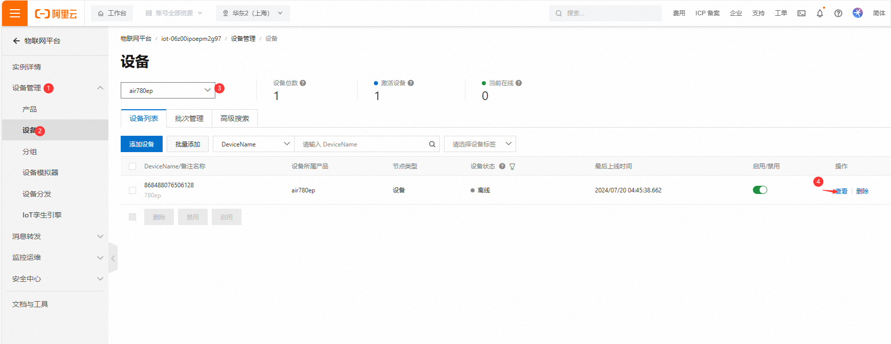

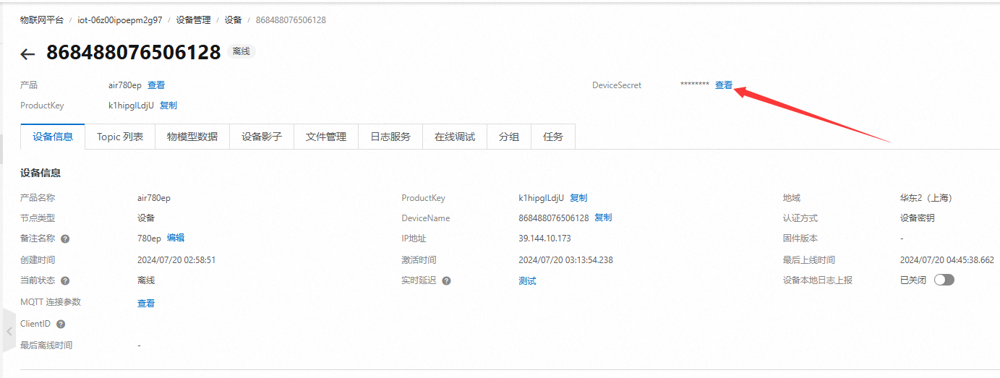


然后在实例详情页面，找到实例id并将其填写到代码中对应位置。

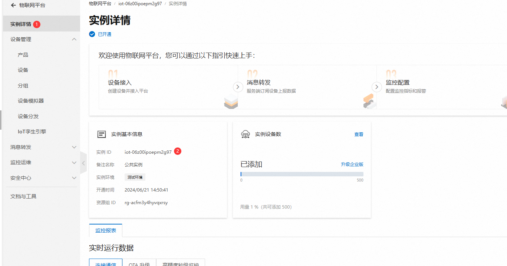

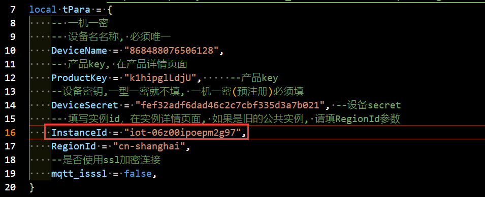

最后将代码保存，通过**Luatools**软件将固件+脚本烧录进设备后，便能连接上阿里云了。这是[烧录教程](https://doc.openluat.com/wiki/21?wiki_page_id=6072#LuatOS_289)。

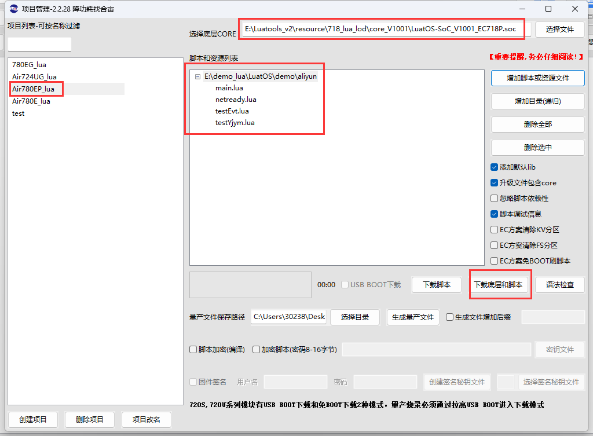


## 一型一密LuatOS-Air方式连接（公共实例）

除了需要添加产品和设备外还需要在阿里云平台中打开对应产品的动态注册开关


先找到所使用的脚本版本进入**demo**目录找到**aliyun**文件夹打开**main.lua**，根据下方图示打开这两行的**require**（如果有被注释掉，将注释去掉），并将其他不相关的注释掉。

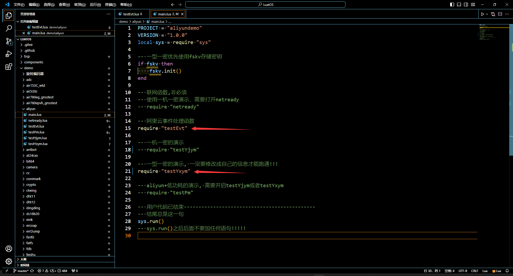

接着打开**testYxym.lua**，根据后面的操作修改**DeviceName**、**ProductKey**、**ProductSecret**和**InstanceId**信息。

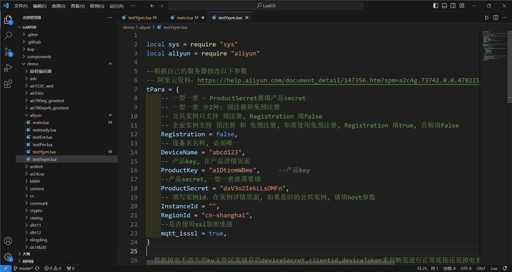

其中**DeviceName**、**ProductKey**和**InstanceId**信息的位置在[一机一密LuatOS-Air方式连接](#一机一密LuatOS-Air方式连接)中已指出。下图为**ProductSecret**信息的位置。

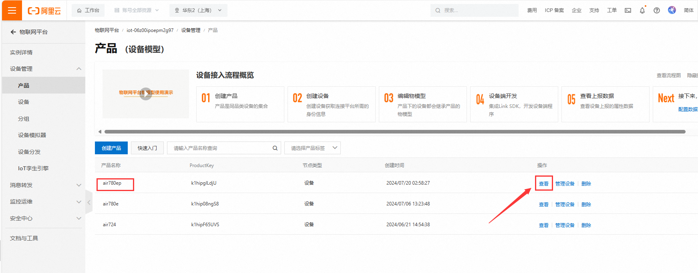

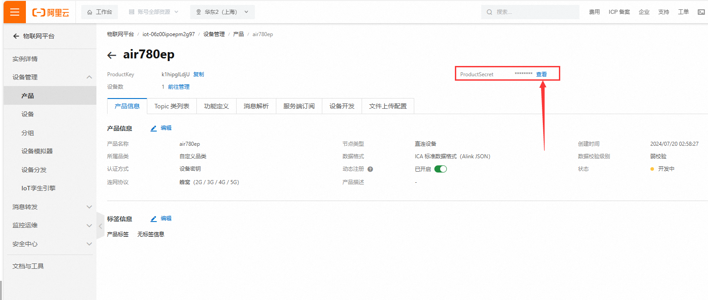

接着将**DeviceName**、**ProductKey**、**ProductSecret**和**InstanceId**信息填写到**testYxym.lua**中对应位置。


最后将代码保存，通过**Luatools**软件将固件+脚本烧录进设备后，便能连接上阿里云了。这是[烧录教程](https://doc.openluat.com/wiki/21?wiki_page_id=6072#LuatOS_289)。
**注意：第一次使用一型一密时，设备要处于未激活状态。**

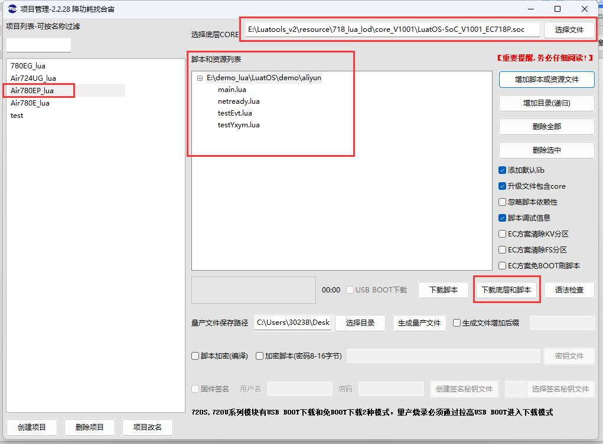


# 发布与订阅消息

## 发布消息

发布消息使用的是**aliyun.publish(topic,qos,payload,cbFnc,cbPara)**这个API。

| 传入值类型 | 释义                                                         |
| :--------- | :----------------------------------------------------------- |
| string     | UTF8编码的主题                                               |
| number     | qos质量等级，0/1，默认0                                      |
| string     | payload 负载内容，UTF8编码                                   |
| function   | cbFnc 消息发布结果的回调函数,回调函数的调用形式为：cbFnc(result,cbPara)。result为true表示发布成功，false或者nil表示订阅失败；cbPara为本接口中的第5个参数 |
| param      | cbPara 消息发布结果回调函数的回调参数                        |
| return     | nil                                                          |

在**demo**里**publishTest()**这个函数演示了接口的操作。无需修改即可实现每20s向阿里云推送一条消息。

```lua
--发布一条QOS为1的消息
function publishTest()
    --注意：在此处自己去控制payload的内容编码，aLiYun库中不会对payload的内容做任何编码转换
    -- aliyun.publish(topic,qos,payload,cbFnc,cbPara)
    log.info("aliyun", "上行数据")
    aliyun.publish("/"..aliyun.opts.ProductKey.."/"..aliyun.opts.DeviceName.."/user/update",1,"LUATOS_CESHI",publishTestCb,"publishTest_"..publishCnt)
end
```

## 订阅消息

订阅使用的是**aLiYun.subscribe(topic, qos)**

| 传入值类型 | 释义                        |
| ---------- | --------------------------- |
| string     | 主题内容为UTF8编码          |
| param      | qos为number类型(0/1，默认1) |
| return     | nil                         |

以下代码为订阅的操作，用户可根据自己的项目需要订阅主题。

```lua
--- 连接结果的处理函数
-- @bool result，连接结果，true表示连接成功，false或者nil表示连接失败
local function connectCbFnc(result)
    log.info("aliyun","连接结果", result)
    if result then
        sys.publish("aliyun_ready")
        log.info("aliyun", "连接成功")
        --订阅主题
        --根据自己的项目需要订阅主题
        -- aliyun.subscribe(topic,qos)
        -- aliyun.subscribe("/".. aliyun.opts.ProductKey.."/".. aliyun.opts.DeviceName.."/user/ceshi",1)

        --PUBLISH消息测试
        publishTest()
    else
        log.warn("aliyun", "连接失败")
    end
end
```

# OTA升级

1. 建立项目并接入阿里云
2. 制作差分升级文件包 [生成差分包详细步骤](https://doc.openluat.com/wiki/21?wiki_page_id=6078)，参考第三章第四节内容
3. 阿里云平台上传差分包

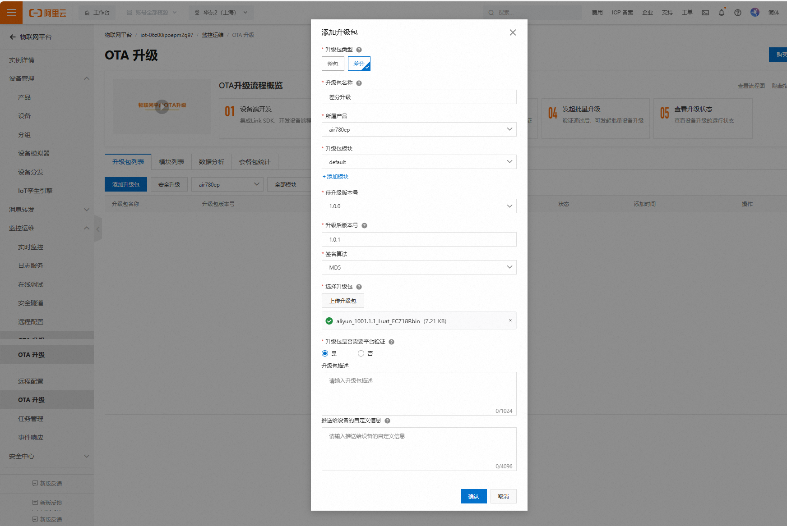

4. 升级包验证

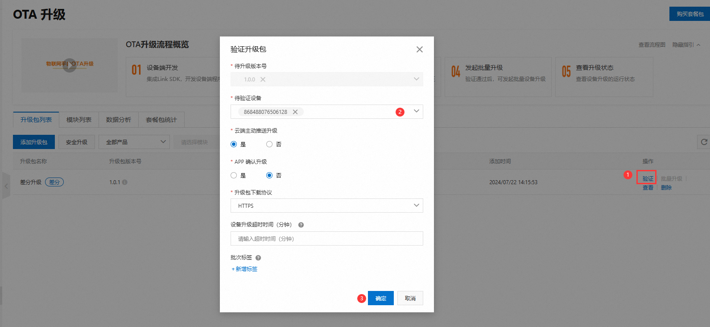

5. 平台查看升级结果


----

> 合宙支持LuatOS开发的模组型号，除本文介绍的Air780EP外，
> 还有Air780EPA、Air780E、Air780EX、Air201、Air780EPT、Air780EPS等型号，
> 本文介绍的接入阿里云的流程，同样也适用于这些型号。


