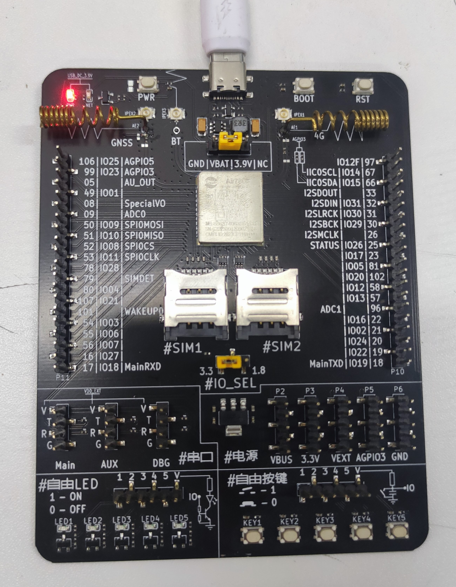
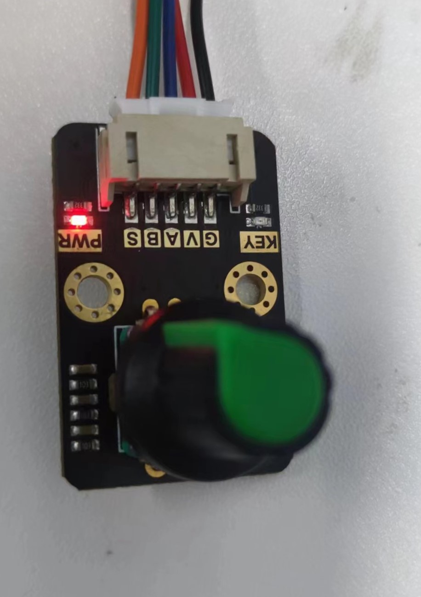
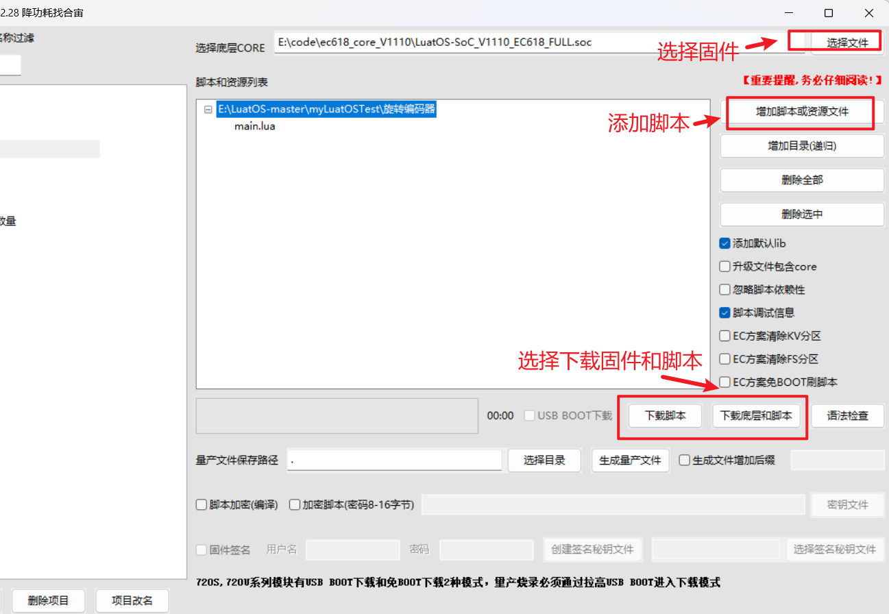
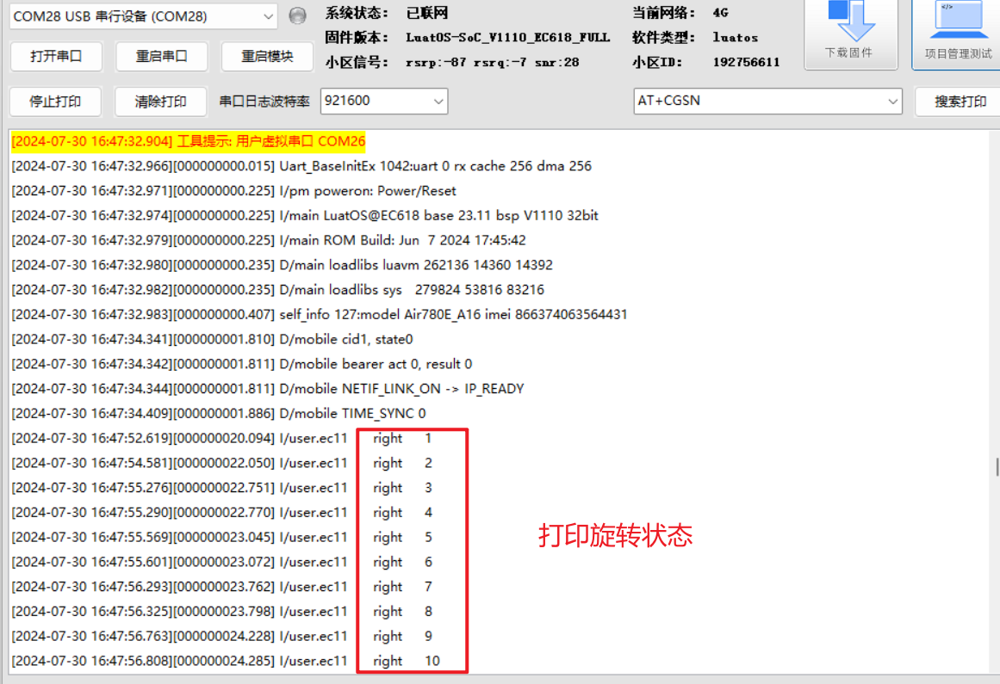

# 780E开发板ec11旋转编码器实例

- 本文档适用于780E开发板
- 关联文档和使用工具

  - [LuatOS-Soc固件获取](https://gitee.com/openLuat/LuatOS/releases)
  - [程序中使用函数讲解](https://wiki.luatos.com/api/libs/ec11.html)
  - [Luatools下载调试工具](https://gitee.com/openLuat/luatos-doc-pool/blob/master/doc/%E5%BC%80%E5%8F%91%E5%B7%A5%E5%85%B7%E5%8F%8A%E4%BD%BF%E7%94%A8%E8%AF%B4%E6%98%8E/Luatools%E4%B8%8B%E8%BD%BD%E8%B0%83%E8%AF%95%E5%B7%A5%E5%85%B7.md)
- 本文档中使用的不是demo中的程序，那个需要模块支持ioqueue才能使用。本文档使用了更加通用的ec11.lua扩展例程库实现了编码器的功能。
### 1、环境准备

1、780E开发板一套



2、旋转编码器



### 2、程序实例

#### API说明

接口

ec11.init(GPIO_A,GPIO_B)

参数

| 参数类型             | 描述                    |
| :------------------ | ----------------------- |
| number       | GPIO_A A引脚对应的GPIO编号, 例如 GPIO6, 就写6 |
| number       | GPIO_B B引脚对应的GPIO编号, 例如 GPIO7, 就写7 |

返回值

无

#### 完整程序
在main.lua中添加如下程序

```lua
PROJECT = "ROTARY_TEST"
VERSION = "1.0.0"

-- 用法实例, 当前支持一定一脉冲
local ec11 = require("ec11")

-- 按实际接线写
local GPIO_A = 6
local GPIO_B = 7
ec11.init(GPIO_A,GPIO_B)

-- 演示接收旋转效果
local count = 0
local function ec11_callBack(direction)
    if direction == "left" then
        -- 往左选,逆时针
        count = count - 1
    else
        -- 往右旋,顺时针
        count = count + 1
    end
    log.info("ec11", direction, count)
end

sys.subscribe("ec11",ec11_callBack)

sys.run()
```

### 3、烧录运行

打开Luatools下载固件和脚本



### 4、效果展示

下载后旋转旋转编码器，可以看到Luatools工具中打印




----

> 合宙支持LuatOS开发的模组型号，除本文介绍的Air780E外，
> 还有Air780EPA、Air780EP、Air780EX、Air201、Air780EPT、Air780EPS等型号，
> 本文介绍的适配EC11旋转编码器的流程，同样也适用于这些型号。但是要注意实际的接线方式，因为不同的模组引脚定义可能不同。


