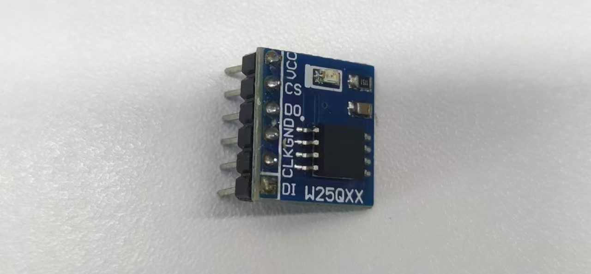
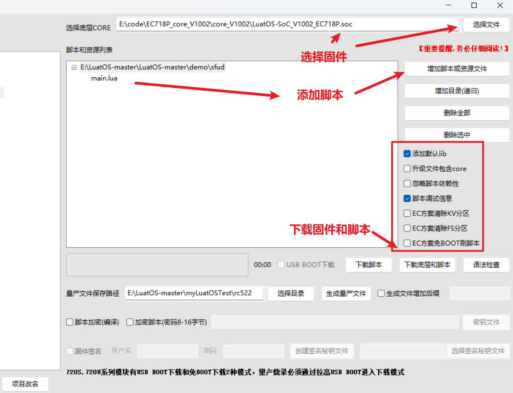
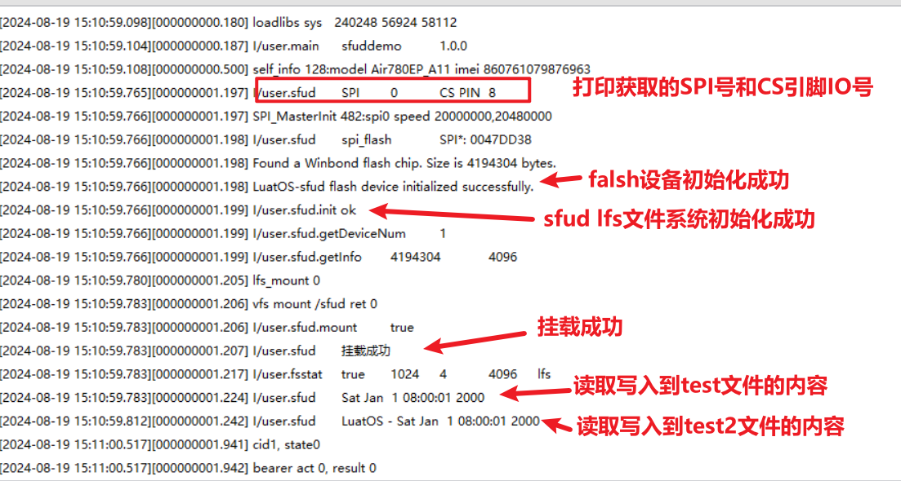
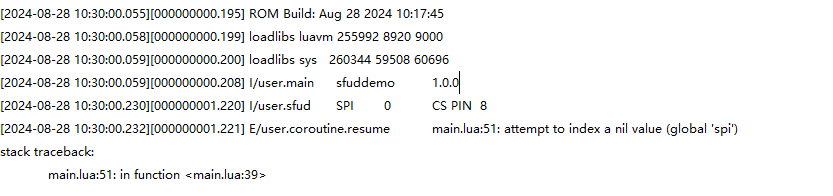
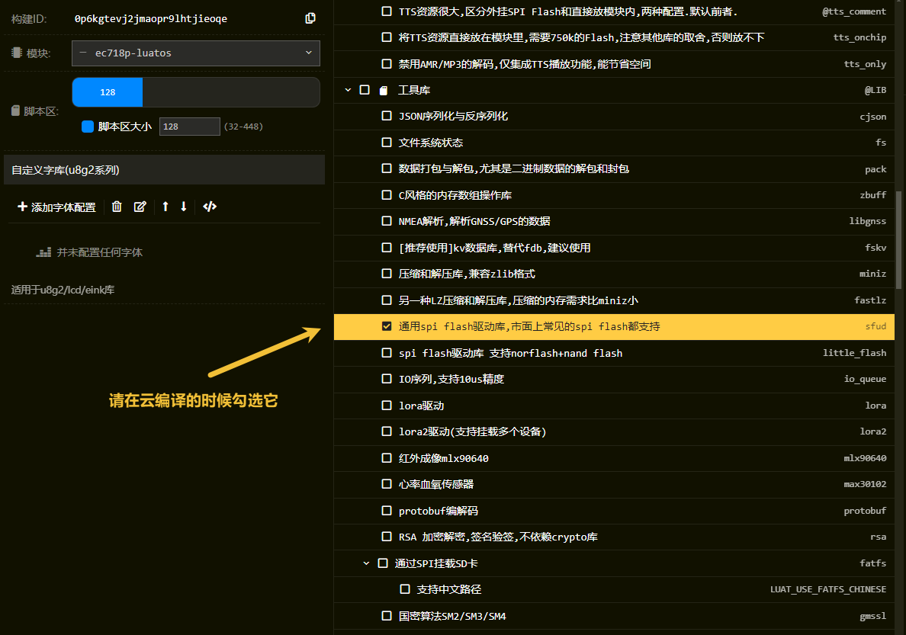

# Air780EP模块LuatOS开发如何外挂一个Flash芯片

## 简介

采用sfud是一款开源的串行SPI Flash通用驱动库，LuatOS中集成了该库，可以调用sfud的api实现对各类SPI Flash的读写操作。

- 关联文档和使用工具：

  - [LuatOS 固件获取](https://gitee.com/openLuat/LuatOS/releases)

  - [sufd-demo](https://gitee.com/openLuat/LuatOS/tree/master/demo/sfud)

  - [Luatools下载调试工具](https://gitee.com/openLuat/luatos-doc-pool/blob/master/doc/开发工具及使用说明/Luatools下载调试工具.md)
  
  - [开发板Core_Air780EP使用说明 ](https://doc.openluat.com/share_article/ekP9pxVv5b0m8)

## 材料准备

1、Air780EP开发板一套。


2、一个使用SPI的flash模块，这里使用的是w25q型号。



### 接线

```lua
--[[
	W25Q		780EP使用小板,看板子上的丝印找到如下引脚
	CS			SPI_CS（GPIO8）
	DO			SPI_MISO（GPIO10）
	CLK			SPI_SCLK（GPIO11）
	DI			SPI_MOSI（GPIO9）
]]
```


## 程序介绍

### API说明

#### 创建一个Task协程

sys.taskInit(func, arg1, arg2, argN)

**参数**

| 传入值类型 | 解释                                                 |
| ---------- | ---------------------------------------------------- |
| function   | 待执行的函数,可以是匿名函数, 也可以是local或全局函数 |
| any        | 需要传递的参数1,可选                                 |
| any        | 需要传递的参数2,可选                                 |
| any        | 需要传递的参数N,可选                                 |

**返回值**

| 返回值类型 | 解释     |
| ---------- | -------- |
| task       | 协程对象 |

#### 设置并启用SPI(对象方式)

spi.deviceSetup(id, cs, CPHA, CPOL, dataw, bandrate, bitdict, ms, mode)

**参数**

| 传入值类型 | 解释                                             |
| ---------- | ------------------------------------------------ |
| int        | SPI号,例如0                                      |
| int        | CS 片选脚,在w600不可用请填nil                    |
| int        | CPHA 默认0,可选0/1                               |
| int        | CPOL 默认0,可选0/1                               |
| int        | 数据宽度,默认8bit                                |
| int        | 波特率,默认20M=20000000                          |
| int        | 大小端, 默认spi.MSB, 可选spi.LSB                 |
| int        | 主从设置, 默认主1, 可选从机0. 通常只支持主机模式 |
| int        | 工作模式, 全双工1, 半双工0, 默认全双工           |

**返回值**

| 返回值类型 | 解释       |
| ---------- | ---------- |
| userdata   | spi_device |

#### 初始化sfud

sfud.init(spi_id, spi_cs, spi_bandrate)/sfud.init(spi_device)

**参数**

| 传入值类型 | 解释                               |
| ---------- | ---------------------------------- |
| int        | spi_id SPI的ID/userdata spi_device |
| int        | spi_cs SPI的片选                   |
| int        | spi_bandrate SPI的频率             |

**返回值**

| 返回值类型 | 解释                       |
| ---------- | -------------------------- |
| bool       | 成功返回true,否则返回false |

#### 获取flash设备信息表中的设备总数

sfud.getDeviceNum()

**参数**

无

**返回值**

| 返回值类型 | 解释         |
| ---------- | ------------ |
| int        | 返回设备总数 |

#### 获取flash设备信息表

sfud.getDeviceTable()

**参数**

无

**返回值**

| 返回值类型 | 解释                             |
| ---------- | -------------------------------- |
| userdata   | 成功返回一个数据结构,否则返回nil |

#### 获取 Flash 容量和page大小

sfud.getInfo(flash)

**参数**

| 传入值类型 | 解释                                                       |
| ---------- | ---------------------------------------------------------- |
| userdata   | flash Flash 设备对象 sfud.get_device_table()返回的数据结构 |

**返回值**

| 返回值类型 | 解释        |
| ---------- | ----------- |
| int        | Flash 容量  |
| int        | page 页大小 |

#### 先擦除再往 Flash 写数据

sfud.eraseWrite(flash, addr,data)

**参数**

| 传入值类型 | 解释                                                       |
| ---------- | ---------------------------------------------------------- |
| userdata   | flash Flash 设备对象 sfud.get_device_table()返回的数据结构 |
| int        | addr 起始地址                                              |
| string     | data 待写入的数据                                          |

**返回值**

| 返回值类型 | 解释      |
| ---------- | --------- |
| int        | 成功返回0 |

#### 读取 Flash 数据

sfud.read(flash, addr, size)

**参数**

| 传入值类型 | 解释                                                       |
| ---------- | ---------------------------------------------------------- |
| userdata   | flash Flash 设备对象 sfud.get_device_table()返回的数据结构 |
| int        | addr 起始地址                                              |
| int        | size 从起始地址开始读取数据的总大小                        |

**返回值**

| 返回值类型 | 解释              |
| ---------- | ----------------- |
| string     | data 读取到的数据 |

#### 挂载sfud lfs文件系统

sfud.mount(flash, mount_point, offset, maxsize)

**参数**

| 传入值类型 | 解释                                                       |
| ---------- | ---------------------------------------------------------- |
| userdata   | flash Flash 设备对象 sfud.get_device_table()返回的数据结构 |
| string     | mount_point 挂载目录名                                     |
| int        | 起始偏移量,默认0                                           |
| int        | 总大小, 默认是整个flash                                    |

**返回值**

| 返回值类型 | 解释         |
| ---------- | ------------ |
| bool       | 成功返回true |

#### 获取文件系统信息

fs.fsstat(path)

**参数**

| 传入值类型 | 解释              |
| ---------- | ----------------- |
| string     | 路径,默认”/”,可选 |

**返回值**

| 返回值类型 | 解释                             |
| ---------- | -------------------------------- |
| boolean    | 获取成功返回true,否则返回false   |
| int        | 总的block数量                    |
| int        | 已使用的block数量                |
| int        | block的大小,单位字节             |
| string     | 文件系统类型,例如lfs代表littlefs |

#### 打开文件

io.open (filename [, mode])

这个函数用字符串 `mode` 指定的模式打开一个文件。 返回新的文件句柄。 当出错时，返回 **nil** 加错误消息。

`mode` 字符串可以是下列任意值：

- **"`r`":** 读模式（默认）；
- **"`w`":** 写模式；
- **"`a`":** 追加模式；
- **"`r+`":** 更新模式，所有之前的数据都保留；
- **"`w+`":** 更新模式，所有之前的数据都删除；
- **"`a+`":** 追加更新模式，所有之前的数据都保留，只允许在文件尾部做写入。

`mode` 字符串可以在最后加一个 '`b`' ， 这会在某些系统上以二进制方式打开文件。

**参数**

| 传入值类型 | 解释     |
| ---------- | -------- |
| string     | 文件路径 |
| string     | 模式     |


#### 读取整个文件,请注意内存消耗

io.readFile(path, mode, offset, len)

**参数**

| 传入值类型 | 解释                  |
| ---------- | --------------------- |
| string     | 文件路径              |
| string     | 读取模式, 默认 “rb”   |
| int        | 起始位置,默认0        |
| int        | 读取长度,默认整个文件 |

**返回值**

| 返回值类型 | 解释                           |
| ---------- | ------------------------------ |
| string     | 文件数据,若文件不存在会返回nil |

#### 将数据写入文件

io.writeFile(path, data)

**参数**

| 传入值类型 | 解释     |
| ---------- | -------- |
| string     | 文件路径 |
| string     | 数据     |

**返回值**

| 返回值类型 | 解释                        |
| ---------- | --------------------------- |
| boolean    | 成功返回true, 否则返回false |

#### 时间戳函数

os.time(mytime)

**参数**

| 传入值类型 | 解释            |
| ---------- | --------------- |
| table      | 日期时间的table |
| return     | 时间戳          |

### 程序demo讲解

#### 1、初始化

初始化SPI和sfud。

```lua
spi_flash = spi.deviceSetup(spi_id,pin_cs,0,0,8,20*1000*1000,spi.MSB,1,0)
log.info("sfud", "spi_flash", spi_flash)
local ret = sfud.init(spi_flash)
```

#### 2、直接读写或挂载sfud lfs文件系统

直接读写或者挂载sfud lfs文件系统开关

```lua
-- 直接读写    
local test_sfud_raw = false
-- 挂载sfud lfs文件系统
local test_sfud_mount = true
```

#### 3、直接读写

调用函数`sfud.eraseWrite()`先擦除指定地址再写入，然后调用`sfud.read()`读取指定地址的数据。

```lua
-- 对于1024地址，先擦除，再向flash中写数据
log.info("sfud.eraseWrite",sfud.eraseWrite(sfud_device,1024,"luatos-sfud1234567890123456789012345678901234567890"))
-- 读取数据，起始地址1024，读取大小4字节
log.info("sfud.read",sfud.read(sfud_device,1024,4))
```

#### 4、挂载sfud lfs文件系统

挂载sfud lfs系统

```lua
local ret = sfud.mount(sfud_device,"/sfud")
```

#### 5、操作文件

```lua
-- 删除文件
os.remove("/sfud/test2")
-- 将数据写入文件
io.writeFile("/sfud/test2", "LuatOS")
-- 以追加的方式打开文件
local f = io.open("/sfud/test2", "a+")
-- 向文件中写入日期数据
f:write(" - " .. os.date())
-- 关闭文件
f:close()
```

## 效果展示

### 1、下载固件和脚本



### 2、在Luatools工具中查看效果




## 常见问题

### 1、为什么我这里运行会出现 "attempt to index a nil value (global 'spi')"的错误




 一些客户由于自己业务有定制需求，所以用的固件是通过云编译出来的，如果出现了这个报错，可以在云编译的时候确认下是否有勾选sfud库。



### 

### 2、接线都正确，但为什么在初始化的时候还是失败

需要检查下对应flash芯片工作电压是多少

780EP硬件可通过IO_SET引脚控制GPIO电压，IO_SET脚连接3.3V，GPIO的电压就会变为3.3V，IO_SET脚连接1.8V同理。按需求进行硬件上的改动。

如果硬件不方便修改，则可以通过软件接口，pm.ioVol(pm.IOVOL_ALL_GPIO,  3300) 修改为3.3V，接口详情请在这里查看[pm.ioVol接口说明](https://wiki.luatos.com/api/pm.html?highlight=%E7%94%B5%E5%8E%8B#pm-iovol-id-val)


