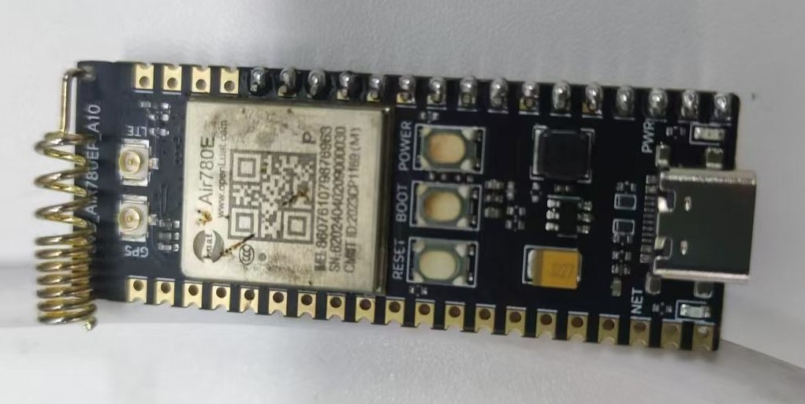
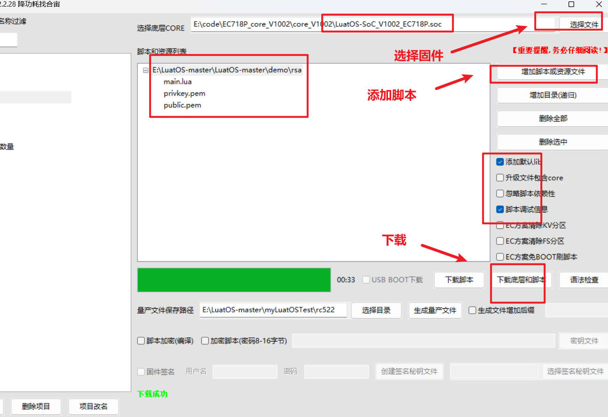
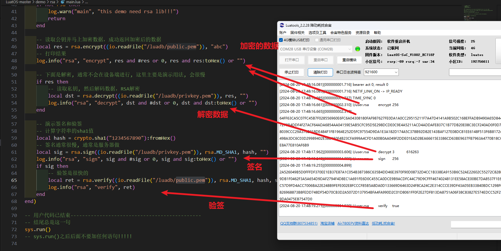

# Air780EP_LuatOS_rsa使用指南

## 简介

RSA算法的安全性基于：将两个大质数相乘很容易，但是想要将其乘积分解成原始的质数因子却非常困难。

- 关联文档和使用工具：

  - [LuatOS 固件获取](https://gitee.com/openLuat/LuatOS/releases)

  - [rsa-demo](https://gitee.com/openLuat/LuatOS/tree/master/demo/rsa)

  - [Luatools下载调试工具](https://gitee.com/openLuat/luatos-doc-pool/blob/master/doc/开发工具及使用说明/Luatools下载调试工具.md)
  
  - [开发板Core_Air780EP使用说明 ](https://doc.openluat.com/share_article/ekP9pxVv5b0m8)

## 材料准备

1、Air780EP开发板一套。



## 程序介绍

### API说明

#### RSA加密

rsa.encrypt(key, data)

**参数**

| 传入值类型 | 解释                                                         |
| ---------- | ------------------------------------------------------------ |
| string     | 公钥数据,仅支持PEM格式                                       |
| string     | 待加密数据, 不能超过公钥位数的一半, 例如 2048bit的公钥, 只能加密128字节的数据 |

**返回值**

| 返回值类型 | 解释                             |
| ---------- | -------------------------------- |
| string     | 加密成功后的数据,若失败会返回nil |

#### RSA解密

rsa.decrypt(key, data, pwd)

**参数**

| 传入值类型 | 解释                   |
| ---------- | ---------------------- |
| string     | 私钥数据,仅支持PEM格式 |
| string     | 待解密数据             |
| string     | 私钥的密码,可选        |

**返回值**

| 返回值类型 | 解释                             |
| ---------- | -------------------------------- |
| string     | 解密成功后的数据,若失败会返回nil |

#### 计算sha1值

crypto.sha1(str)

**参数**

| 传入值类型 | 解释             |
| ---------- | ---------------- |
| string     | 需要计算的字符串 |

**返回值**

| 返回值类型 | 解释                        |
| ---------- | --------------------------- |
| string     | 计算得出的sha1值的hex字符串 |

#### RSA签名

rsa.sign(key, md, hash, pwd)

**参数**

| 传入值类型 | 解释                                              |
| ---------- | ------------------------------------------------- |
| string     | 私钥数据,仅支持PEM格式                            |
| int        | 签名模式, 例如 rsa.MD_SHA1 , rsa.MD_SHA256        |
| string     | hash数据, 如果是HEX字符串,记得fromHex转二进制数据 |
| string     | 私钥密码, 可选                                    |

**返回值**

| 返回值类型 | 解释                         |
| ---------- | ---------------------------- |
| string     | 成功返回sig数据, 否则返回nil |

#### RSA验签

rsa.verify(key, md, hash, sig)

**参数**

| 传入值类型 | 解释                                              |
| ---------- | ------------------------------------------------- |
| string     | 公钥数据,仅支持PEM格式                            |
| int        | 签名模式, 例如 rsa.MD_SHA1 , rsa.MD_SHA256        |
| string     | hash数据, 如果是HEX字符串,记得fromHex转二进制数据 |
| string     | sig数据, 如果是HEX字符串,记得fromHex转二进制数据  |

**返回值**

| 返回值类型 | 解释                                 |
| ---------- | ------------------------------------ |
| bool       | 有效返回true,否则为false,出错返回nil |

### 程序demo讲解

#### 1、rsa加密

读取文件public.pem中的公钥然后加密数据。

```lua
-- 读取公钥并马上加密数据，成功返回加密后的数据
local res = rsa.encrypt((io.readFile("/luadb/c")), "abc")
```

#### 2、rsa解密

读取privkey.pem文件中的私钥，然后采用rsa解密数据

```lua
-- 读取私钥, 然后解码数据，RSA解密
local dst = rsa.decrypt((io.readFile("/luadb/privkey.pem")), res, "")
```

#### 3、计算字符串的sha1值

```lua
local hash = crypto.sha1("1234567890"):fromHex()
```

#### 4、签名

读取privkey.pem中的私钥数据(仅支持PEM格式)，采用rsa.MD_SHA1模式签名

```lua
local sig = rsa.sign((io.readFile("/luadb/privkey.pem")), rsa.MD_SHA1, hash, "")
```

#### 5、验签

读取public.pem文件中的公钥数据，采用rsa.MD_SHA1模式验签

```lua
local ret = rsa.verify((io.readFile("/luadb/public.pem")), rsa.MD_SHA1, hash, sig)
```

### 效果展示

#### 1、下载固件和脚本



#### 2、效果展示




