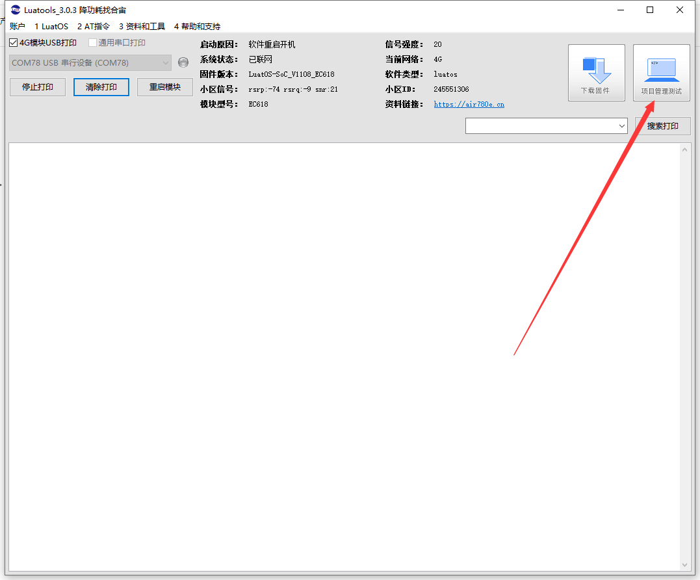
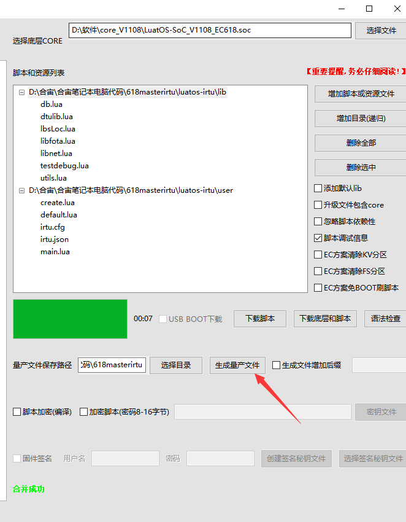
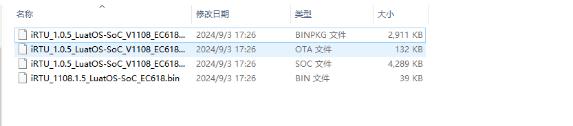
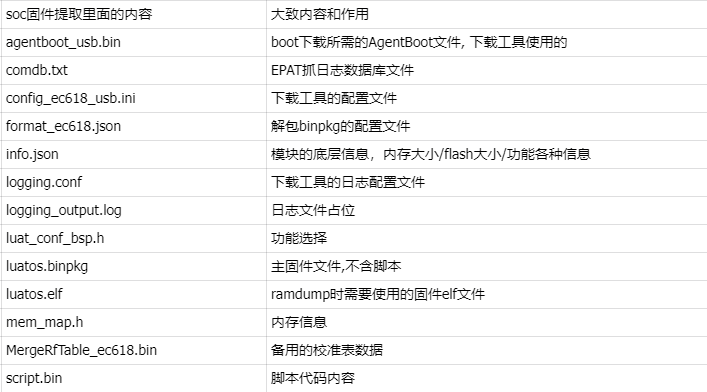

# Air780E量产binpkg文件如何获取

## 背景

最近luatos开发客户增多，客户在量产烧录的时候需要binpkg文件，但是有些客户不知道binpkg文件是什么，在哪里获取，是否可以用soc文件提取出来，使用里面的binpkg文件呢？

- 关联文档和使用工具：

  - [Luatools下载调试工具](https://gitee.com/openLuat/luatos-doc-pool/blob/master/doc/开发工具及使用说明/Luatools下载调试工具.md)
  

## 材料准备

1、打开Luatools，点击项目管理测试

2、放入脚本和core固件点击生成量产文件：

3、会生成4个文件，一个升级的bin文件，一个binpkg文件，一个OTA文件，一个soc文件，获取binpkg文件即可：

## soc提取出来文件内容大概说明

## binpkg和soc有啥区别呢？
  soc是合宙定义的格式
  binpkg是移芯定义的格式

## 是否可以用soc里面的binpkg文件烧录呢？
不行，因为soc里的binpkg是不带脚本区的数据的，量产文件目录里的生产的binpkg, 带脚本数据,所以会存在一种情况，先烧录了soc固件，往脚本区的flash里面写入了内容，再烧录soc的binpkg，会导致脚本区有内容，实际上soc里面的binpkg是没有脚本区的内容的

## binpkg烧录的大概原
实际上烧录binpkg就是往模块的flash指定区域去写内容，刷机工具就是把binpkg的每个部分, 按规定偏移量, 写到flash上

