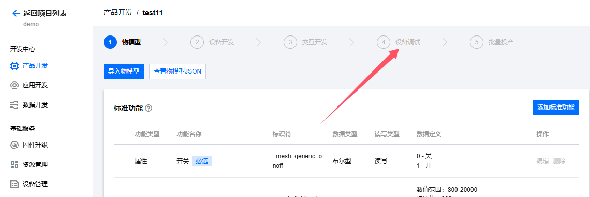

# 一库打通所有云平台--IOT_CLOUD系列文档之腾讯物联网云平台

## IOT_CLOUD介绍

​	众所周知，市面上有很多云平台，阿里云、腾讯云、中移onenet、华为云、百度云、华为云、Tlink云等等......并且每家都有自己的协议，工程师要移植不同的sdk代码或基于各家的手册文档对接不同的协议，看着都头大！！！

​	所以**iotcloud**应运而生！iotcloud是合宙专门为了合并iot平台而制作的库，意在使用统一且极简的代码接入各个云平台，轻松实现云功能。用户无需为那么多云平台的接入而头疼，只需要极简的通用API即可轻松上云！并且因为通用，所以云平台之间的迁移也十分方便。

​	**注意:本文档以AIR780EP+Luatos作为示例，此库为网络通用库不限制型号，所有LUATOS支持的蜂窝模组都可使用**

### 实现介绍：

​	iotcloud库本质就是上层设计一套通用的API，库来进行每个平台功能的对接。目前已经实现了各个平台的所有注册方式，其中自动注册会将相关验证信息保存kv，随后使用此验证信息进行连接，通知针对每个平台添加了特有系统实现，比如设备上线通知，设备版本号上传，ota功能等，用户无需管理这些只需要注意相关下发消息做应用逻辑即可

## 腾讯云介绍

​	腾讯云物联网开发平台（IoT Explorer）是面向智慧生活与产业互联应用的物联网 PaaS 平台，为基于物联网的各行业设备制造商、方案商及应用开发商提供一站式设备智能化服务。平台提供海量设备连接与管理能力及基于腾讯连连的小程序应用开发能力，并打通腾讯云基础产品及 AI 能力，聚合腾讯生态内容能力。从而提升传统行业设备智能化的效率，降低用户的开发运维成本。

​	**官网地址：**[物联网开发平台 - 控制台 (tencent.com)](https://console.cloud.tencent.com/iotexplorer)

## 前期准备

### 云平台准备

​	需要登录官网[物联网开发平台 - 控制台 (tencent.com)](https://console.cloud.tencent.com/iotexplorer)注册腾讯云账号并新建公共实例并且新建一个项目，后面我们会在此项目中进行演示

​	**注意：腾讯新出了个v2版本开发平台，本库也支持但是不推荐使用，至笔者编写此文章为止，V2较V1版本去掉了证书校验，去掉了自动注册中自动创建设备功能，并且已经和腾讯云确认此改动，是的，自动注册的自动创建设备改没了，自动注册要手动一个一个创建设备，呵呵**

### 硬件准备

- air780ep开发板一块
- USB数据线
- 电脑

## 实战教学

​	接下来我们不按部就班的介绍每个API，这样很枯燥。我们直接实战，跟着文档从0一步一步进行下去，每一步介绍涉及到的API，流程结束也就会了iotcloud库的使用

### 设备注册

#### 设备注册API

​	注册的API只有一个但是支持了所有的注册方式，使用也很简单

**iotcloud.new(cloud,iot_config,connect_config)**

创建云平台对象

**参数**

| 传入值类型 | 解释                                                         |
| ---------- | ------------------------------------------------------------ |
| string     | 云平台 iotcloud.TENCENT:腾讯云 iotcloud.ALIYUN:阿里云 iotcloud.ONENET:中国移动云 iotcloud.HUAWEI:华为云 iotcloud.TUYA:涂鸦云 |
| table      | iot云平台配置, device_name:可选，默认为imei否则为unique_id iot_config.product_id:产品id(阿里云则为产品key) iot_config.product_secret:产品密钥,有此项则为动态注册 iot_config.key:设备秘钥,有此项则为秘钥连接 userid:用户ID,onenet专用,动态注册使用 userkey:用户Accesskey,onenet专用,动态注册使用 |
| table      | mqtt配置, host:可选,默认为平台默认host ip:可选,默认为平台默认ip tls:加密,若有此项一般为产品认证 keepalive:心跳时间,单位s 可选,默认240 |

**返回值**

| 返回值类型 | 解释       |
| ---------- | ---------- |
| table      | 云平台对象 |

#### 设备注册分类

​	腾讯云支持三种注册方式(实际是四种，动态注册里分两种，但是对用户无感所以这里不进行拆分)

1. **密钥校验(手动注册)**

   密钥校验即使用秘钥作为校验凭据，首先新建产品


​	

​	按照要求填写，认证方式选择密钥认证，之后我们点进去新建个设备，设备名称我们可以直接填写模组的imei




这样我们就创建好了设备，我们点进去看下设备信息


​	可以看到我们需要的数据已经被贴心的加了一键复制，我们要记录下 设备名称、产品ID、设备密钥 这三个数据，使用这三个数据我们就可以上云了

​	接下来我们看下代码具体怎么用

```lua
-- 密钥校验
-- iotcloudc = iotcloud.new(iotcloud.TENCENT,{produt_id = "xxx",device_name = "xxx",key = "xxx"})
```

​	第一个参数表示我们使用的是腾讯云，第二个参数我们将上面得到的三个参数填写到table中即可，so easy~

2. **证书校验(手动注册)**

​	证书校验即使用证书作为校验凭据，注意选择证书认证，**注意：V2版本腾讯云不支持新建此校验方式**


​	之后和上面密钥校验一样的创建设备流程，创建之后我们再来看看设备信息


​	大家应该猜到了，还是三个参数，产品名称 产品ID 最后一个变成了设备证书

​	接下来我们再来看下代码具体怎么用

```lua
-- 证书校验
-- iotcloudc = iotcloud.new(iotcloud.TENCENT,{produt_id = "xxx",device_name = "xxx"},{tls={client_cert=io.readFile("/luadb/client_cert.crt")}})
```

​	第一个参数表示我们使用的是腾讯云，第二个参数我们将上面得到的产品名称 产品ID，第三个参数写上我们的证书，同样很简单~

3. **动态注册(推荐)**

​	上面两种方式都需要我们手动在云平台上创建设备，但是我们的产品会有很多设备，手动创建太麻烦，动态注册就解决了这些问题~他可以实现统一代码使用时动态进行设备注册，无需手动创建

**注意：V2版本腾讯云不支持自动创建设备**	

​	这样我们就简单了很多，上面两种方式创建的产品详情中都有动态注册开关，我们只需要打开动态注册开关和自动创建设备开关即可支持两种方式的动态注册


​	随后会生成动态注册上方的产品密钥，我们复制产品ID和产品密钥即可

​	接下来我们再来看下代码具体怎么用

```lua
-- 动态注册
--iotcloudc = iotcloud.new(iotcloud.TENCENT,{produt_id = "xxx" ,product_secret = "xxx")
```

​	第一个参数表示我们使用的是腾讯云，第二个参数我们将上面得到的产品ID和产品密钥，非常的简单！

### 连接/断开云平台

​	注册完成了，我们开始上云了~ 非常简单，iotcloud库的api基本和mqtt库一样，所以连接只需要一个API

**cloudc:connect()**

云平台连接

**参数**

无

**返回值**

无

**例子**

```
iotcloudc:connect()
```

------

​	连接说了，我们也说一下断开连接，也只需要一个API

**cloudc:disconnect()**

云平台断开

**参数**

无

**返回值**

无

**例子**

```
iotcloudc:disconnect()
```

### 订阅/取消订阅主题

​	同上，订阅和取消订阅也很简单

**cloudc:subscribe(topic, qos)**

云平台订阅

**参数**

| 传入值类型   | 解释                            |
| ------------ | ------------------------------- |
| string/table | 主题                            |
| number       | topic为string时生效 0/1/2 默认0 |

**返回值**

无

------

**cloudc:unsubscribe(topic)**

云平台取消订阅

**参数**

| 传入值类型   | 解释 |
| ------------ | ---- |
| string/table | 主题 |

**返回值**

无

### 发布数据

​	数据的发布也同MQTT一样

**cloudc:publish(topic,data,qos,retain)**

云平台发布

**参数**

| 传入值类型   | 解释                    |
| ------------ | ----------------------- |
| string/table | 主题                    |
| string       | 消息,必填,但长度可以是0 |
| number       | 消息级别 0/1 默认0      |
| number       | 是否存档, 0/1,默认0     |

**返回值**

无

### 接收数据

​	接收统一使用了`"iotcloud"`消息进行通知，所以我们只需要订阅此系统消息即可

```lua
sys.subscribe("iotcloud", function(cloudc,event,data,payload)
    if event == iotcloud.CONNECT then -- 云平台联上了
            -- iotcloud:subscribe("test") -- 定阅主题
    elseif event == iotcloud.RECEIVE then
            print("iotcloud","topic", data, "payload", payload)
            -- 用户处理代码
    elseif event ==  iotcloud.OTA then
        if data then
            rtos.reboot()
        end
    elseif event == iotcloud.DISCONNECT then -- 云平台断开了
            -- 用户处理代码
    end
end)
```

### 云平台关闭

​	云平台关闭会释放掉内存，之后不能再进行重接，只能重新新建再连接

**cloudc:close()**

云平台关闭

**参数**

无

**返回值**

无

**例子**

```
iotcloudc:close()
```

### 云平台OTA

​	仅仅如此了么？当然不只，iotcloud还支持了腾讯云平台的ota功能，可以直接进行ota，所有流程iotcloud库都进行了支持，做到了用户无感，用户在订阅`"iotcloud"`消息中会有`iotcloud.OTA`事件，此事件即为ota完成的通知，我们选择时间进行设备重启即可

## 效果演示

### 代码演示

​	好了，接下来我们看下完整代码和效果，这里以动态注册为例，demo地址：[demo/iotcloud/main.lua · 合宙Luat/LuatOS - 码云 - 开源中国 (gitee.com)](https://gitee.com/openLuat/LuatOS/blob/master/demo/iotcloud/main.lua)

```lua

-- LuaTools需要PROJECT和VERSION这两个信息
PROJECT = "iotclouddemo"
VERSION = "1.0.0"

-- sys库是标配
_G.sys = require("sys")
--[[特别注意, 使用mqtt库需要下列语句]]
_G.sysplus = require("sysplus")

local iotcloud = require("iotcloud")

sys.taskInit(function()
    -- 等待联网
    sys.waitUntil("IP_READY")

    --------    以下接入方式根据自己需要修改,相关参数修改为自己的    ---------

    -- 腾讯云 
    -- 动态注册
    iotcloudc = iotcloud.new(iotcloud.TENCENT,{produt_id = "xxx" ,product_secret = "xxx",device_name = "xxx"})

    -- 密钥校验
    -- iotcloudc = iotcloud.new(iotcloud.TENCENT,{produt_id = "xxx",device_name = "xxx",key = "xxx"})
    -- 证书校验
    -- iotcloudc = iotcloud.new(iotcloud.TENCENT,{produt_id = "xxx",device_name = "xxx"},{tls={client_cert=io.readFile("/luadb/client_cert.crt")}})

    if iotcloudc then
        iotcloudc:connect()
    end

end)

sys.subscribe("iotcloud", function(cloudc,event,data,payload)
    if event == iotcloud.CONNECT then -- 云平台联上了
            print("iotcloud","CONNECT", "云平台连接成功")
            -- iotcloud:subscribe("test") -- 定阅主题
    elseif event == iotcloud.RECEIVE then
            print("iotcloud","topic", data, "payload", payload)
            -- 用户处理代码
    elseif event ==  iotcloud.OTA then
        if data then
            rtos.reboot()
        end
    elseif event == iotcloud.DISCONNECT then -- 云平台断开了
            -- 用户处理代码
    end
end)

-- 用户代码已结束---------------------------------------------
-- 结尾总是这一句
sys.run()
-- sys.run()之后后面不要加任何语句!!!!!

```


### 设备日志：


​	可以看到我们的设备打印了连接成功，证明自动注册+连接流程已经完成

### 云平台效果：


​	设备已经自动注册并且在线

​	至此，云平台已经连接成功，剩下的就是要根据自己的产品需求，自己的物模型上报/下发数据就可以了


