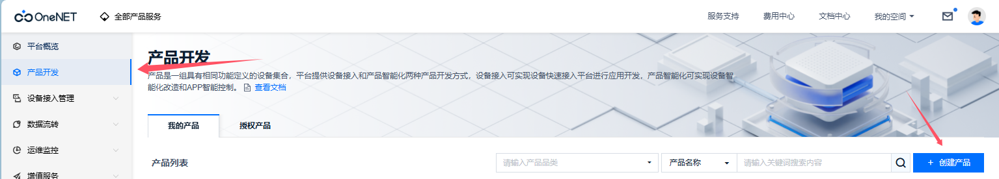
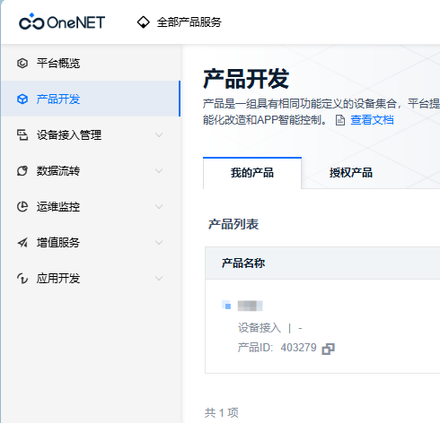
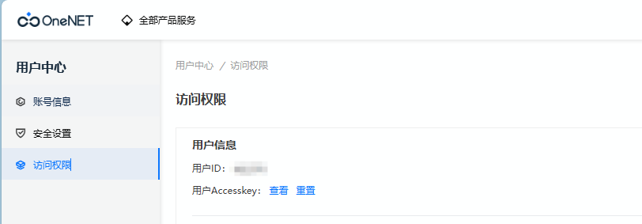
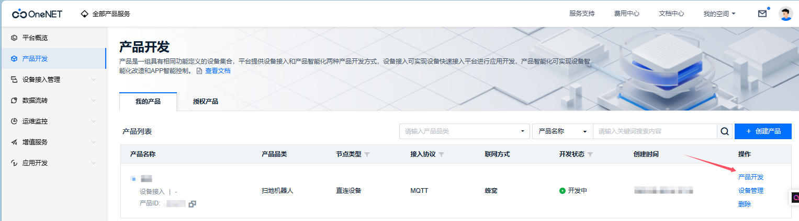
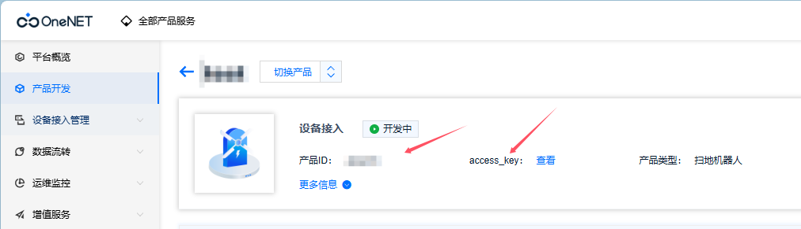
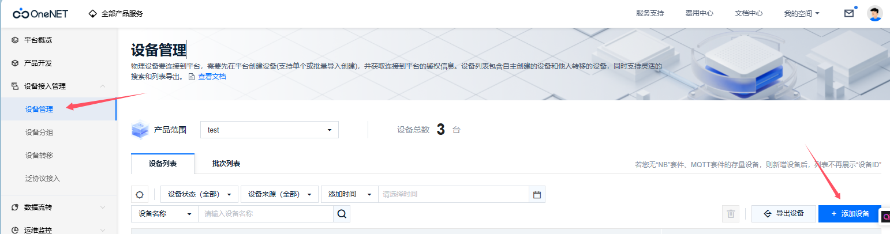
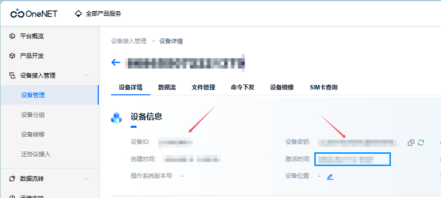
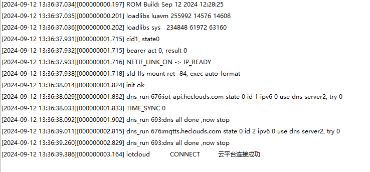
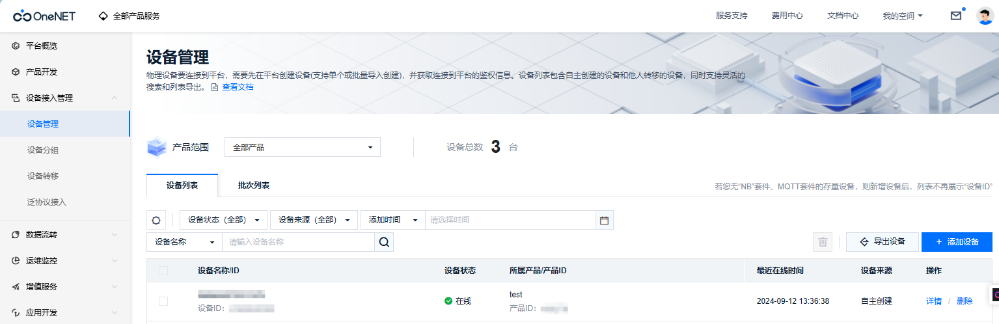

# 一库打通所有云平台--IOT_CLOUD系列文档之中移ONENET物联网云平台

## 系列链接

​	[IOT_CLOUD系列文档之腾讯物联网云平台](https://gitee.com/openLuat/luatos-doc-pool/blob/master/public/20240906_any_luatos_iotcloud_txiot.md)

## IOT_CLOUD介绍

​	众所周知，市面上有很多云平台，阿里云、腾讯云、中移onenet、华为云、百度云、华为云、Tlink云等等......并且每家都有自己的协议，工程师要移植不同的sdk代码或基于各家的手册文档对接不同的协议，看着都头大！！！

​	所以**iotcloud**应运而生！iotcloud是合宙专门为了合并iot平台而制作的库，意在使用统一且极简的代码接入各个云平台，轻松实现云功能。用户无需为那么多云平台的接入而头疼，只需要极简的通用API即可轻松上云！并且因为通用，所以云平台之间的迁移也十分方便。

​	**注意:本文档以AIR780E+Luatos作为示例，此库为网络通用库不限制型号，所有LUATOS支持的蜂窝模组都可使用**

### 实现介绍：

​	iotcloud库本质就是上层设计一套通用的API，库来进行每个平台功能的对接。目前已经实现了各个平台的所有注册方式，其中自动注册会将相关验证信息保存kv，随后使用此验证信息进行连接，通知针对每个平台添加了特有系统实现，比如设备上线通知，设备版本号上传，ota功能等，用户无需管理这些只需要注意相关下发消息做应用逻辑即可

## ONENET介绍

​	OneNET物联网开放平台是中国移动打造的面向产业互联和智慧生活应用的物联网PaaS平台，OneNET支持适配各种网络环境和协议类型，可实现各种传感器和智能硬件的快速接入，提供丰富的API和应用模板以支撑各类行业应用和智能硬件的开发，有效降低物联网应用开发和部署成本，满足物联网领域设备连接、智能化改造、协议适配、数据存储、数据安全以及大数据分析等等平台级服务需求。

​	**官网地址：**[平台概览 - OneNET物联网平台 (10086.cn)](https://open.iot.10086.cn/console/summary)

​	**注意：ONENET物联网平台经过很多次更新，老版ONENET->新版ONENET->ONENET Studio->OneNET物联网开放平台，本次示例为最新的OneNET物联网开放平台最为演示平台**

## 前期准备

### 云平台准备

​	需要登录官网[平台概览 - OneNET物联网平台 (10086.cn)](https://open.iot.10086.cn/console/summary)注册腾讯云账号并创建一个产品，后面我们会在此项目中进行演示



​	创建完成后我们要记住产品ID，后面会用到



### 硬件准备

- air780ep开发板一块
- USB数据线
- 电脑

## 实战教学

​	鉴于iotcloud的库是通用的，这里我们只说一下不同的注册即可，其他都是一样使用的，参考系列文档之连接腾讯云

### 设备注册

#### 设备注册API

​	注册的API只有一个但是支持了所有的注册方式，使用也很简单

**iotcloud.new(cloud,iot_config,connect_config)**

创建云平台对象

**参数**

| 传入值类型 | 解释                                                         |
| ---------- | ------------------------------------------------------------ |
| string     | 云平台 iotcloud.TENCENT:腾讯云 iotcloud.ALIYUN:阿里云 iotcloud.ONENET:中国移动云 iotcloud.HUAWEI:华为云 iotcloud.TUYA:涂鸦云 |
| table      | iot云平台配置, device_name:可选，默认为imei否则为unique_id iot_config.product_id:产品id(阿里云则为产品key) iot_config.product_secret:产品密钥,有此项则为动态注册 iot_config.key:设备秘钥,有此项则为秘钥连接 userid:用户ID,onenet专用,动态注册使用 userkey:用户Accesskey,onenet专用,动态注册使用 |
| table      | mqtt配置, host:可选,默认为平台默认host ip:可选,默认为平台默认ip tls:加密,若有此项一般为产品认证 keepalive:心跳时间,单位s 可选,默认240 |

**返回值**

| 返回值类型 | 解释       |
| ---------- | ---------- |
| table      | 云平台对象 |

#### 设备注册分类

​	ONENET支持两种注册方式:自动注册和手动注册，其中手动注册设备支持一型一密和一机一密方式进行连接登录

1. **动态注册(推荐)**

	​	此方式极为简单，无需创建设备，他可以实现统一代码使用时动态进行设备注册，只需要三个参数，产品ID，用户ID，用户Accesskey

   ​	产品ID在上面创建产品的时候已经拿到了，接下来我们点击右上角头像下的[权限访问](https://open.iot.10086.cn/account/access)就可以看到 用户ID和用户Accesskey了
   
   

​	接下来我们再来看下代码具体怎么用

```lua
-- 动态注册
--iotcloudc = iotcloud.new(iotcloud.ONENET,{produt_id = "xxx",userid = "xxx",userkey = "xxx"})
```

​	第一个参数表示我们使用的是ONENET，第二个参数我们将上面得到的产品ID，用户ID，用户Accesskey，非常的简单！

2. **手动注册(一型一密)**

   一型一密使用产品密钥作为校验凭据，我们点击产品开发
   
   
   
   

​	可以获取到产品ID和产品密钥，之后我们创建设备，点击设备管理->创建设备(推荐设备名称使用IMEI创建)



​	接下来我们看下代码具体怎么用

```lua
-- 密钥校验
-- iotcloudc = iotcloud.new(iotcloud.ONENET,{produt_id = "xxx",device_name = "xxx",product_secret = "xxx"})
```

​	第一个参数表示我们使用的是ONENET，第二个参数我们将上面得到的三个参数填写到table中即可，so easy~

3. **手动注册(一机一密)**

​	一机一密使用设备密钥作为校验凭据

​	和上面一型一密的创建设备流程一样，创建之后我们再来看看设备信息



​	记住设备ID和设备密钥

​	接下来我们再来看下代码具体怎么用

```lua
-- 证书校验
-- iotcloudc = iotcloud.new(iotcloud.ONENET,{produt_id = "xxx",device_name = "xxx",device_secret = "xxx"})
```

​	第一个参数表示我们使用的是ONENET，第二个参数我们将上面得到的产品ID、设备ID和设备密钥，同样很简单~

## 效果演示

### 代码演示

​	好了，接下来我们看下完整代码和效果，这里以动态注册为例，demo地址：[demo/iotcloud/main.lua · 合宙Luat/LuatOS - 码云 - 开源中国 (gitee.com)](https://gitee.com/openLuat/LuatOS/blob/master/demo/iotcloud/main.lua)

```lua

-- LuaTools需要PROJECT和VERSION这两个信息
PROJECT = "iotclouddemo"
VERSION = "1.0.0"

-- sys库是标配
_G.sys = require("sys")
--[[特别注意, 使用mqtt库需要下列语句]]
_G.sysplus = require("sysplus")

local iotcloud = require("iotcloud")

sys.taskInit(function()
    -- 等待联网
    sys.waitUntil("IP_READY")

    --------    以下接入方式根据自己需要修改,相关参数修改为自己的    ---------

    -- ONENET云
    -- 动态注册
    iotcloudc = iotcloud.new(iotcloud.ONENET,{produt_id = "xxx",userid = "xxx",userkey = "xxx"})
    -- 一型一密
    -- iotcloudc = iotcloud.new(iotcloud.ONENET,{produt_id = "xxx",device_name = "xxx",product_secret = "xxx"})
    -- 一机一密
    -- iotcloudc = iotcloud.new(iotcloud.ONENET,{produt_id = "xxx",device_name = "xxx",device_secret = "xxx"})

    if iotcloudc then
        iotcloudc:connect()
    end

end)

sys.subscribe("iotcloud", function(cloudc,event,data,payload)
    if event == iotcloud.CONNECT then -- 云平台联上了
            print("iotcloud","CONNECT", "云平台连接成功")
            -- iotcloud:subscribe("test") -- 定阅主题
    elseif event == iotcloud.RECEIVE then
            print("iotcloud","topic", data, "payload", payload)
            -- 用户处理代码
    elseif event ==  iotcloud.OTA then
        if data then
            rtos.reboot()
        end
    elseif event == iotcloud.DISCONNECT then -- 云平台断开了
            -- 用户处理代码
    end
end)

-- 用户代码已结束---------------------------------------------
-- 结尾总是这一句
sys.run()
-- sys.run()之后后面不要加任何语句!!!!!

```

### 设备日志：



​	可以看到我们的设备打印了连接成功，证明自动注册+连接流程已经完成

### 云平台效果：



​	设备已经自动注册并且在线

​	至此，云平台已经连接成功，剩下的就是要根据自己的产品需求，自己的物模型上报/下发数据就可以了


