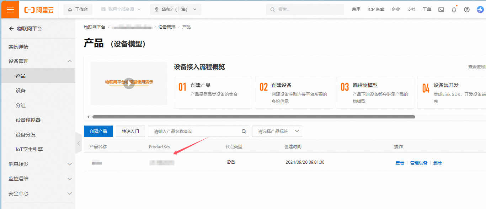
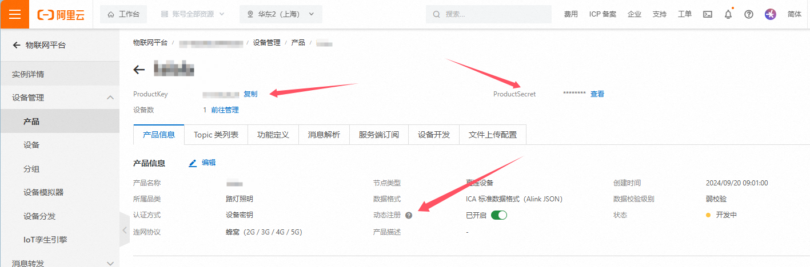
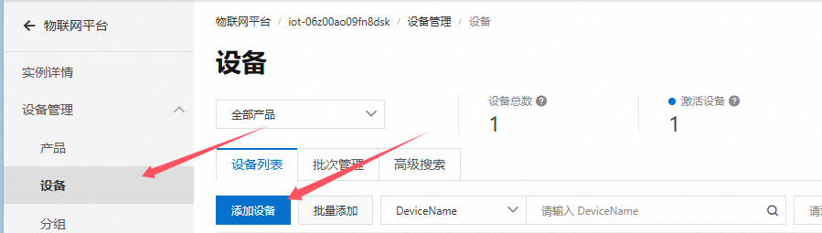
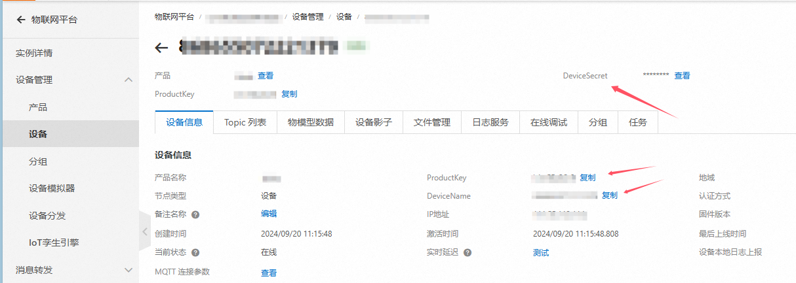
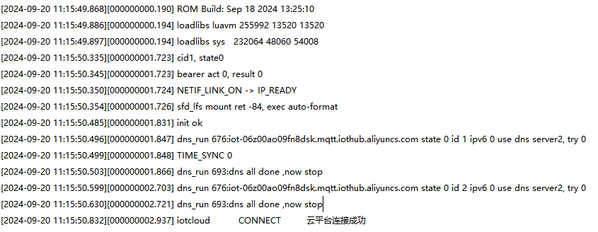

# 一库打通所有云平台--IOT_CLOUD系列文档之阿里云物联网云平台

## 系列链接

​	[IOT_CLOUD系列文档之腾讯物联网云平台](https://gitee.com/openLuat/luatos-doc-pool/blob/master/public/20240906_any_luatos_iotcloud_txiot.md)

​	[IOT_CLOUD系列文档之中移ONENET物联网云平台](https://gitee.com/openLuat/luatos-doc-pool/blob/master/public/20240912_any_luatos_iotcloud_onenet.md)

## IOT_CLOUD介绍

​	众所周知，市面上有很多云平台，阿里云、腾讯云、中移onenet、华为云、百度云、华为云、Tlink云等等......并且每家都有自己的协议，工程师要移植不同的sdk代码或基于各家的手册文档对接不同的协议，看着都头大！！！

​	所以**iotcloud**应运而生！iotcloud是合宙专门为了合并iot平台而制作的库，意在使用统一且极简的代码接入各个云平台，轻松实现云功能。用户无需为那么多云平台的接入而头疼，只需要极简的通用API即可轻松上云！并且因为通用，所以云平台之间的迁移也十分方便。

​	**注意:本文档以AIR780E+Luatos作为示例，此库为网络通用库不限制型号，所有LUATOS支持的蜂窝模组都可使用**

### 实现介绍：

​	iotcloud库本质就是上层设计一套通用的API，库来进行每个平台功能的对接。目前已经实现了各个平台的所有注册方式，其中自动注册会将相关验证信息保存kv，随后使用此验证信息进行连接，通知针对每个平台添加了特有系统实现，比如设备上线通知，设备版本号上传，ota功能等，用户无需管理这些只需要注意相关下发消息做应用逻辑即可

## 阿里云物联网介绍

​	阿里云物联网平台是一个集成了设备接入、设备管理、数据安全通信、消息订阅、消息转发和数据服务（存储、分析、过滤、解析、集成等）等能力的一体化平台。向下支持连接海量设备，采集设备数据上云；向上提供云端API，服务端可通过云端SDK调用云端API将指令下发至设备端，实现远程控制。

​	**官网地址：**[阿里云物联网平台 (aliyun.com)](https://iot.console.aliyun.com/lk/vpc/instance/detail_s)

**注意：阿里云平台分为 旧版公共实例 新版公共实例和企业版实例，企业版和新版我们可以看为一个使用，新旧公共实例要自行区别，新阿里云账号开通为新版公共实例，老账号已经开通旧版公共实例的无法切换至新版公共实例**

## 前期准备

### 云平台准备

​	需要登录官网[阿里云物联网平台 (aliyun.com)](https://iot.console.aliyun.com/lk/vpc/instance/detail_s)注册阿里云账号开通物联网平台，

​	**新旧公共实例平台需要进行区分 [物联网平台新版公共实例、旧版公共实例和企业版实例类型、区别和开通使用_物联网平台(IoT)-阿里云帮助中心 (aliyun.com)](https://help.aliyun.com/zh/iot/user-guide/overview-60#92d6a1e87dpsh)**

|   **实例**   |                      **控制台实例卡片**                      |
| :----------: | :----------------------------------------------------------: |
| 新版公共实例 | **实例概览**页签显示实例**ID**值。 |
| 旧版公共实例 | **实例概览**页签不显示实例**ID**值。 |

​	**如果是新版公共实例记住此处获取的实例ID，后面会用到**

​	随后创建一个产品，后面我们会在此项目中进行演示


​	认证方式记得选择设备秘钥


​	创建完成后我们要记住产品ID，后面会用到



### 硬件准备

- air780e开发板一块
- USB数据线
- 电脑

## 实战教学

​	鉴于iotcloud的库是通用的，这里我们只说一下不同的注册即可，其他都是一样使用的，可以参考[IOT_CLOUD系列文档之腾讯物联网云平台](https://gitee.com/openLuat/luatos-doc-pool/blob/master/public/20240906_any_luatos_iotcloud_txiot.md)

### 设备注册

#### 设备注册API

​	注册的API只有一个但是支持了所有的注册方式，使用也很简单

**iotcloud.new(cloud,iot_config,connect_config)**

创建云平台对象

**参数**

| 传入值类型 | 解释                                                         |
| ---------- | ------------------------------------------------------------ |
| string     | 云平台 iotcloud.TENCENT:腾讯云 iotcloud.ALIYUN:阿里云 iotcloud.ONENET:中国移动云 iotcloud.HUAWEI:华为云 iotcloud.TUYA:涂鸦云 |
| table      | iot云平台配置, device_name:可选，默认为imei否则为unique_id iot_config.product_id:产品id(阿里云则为产品key) iot_config.product_secret:产品密钥,有此项则为动态注册 iot_config.key:设备秘钥,有此项则为秘钥连接 userid:用户ID,onenet专用,动态注册使用 userkey:用户Accesskey,onenet专用,动态注册使用 |
| table      | mqtt配置, host:可选,默认为平台默认host ip:可选,默认为平台默认ip tls:加密,若有此项一般为产品认证 keepalive:心跳时间,单位s 可选,默认240 |

**返回值**

| 返回值类型 | 解释       |
| ---------- | ---------- |
| table      | 云平台对象 |

#### 设备注册分类

​	阿里云支持四种注册方式:一机一密 一型一密预注册 一型一密免预注册 和 子设备动态注册，这里子设备动态注册不涉及，我们将介绍其余三种注册方式。

​	可以先了解一下这几种注册方式区别[设备接入物联网平台的安全认证方法_物联网平台(IoT)-阿里云帮助中心 (aliyun.com)](https://help.aliyun.com/zh/iot/user-guide/overview-1?spm=a2c4g.11186623.0.0.31f565ec8hJiDj)

1. **一型一密(免预注册)(推荐，但需要企业版实例平台)**

   ​	此方式极为简单，无需创建设备，他可以实现统一代码使用时动态进行设备注册，只需要三个参数，实例ID，产品ID和产品秘钥，会自动用imei作为设备名进行设备注册

   ​	实例ID和产品ID在上面准备阶段的时候已经拿到了，接下来我们查看产品就能看到产品秘钥了，并且确保打开了动态注册

   

​	接下来我们再来看下代码具体怎么用

```lua
-- 动态注册(免预注册)(一型一密)(仅企业版支持)
-- iotcloudc = iotcloud.new(iotcloud.ALIYUN,{instance_id = "xxx",produt_id = "xxx",product_secret = "xxx"}) -- 企业版公共实例
```

​	第一个参数表示我们使用的是阿里云，第二个参数我们将上面得到的实例ID，产品ID，产品秘钥，非常的简单！

2. **一型一密(预注册)**

   一型一密预注册流程就是上面免预注册的流程后加上一步手动注册

   

   点击创建设备之后创建即可，推荐使用imei作为设备名

   接下来我们看下代码具体怎么用

```lua
-- 动态注册(预注册)(一型一密)
-- iotcloudc = iotcloud.new(iotcloud.ALIYUN,{produt_id = "xxx",device_name = "xxx",product_secret = "xxx"})                     -- 旧版公共实例
-- iotcloudc = iotcloud.new(iotcloud.ALIYUN,{instance_id = "xxx",produt_id = "xxx",device_name = "xxx",product_secret = "xxx"}) -- 新版公共实例
```

​	第一个参数表示我们使用的是阿里云，第二个参数我们将上面得到的三个参数填写到table中即可，如果是新版或者企业版就多一个实例ID，so easy~

3. **一机一密**

​	和上面一型一密(预注册)的创建设备流程一样，创建之后我们再来看看设备信息



​	记住产品ID 设备名和设备密钥

​	接下来我们再来看下代码具体怎么用

```lua
-- 密钥校验 (预注册)(一机一密)
-- iotcloudc = iotcloud.new(iotcloud.ALIYUN,{produt_id = "xxx",device_name = "xxx",key = "xxx"})                    -- 旧版公共实例
-- iotcloudc = iotcloud.new(iotcloud.ALIYUN,{instance_id = "xxx",produt_id = "xxx",device_name = "xxx",key = "xxx"})-- 新版公共实例
```

​	第一个参数表示我们使用的是阿里云，第二个参数我们将上面得到的产品ID、设备名和设备密钥，如果是新版或者企业版就多一个实例ID，同样很简单~

## 效果演示

### 代码演示

​	好了，接下来我们看下完整代码和效果，这里以动态注册为例，demo地址：[demo/iotcloud/main.lua · 合宙Luat/LuatOS - 码云 - 开源中国 (gitee.com)](https://gitee.com/openLuat/LuatOS/blob/master/demo/iotcloud/main.lua)

```lua
-- LuaTools需要PROJECT和VERSION这两个信息
PROJECT = "iotclouddemo"
VERSION = "1.0.0"

-- sys库是标配
_G.sys = require("sys")
--[[特别注意, 使用mqtt库需要下列语句]]
_G.sysplus = require("sysplus")

local iotcloud = require("iotcloud")

sys.taskInit(function()
    -- 等待联网
    sys.waitUntil("IP_READY")

    --------    以下接入方式根据自己需要修改,相关参数修改为自己的    ---------

    -- 阿里云  
    -- 动态注册(免预注册)(一型一密)(仅企业版支持)
    iotcloudc = iotcloud.new(iotcloud.ALIYUN,{instance_id = "xxx",produt_id = "xxx",product_secret = "xxx"}) -- 企业版公共实例
    -- 动态注册(预注册)(一型一密)
    -- iotcloudc = iotcloud.new(iotcloud.ALIYUN,{produt_id = "xxx",device_name = "xxx",product_secret = "xxx"})                     -- 旧版公共实例
    -- iotcloudc = iotcloud.new(iotcloud.ALIYUN,{instance_id = "xxx",produt_id = "xxx",device_name = "xxx",product_secret = "xxx"}) -- 新版公共实例
    -- 密钥校验 (预注册)(一机一密)
    -- iotcloudc = iotcloud.new(iotcloud.ALIYUN,{produt_id = "xxx",device_name = "xxx",key = "xxx"})                    -- 旧版公共实例
    -- iotcloudc = iotcloud.new(iotcloud.ALIYUN,{instance_id = "xxx",produt_id = "xxx",device_name = "xxx",key = "xxx"})-- 新版公共实例

    if iotcloudc then
        iotcloudc:connect()
    end

end)

sys.subscribe("iotcloud", function(cloudc,event,data,payload)
    if event == iotcloud.CONNECT then -- 云平台联上了
            print("iotcloud","CONNECT", "云平台连接成功")
            -- iotcloud:subscribe("test") -- 定阅主题
    elseif event == iotcloud.RECEIVE then
            print("iotcloud","topic", data, "payload", payload)
            -- 用户处理代码
    elseif event ==  iotcloud.OTA then
        if data then
            rtos.reboot()
        end
    elseif event == iotcloud.DISCONNECT then -- 云平台断开了
            -- 用户处理代码
    end
end)

-- 用户代码已结束---------------------------------------------
-- 结尾总是这一句
sys.run()
-- sys.run()之后后面不要加任何语句!!!!!

```

### 设备日志：



​	可以看到我们的设备打印了连接成功，证明自动注册+连接流程已经完成

### 云平台效果：


​	设备已经自动注册并且在线

​	至此，云平台已经连接成功，剩下的就是要根据自己的产品需求，自己的物模型上报/下发数据就可以了


