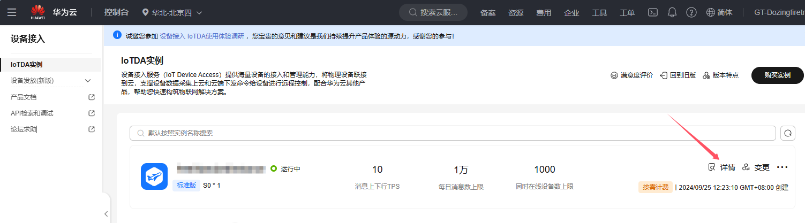
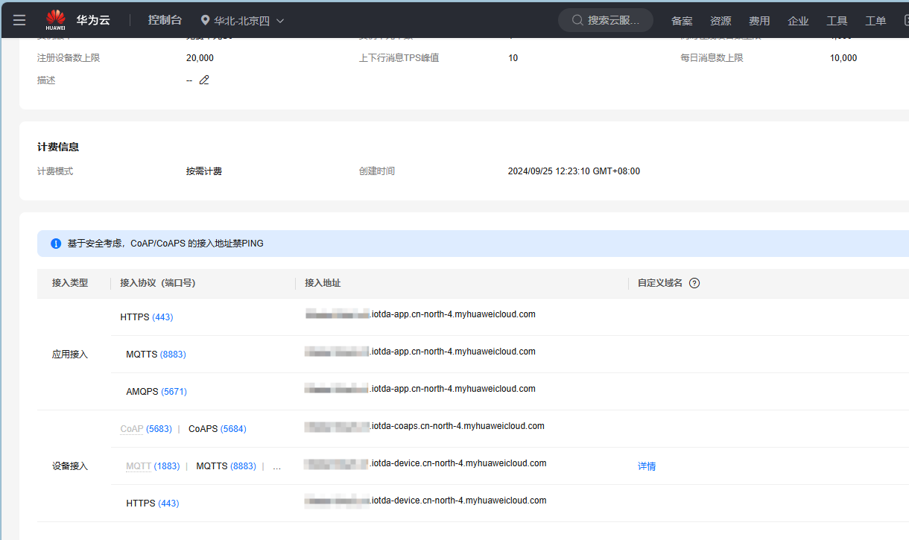
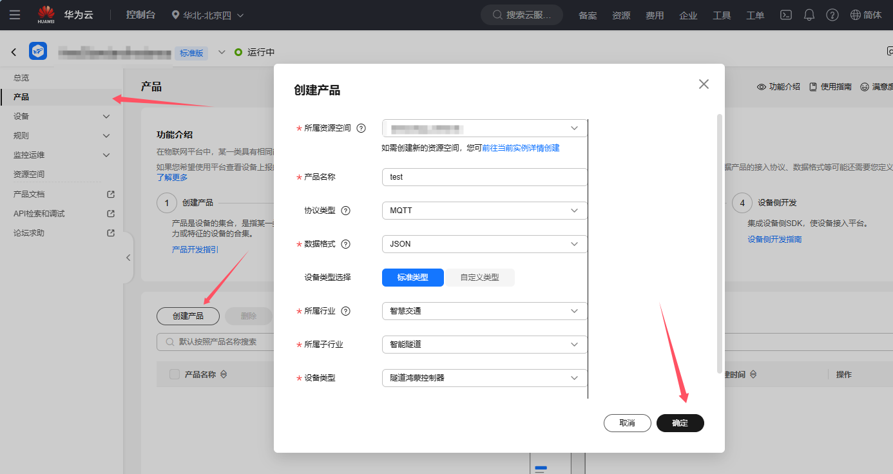
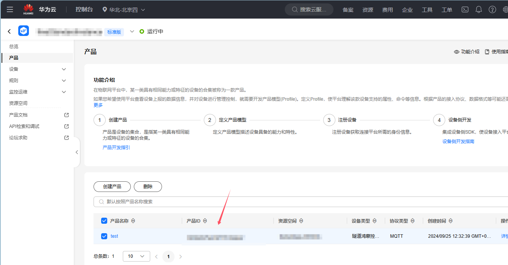
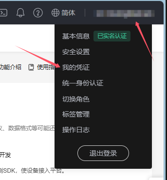
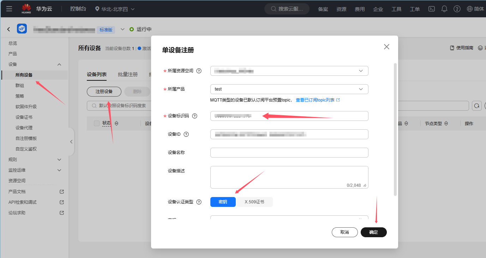
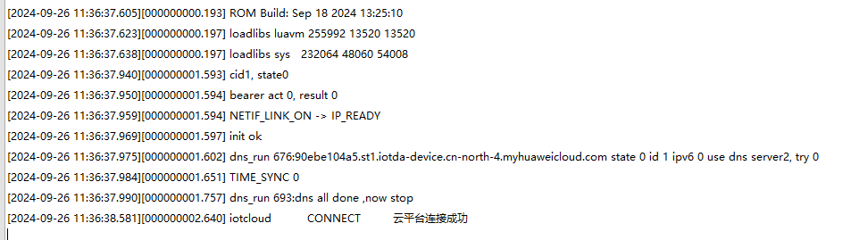
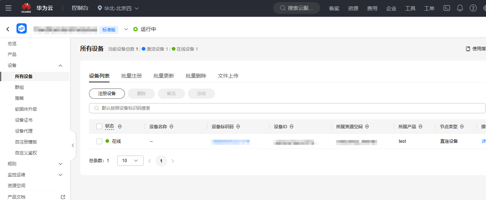

# 一库打通所有云平台--IOT_CLOUD系列文档之华为云物联网云平台

## 系列链接

​	[IOT_CLOUD系列文档之腾讯物联网云平台](https://gitee.com/openLuat/luatos-doc-pool/blob/master/public/20240906_any_luatos_iotcloud_txiot.md)

​	[IOT_CLOUD系列文档之中移ONENET物联网云平台](https://gitee.com/openLuat/luatos-doc-pool/blob/master/public/20240912_any_luatos_iotcloud_onenet.md)

​	[IOT_CLOUD系列文档之中移ONENET阿里云平台](https://gitee.com/openLuat/luatos-doc-pool/blob/master/public/20240920_any_luatos_iotcloud_aliyun.md)

## IOT_CLOUD介绍

​	众所周知，市面上有很多云平台，阿里云、腾讯云、中移onenet、华为云、百度云、华为云、Tlink云等等......并且每家都有自己的协议，工程师要移植不同的sdk代码或基于各家的手册文档对接不同的协议，看着都头大！！！

​	所以**iotcloud**应运而生！iotcloud是合宙专门为了合并iot平台而制作的库，意在使用统一且极简的代码接入各个云平台，轻松实现云功能。用户无需为那么多云平台的接入而头疼，只需要极简的通用API即可轻松上云！并且因为通用，所以云平台之间的迁移也十分方便。

​	**注意:本文档以AIR780E+Luatos作为示例，此库为网络通用库不限制型号，所有LUATOS支持的蜂窝模组都可使用**

### 实现介绍：

​	iotcloud库本质就是上层设计一套通用的API，库来进行每个平台功能的对接。目前已经实现了各个平台的所有注册方式，其中自动注册会将相关验证信息保存kv，随后使用此验证信息进行连接，通知针对每个平台添加了特有系统实现，比如设备上线通知，设备版本号上传，ota功能等，用户无需管理这些只需要注意相关下发消息做应用逻辑即可

## 华为云物联网介绍

​	华为云物联网平台设备接入云服务（IoTDA）提供海量设备的接入和管理能力，将物理设备联接到云，支撑设备数据采集上云和云端下发命令给设备进行远程控制，配合华为云其他产品，帮助您快速构筑物联网解决方案。

​	**官网地址：**[设备接入-控制台 (huaweicloud.com)](https://console.huaweicloud.com/iotdm/?region=cn-north-4#/dm-portal/instance)

​	**注意:注意区分账号，华为的账号分为华为账号 华为云账号，IAM账号，注意区别**

## 前期准备

### 云平台准备

​	需要登录官网[设备接入-控制台 (huaweicloud.com)](https://console.huaweicloud.com/iotdm/?region=cn-north-4#/dm-portal/instance)注册华为云账号开通物联网平台

​	**注意:要使用华为云账号而不是华为账号，我们需要的是IAM账户，这里有点麻烦，关于IAM账户介绍请看 [基本概念_统一身份认证服务 IAM_华为云 (huaweicloud.com)](https://support.huaweicloud.com/productdesc-iam/iam_01_0023.html#section2)  和 [成长地图_统一身份认证服务 IAM_华为云 (huaweicloud.com)](https://support.huaweicloud.com/iam/index.html) 如果不搞这部分，自动注册将无法使用，只能手动注册** 


​	开通IoTDA实例后，我们点击详情



​	

​	**接入地址中.iotda前为endpoint(即打码部分)，我们需要记录下来，后面会用**

​	随后创建一个产品，后面我们会在此项目中进行演示



​	创建完成后我们要记住产品ID，后面会用到



### 硬件准备

- air780e开发板一块
- USB数据线
- 电脑

## 实战教学

​	鉴于iotcloud的库是通用的，这里我们只说一下不同的注册即可，其他都是一样使用的，可以参考[IOT_CLOUD系列文档之腾讯物联网云平台](https://gitee.com/openLuat/luatos-doc-pool/blob/master/public/20240906_any_luatos_iotcloud_txiot.md)

### 设备注册

#### 设备注册API

​	注册的API只有一个但是支持了所有的注册方式，使用也很简单

**iotcloud.new(cloud,iot_config,connect_config)**

创建云平台对象

**参数**

| 传入值类型 | 解释                                                         |
| ---------- | ------------------------------------------------------------ |
| string     | 云平台 iotcloud.TENCENT:腾讯云 iotcloud.ALIYUN:阿里云 iotcloud.ONENET:中国移动云 iotcloud.HUAWEI:华为云 iotcloud.TUYA:涂鸦云 |
| table      | iot云平台配置, device_name:可选，默认为imei否则为unique_id iot_config.product_id:产品id(阿里云则为产品key) iot_config.product_secret:产品密钥,有此项则为动态注册 iot_config.key:设备秘钥,有此项则为秘钥连接 userid:用户ID,onenet专用,动态注册使用 userkey:用户Accesskey,onenet专用,动态注册使用 |
| table      | mqtt配置, host:可选,默认为平台默认host ip:可选,默认为平台默认ip tls:加密,若有此项一般为产品认证 keepalive:心跳时间,单位s 可选,默认240 |

**返回值**

| 返回值类型 | 解释       |
| ---------- | ---------- |
| table      | 云平台对象 |

#### 设备注册分类

​	华为云支持两种注册方式:自动注册(免预注册) 和 手动注册(预注册)。

1. **自动注册(免预注册)**

   ​	此方无需创建设备，他可以实现统一代码使用时动态进行设备注册，但比较繁琐，需要六个参数，产品ID，项目ID，endpoint，IAM用户名，IAM密码，iam_domain，会自动用imei作为设备名进行设备注册

   ​	点击 我的凭证

   
   
   ​	
   
   
   
   ​	记录下对应值
   
   ​	接下来我们再来看下代码具体怎么用

```lua
-- 动态注册(免预注册)
-- iotcloudc = iotcloud.new(iotcloud.HUAWEI,{produt_id = "xxx",project_id = "xxx",endpoint = "xxx",
    --                         iam_username="xxx",iam_password="xxx",iam_domain="xxx"})
```

​	第一个参数表示我们使用的是华为云，第二个参数我们将上面得到数据写入即可，此方法账户权限偏繁琐！

2. **一机一密(预注册)**

​	此方法需要手动预注册，但是流程极为简单，我们直接创建设备



​	记住设备名和设备密钥

​	接下来我们再来看下代码具体怎么用

```lua
-- 手动注册(预注册)
-- iotcloudc = iotcloud.new(iotcloud.HUAWEI,{produt_id = "xxx",endpoint = "xxx",device_name = "xxx",device_secret = "xxx"})
```

​	第一个参数表示我们使用的是阿里云，第二个参数我们将上面得到的产品ID、endpoint、设备名和设备密钥，非常很简单~

### 云平台OTA

​	iotcloud还支持了华为云平台的ota功能，可以直接进行ota，所有流程iotcloud库都进行了支持，做到了用户无感，用户在订阅`"iotcloud"`消息中会有`iotcloud.OTA`事件，此事件即为ota完成的通知，我们选择时间进行设备重启即可

## 效果演示

### 代码演示

​	好了，接下来我们看下完整代码和效果，这里以动态注册为例，demo地址：[demo/iotcloud/main.lua · 合宙Luat/LuatOS - 码云 - 开源中国 (gitee.com)](https://gitee.com/openLuat/LuatOS/blob/master/demo/iotcloud/main.lua)

```lua
-- LuaTools需要PROJECT和VERSION这两个信息
PROJECT = "iotclouddemo"
VERSION = "1.0.0"

-- sys库是标配
_G.sys = require("sys")
--[[特别注意, 使用mqtt库需要下列语句]]
_G.sysplus = require("sysplus")

local iotcloud = require("iotcloud")

sys.taskInit(function()
    -- 等待联网
    sys.waitUntil("IP_READY")

    --------    以下接入方式根据自己需要修改,相关参数修改为自己的    ---------

    -- 华为云
    -- 动态注册(免预注册)
    -- iotcloudc = iotcloud.new(iotcloud.HUAWEI,{produt_id = "xxx",project_id = "xxx",endpoint = "xxx",
    --                         iam_username="xxx",iam_password="xxx",iam_domain="xxx"})
    -- 手动注册(预注册)
    iotcloudc = iotcloud.new(iotcloud.HUAWEI,{produt_id = "xxx",endpoint = "xxx",device_name = "xxx",device_secret = "xxx"})

    if iotcloudc then
        iotcloudc:connect()
    end

end)

sys.subscribe("iotcloud", function(cloudc,event,data,payload)
    if event == iotcloud.CONNECT then -- 云平台联上了
            print("iotcloud","CONNECT", "云平台连接成功")
            -- iotcloud:subscribe("test") -- 定阅主题
    elseif event == iotcloud.RECEIVE then
            print("iotcloud","topic", data, "payload", payload)
            -- 用户处理代码
    elseif event ==  iotcloud.OTA then
        if data then
            rtos.reboot()
        end
    elseif event == iotcloud.DISCONNECT then -- 云平台断开了
            -- 用户处理代码
    end
end)

-- 用户代码已结束---------------------------------------------
-- 结尾总是这一句
sys.run()
-- sys.run()之后后面不要加任何语句!!!!!

```

### 设备日志：



​	可以看到我们的设备打印了连接成功，证明自动注册+连接流程已经完成

### 云平台效果：



​	设备已经自动注册并且在线

​	至此，云平台已经连接成功，剩下的就是要根据自己的产品需求，自己的物模型上报/下发数据就可以了


