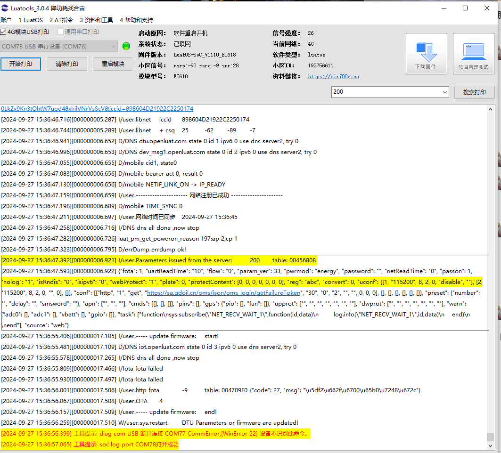
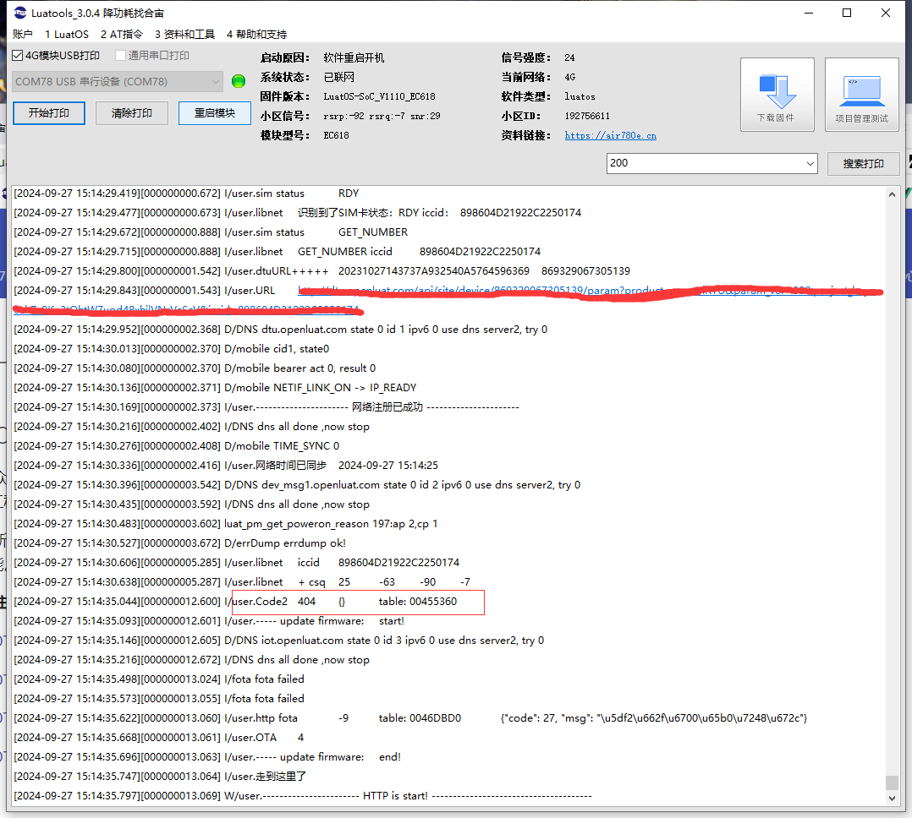

# HTTP相关返回值异常如何解决（实例持续更新中）

## HTTP介绍

HTTP（超文本传输协议，Hypertext Transfer Protocol）是用于在网络上进行数据交换的应用层协议。它是万维网（WWW）的基础，允许客户端（通常是网页浏览器）与服务器之间进行通信。以下是对 HTTP 的一些基本介绍：

1. 基本概念
请求-响应模型: HTTP 使用请求-响应模型。客户端发送请求，服务器处理请求并返回响应。
无状态协议: 每个请求都是独立的，服务器不会记住之前的请求状态。这种设计简化了服务器的实现，但可能需要其他机制（如 cookies）来管理会话状态。

2. 请求和响应
请求:

请求行: 包含请求方法（如 GET、POST）、请求的 URL 和 HTTP 版本。

请求头: 提供有关客户端环境的信息（如 User-Agent、Accept 等）。

请求体: 仅在某些请求方法（如 POST）中使用，包含要发送的数据。

响应:

状态行: 包含 HTTP 版本、状态码（如 200、404、500）和状态描述。

响应头: 提供有关响应的信息（如 Content-Type、Content-Length 等）。

响应体: 包含实际传输的数据（如 HTML 文档、图像等）。


3. 常见的 HTTP 方法
    GET: 请求指定的资源，通常用于获取数据。(模组支持)

    POST: 向指定资源提交数据，通常用于创建或更新数据。(模组支持)

    PUT: 更新指定资源的内容。

    DELETE: 删除指定的资源。

    HEAD: 类似于 GET，但服务器只返回响应头，不返回响应体。


4. HTTP 状态码
    HTTP 状态码用于表示请求的结果，分为五类：

    1xx: 信息性状态码（如 100 Continue）。

    2xx: 成功状态码（如 200 OK）。

    3xx: 重定向状态码（如 301 Moved Permanently）。

    4xx: 客户端错误状态码（如 404 Not Found）。

    5xx: 服务器错误状态码（如 500 Internal Server Error）。


## HTTP客户端错误状态码情况案例分析以及如何解决

### 1xx 信息性状态码
这些状态码表示请求已被接收，继续处理请求。

#### 100 Continue: 客户端应继续发送请求的剩余部分。
##### 状态码100的含义：
HTTP 状态码 100 Continue 是一个信息性状态码，表示客户端应继续发送请求的剩余部分。它通常是在客户端发送一个包含 Expect: 100-continue 头的请求时，服务器响应的。

##### 使用场景：
大文件上传: 当客户端要上传一个大文件时，它可以先发送一个请求头，询问服务器是否准备好接收文件。这时，服务器可以返回 100 Continue，表示可以继续上传文件。

节省带宽: 如果服务器无法处理请求，返回 100 Continue 可以避免客户端发送大量数据，从而节省带宽和资源。

##### 具体工作流程：
客户端发送请求: 客户端发送一个带有 Expect: 100-continue 的请求头。
服务器响应:
如果服务器准备好接收请求，返回 100 Continue，指示客户端继续发送请求体。
如果服务器无法处理请求（例如，身份验证失败或请求格式不正确），则服务器可以直接返回相应的错误状态码（如 401 或 403），而不是 100 Continue。

#### 101 Switching Protocols: 服务器已理解客户端的请求，并将其协议更改为客户端所请求的协议。
##### 状态码101的含义：
HTTP 状态码 101 Switching Protocols 是一个信息性状态码，表示服务器已经理解了客户端的请求，并将协议更改为客户端所请求的协议。这通常用于在 HTTP 协议和其他协议之间进行切换，例如从 HTTP 协议切换到 WebSocket 协议。

##### 使用场景
WebSocket 连接: 在建立 WebSocket 连接时，客户端首先发送一个 HTTP 请求，要求服务器将协议切换到 WebSocket。若服务器支持这一请求并同意切换，它会返回 101 状态码。

协议升级: 其他情况下，当客户端请求服务器使用不同的协议进行通信时（如从 HTTP/1.1 切换到 HTTP/2），也会用到此状态码。

##### 具体工作流程
客户端发送请求: 客户端发送一个带有 Upgrade 头的请求，表明希望切换协议。

请求示例:

- GET /chat HTTP/1.1
- Host: example.com
- Upgrade: websocket
- Connection: Upgrade
- 服务器响应: 如果服务器支持请求的协议并同意切换，它会返回 101 Switching Protocols，表示协议已成功切换。

服务器响应示例:

- HTTP/1.1 101 Switching Protocols
- Upgrade: websocket
- Connection: Upgrade
- 后续通信: 协议切换后，客户端和服务器可以使用新协议进行后续通信。
### 2xx 成功状态码
这些状态码表示请求已成功处理。

#### 200 OK: 请求成功，通常返回请求的资源。

##### 状态码200的含义：
HTTP 状态码 200 OK 是最常见的成功响应状态码，表示请求已成功处理。它通常用于标准的 GET 或 POST 请求，表明服务器已成功接收到请求并返回了所请求的资源。

##### 使用场景
- GET 请求: 当客户端请求某个资源（如网页、图片等），并且服务器成功找到并返回该资源时，服务器会返回 200 OK。

- POST 请求: 当客户端向服务器提交数据（如表单数据）并且服务器成功处理这些数据时，也会返回 200 OK。此时，响应体可能包含操作结果的信息。

##### 示例


201 Created: 请求成功并创建了新的资源。
##### 状态码201的含义：
HTTP 状态码 201 Created 表示请求已成功处理，并且由于该请求，服务器创建了一个新的资源。这个状态码通常用于 POST 请求，特别是在客户端向服务器提交数据以创建新资源时。

##### 使用场景
资源创建: 当客户端通过 POST 请求向服务器发送数据（例如，提交表单数据）并成功创建一个新资源时，服务器会返回 201 Created。

API 设计: 在 RESTful API 中，201 状态码常用于表示新资源的创建成功，并且通常在响应中包含指向该新资源的 URI。

##### 示例
创建新资源的 POST 请求示例:

- POST /api/users HTTP/1.1
- Host: example.com
- Content-Type: application/json
- Content-Length: 45

{"name": "John Doe", "email": "john@example.com"}
服务器响应示例:

- HTTP/1.1 201 Created
- Location: /api/users/123
- Content-Type: application/json

{"id": 123, "name": "John Doe", "email": "john@example.com"}
##### 关键要点
- Location 头: 通常在响应中包含 Location 头，指向新创建资源的 URI。
- 响应体: 可以在响应体中返回新资源的详细信息，帮助客户端确认创建结果。

#### 202 Accepted: 请求已接受，但尚未处理。

##### 状态码202的含义：
HTTP 状态码 202 Accepted 表示请求已被接受进行处理，但尚未完成。这意味着请求的处理是异步的，服务器已经接收到请求并将其放入处理队列中，但尚未提供最终结果。


##### 使用场景
异步处理: 202 状态码通常用于那些需要较长时间才能完成的操作，例如上传大文件、复杂的数据处理或与外部服务的交互。

任务排队: 在某些情况下，服务器会返回 202 状态码以指示请求已被接受，但实际的处理将在后续时间内完成。

##### 示例
异步请求的 POST 请求示例:

- POST /api/process-data HTTP/1.1
- Host: example.com
- Content-Type: application/json
- Content-Length: 50

{"data": "large dataset or task details"}
服务器响应示例:

- HTTP/1.1 202 Accepted
- Content-Type: application/json

{"message": "Your request is being processed"}
##### 关键要点
请求已接受: 202 状态码表明请求已经被接受，而不是直接表示成功完成。
结果不可用: 由于处理是异步的，客户端通常需要通过其他机制（如轮询或回调）来获取处理结果。

#### 203 Non-Authoritative Information: 服务器成功处理了请求，但返回的信息可能来自另一来源。

##### 状态码203的含义：
HTTP 状态码 203 Non-Authoritative Information 表示请求已成功处理，但返回的信息可能不是来自原始服务器，而是来自一个代理服务器或其他中间实体。这意味着响应的内容可能经过了修改或附加了额外的信息。

##### 使用场景
代理服务器: 当客户端通过代理服务器发送请求时，代理可能会返回 203 状态码以指示响应的内容不是来自原始服务器。

内容修改: 如果代理对响应进行了某种形式的修改，比如添加了额外的头信息，服务器可能会返回 203 状态码，告知客户端这部分信息可能不具有权威性。

##### 示例
通过代理服务器的请求示例:

- GET /api/resource HTTP/1.1
- Host: example.com

代理服务器的响应示例:

- HTTP/1.1 203 Non-Authoritative Information
- Content-Type: application/json

{"data": "This data is modified or supplemented by the proxy"}
##### 关键要点
非权威性信息: 203 状态码用于表示返回的信息可能不是最原始或权威的，客户端应谨慎对待这些信息。

不常用: 在实际应用中，203 状态码的使用相对较少，大多数情况下，客户端和服务器之间的直接通信更为常见。

#### 204 No Content: 请求成功，但没有返回内容。

##### 状态码204的含义：
HTTP 状态码 204 No Content 表示请求已成功处理，但没有内容返回。这通常用于处理成功的请求，但没有需要返回给客户端的实体内容。

##### 使用场景
成功处理的请求: 当客户端发送请求（例如，DELETE 请求）并且服务器成功处理了该请求，但不需要返回任何内容时，可以使用 204 状态码。

更新操作: 在某些情况下，客户端可能发送更新请求（如 PUT），服务器成功处理后，可以返回 204 状态码而不返回任何数据。

保持连接: 204 状态码可以用于保持与客户端的连接，而不传送实际的数据内容。

##### 示例
成功删除资源的 DELETE 请求示例:

- DELETE /api/resource/123 HTTP/1.1
- Host: example.com

服务器响应示例:

- HTTP/1.1 204 No Content

关键要点

无内容返回: 204 状态码明确表示没有返回的内容，客户端不应期望任何响应体。

保持连接: 由于没有内容，204 响应通常具有较小的负担和较快的处理速度，有助于提高性能。

#### 205 Reset Content: 请求成功，要求客户端重置文档视图。

##### 状态码205的含义：
HTTP 状态码 205 Reset Content 表示请求已成功处理，但客户端需要重置视图或输入字段。这通常用于表单提交后，服务器希望客户端清除或重置其当前的内容。

##### 使用场景
表单处理: 当客户端提交表单后，服务器可能会返回 205 状态码，指示客户端重置表单输入内容，以便用户可以进行新的输入。

UI 状态重置: 在某些应用程序中，服务器可能希望客户端清除当前的视图状态或数据，以确保用户体验的一致性。

##### 示例
表单提交的 POST 请求示例:

- POST /api/submit-form HTTP/1.1
- Host: example.com
- Content-Type: application/x-www-form-urlencoded

name=John&email=john@example.com
服务器响应示例:

- HTTP/1.1 205 Reset Content

##### 关键要点
重置内容: 205 状态码明确表示客户端应该重置其当前的内容或视图状态，通常与表单操作相关。

不返回内容: 和 204 状态码类似，205 响应通常不包含实体内容。

#### 206 Partial Content: 服务器成功处理了部分 GET 请求，返回的是部分资源。

##### 状态码206的含义：
HTTP 状态码 206 Partial Content 表示服务器成功处理了部分 GET 请求。这通常用于当客户端请求资源的某一部分时，服务器能够满足该请求并返回所请求的部分内容。

##### 使用场景
范围请求: 客户端可能会使用 Range 请求头来请求资源的特定部分（例如，视频流、音频流或大型文件的下载）。服务器根据请求的范围返回相应的部分内容。

大文件下载: 当用户下载大文件时，支持恢复下载的客户端可以请求文件的特定字节范围，以便在网络中断时能够继续下载。

##### 示例
范围请求的 GET 请求示例:

- GET /large-file.zip HTTP/1.1
- Host: example.com
- Range: bytes=0-499

服务器响应示例:

- HTTP/1.1 206 Partial Content
- Content-Range: bytes 0-499/123456
- Content-Length: 500
- Content-Type: application/zip


##### 关键要点
部分内容: 206 状态码表示请求成功并返回的是请求的部分内容，而不是整个资源。

Content-Range 头: 响应中会包含 Content-Range 头，指示返回的内容范围和资源的总大小。

### 3xx 重定向状态码
这些状态码表示客户端需要进一步操作才能完成请求。

#### 300 Multiple Choices: 请求的资源有多种选择，客户端可以选择其中一个。

##### 状态码300的含义：
HTTP 状态码 300 Multiple Choices 表示请求的资源可以有多种表示，客户端可以选择其中之一。这个状态码通常用于指示用户或应用程序有多个选项可供选择，并且服务器提供了这些选项的列表。

##### 使用场景
资源重定向: 当请求的资源有多个可用版本（例如，不同语言的网页、不同格式的文件等），服务器会返回 300 状态码，指明可选的资源。

内容协商: 服务器可能根据请求头（如 Accept 或 Accept-Language）提供不同的响应选项，让客户端选择最合适的内容。

##### 示例
请求的 GET 请求示例:

- GET /example HTTP/1.1
- Host: example.com

服务器响应示例:

- HTTP/1.1 300 Multiple Choices
- Content-Type: text/html

``` html
<html>
<head>
  <title>Multiple Choices</title>
</head>
<body>
  <h1>Multiple Choices</h1>
  <p>The requested resource is available in multiple formats:</p>
  <ul>
    <li><a href="/example/en">English Version</a></li>
    <li><a href="/example/es">Spanish Version</a></li>
    <li><a href="/example/pdf">PDF Version</a></li>
  </ul>
</body>
</html>
```
##### 关键要点

- 选择性: 300 状态码表示客户端可以选择多个资源，通常伴随响应内容列出这些选项。
- 用户体验: 该状态码可以提升用户体验，让用户根据需要选择最适合的资源。

#### 301 Moved Permanently: 请求的资源已被永久移动到新位置，返回的新 URI 在响应中提供。

##### 状态码301的含义：
HTTP 状态码 301 Moved Permanently 表示请求的资源已经永久移动到一个新的 URI（统一资源标识符），并且所有未来的请求都应使用新的 URI。这个状态码通常用于网页重定向，告知搜索引擎和客户端该资源的更新位置。

##### 使用场景
网站重构: 当网站的结构或域名发生变化时，可以使用 301 状态码来指向新的地址，从而确保用户和搜索引擎能够正确找到页面。

SEO 优化: 使用 301 重定向可以将旧页面的权重传递给新页面，有助于保持搜索引擎排名。

内容迁移: 当资源从一个位置移动到另一个位置，但希望保持用户和外部链接的有效性时，使用 301 重定向是一个合适的选择。

##### 示例
请求的 GET 请求示例:

- GET /old-page HTTP/1.1
- Host: example.com

服务器响应示例:

- HTTP/1.1 301 Moved Permanently
- Location: https://example.com/new-page
- Content-Type: text/html

```html
<html>
<head>
  <title>301 Moved Permanently</title>
</head>
<body>
  <h1>301 Moved Permanently</h1>
  <p>The requested resource has been moved to <a href="https://example.com/new-page">https://example.com/new-page</a>.</p>
</body>
</html>
```

##### 关键要点

- Location 头: 响应中包含 `Location` 头，指示新的 URI。客户端应使用该 URI 进行后续请求。
- 搜索引擎友好: 301 状态码告知搜索引擎该页面永久移动，搜索引擎会更新其索引以反映这一变化。

#### 302 Found: 请求的资源临时移动到新位置，客户端应使用新 URI 继续请求。

##### 状态码302的含义：
HTTP 状态码 302 Found 表示请求的资源临时被移动到另一个 URI。当客户端接收到这个状态码时，它应立即使用新的 URI 进行后续请求。这种状态码通常用于临时重定向，意味着原始 URI 仍然有效，未来的请求可能仍然会返回原始资源。

##### 使用场景
临时重定向: 在需要临时更改资源位置时，例如网站维护或临时活动的页面，302 状态码是适合的选择。

用户登录流程: 在用户成功登录后，可以使用 302 状态码将用户重定向到他们请求的页面。

A/B 测试: 在进行 A/B 测试时，可以使用 302 状态码将用户临时重定向到不同的页面进行分析。

##### 示例
请求的 GET 请求示例:

- GET /old-page HTTP/1.1
- Host: example.com

服务器响应示例:

- HTTP/1.1 302 Found
- Location: https://example.com/new-page
- Content-Type: text/html
``` html
<html>
<head>
  <title>302 Found</title>
</head>
<body>
  <h1>302 Found</h1>
  <p>The requested resource is temporarily located at <a href="https://example.com/new-page">https://example.com/new-page</a>.</p>
</body>
</html>
```
##### 关键要点

- Location 头: 响应中包含 `Location` 头，指示新的临时 URI。客户端应使用该 URI 进行后续请求。
- 缓存行为: 302 状态码通常不会被缓存，因为它表示临时重定向。

#### 303 See Other: 对请求的响应可在不同 URI 处找到，客户端应使用 GET 方法请求该 URI。

##### 状态码303的含义：
HTTP 状态码 303 See Other 表示客户端应使用 GET 方法请求另一个 URI 来获取所需的资源。它通常用于在处理 POST 请求后重定向客户端到一个新的页面。这一状态码的主要目的是确保客户端获取资源时使用的是正确的 HTTP 方法。

##### 使用场景
表单提交: 在用户提交表单（例如，登录或注册）后，服务器可以返回 303 状态码，将用户重定向到一个结果页面，而不是重新提交表单。这有助于避免重复提交。

RESTful API: 在 RESTful 服务中，303 可以用于指示客户端在某个操作后应获取资源的不同位置。

状态更新: 在执行某些操作（如更新或删除）后，服务器可以使用 303 状态码引导客户端查看更新后的状态或结果。

##### 示例
请求的 POST 请求示例:

- POST /submit-form HTTP/1.1
- Host: example.com
- Content-Type: application/x-www-form-urlencoded

- username=user&password=pass

服务器响应示例:

- HTTP/1.1 303 See Other
- Location: https://example.com/success
- Content-Type: text/html

``` html
<html>
<head>
  <title>303 See Other</title>
</head>
<body>
  <h1>303 See Other</h1>
  <p>The resource you are looking for can be found at <a href="https://example.com/success">https://example.com/success</a>.</p>
</body>
</html>
```

##### 关键要点

- **Location 头**: 响应中包含 `Location` 头，指示新的 URI。客户端应使用 GET 方法请求该 URI。
- **HTTP 方法**: 303 状态码确保客户端在重定向后使用 GET 方法，而不是继续使用原来的请求方法（如 POST）。

#### 304 Not Modified: 客户端的缓存版本是最新的，服务器没有新内容。

##### 状态码304的含义：
HTTP 状态码 304 Not Modified 表示所请求的资源自上次请求以来没有被修改。这通常与缓存机制相关，用于指示客户端可以使用其缓存的版本，而不需要重新下载资源。

使用场景
缓存优化: 当客户端向服务器请求资源时，它可能会发送一个条件请求，附带 If-Modified-Since 或 If-None-Match 头。如果资源在服务器上没有被修改，服务器会返回 304 状态码，从而节省带宽和提高加载速度。

减少延迟: 通过使用 304 状态码，服务器可以减少不必要的数据传输，提高性能。

##### 示例
请求的 GET 请求示例:

- GET /image.png HTTP/1.1
- Host: example.com
- If-Modified-Since: Wed, 21 Oct 2023 07:28:00 GMT

服务器响应示例:

- HTTP/1.1 304 Not Modified

##### 关键要点
- 条件请求: 304 状态码通常与条件请求一起使用，客户端会在请求中包含 If-Modified-Since 或 If-None-Match 头。
- 没有消息体: 在响应中，304 状态码通常不会包含消息体，因此不会传输任何资源数据。

#### 305 Use Proxy: 请求的资源必须通过指定的代理访问。

##### 状态码305的含义：
HTTP 状态码 305 Use Proxy 表示请求的资源必须通过指定的代理进行访问。此状态码的使用并不常见，且在某些情况下可能会造成安全隐患，因此在现代 web 开发中很少被使用。

##### 使用场景
代理需求: 当服务器希望客户端通过特定的代理服务器来访问请求的资源时，可以使用 305 状态码。如果客户端没有配置该代理，则可能无法访问所请求的资源。
示例
请求的 GET 请求示例:

- GET /resource HTTP/1.1
- Host: example.com

服务器响应示例:

- HTTP/1.1 305 Use Proxy
- Location: http://proxy.example.com:8080/

在这个例子中，响应中的 Location 头指示客户端应该通过 http://proxy.example.com:8080/ 这个代理来访问所请求的资源。

##### 关键要点
- 安全隐患: 由于 305 状态码可能会导致安全问题（例如，恶意代理），很多浏览器和 HTTP 客户端并不支持或忽略这一状态码。
- 不常用: 这个状态码在实际应用中并不常见，通常开发者会选择其他方法来实现类似的功能。

#### 307 Temporary Redirect: 请求的资源临时移动到新位置，客户端应使用原来的请求方法继续请求。

##### 状态码307的含义：
HTTP 状态码 307 Temporary Redirect 表示请求的资源临时移动到一个新的 URI。与 302 状态码类似，307 也用于临时重定向，但有一个重要的区别：307 确保客户端在重定向时使用原始的 HTTP 方法。

##### 使用场景
保持方法一致性: 当客户端发起一个 POST 请求时，如果服务器返回 307 状态码，客户端在重定向到新 URI 时仍然使用 POST 方法。这在某些情况下非常重要，例如提交表单后需要临时重定向到不同的页面。

临时重定向: 用于指示资源临时移动到新位置，适用于需要在短期内更改资源位置的场景。

##### 示例
请求的 POST 请求示例:

- POST /submit-form HTTP/1.1
- Host: example.com
- Content-Type: application/x-www-form-urlencoded

- data=value

服务器响应示例:

- HTTP/1.1 307 Temporary Redirect
- Location: http://example.com/thank-you

在这个例子中，客户端会被告知资源临时移动到 http://example.com/thank-you，并且仍然会使用 POST 方法进行请求。

##### 关键要点
- 方法保持: 与 302 状态码不同，307 状态码要求客户端在重定向时保持原始的 HTTP 方法。
- 临时性: 307 状态码是临时的，表示将来可能会恢复到原始 URI。

#### 308 Permanent Redirect: 请求的资源永久移动到新位置，客户端应使用原来的请求方法继续请求。

##### 状态码303的含义：
HTTP 状态码 308 Permanent Redirect 表示请求的资源已被永久移动到一个新的 URI，并且客户端在重定向时应继续使用原始的 HTTP 方法（例如，POST、PUT等）。

##### 使用场景
方法保持: 与 301 状态码不同，308 确保在重定向时客户端使用原始的 HTTP 方法。这对于某些操作（如文件上传或表单提交）非常重要。

永久性重定向: 用于指示资源永久性地移动到新的位置，适用于需要更新链接或资源地址的场景。

##### 示例
请求的 POST 请求示例:

- POST /old-endpoint HTTP/1.1
- Host: example.com
- Content-Type: application/json

{"key": "value"}

服务器响应示例:

- HTTP/1.1 308 Permanent Redirect
- Location: http://example.com/new-endpoint

在这个例子中，客户端会被告知资源永久移动到 http://example.com/new-endpoint，并且在重定向时仍然使用 POST 方法进行请求。

##### 关键要点
- 方法保持: 308 状态码确保客户端在重定向时保持原始的 HTTP 方法，这对于某些请求非常关键。
- 永久性: 308 表示请求的资源已被永久移动，客户端应更新其链接。

### 4xx 客户端错误状态码
这些状态码表示请求有问题，通常是由于客户端的错误引起的。

#### 400 Bad Request: 请求格式不正确，服务器无法理解。

##### 状态码400的含义：
HTTP 状态码 400 Bad Request 表示服务器无法理解由于客户端发出的请求导致的语法错误。换句话说，客户端发送的请求是无效的，通常是因为请求格式不正确或缺少必需的参数。

##### 使用场景
请求格式错误: 客户端发送的请求格式不符合服务器的要求，例如 JSON 格式不正确或 URL 编码错误。

缺少必需参数: 请求中缺少服务器所需的参数，导致无法处理请求。

无效的请求头: 请求中的某些头信息无效或不符合预期。

##### 示例
请求的示例:

- POST /api/resource HTTP/1.1
- Host: example.com
- Content-Type: application/json

{"key": "value"  // 这里缺少结束的大括号

服务器响应示例:

- HTTP/1.1 400 Bad Request
- Content-Type: application/json

{
    "error": "Invalid JSON format"
}

在这个例子中，由于缺少结束的大括号，服务器无法解析请求体，因而返回 400 状态码。

##### 关键要点
- 客户端错误: 400 状态码表示客户端的请求有误，通常是由于请求的语法不正确。
- 不应重试: 通常情况下，客户端在遇到 400 错误后应检查并修正请求，而不是简单地重试。

#### 401 Unauthorized: 请求要求用户身份验证，未提供有效凭据。

##### 状态码303的含义：
HTTP 状态码 401 Unauthorized 表示请求需要用户身份验证，但未提供有效的身份凭据。换句话说，客户端请求的资源需要认证，且客户端未提供所需的身份验证信息，或者提供的凭据无效。

##### 使用场景
需要身份验证: 服务器要求客户端提供有效的身份凭据以访问受保护的资源。

无效凭据: 客户端提供的身份凭据（如用户名和密码）不正确。

缺少凭据: 客户端未在请求中包含任何身份验证信息。

##### 示例
请求的示例:

- GET /protected/resource HTTP/1.1
- Host: example.com

服务器响应示例:

- HTTP/1.1 401 Unauthorized
- WWW-Authenticate: Basic realm="Access to the staging site"
- Content-Type: application/json

{
    "error": "Authentication required"
}

在这个例子中，服务器响应 401 状态码，表示需要身份验证。响应头中还包含 WWW-Authenticate 字段，指示客户端使用基本认证方式进行身份验证。

##### 关键要点
- 身份验证失败: 401 状态码表示请求未通过身份验证。
- 提供凭据: 当客户端收到 401 响应时，应提供有效的身份凭据以重新发起请求。
- WWW-Authenticate 头: 响应中通常会包含 WWW-Authenticate 头，指示可用的身份验证方法。

#### 402 Payment Required: 预留状态码，尚未广泛使用。

##### 状态码303的含义：
HTTP 状态码 402 Payment Required 是一个保留状态码，主要用于指示需要支付才能访问请求的资源。虽然该状态码在实际使用中并不常见，但它的意图是为支付系统提供支持。

##### 主要特点
支付要求: 402 状态码通常表示客户端需要进行支付或订阅才能访问所请求的资源。

未广泛使用: 尽管状态码存在，但在多数实际应用中并未被广泛采用，许多实现选择使用其他方法来处理支付，例如直接在响应中提供支付信息，而不是使用 402 状态码。

##### 示例
请求的示例:

- GET /premium-content HTTP/1.1
- Host: example.com

服务器响应示例:

- HTTP/1.1 402 Payment Required
- Content-Type: application/json

{
    "error": "Payment is required to access this content."
}

在这个例子中，服务器返回 402 状态码，表示客户端需要支付才能访问请求的内容。

##### 关键要点
- 支付指示: 402 状态码用于指示需要支付才能访问某些资源。
- 灵活性: 服务器可以在响应中提供详细的支付信息和指引，以便客户端了解如何完成支付。

#### 403 Forbidden: 服务器拒绝请求，用户没有权限访问。

##### 状态码303的含义：
HTTP 状态码 403 Forbidden 表示服务器理解了客户端的请求，但拒绝执行该请求。换句话说，服务器已知请求的资源，但由于权限或访问控制的原因，不允许客户端访问。

##### 主要特点
权限问题: 403 状态码通常表示用户没有足够的权限来访问所请求的资源，可能是由于身份验证不足或权限设置错误。

不应重定向: 与 401 状态码不同，403 状态码并不建议客户端尝试重新进行身份验证，因为请求已被明确拒绝。

##### 示例
请求的示例:

- GET /restricted-area HTTP/1.1
- Host: example.com

服务器响应示例:

- HTTP/1.1 403 Forbidden
- Content-Type: application/json

{
    "error": "You do not have permission to access this resource."
}

在这个例子中，服务器返回 403 状态码，表示客户端没有权限访问请求的资源。

##### 关键要点
- 请求被拒绝: 403 状态码表示请求被拒绝，原因可能是权限不足。
- 无效凭据: 403 状态码并不意味着身份验证失败，而是意味着即使提供了有效凭据，访问仍然被拒绝。
- 详细信息: 服务器可以在响应中提供更多信息，说明拒绝访问的原因。

#### 404 Not Found: 请求的资源未找到。

##### 状态码404的含义：
HTTP 状态码 404 Not Found 表示服务器无法找到客户端请求的资源。这是一个常见的状态码，通常用于指示所请求的页面或文件不存在于服务器上。

##### 主要特点
资源未找到: 404 状态码通常表示请求的URL在服务器上不存在，可能是因为链接错误、资源已被删除或从未存在过。

无特定原因: 404状态码不提供关于为什么资源未找到的具体原因，只是表明该资源不可用。

##### 示例
请求的示例:


在这个例子中，服务器返回 404 状态码，表示客户端请求的页面不存在。

##### 关键要点
- 常见错误: 404 是最常见的客户端错误之一，用户在浏览网站时经常会遇到。
- SEO影响: 搜索引擎通常会将404错误视为负面因素，影响网站的搜索排名，因此网站管理员应确保404页面的友好性和信息性。
- 自定义页面: 很多网站会提供自定义的404页面，以改善用户体验，提供导航链接或搜索框，帮助用户找到他们想要的内容。

#### 405 Method Not Allowed: 请求的方法不被允许。

##### 状态码303的含义：
HTTP 状态码 405 Method Not Allowed 表示客户端请求的 HTTP 方法（如 GET、POST、PUT、DELETE 等）被服务器禁止或不支持。换句话说，虽然请求的目标资源存在，但所使用的方法不被允许。

##### 主要特点
方法不支持: 405 状态码通常表示客户端使用了一种不被允许的 HTTP 方法。例如，尝试对一个只支持 GET 方法的资源使用 POST 方法。

允许的方法: 服务器应在响应中提供一个 Allow 头部，列出该资源允许的 HTTP 方法。

##### 示例
请求的示例:

- POST /example-resource HTTP/1.1
- Host: example.com

服务器响应示例:

- HTTP/1.1 405 Method Not Allowed
- Allow: GET, OPTIONS
- Content-Type: application/json

{
    "error": "The POST method is not allowed for this resource."
}

在这个例子中，服务器返回 405 状态码，表示客户端尝试使用 POST 方法，但该资源仅允许 GET 和 OPTIONS 方法。

##### 关键要点
- 特定于方法: 405 状态码与资源的存在无关，而是与请求方法的有效性有关。
- 允许的方法: 服务器应该使用 Allow 头部告知客户端可用的方法，以便客户端可以选择其他有效的方法进行请求。
- 调试: 405 错误通常指示客户端在与服务器的交互中存在问题，开发者应检查代码或请求以确保使用正确的方法。


#### 406 Not Acceptable: 请求的资源无法生成符合客户端请求头中 Accept 字段的响应。

##### 状态码406的含义：
HTTP 状态码 406 Not Acceptable 表示服务器无法生成客户端所请求的内容类型。具体来说，服务器能够理解请求，但根据客户端所提供的 Accept 头部，无法提供符合要求的响应格式。

##### 主要特点
内容协商: 406 状态码通常与内容协商有关。客户端在请求中可能指定了它能接受的内容类型（如 application/json、text/html 等），但服务器无法提供这些类型的响应。

响应头部: 服务器可以在响应中包含 Content-Type 头部，说明所提供的内容类型。

##### 示例
请求示例:

- GET /resource HTTP/1.1
- Host: example.com
- Accept: application/xml

服务器响应示例:

- HTTP/1.1 406 Not Acceptable
- Content-Type: application/json

{
    "error": "Cannot generate response in the requested format."
}

在这个示例中，客户端请求的资源希望返回 application/xml 格式，但服务器只能提供 application/json 格式，因此返回 406 状态码。

##### 关键要点
- 与内容类型相关: 406 状态码专注于请求的内容类型，表明服务器无法满足客户端的类型要求。
- 调试提示: 如果客户端收到 406 错误，建议检查 Accept 头部的值，确保请求中包含的类型是服务器能够处理的。
- 常见场景: 在 RESTful API 和 Web 服务中，406 状态码通常出现在客户端请求特定格式的响应，但服务器无法提供该格式时。


#### 407 Proxy Authentication Required: 需要在代理服务器进行身份验证。

##### 状态码407的含义：
HTTP 状态码 407 Proxy Authentication Required 表示客户端必须先通过代理服务器进行身份验证才能访问所请求的资源。这个状态码通常在通过代理服务器进行请求时出现。

##### 主要特点
代理身份验证: 407 状态码与身份验证相关，客户端需要提供有效的凭证（如用户名和密码）以便于代理服务器进行身份验证。

响应头部: 服务器会在响应中包含一个 Proxy-Authenticate 头部，指示客户端使用的身份验证方法。

##### 示例
请求示例:

- GET /protected-resource HTTP/1.1
- Host: example.com

服务器响应示例:

- HTTP/1.1 407 Proxy Authentication Required
- Proxy-Authenticate: Basic realm="Proxy"
- Content-Type: application/json

{
    "error": "Proxy authentication is required."
}

在这个示例中，客户端试图访问一个受保护的资源，但未能提供代理服务器所需的身份验证信息，因此返回 407 状态码。

##### 关键要点
- 代理服务器的要求: 407 状态码通常出现在使用代理服务器的环境中，表明需要进行代理身份验证。
- 与身份验证相关: 与 401 Unauthorized 状态码不同，后者是针对资源服务器的身份验证，而 407 针对代理服务器的身份验证。
- 常见场景: 在企业网络环境中，经常使用代理服务器来访问外部资源，因此可能会遇到 407 状态码。

#### 408 Request Timeout: 请求超时。

##### 状态码408的含义：
HTTP 状态码 408 Request Timeout 表示服务器在等待客户端发送请求时超时，客户端未能在服务器允许的时间内完成请求。

##### 主要特点
请求超时: 408 状态码通常表示客户端在发起请求后，未能及时发送完整的请求数据。服务器等待了一段时间后决定关闭连接。

客户端问题: 这通常是由于网络延迟、客户端问题或用户未能及时发送请求导致的。

##### 示例
请求示例:

- GET /slow-resource HTTP/1.1
- Host: example.com

服务器响应示例:

- HTTP/1.1 408 Request Timeout
- Content-Type: application/json

{
    "error": "The server timed out waiting for the request."
}

在这个示例中，客户端发起了请求，但未能在规定的时间内发送完整的请求数据，因此服务器返回了 408 状态码。

##### 关键要点
- 与客户端行为相关: 408 状态码一般与客户端的行为有关，而不是服务器的配置或性能问题。
- 重试机制: 客户端可以根据需要重试请求，但应该检查网络连接，确保请求能够在合理的时间内完成。
- 常见场景: 408 状态码通常出现在网络不稳定或客户端程序未能及时响应的情况下。


#### 409 Conflict: 请求的当前状态与所请求的操作发生冲突。

##### 状态码409的含义：
HTTP 状态码 409 Conflict 表示请求与当前服务器的状态发生冲突，导致请求无法被执行。这个状态码通常用于指示由于资源状态不一致而导致的问题。

##### 主要特点
资源冲突: 409 状态码通常出现在尝试对资源进行更新、删除或创建操作时，当前的资源状态与请求内容不一致。

常见场景:

- 并发更新: 当多个客户端尝试同时更新同一资源时，可能会出现冲突。
- 业务逻辑冲突: 例如，尝试创建一个已经存在的资源，或者尝试删除一个正在被引用的资源。
##### 示例
请求示例:

- POST /api/users HTTP/1.1
- Host: example.com
- Content-Type: application/json

{
    "username": "existingUser",
    "password": "securePassword123"
}

服务器响应示例

如果 existingUser 这个用户名已经在系统中存在，服务器将返回以下响应：

- HTTP/1.1 409 Conflict
- Content-Type: application/json

{
    "error": "Username already exists."
}

在这个示例中：
- 客户端尝试注册一个用户名为 existingUser 的新用户。
- 服务器发现这个用户名已经被其他用户使用，因此返回了 409 Conflict 状态码，并在响应体中提供了详细的错误信息，说明冲突的原因。

##### 关键要点
- 需要处理冲突: 客户端需要处理这种冲突，可能需要进行重试或采取其他措施，例如获取最新的资源状态。
- 提供更多信息: 服务器通常会在响应体中提供有关冲突的详细信息，以帮助客户端理解问题所在。
- 与其他状态码的区别: 与 400 Bad Request 等状态码不同，409 表示请求在语法上是正确的，但由于资源状态的原因无法被接受。

#### 410 Gone: 请求的资源已被永久删除。

##### 状态码410的含义：
HTTP 状态码 410 Gone 表示请求的资源在服务器上曾经存在，但现在已经被永久删除，且没有可用的转发地址。与 404 Not Found 不同，410 表示这个资源不再可用，并且将来也不会再出现。

##### 主要特点
资源已永久删除: 410 状态码用于表明资源不再存在于服务器上，并且客户端不应该再请求该资源。

与 404 的区别:

- 404 Not Found: 表示资源未找到，但可能是暂时的，客户端可以尝试再次请求。
- 410 Gone: 明确表明资源已被永久删除，不会再返回。
使用场景:

当网站或 API 中的某个资源被删除，并且希望告知用户或搜索引擎该资源不再可用时，可以使用 410 状态码。
##### 示例
请求示例:

- GET /api/resource/123 HTTP/1.1
- Host: example.com

服务器响应示例:

- HTTP/1.1 410 Gone
- Content-Type: application/json

{
    "error": "The requested resource has been permanently removed."
}

解释
在这个示例中：

客户端发送请求以获取资源 /api/resource/123。
服务器返回 410 Gone 状态码，表示该资源已被永久删除，并且在响应中提供了错误信息，告知客户端该资源不再可用。
##### 关键要点
- 搜索引擎优化: 使用 410 状态码可以告诉搜索引擎该资源已被删除，从而避免搜索引擎继续索引该资源。
- 清晰的意图: 410 状态码明确传达了资源的状态，有助于客户端理解不再请求该资源。

#### 411 Length Required: 请求必须包含 Content-Length 头。

##### 状态码411的含义：
HTTP 状态码 411 Length Required 表示服务器要求请求中必须包含 Content-Length 头部。这个状态码通常在客户端发送一个不包含 Content-Length 头的请求时返回，尤其是在请求体存在的情况下（如 POST 或 PUT 请求）。

##### 主要特点
请求体必需: 当客户端发送的请求包含请求体（例如，POST 或 PUT 请求）时，服务器需要知道请求体的长度，以便正确处理请求。

避免不确定性: 服务器通过返回 411 状态码，确保客户端在发送请求时提供请求体的长度信息，避免处理时的潜在不确定性。

##### 使用场景
当客户端发送一个 POST 请求，但没有指定请求体的长度时，服务器将返回 411 状态码，提示客户端补充必要的头部信息。
##### 示例
请求示例:

- POST /api/resource HTTP/1.1
- Host: example.com
- Content-Type: application/json

{
    "data": "example data"
}

在这个请求中，缺少 Content-Length 头部。

服务器响应示例:

- HTTP/1.1 411 Length Required
- Content-Type: application/json

{
    "error": "Content-Length header is required."
}

解释
在这个示例中：

客户端发送了一个 POST 请求，但没有包含 Content-Length 头部。
服务器返回 411 Length Required 状态码，表示请求必须包含 Content-Length 头部，并在响应中提供了错误信息。

##### 关键要点
- 请求体长度要求:411 状态码表示服务器需要请求体的 Content-Length 头部，以确定请求体的大小。
- 避免数据不完整处理:服务器通过此状态码确保客户端提供请求体的长度信息，以避免处理时的不确定性。
- 客户端响应:当接收到 411 状态码时，客户端需要在后续请求中包含 Content-Length 头部。
- 错误处理:返回 411 状态的响应通常会附带说明，告知客户端需要添加 Content-Length 头部。
- 与其他状态码的区别:不同于 400 Bad Request，411 更加具体，专注于请求体长度的缺失。

#### 412 Precondition Failed: 请求的一个或多个前提条件失败。

##### 状态码412的含义：
412 状态码表示服务器无法满足请求中的某些前提条件。这通常与请求头中的条件（如 If-None-Match 和 If-Modified-Since）有关。

##### 主要特点
前提条件失败: 410 状态码用于表明请求中的条件不成立，意味着请求未能满足服务器的要求。

与 200 和 404 的区别
- 200 OK: 表示请求成功，资源已正确返回。
- 404 Not Found: 表示请求的资源未找到，可能是暂时的，客户端可以尝试再次请求。
- 412 Precondition Failed: 明确表明请求中包含的条件未被满足，客户端需要调整请求。

使用场景

当客户端希望在特定条件下仅请求资源时，例如：只在资源自某个时间点后被修改时才获取资源，且该条件未被满足时，使用 412 状态码。
##### 示例
请求示例:

- GET /api/resource HTTP/1.1
- Host: example.com
- If-None-Match: "etag_value"

（假设服务器的当前 ETag 为不同的值）

服务器响应示例:

- HTTP/1.1 412 Precondition Failed
- Content-Type: application/json

{
    "error": "Precondition failed: ETag does not match."
}

解释
在这个示例中：

客户端发送请求以获取资源，并包含了一个条件（如 ETag）。
服务器返回 412 Precondition Failed 状态码，表示请求中的条件未被满足，并在响应中提供了错误信息，告知客户端条件未能通过。
##### 关键要点
- 条件请求: 适用于需要基于前提条件进行请求的场景。
- 优化网络请求: 通过条件请求，客户端可以减少不必要的数据传输。
- 客户端处理: 接收到此状态码时，客户端应检查请求的条件并适当调整后重新发送请求。

#### 413 Payload Too Large: 请求的负载超过服务器处理的限制。

##### 状态码413的含义：
413 状态码表示请求体的大小超过了服务器所能处理的限制，服务器拒绝处理该请求，因为请求中发送的数据过大。

##### 主要特点
请求体过大: 此状态码表明客户端发送的请求体超出了服务器的处理能力。

使用场景

当客户端尝试上传文件或发送大量数据时，如果超出了服务器配置的最大允许大小，服务器会返回 413 状态码。
常用于文件上传、数据提交等场景。
##### 示例
请求示例:

- POST /api/upload HTTP/1.1
- Host: example.com
- Content-Type: application/json
- Content-Length: 5000000  // 假设这个请求体过大

{
    "data": "…" // 大量数据
}

服务器响应示例:

- HTTP/1.1 413 Payload Too Large
- Content-Type: application/json

{
    "error": "Request payload is too large."
}

解释
在这个示例中：

客户端发送一个请求以上传数据，但请求体的大小超出了服务器的处理限制。
服务器返回 413 Payload Too Large 状态码，表明请求体过大，并在响应中包含错误信息，告知客户端请求未被处理。
##### 关键要点
- 限制配置: 服务器通常可以配置允许的最大请求体大小，超出此限制会导致 413 状态码。
- 客户端处理: 接收到此状态码时，客户端应缩小请求体的大小，或分批发送数据。

#### 414 URI Too Long: 请求的 URI 过长。

##### 状态码414的含义：
414 状态码表示请求的 URI（统一资源标识符）过长，服务器无法处理该请求。通常是因为请求的 URL 超过了服务器的限制。

##### 主要特点
URI 过长: 此状态码表明客户端发送的请求中包含的 URI 超出了服务器的处理能力。

使用场景
当客户端在 GET 请求中传递了过多的参数，导致生成的 URL 超过服务器所能接受的长度时，会返回 414 状态码。
常见于网页表单提交或复杂查询字符串的情况。
##### 示例
请求示例:

- GET /api/resource?param1=value1&param2=value2&param3=value3&param4=value4&... HTTP/1.1
- Host: example.com
- 假设该请求的 URL 太长，超出了服务器的限制。

服务器响应示例:

- HTTP/1.1 414 URI Too Long
- Content-Type: application/json

{
    "error": "The requested URI is too long."
}

解释
在这个示例中：

客户端发送的 GET 请求中包含了过长的查询字符串。
服务器返回 414 URI Too Long 状态码，表明请求的 URI 超长，并在响应中包含错误信息，告知客户端请求未被处理。
##### 关键要点
- 限制配置: 服务器通常会有一个配置项来定义允许的最大 URI 长度，超出此限制会导致 414 状态码。
- 客户端处理: 接收到此状态码时，客户端应考虑通过 POST 请求或缩短请求参数来重新发送请求。

#### 415 Unsupported Media Type: 请求中包含的媒体类型不被支持。

##### 状态码415的含义：
415 状态码表示请求中包含的媒体类型（Content-Type）不被服务器支持。服务器无法处理请求，因为请求体中的数据格式不符合预期。

##### 主要特点
不支持的媒体类型: 此状态码表明客户端在请求中使用了服务器无法理解或处理的媒体类型。

使用场景
当客户端发送的数据格式与服务器期望的格式不匹配时，例如发送 JSON 数据而服务器只接受 XML。
常见于文件上传、API 请求等场景。
##### 示例
请求示例:

- POST /api/resource HTTP/1.1
- Host: example.com
- Content-Type: application/xml  // 假设服务器期望接收 JSON
- Content-Length: 123


服务器响应示例:

- HTTP/1.1 415 Unsupported Media Type
- Content-Type: application/json

{
    "error": "The media type is not supported."
}

解释
在这个示例中：

客户端发送的请求中，Content-Type 为 application/xml，但服务器期望接收 application/json。
服务器返回 415 Unsupported Media Type 状态码，表明请求的媒体类型不被支持，并在响应中包含错误信息。
##### 关键要点
- 媒体类型: 请求的 Content-Type 需要与服务器支持的类型匹配，才能成功处理请求。
- 客户端处理: 接收到此状态码时，客户端应检查请求的媒体类型，并根据服务器的要求进行调整。

#### 416 Range Not Satisfiable: 请求的范围无效。

##### 状态码416的含义：
416 状态码表示请求的范围无效或无法满足。通常用于处理部分内容请求（使用 Range 头部），当服务器无法提供请求的特定部分时返回此状态码。

#####主要特点
范围请求: 416 状态码主要与带有 Range 头部的请求相关，表明请求的字节范围超出了可用的资源范围。

使用场景
当客户端请求某个资源的特定字节范围，但该范围超出资源的实际大小时。
常见于视频流、文件下载等场景。
#####示例
请求示例:

- GET /video.mp4 HTTP/1.1
- Host: example.com
- Range: bytes=1000-2000  // 假设视频文件的总大小小于1000字节

服务器响应示例:

- HTTP/1.1 416 Range Not Satisfiable
- Content-Type: application/json

{
    "error": "Requested range not satisfiable."
}

解释
在这个示例中：

客户端请求的视频文件的字节范围为 1000-2000，但该文件的实际大小小于 1000 字节。
服务器返回 416 Range Not Satisfiable 状态码，表明请求的范围无法满足，并在响应中提供错误信息。
##### 关键要点
- 有效范围: 服务器在处理范围请求时，会根据资源的实际大小来验证请求的 Range 头部。
- 客户端处理: 接收到此状态码时，客户端应检查请求的范围并根据资源的实际大小进行调整。

#### 417 Expectation Failed: 服务器无法满足 Expect 请求头中指定的期望值。

##### 状态码417的含义：
417 状态码表示服务器无法满足 Expect 请求头中指定的期望值。通常在客户端请求中包含 Expect 头部时使用。

##### 主要特点
期望值: Expect 头部可以用于指示客户端期望服务器在处理请求时执行某些操作（例如，期待服务器支持某些特性）。
不满足期望: 如果服务器无法满足这些期望，就会返回 417 状态码。

使用场景

客户端发送请求时希望服务器执行某些条件，例如使用 Expect: 100-continue 来指示服务器在发送完整请求体之前先确认是否继续处理。
服务器不支持或无法满足客户端的期望时。
##### 示例
请求示例:

- POST /api/resource HTTP/1.1
- Host: example.com
- Expect: 100-continue
- Content-Type: application/json
- Content-Length: 123

{
    "data": "example"
}

服务器响应示例:

- HTTP/1.1 417 Expectation Failed
- Content-Type: application/json

{
    "error": "The expectation given in the Expect request-header field could not be met."
}

解释
在这个示例中：

客户端请求中包含 Expect: 100-continue，希望服务器在处理请求体之前确认请求是否可以继续。
如果服务器无法满足这个期望（例如，不支持 100-continue），就会返回 417 Expectation Failed 状态码，并提供错误信息。
##### 关键要点
- Expectation 头: 客户端可以通过 Expect 头部传递特定的期望值，服务器需判断是否能够满足这些期望。
- 客户端处理: 接收到此状态码时，客户端应检查其 Expect 头部的内容，并根据服务器的反馈调整请求。

### 5xx 服务器错误状态码
这些状态码表示服务器在处理请求时发生了错误。

#### 500 Internal Server Error: 服务器遇到意外情况，无法完成请求。

##### 状态码500的含义：
500 状态码表示服务器遇到了一个意外的情况，导致无法完成请求。这是一个通用的错误响应，表明服务器在处理请求时发生了内部错误。

##### 主要特点
通用性: 500 错误并不指向特定的错误类型，而是一个通用的错误代码，表明服务器内部出现了问题。
服务器问题: 该状态码通常指示服务器的配置、代码错误、资源限制或其他因素导致的失败。

使用场景

应用程序代码中的异常未被捕获。
数据库连接失败或超时。
服务器配置错误（例如，权限问题、缺失的文件等）。
资源或服务不可用（如后端服务出现故障）。
##### 示例
请求示例:

- GET /api/resource HTTP/1.1
- Host: example.com

服务器响应示例:

- HTTP/1.1 500 Internal Server Error
- Content-Type: application/json

{
    "error": "An unexpected error occurred. Please try again later."
}

解释
在这个示例中：

客户端请求了一个资源，但服务器在处理请求时发生了内部错误，无法返回所请求的内容。
服务器返回 500 状态码，并在响应中包含错误信息，提示用户发生了意外错误。
##### 关键要点
- 调试: 由于 500 错误指向服务器内部问题，开发人员通常需要查看服务器日志以找出具体的错误原因。
- 用户体验: 在用户界面中，应该提供友好的错误消息，避免泄露服务器的内部信息。
#### 501 Not Implemented: 服务器不支持请求中所需的功能。

##### 状态码501的含义：
501 状态码表示服务器不支持请求中所需的功能。这通常意味着服务器不认识请求方法，或者没有能力完成请求。

##### 主要特点
不支持的功能: 该状态码指示客户端请求的某个特性或方法未被服务器实现或支持。
常见原因: 服务器可能未被配置为支持特定的 HTTP 方法（如 PUT 或 DELETE），或者请求所需的功能在服务器上根本不存在。

使用场景

客户端使用了服务器不支持的 HTTP 方法。例如，尝试使用 PUT 方法上传资源，但服务器未实现该方法。
对于某些协议功能（如某些扩展的 HTTP 头部或请求格式），服务器未实现。
##### 示例
请求示例:

- PUT /api/resource HTTP/1.1
- Host: example.com
- Content-Type: application/json

{
    "data": "example"
}

服务器响应示例:

- HTTP/1.1 501 Not Implemented
- Content-Type: application/json

{
    "error": "The requested method is not supported by the server."
}

解释
在这个示例中：

客户端尝试使用 PUT 方法更新资源，但服务器没有实现此功能，因此返回 501 状态码。
服务器在响应中包含错误信息，说明请求的方法不被支持。
##### 关键要点
- 开发者注意: 501 状态码通常表明需要对服务器的功能进行扩展或修改，以支持客户端的请求。
- 用户体验: 为了避免用户混淆，服务器应提供明确的错误信息，说明不支持的功能或方法。

#### 502 Bad Gateway: 作为网关或代理的服务器从上游服务器接收到无效响应。

##### 状态码502的含义：
502 状态码表示作为网关或代理的服务器在尝试完成请求时，从上游服务器接收到无效的响应。这通常发生在反向代理或负载均衡器中。

##### 主要特点
网关或代理问题: 502 错误表明网关或代理服务器无法获取来自上游服务器的有效响应。
上游服务器故障: 可能是由于上游服务器宕机、网络故障或配置错误，导致无法正常响应请求。

使用场景


反向代理服务器（如 Nginx、Apache）在处理请求时，向上游服务器（如应用服务器或数据库）发起请求，但未能获得有效响应。
负载均衡器无法与后端服务器通信，导致无法处理客户端请求。
##### 示例
请求示例:

- GET /api/resource HTTP/1.1
- Host: example.com

服务器响应示例:

- HTTP/1.1 502 Bad Gateway
- Content-Type: application/json

{
    "error": "The gateway received an invalid response from the upstream server."
}
解释
在这个示例中：

客户端请求资源，但由于代理服务器未能从上游服务器获得有效响应，返回了 502 状态码。
响应中包含错误信息，说明网关或代理服务器无法正常工作。
##### 关键要点
- 故障排除: 502 错误通常需要系统管理员检查上游服务器的状态、网络连接和配置，以找出问题所在。
- 用户体验: 服务器应提供清晰的错误信息，以帮助用户理解问题，并建议后续操作（如稍后重试）。

#### 503 Service Unavailable: 服务器当前无法处理请求，通常是由于过载或维护。

##### 状态码503的含义：
503 状态码表示服务器当前无法处理请求，通常是由于临时过载或正在进行维护。这意味着服务器暂时无法提供服务，但在未来可能会恢复正常。

##### 主要特点
临时性故障: 503 状态码通常指示服务器在某一时刻无法处理请求，但并不意味着服务器永久性不可用。
过载或维护: 服务器可能因为流量过大、资源耗尽或正在进行维护而无法响应请求。

使用场景

服务器正在进行维护，管理员可能已设置标志以指示不接受新请求。
由于流量激增，服务器超出了处理能力，无法响应所有请求。
##### 示例
请求示例:

- GET /api/resource HTTP/1.1
- Host: example.com

服务器响应示例:

- HTTP/1.1 503 Service Unavailable
- Content-Type: application/json
- Retry-After: 300

{
    "error": "The service is temporarily unavailable. Please try again later."
}

解释
在这个示例中：

客户端请求资源，但由于服务器当前无法处理请求，返回了 503 状态码。
响应中包含 Retry-After 头，建议客户端在 300 秒后重试请求。
##### 关键要点
- 维护通知: 服务器可以使用 503 状态码来通知用户正在进行维护，并建议何时重试。
- 负载均衡: 在负载均衡器的环境中，503 状态码可以用于指示某些后端服务器暂时不可用。

#### 504 Gateway Timeout: 作为网关或代理的服务器未能在规定时间内从上游服务器接收到请求。

##### 状态码504的含义：
504 状态码表示作为网关或代理的服务器在等待上游服务器响应时超时。这通常发生在反向代理或负载均衡器中，表明上游服务器未能在预定时间内返回响应。

##### 主要特点
超时错误: 504 错误指示网关或代理由于未能在特定时间内接收到上游服务器的响应而超时。
上游服务器响应延迟: 可能是由于上游服务器处理请求的时间过长、网络延迟或上游服务器宕机等原因。

使用场景

反向代理服务器（如 Nginx、Apache）在处理请求时，尝试向上游服务器发起请求，但未能在规定的时间内收到响应。
负载均衡器在与后端服务器通信时，未能及时获得有效响应。
##### 示例
请求示例:

- GET /api/resource HTTP/1.1
- Host: example.com

服务器响应示例:

- HTTP/1.1 504 Gateway Timeout
- Content-Type: application/json

{
    "error": "The gateway timed out while waiting for a response from the upstream server."
}
解释
在这个示例中：

客户端请求资源，但由于网关或代理在等待上游服务器的响应时超时，返回了 504 状态码。
响应中包含错误信息，说明网关在等待上游服务器时遇到了问题。
##### 关键要点
- 故障排除: 504 错误通常需要管理员检查上游服务器的状态和网络连接，以找出导致超时的原因。
- 用户体验: 服务器应提供清晰的错误信息，以帮助用户理解问题，并建议后续操作（如稍后重试）。


