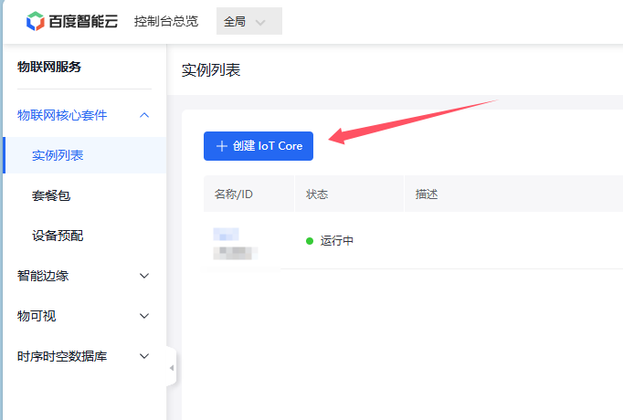
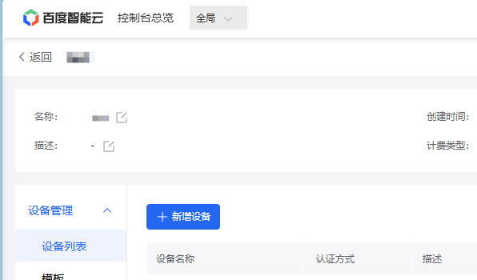
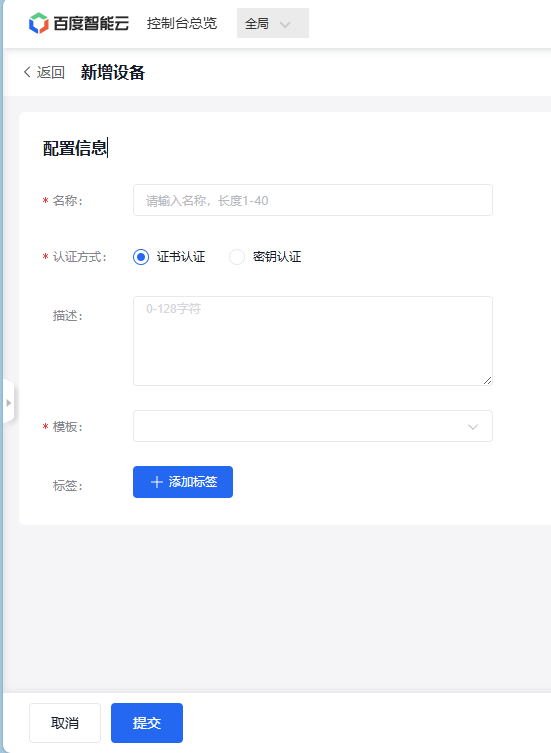
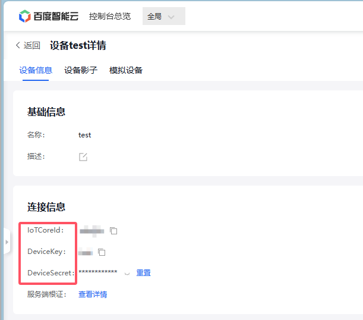
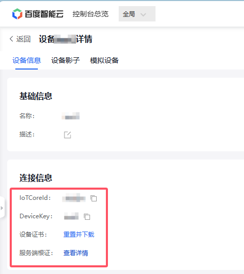
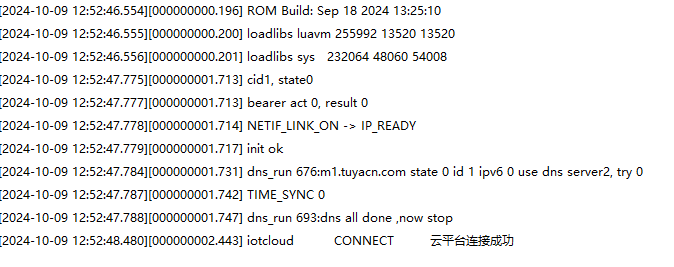

# 一库打通所有云平台--IOT_CLOUD系列文档之百度云物联网云平台

## 系列链接

​	[一库打通所有云平台--IOT_CLOUD系列文档](https://gitee.com/openLuat/luatos-doc-pool/blob/master/public/20240912_any_luatos_iotcloud.md)

## IOT_CLOUD介绍

​	众所周知，市面上有很多云平台，阿里云、腾讯云、中移onenet、华为云、百度云、华为云、Tlink云等等......并且每家都有自己的协议，工程师要移植不同的sdk代码或基于各家的手册文档对接不同的协议，看着都头大！！！

​	所以**iotcloud**应运而生！iotcloud是合宙专门为了合并iot平台而制作的库，意在使用统一且极简的代码接入各个云平台，轻松实现云功能。用户无需为那么多云平台的接入而头疼，只需要极简的通用API即可轻松上云！并且因为通用，所以云平台之间的迁移也十分方便。

​	**注意:本文档以AIR780E+Luatos作为示例，此库为网络通用库不限制型号，所有LUATOS支持的蜂窝模组都可使用**

### 实现介绍：

​	iotcloud库本质就是上层设计一套通用的API，库来进行每个平台功能的对接。目前已经实现了各个平台的所有注册方式，其中自动注册会将相关验证信息保存kv，随后使用此验证信息进行连接，通知针对每个平台添加了特有系统实现，比如设备上线通知，设备版本号上传，ota功能等，用户无需管理这些只需要注意相关下发消息做应用逻辑即可

## 百度云物联网介绍

​	物联网核心套件（IoT Core）是面向物联网领域开发者的全托管云服务，通过主流的物联网协议（如 MQTT）通讯，可以在智能设备与云端之间建立安全的双向连接，快速实现物联网项目。

​	**官网地址：**[智能物联网_天工物联网平台-百度智能云 (baidu.com)](https://console.bce.baidu.com/iot2/core/)

​	**官方文档地址：**[物联网核心套件文档](https://cloud.baidu.com/doc/IoTCore/index.html)

## 前期准备

### 云平台准备

​	需要登录官网[智能物联网_天工物联网平台-百度智能云 (baidu.com)](https://console.bce.baidu.com/iot2/core/)注册百度账号开通物联网核心套件 IoT Core

​	开通后我们点击创建 IoT Core进行产品创建，后续演示都在此产品中进行




### 硬件准备

- air780e开发板一块
- USB数据线
- 电脑

## 实战教学

​	鉴于iotcloud的库是通用的，这里我们只说一下不同的注册即可，其他都是一样使用的，可以参考[IOT_CLOUD系列文档之腾讯物联网云平台](https://gitee.com/openLuat/luatos-doc-pool/blob/master/public/20240906_any_luatos_iotcloud_txiot.md)

### 设备注册

#### 设备注册API

​	注册的API只有一个但是支持了所有的注册方式，使用也很简单

**iotcloud.new(cloud,iot_config,connect_config)**

创建云平台对象

**参数**

| 传入值类型 | 解释                                                         |
| ---------- | ------------------------------------------------------------ |
| string     | 云平台 iotcloud.TENCENT:腾讯云 iotcloud.ALIYUN:阿里云 iotcloud.ONENET:中国移动云 iotcloud.HUAWEI:华为云 iotcloud.TUYA:涂鸦云 iotcloud.BAIDU: 百度云 iotcloud.TLINK: Tlink云 |
| table      | iot云平台配置, device_name:可选，默认为imei否则为unique_id iot_config.product_id:产品id(阿里云则为产品key) iot_config.product_secret:产品密钥,有此项则为动态注册 iot_config.key:设备秘钥,有此项则为秘钥连接 userid:用户ID,onenet专用,动态注册使用 userkey:用户Accesskey,onenet专用,动态注册使用 |
| table      | mqtt配置, host:可选,默认为平台默认host ip:可选,默认为平台默认ip tls:加密,若有此项一般为产品认证 keepalive:心跳时间,单位s 可选,默认240 |

**返回值**

| 返回值类型 | 解释       |
| ---------- | ---------- |
| table      | 云平台对象 |

#### 设备注册分类

​	百度云支持秘钥验证和证书验证两种方式

1. **秘钥验证**

   ​	我们点击产品->新增设备	

   

   ​	认证方式修改为密钥认证后点击提交即可创建成功
   
   
   
   ​	创建成功后我们点击设备查看详情
   
   
   
   记录下着三个值分别对应produt_id device_name device_secret
   
   接下来我们再来看下代码具体怎么用

```lua
    -- 百度云 
    -- iotcloudc = iotcloud.new(iotcloud.BAIDU,{produt_id = "xxx",device_name = "xxx",device_secret = "xxx"})

```

​	第一个参数表示我们使用的是百度云，第二个参数我们将上面得到数据写入即可！

2. **证书验证**

​	**注意：不推荐使用此方式，因为证书存在过期，需要定期升级维护**

​	创建方式和上方密钥方式一样，只不过认证方式选择证书认证



​	记录下参数，证书部分参考官方文档进行处理 [使用证书鉴权建立MQTT连接 - 物联网核心套件IoTCore | 百度智能云文档 (baidu.com)](https://cloud.baidu.com/doc/IoTCore/s/Fkdqzh6r8)

1. 接下来我们再来看下代码具体怎么用

```lua
    -- 百度云 
    iotcloudc = iotcloud.new(iotcloud.BAIDU,{produt_id = "xxx",device_name = "xxx"},
    {tls={server_cert=io.readFile("/luadb/GlobalSign.cer"),
    client_cert=io.readFile("/luadb/client_cert"),
    client_key=io.readFile("/luadb/client_private_key")}})

```

​	第一个参数表示我们使用的是百度云，第二个和第三个参数我们将上面得到数据写入即可！

## 效果演示

### 代码演示

​	好了，接下来我们看下完整代码和效果，这里以动态注册为例，demo地址：[demo/iotcloud/main.lua · 合宙Luat/LuatOS - 码云 - 开源中国 (gitee.com)](https://gitee.com/openLuat/LuatOS/blob/master/demo/iotcloud/main.lua)

```lua
-- LuaTools需要PROJECT和VERSION这两个信息
PROJECT = "iotclouddemo"
VERSION = "1.0.0"

-- sys库是标配
_G.sys = require("sys")
--[[特别注意, 使用mqtt库需要下列语句]]
_G.sysplus = require("sysplus")

local iotcloud = require("iotcloud")

sys.taskInit(function()
    -- 等待联网
    sys.waitUntil("IP_READY")

    --------    以下接入方式根据自己需要修改,相关参数修改为自己的    ---------

    -- 百度云 
    iotcloudc = iotcloud.new(iotcloud.BAIDU,{produt_id = "xxx",device_name = "xxx",device_secret = "xxx"})
    -- iotcloudc = iotcloud.new(iotcloud.BAIDU,{produt_id = "xxx",device_name = "xxx"},
    {tls={server_cert=io.readFile("/luadb/GlobalSign.crt"),
    client_cert=io.readFile("/luadb/client_cert"),
    client_key=io.readFile("/luadb/client_private_key")}})

    if iotcloudc then
        iotcloudc:connect()
    end

end)

sys.subscribe("iotcloud", function(cloudc,event,data,payload)
    if event == iotcloud.CONNECT then -- 云平台联上了
            print("iotcloud","CONNECT", "云平台连接成功")
            -- iotcloud:subscribe("test") -- 定阅主题
    elseif event == iotcloud.RECEIVE then
            print("iotcloud","topic", data, "payload", payload)
            -- 用户处理代码
    elseif event ==  iotcloud.OTA then
        if data then
            rtos.reboot()
        end
    elseif event == iotcloud.DISCONNECT then -- 云平台断开了
            -- 用户处理代码
    end
end)

-- 用户代码已结束---------------------------------------------
-- 结尾总是这一句
sys.run()
-- sys.run()之后后面不要加任何语句!!!!!

```

### 设备日志：



​	可以看到我们的设备打印了连接成功，证明自动注册+连接流程已经完成

​	至此，云平台已经连接成功，剩下的就是要根据自己的产品需求，自己的物模型上报/下发数据就可以了


