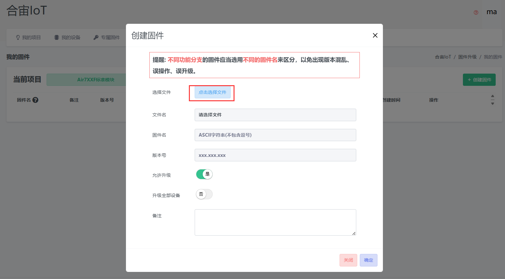
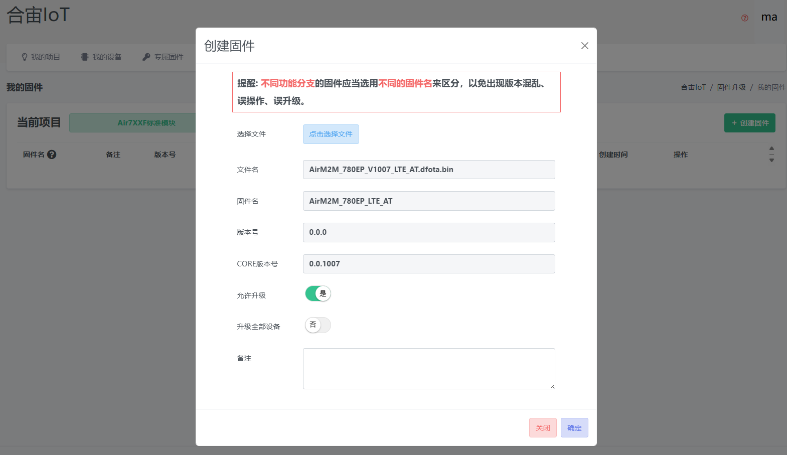
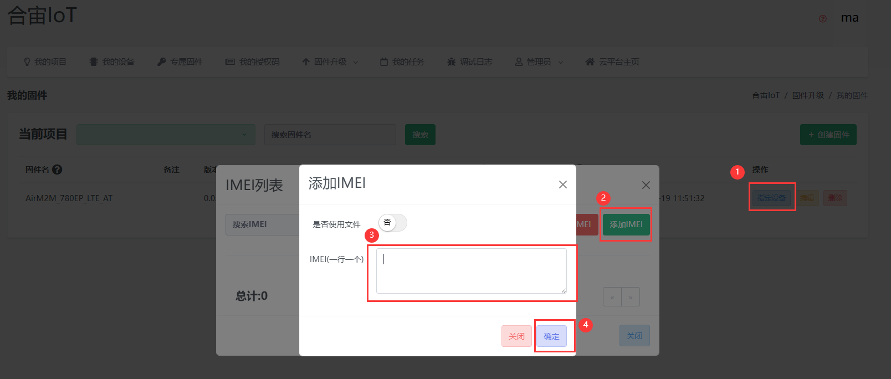
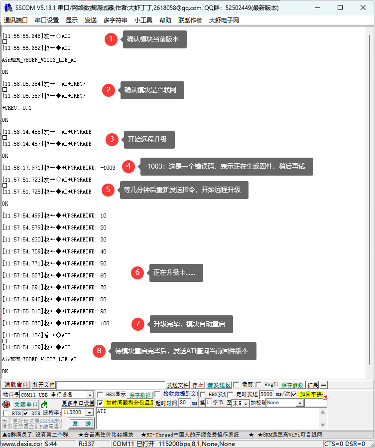
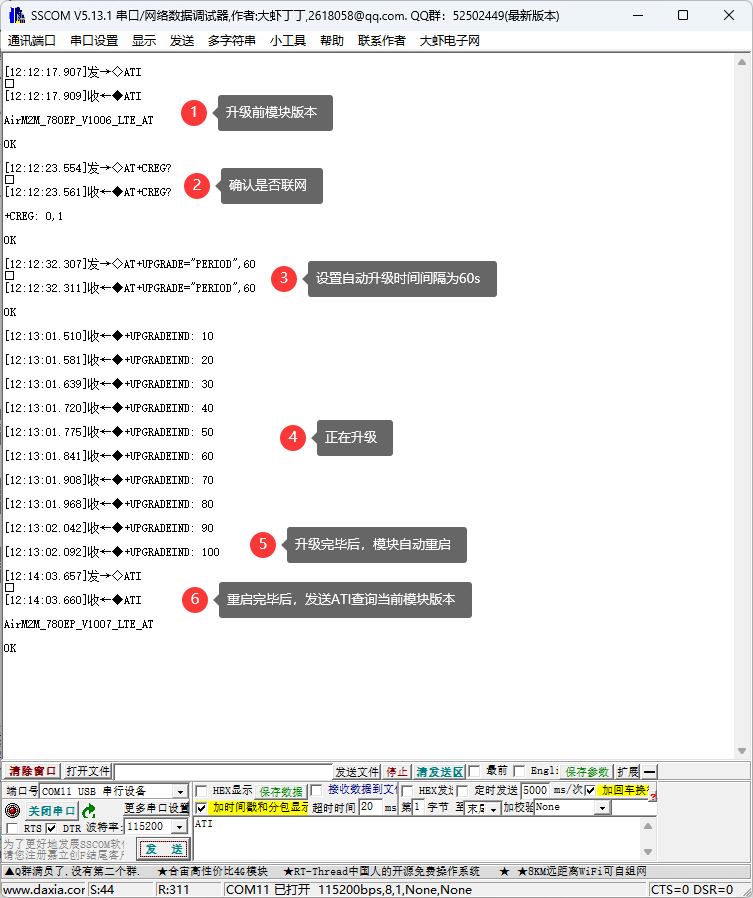
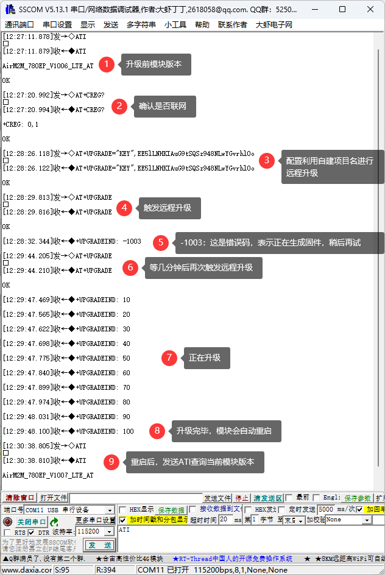
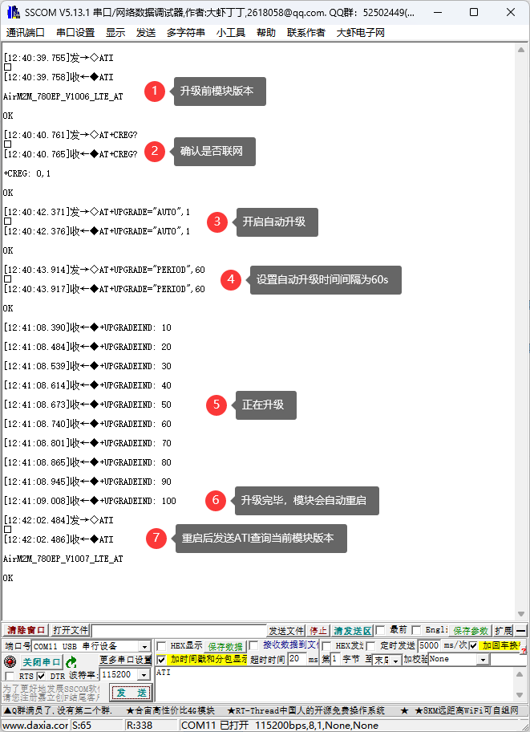
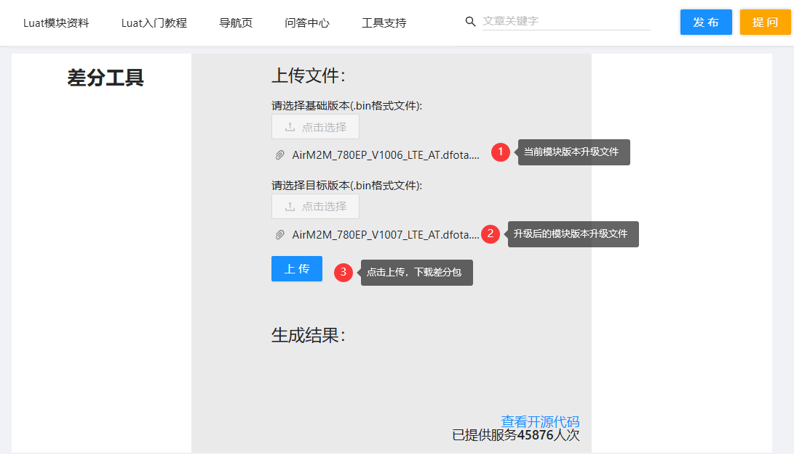
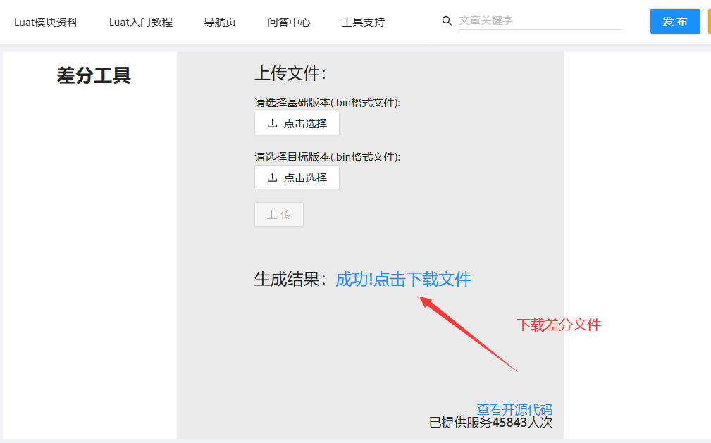
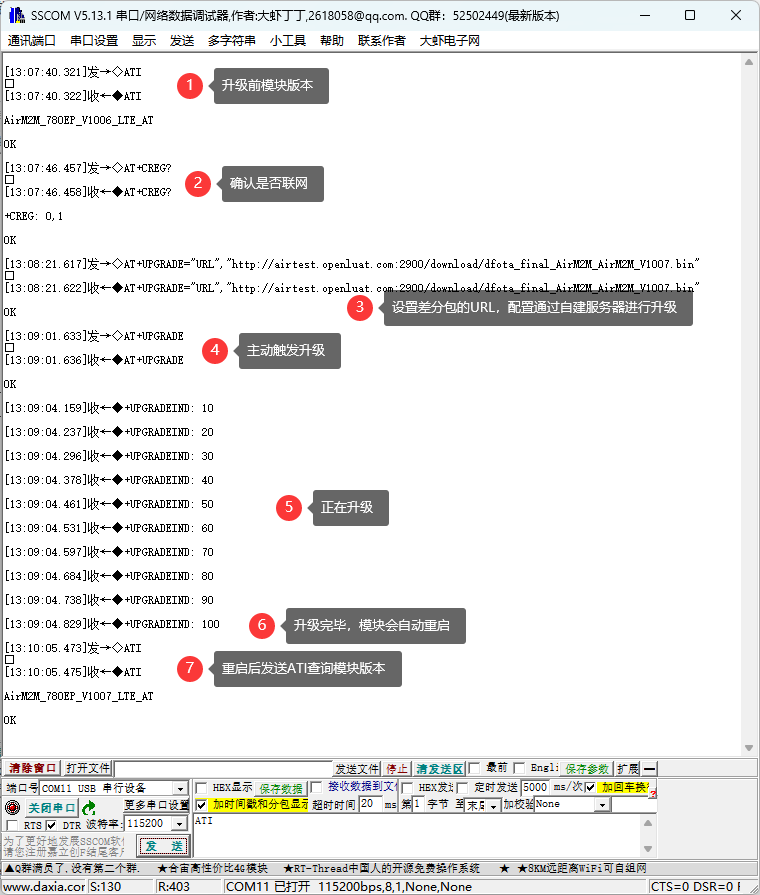

# Air780EP模块AT开发FOTA远程升级指南

# 简介

>  AT版本的远程升级主要是对AT固件进行升级，实际方式为通过合宙官方IOT平台升级或者使用自己搭建的服务器进行升级服务。
>
> - 关联文档和使用工具：
>
>   - [AT固件获取](https://gitee.com/openLuat/airm2m-ec718-at/releases)
>
>   - [生成差分包工具网址](https://doc.openluat.com/chafen)
>

# 合宙IOT平台配置

此为[合宙IOT平台](http://iot.openluat.com/)对应链接。

## 升级日志 —— 如何查看

## 升级日志 —— 响应码列表

| 响应码 |   响应信息   |                       问题以及解决办法                       |                云平台日志结果                 |
| :----: | :----------: | :----------------------------------------------------------: | :-------------------------------------------: |
|   3    |  无效的设备  |                 检查请求键名(imei小写)正确性                 |                      无                       |
|   17   |    无权限    | 设备会上报imei、固件名、项目key。 服务器会以此查出设备、固件、项目三 条记录， 如果 这三者不在同一个用户名下，就会认为无权限。 设备不在项目key对应的账户下， 可寻找合宙技术支持查询该设备在哪个账户下， 核实情况后可修改设备归属 |                    无权限                     |
|   21   |      21      |                    不允许从1.0.2升到1.0.3                    |                      21                       |
|   25   |  无效的项目  | productkey不一致，检查是否存在拼写错误， 检查模块是否在本人账户下，若不在本人账户下，请联系合宙工作人员处理 |                  未找到项目                   |
|   26   |  无效的固件  | 固件名称错误，项目中没有对应的固件。用户自己修改了固件名称，可对照升级日志中设备当前固件名与升级配置中固件名是否相同（固件名称，固件功能要完全一致，只是版本号不同）。 |                  找不到固件                   |
|   27   | 已是最新版本 | 1、设备固件版本高于云平台 2、固件版本设备脚本版本高于云平台版本 3、用户项目升级配置中未添加该设备 4、云平台升级配置中，是否升级配置为否 |   已是最新版本 设备不在配置的升级设备列表中   |
|   40   |   循环升级   | [云平台](https://iot.openluat.com/)进入设备列表搜索被禁止的imei，解除禁止升级就好了。 云平台防止模块在升级失败后，反复请求升级导致流量耗尽， 在模块一天请求升级六次后会禁止模块升级。可在平台解除。 | 检测到循环升级 (已禁止升级，请到设备列表解除) |
|   43   |    请等待    | 云平台生成差分升级包需要等待， 一到三分钟后云平台生成完成差分包便可以请求成功。 |             正在生成版本，请等待              |
|   44   | 基础版本缺失 | 平台未收录设备固件（多为定制固件， 可寻找合宙技术支持人员添加，需提供定制固件邮件） |               基础CORE版本缺失                |

## 使用默认项目名配置

客户在向合宙采购4G模块时，如果采购人员没有告知这批模块应该放在IOT平台的哪个产品下，合宙则会以**采购人的手机号为账号，默认密码888888，需要创建一个"Air7XXF标准模块"的项目**。

注意：以**"Air7XXF标准模块"**命名的项目，为780EP模块AT版本默认FOTA请求升级的IOT项目。并将此次所采购的所有模块都放在这个项目下，如果模块没在该项目下或者需要更换项目请联系合宙工作人员。

### 配置流程

以780EP为例，获取[AT固件版本](https://gitee.com/openLuat/airm2m-ec718-at/releases)，下载到本地后解压并将dfota.bin文件上传到dfota中。

1. 在IOT平台-我的项目页面点击固件列表

2. 创建固件，上传对应文件

3. 上传好文件之后会自动生成固件名称，不需要修改

4. 如果配置“升级全部设备”选项为“是”，则无需配置IMEI，按照上述内容配置即可。如果选择“否”，还需添加IMEI，如下图所示。

### AT指令触发升级

#### 手动触发升级

如下模块从V1006升级到V1007的流程

#### 自动升级（默认24小时内自动触发）

自动升级是模块定期向后台发送升级请求，来获取新固件进行更新的，大致流程如下

可以通过**AT+UPGRADE="PERIOD",60**设置自动升级时间，这里设置为60s来作为演示

## 使用自建项目名配置

客户从合宙采购完模块之后，注册登录[合宙IOT平台](http://iot.openluat.com/)，在IOT平台我的项目页面新建一个项目，并要求合宙工作人员将这批模块放入新建的项目中（客户本身无权限进行操作）。本示例就以“远程升级模块”为项目名进行远程升级。

该项目下的模块可通过设备列表查看

### 配置流程

- 参考[使用默认项目名配置](# 使用默认项目名配置)下的配置流程
- 注意此时的项目为“远程升级模块”

### AT指令触发升级

#### 手动触发升级

1. 通过下方图示操作，找到对应项目的项目Key。

2. 复制项目Key，用**AT+UPGRADE="KEY",ProductKey**进行配置，其中**ProductKey**为对应项目Key
   
   要注意的是该命令参数会写入nv，掉电保存
   
   然后再发送**AT+UPGRADE**进行远程升级

#### 自动升级（默认24小时内自动触发）

自动升级是模块定期向后台发送升级请求，来获取新固件进行更新的，大致流程如下

可以通过**AT+UPGRADE="PERIOD",60**设置自动升级时间，这里设置为60s来作为演示

# 自定义服务器升级

- 使用自己的服务器来升级模块和使用iot平台升级最重要的区别是下载固件的来源不同。
- 其实FOTA的过程是新老版本生成差分包再进行升级的过程，那么这个差分的过程在哪里呢？使用合宙iot平台升级，差分的过程在iot服务器后台，那使用自己的服务器该怎么办呢？答案当然是自己来完成差分的过程，放在服务器等待模块来下载。

## 差分包生成工具

​	手动生成差分包的过程使用doc平台工具中的差分工具 [差分工具](https://doc.openluat.com/chafen)

​	**注意**：升级文件为 **xxxx.dfota.bin** 文件

下载生成的差分文件

- 本次我们从V1006升级到V1007需要准备各自的bin远程升级文件，上传完成后等待差分完成，下载得到的差分文件，这里将名字改为**dfota_final_AirM2M_AirM2M_V1007.bin**。

## 配置流程

- 把生成的固件放到服务器上，然后通过**AT+UPGRADE="URL",""**指令设置对应的URL链接。
- 配置完差分包URL地址成功后，**AT+UPGRADE **主动触发升级。  
- 升级流程如下，这里选择了USB的另外一个端口，可以上报模块的升级过程：

恭喜你成功从V1006版本通过自定义服务器搭建FOTA服务的方式升级到了更新的V1007版本！