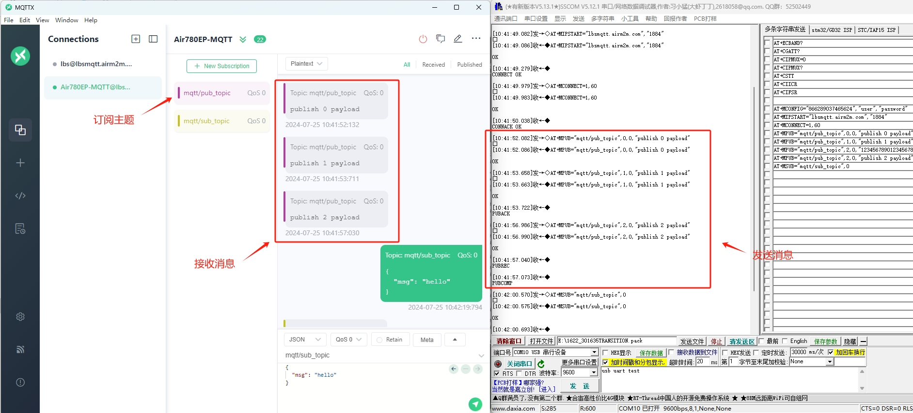
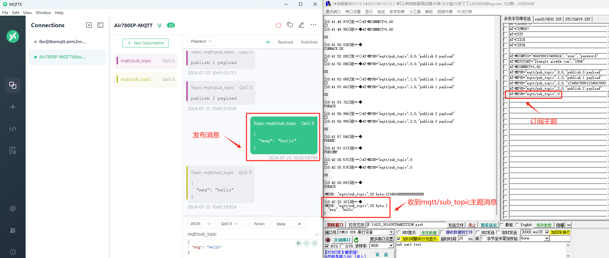
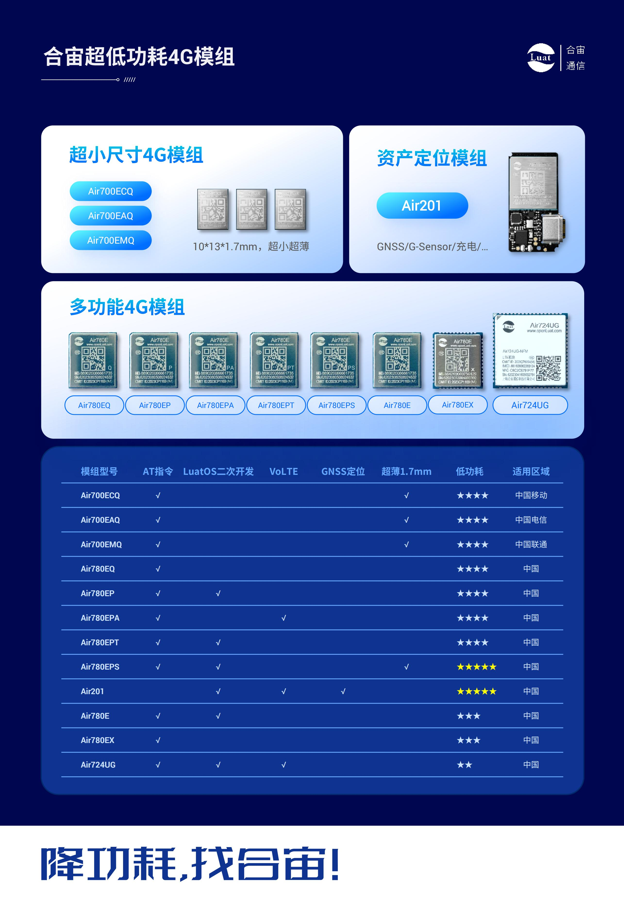

# Air780EP模块AT开发MQTT和MQTTS的应用指南

# 简介

> - 关联文档和使用工具：
>
>   - [AT固件获取](https://gitee.com/openLuat/airm2m-ec718-at/releases)
>   - [AT指令手册](https://doc.openluat.com/article/4985)
>

# 材料准备
- [EVB_Air780EP(V)]开发板一套，包括天线SIM卡
- USB线
- PC电脑
- 串口调试工具（如果没有准备，推荐可以使用llcom，下载地址：https://llcom.papapoi.com）
- AT固件获取：https://gitee.com/openLuat/airm2m-ec718-at/releases ，进页面按下Ctrl+F 搜索 **AirM2M_780EP_LTE_AT** 即可找到780EP模块所使用的AT固件，推荐选用该固件名称后面数字版本号最高的最新relase版本进行调试。
- 当前文档示例使用[AirM2M_780EP_V1007_LTE_AT版本固件](https://cdn.openluat-erp.openluat.com/erp_site_file/product_file/sw_file_20240422190620_AirM2M_780EP_V1007_LTE_AT.zip)

 

# 应用概述

```
4G模块支持MQTT和MQTT SSl协议，  MQTT应用的基本流程如下：

1、如果要支持SSL，配置SSL参数

2、通过TCP连接到MQTT服务器

3、发送MQTT CONNECT到服务器，打开会话连接

4、订阅或者发布消息
```

#  示例

## 发布消息示例
先来看个正常情况下的AT命令序列，如果不理解AT命令含义，请自行参考AT手册
```lua
AT+CPIN?

 

+CPIN: READY    //查询sim卡是否正常

 

OK

AT+CGATT?

 

+CGATT: 1        //查询是否附着上数据网络，如果返回+CGATT: 0表示未附着上

 

OK


AT+MCONFIG="866289037465624","user","password"

 
OK

AT+MIPSTART="lbsmqtt.airm2m.com","1884"

 

OK

 

CONNECT OK

AT+MCONNECT=1,60

 

OK

 

CONNACK OK

AT+MSUB="mqtt/sub_topic",0

 

OK

 

SUBACK

AT+MPUB="mqtt/pub_topic",0,0,"publish 0 payload"

 

OK

AT+MPUB="mqtt/pub_topic",1,0,"publish 1 payload"

 

OK

 

PUBACK

AT+MPUB="mqtt/pub_topic",2,0,"publish 2 payload"

 

OK

 

PUBREC

 

PUBCOMP
```

 发布消息示例演示效果

在这个过程中，注意事项如下：

         1、发送MIPSTART命令后，收到OK仅仅表示4G模块开始处理这条命令，并不表示TCP已经连接成功；只有收到CONNECT OK才是成功的应答（其余错误应答，参考AT手册）
    
         2、发送MCONNECT命令后，收到OK仅仅表示4G模块开始处理这条命令，并不表示MQTT已经连接成功；只有收到CONNACK OK才是成功的应答（其余错误应答，参考AT手册）
    
         3、发送MSUB命令后，收到OK仅仅表示4G模块开始处理这条命令，并不表示MQTT已经订阅成功；只有收到SUBACK才是成功的应答（其余错误应答，参考AT手册）
    
         4、发送MPUB命令后，如果QOS不是0，则收到OK仅仅表示4G模块开始处理这条命令，并不表示MQTT已经发布成功；只有收到PUBACK（QOS为1时）或者PUBCOMP（QOS为2时）才是成功的应答（其余错误应答，参考AT手册）

## 接收消息示例
先来看下接收到订阅消息时的AT命令处理序列，如果不理解AT命令含义，请自行参考AT手册
```lua
AT+MCONFIG="866289037465624","user","password"
OK

AT+MIPSTART="lbsmqtt.airm2m.com","1884"
OK
CONNECT OK

AT+MCONNECT=1,60
OK

CONNACK OK

AT+MSUB="mqtt/sub_topic",0
OK
SUBACK

AT+MPUB="mqtt/sub_topic",0,0,"123456"
//在mqtt/sub_topic上收到订阅消息，payload为123456

//默认是直接输出收到的订阅消息，不做缓存

+MSUB: "mqtt/sub_topic",6 byte,123456

//设置订阅消息的处理模式，设置为缓存模式

//接下来收到订阅消息时，会提示订阅消息的缓存位置

AT+MQTTMSGSET=1

OK

//在mqtt/sub_topic上收到一条订阅消息，缓存到位置0

+MSUB: 0

//主动读取缓存的所有订阅消息

AT+MQTTMSGGET

+MSUB:mqtt/sub_topic,6 byte,123456

OK

//在mqtt/sub_topic上收到一条订阅消息，缓存到位置0

+MSUB: 0
//在mqtt/sub_topic上收到一条订阅消息，缓存到位置1

+MSUB: 1

//主动读取缓存的所有订阅消息

AT+MQTTMSGGET
+MSUB:mqtt/sub_topic,6 byte,123456

+MSUB:mqtt/sub_topic,6 byte,123456
OK
```

接收消息演示效果



## TCP被动断开示例

 先来看下连接被动断开时的AT命令处理序列，如果不理解AT命令含义，请自行参考AT手册
```lua
AT+MCONFIG="866289037465624","user","password"
OK

AT+MIPSTART="lbsmqtt.airm2m.com","1884"
OK
CONNECT OK

AT+MCONNECT=1,60
OK
CONNACK OK
CLOSED               //此处TCP连接被动断开

AT+MIPCLOSE
+CME ERROR: 767     //此处无论返回OK、ERROR还是CME ERROR，都直接跳过，不用做正确性判断
AT+MCONFIG="866289037465624","user","password"
OK
AT+MIPSTART="lbsmqtt.airm2m.com","1884"
OK
CONNECT OK
AT+MCONNECT=1,60
OK

CONNACK OK
```
## PDP被动去激活示例

先来看下PDP被动去激活时的AT命令处理序列，如果不理解AT命令含义，请自行参考AT手册

```lua

AT+MCONFIG="866289037465624","user","password"

OK

AT+MIPSTART="lbsmqtt.airm2m.com","1884"

OK

CONNECT OK

AT+MCONNECT=1,60

OK

CONNACK OK
+CGEV: NW PDN DEACT 1       //此处PDP被动去激活

AT+MIPCLOSE
OK                     //此处无论返回OK、ERROR还是CME ERROR，都直接跳过，不用做正确性判断

AT+MCONFIG="866289037465624","user","password"
OK
AT+MIPSTART="lbsmqtt.airm2m.com","1884"
OK
CONNECT OK
AT+MCONNECT=1,60
OK
CONNACK OK
```
## SSL带证书验证流程（单向认证）

先来看下SSL带证书验证（单向认证）时的AT命令处理序列，如果不理解AT命令含义，请自行参考AT手册

```lua
AT+CGATT?

+CGATT: 1

OK

AT+FSCREATE="ca.crt"			//创建CA 证书文件

OK

AT+FSWRITE="ca.crt",0,1212,15  //1212是证书文件长度，15为超时时间，这里是举例说明，请填入实际数据，不要照抄

>
//此处填写证书数据

OK

AT+SSLCFG="cacert",88,"ca.crt"	//设置CA证书文件为ca.crt

OK

AT+SSLCFG="seclevel",88,1		//1表示设置认证模式为只对服务器认证

OK

AT+MCONFIG="868488076506128","user","password"	//这三个参数可以不加双引号，第一个参数需要开发者自己设置
												//后两个参数可以不填，格式为:AT+MCONFIG="868488076506128","",""

OK

AT+SSLMIPSTART="airtest.openluat.com",8883		//开发者请修改为自己的服务器地址和端口

OK

CONNECT OK

AT+MCONNECT=1,60								//在MIPSTART返回CONNECT OK后才能发MCONNECT命令
												//而且要立即发，否则会被服务器踢掉

OK

CONNACK OK

--后面发布和接收与前面一样，直接参考
```

## SSL带证书验证流程（双向认证）

先来看下SSL带证书验证（双向认证）时的AT命令处理序列，如果不理解AT命令含义，请自行参考AT手册

```lua
AT+CGATT?

+CGATT: 1

OK

AT+FSCREATE="ca.crt"			//创建CA 证书文件

OK

AT+FSWRITE="ca.crt",0,1212,15  //1212是证书文件长度，15为超时时间，这里是举例说明，请填入实际数据，不要照抄

>
//此处填写证书数据

OK

AT+FSCREATE="client.crt"		//创建客户端证书文件

OK

AT+FSWRITE="client.crt",0,1127,15

>
//此处填写证书数据

OK

AT+FSCREATE="client.key"		//创建客户端key文件

OK

AT+FSWRITE="client.key",0,1679,15

>
//此处填写证书数据

OK

AT+SSLCFG="cacert",88,"ca.crt"	//设置CA证书文件为ca.crt

OK

AT+SSLCFG="clientcert",88,"client.crt"	//设置客户端证书文件为client.crt

OK

AT+SSLCFG="clientkey",88,"client.key"	//设置客户端密钥文件为client.key

OK

AT+SSLCFG="seclevel",88,2				//设置认证模式为双向认证

OK

AT+MCONFIG="868488076506128","user","password"	//这三个参数可以不加双引号，第一个参数需要开发者自己设置
												//后两个参数可以不填，格式为:AT+MCONFIG="868488076506128","",""

OK

AT+SSLMIPSTART="airtest.openluat.com",8883		//开发者请修改为自己的服务器地址和端口

OK

CONNECT OK

AT+MCONNECT=1,60								//在MIPSTART返回CONNECT OK后才能发MCONNECT命令
												//而且要立即发，否则会被服务器踢掉

OK

CONNACK OK

--后面发布和接收与前面一样，直接参考
```


------


# 常见问题

**1、MQTT支持多连接吗**
目前MQTT仅支持单连接，不支持多连接
**2、MQTT的遗嘱如何使用**
  通过AT+MCONFIG命令可以设置遗嘱的qos、retain标志、topic、payload；在如下几种（包含但是又不仅限于如下情况）情况下，服务器会主动发布遗嘱消息到订阅的客户端：

         1、模块和服务器通信异常（例如模块突然关机、模块进入了一个没有网络信号的环境等）超过1.5倍（一般是1.5倍，但不排除服务器可以修改这个时间）的 keep alive时间（可以通过AT+MCONNECT设置keep alive时间）
    
         2、模块主动执行AT+MDISCONNECT或者AT+MIPCLOSE
    
         曾经有用户碰到过如下问题：
    
         模块设置了遗嘱topic为/will_topic，遗嘱payload为offline，keep alive时间为5分钟，模块关机后，等待2分钟，在等待的2分钟内，其他订阅了/will_topic的客户端没有收到遗嘱消息（这是正常的，因为还没有到达1.5倍的keep alive时间），2分钟后，模块开机mqtt重连成功后，其他客户端却收到了遗嘱消息，这是什么原因呢？这部分机制是服务器端设计的，和模块无关，个人认为：服务器端仍然在维持2分钟前的那个mqtt连接，现在模块开机，用同样的client id重连后，会断开之前维护的相同client id的mqtt连接，断开时，就发布了一次遗嘱消息。那这种问题，如何解决呢？模块可以在AT+MCONNECT返回CONNACK OK之后，通过AT+MPUB一个topic为/will_topic，payload为online的消息，这样订阅了遗嘱topic的其他客户端就会收到这个online消息

**3、MQTT SSL如何使用**
本文主要描述了基本流程和异常处理，对于MQTT SSL使用方法没有做过多描述，这一部分，请自行参考AT手册MQTT章节下《使用方法举例》中的"SSL带证书验证流程"使用方法；支持的SSL参数，请自行参考AT+SSLCFG命令说明

         如果SSL的参数配置不变，则每次开机运行过程中，仅设置一次即可


**4、重试多次PDP，MQTT应用一直连接失败**
如果重试多次PDP激活，PDP一直激活失败，或者MQTT一直连接失败，则尝试使用如下手段恢复：

         1、使用RESET引脚复位模块
    
         2、极端情况下，直接给模块断电，再上电，POWER KEY引脚拉低开机

**5、MPUB命令中，payload包含"如何发送？**
消息中内嵌的双引号请用\22 表达；控制字符 \r(0x0D)请用\0D 表达；控制字符\n（0x0A） 请用\0A 表达 如果是 MCU 发消息，请用\\\22，\\\0D，\\\0A 来 表达，即\需要转义成\\\

**6、连接服务器失败**
1. 检查下模块信号、网络注册、网络附着、PDP激活状态
2. 检查下SIM卡是否欠费
3. 使用mqtt.fx，连接服务器确认一下是否可以连接成功，排除服务器故障
4. 部分国外的开源项目提供免费的MQTT代理服务器，因为网络的原因，国内存在严重的延迟或者丢包现象，导致程序运行出现问题，此现象在AT开发时影响严重
5. 确认是不是域名解析失败导致，可以通过AT+CDNSGIP=<domain name>确认一下域名是否能正常解析（***注意：该命令只有在执行完at+cstt、at+ciicr、at+cifsr后才能正常工作***），不能正常解析，可以通过AT+CDNSCFG=ip1,ip2设置域名解析服务器。
6. 在 MIPSTART /SSLMIPSTART返 回 CONNECT OK后 才 能 发 MCONNECT命令，而且要立即发，否则会被服务器踢掉。

**7、数据接收缓存问题**
1)    不缓存：通过AT+MQTTMSGSET=0设置；收到订阅的publish报文后，立即通过AT口输出主题、payload长度、payload内容，每个报文中支持的payload内容最长4100字节

2) 内存缓存：通过AT+MQTTMSGSET=1设置；内存中有一个缓存表，一条消息最多4kb，最多支持缓存4条publish报文；收到订阅的publish报文后，插入缓冲表中的空闲位置，然后通过AT口输出存储位置；缓存表满之后，新收到的publish报文会覆盖最旧的publish报文

2) 注意：缓存表位于内存中，断电或者重启后，缓存表中的数据会被清空；建议收到数据时，通过AT+MQTTMSGGET及时读取出来，以防缓冲区满覆盖丢失数据

**8、数据发送问题**
AT+MPUB最大publish 4100字节,AT+MPUBEX长度取值范围1-4100

----

> 合宙支持AT功能的模组型号，除本文介绍的Air780EP外，
> 还有Air780EPA、Air780E、Air780EX、Air724UG、Air201、Air780EQ、Air700ECQ、Air700EAQ、Air780EPT、Air780EPS等型号，
> 本文介绍的MQTT应用流程，同样也适用于这些型号。




