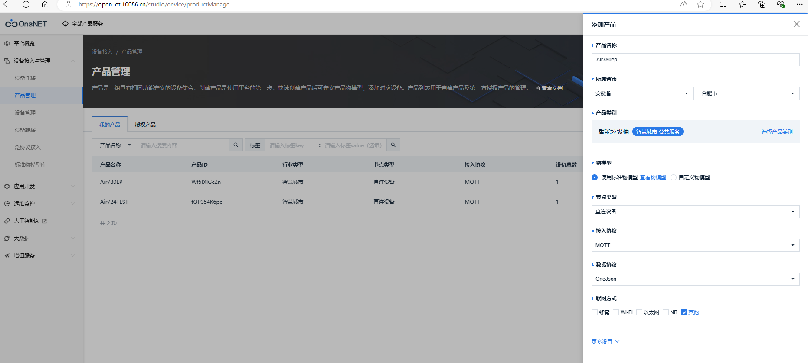
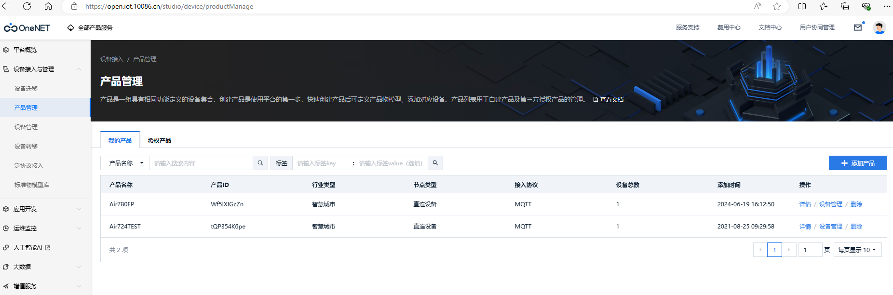
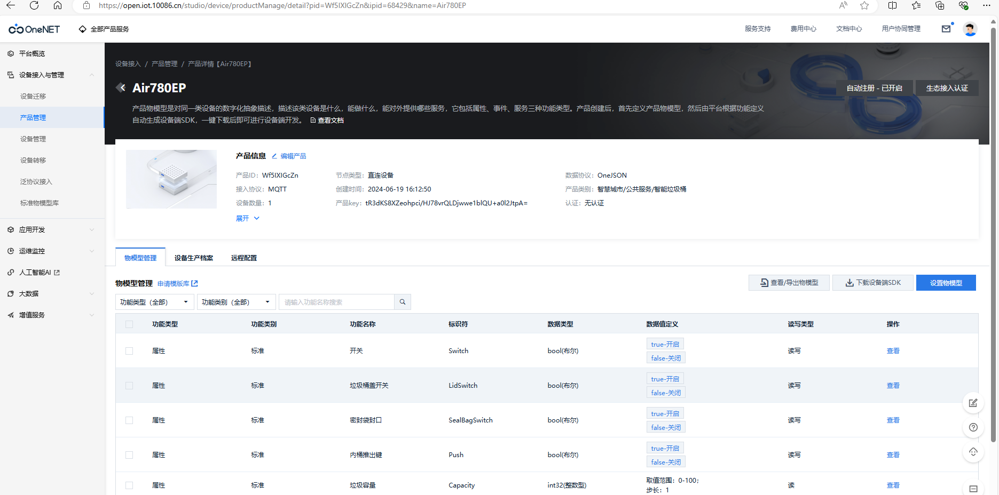
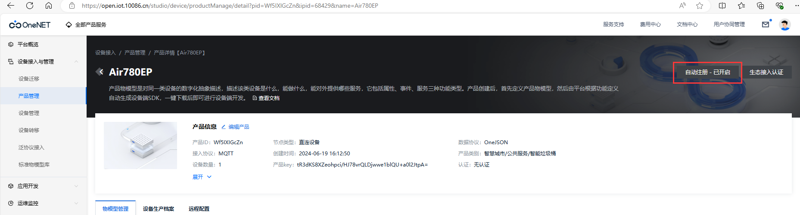
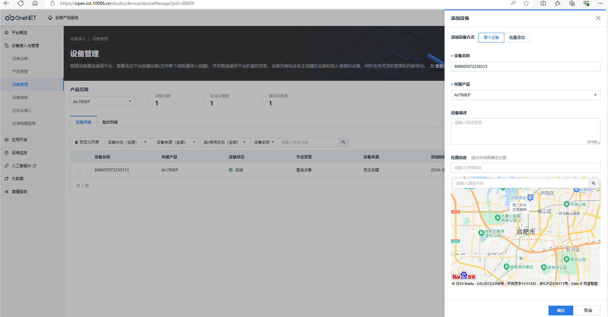
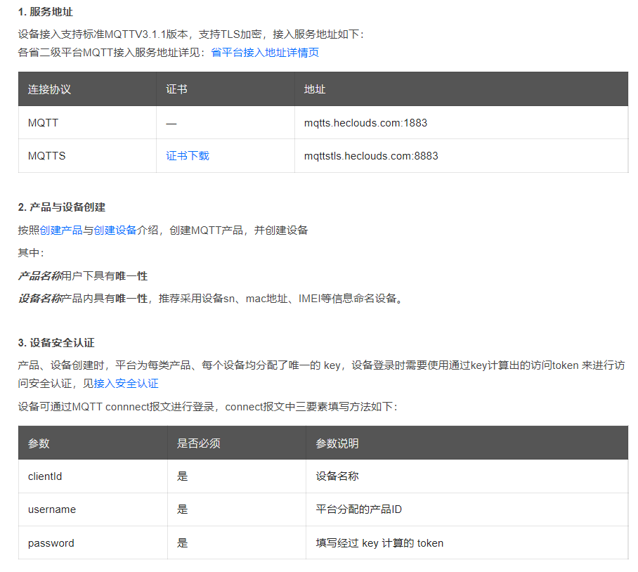
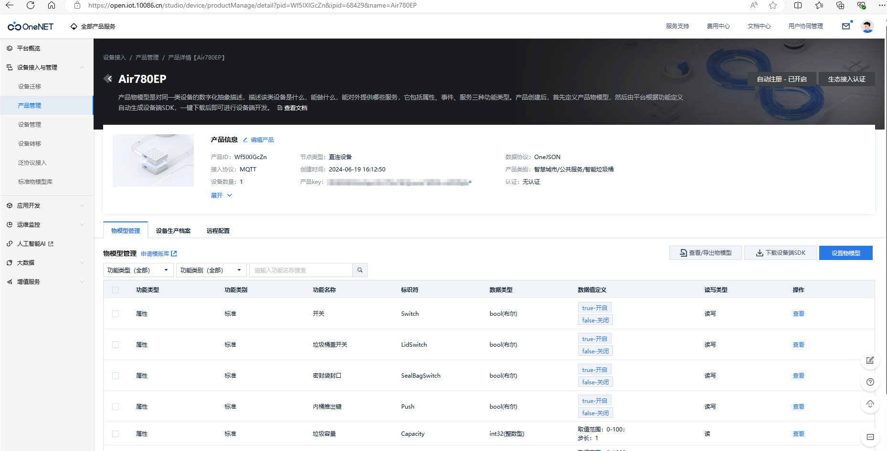
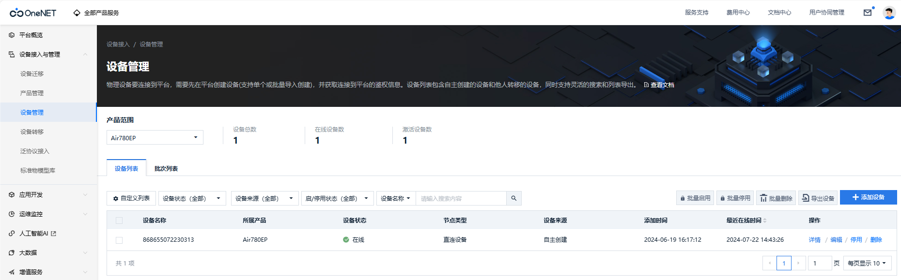
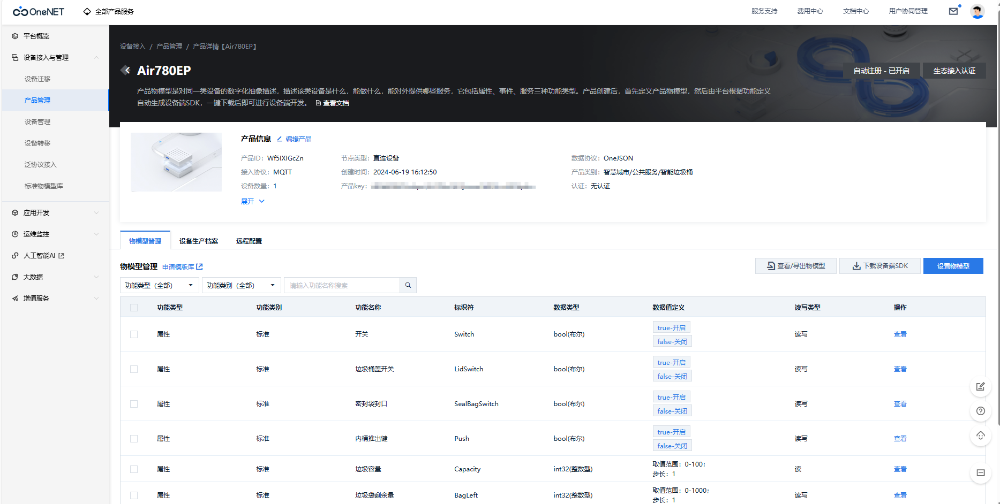
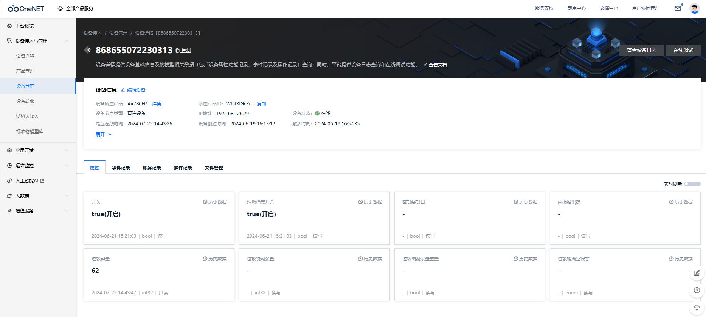

# Air780EP模块AT开发接入OneNET移动物联网开放平台指南

# 简介

> - 关联文档和使用工具：
>
>   - [AT固件获取](https://gitee.com/openLuat/airm2m-ec718-at/releases)
>   - [AT指令手册](https://doc.openluat.com/article/4985)
>   - [OneNET 物联网平台](https://open.iot.10086.cn/)
>

# 材料准备
- [EVB_Air780EP(V)]开发板一套，包括天线SIM卡
- USB线
- PC电脑
- 串口调试工具（如果没有准备，推荐可以使用llcom，下载地址：https://llcom.papapoi.com）
- AT固件获取：https://gitee.com/openLuat/airm2m-ec718-at/releases ，进页面按下Ctrl+F 搜索 **AirM2M_780EP_LTE_AT** 即可找到780EP模块所使用的AT固件，推荐选用该固件名称后面数字版本号最高的最新relase版本进行调试。
- 当前文档示例使用[AirM2M_780EP_V1007_LTE_AT版本固件](https://cdn.openluat-erp.openluat.com/erp_site_file/product_file/sw_file_20240422190620_AirM2M_780EP_V1007_LTE_AT.zip)

 

# 应用概述

```
使用AT方式通过MQTT协议连接onenet studio。官网地址：https://open.iot.10086.cn/

4G模块支持MQTT和MQTT SSl协议，  MQTT应用的基本流程如下：

1、如果要支持SSL，配置SSL参数

2、通过TCP连接到MQTT服务器

3、发送MQTT CONNECT到服务器，打开会话连接

4、订阅或者发布消息
```

#  示例

1. 在onenet上创建产品

   打开OneNET官网，进入控制台，进入[Onenet Studio](https://open.iot.10086.cn/studio/summary)，选择设备接入与管理，点击产品管理。

    

   点击添加产品

    

   根据自己产品填写，注意：节点类型选择直连设备，接入协议选择MQTT，点击确定

    

   点击详情

    

   将右上角自动注册打开

    

   记住产品ID和产品key


2. 创建设备

   填入设备名，选择产品，这里我使用的是模块的imei来做设备名称

   

3. 查看onenet接入协议

   [MQTT设备连接_开发者文档_OneNET (10086.cn)](https://open.iot.10086.cn/doc/v5/fuse/detail/919))
   
   

   可以看到，登入onenet时，mqtt的clientID、username和password都有指定

   clientId即为刚才创建的设备名称

   username为创建的产品ID




   password是需要经过加密计算得来的鉴权token

   计算方法详见如下文章，这篇文章测试时直接使用onenet提供的测试工具来计算鉴权密码，鉴权计算测试工具下面连接中下载

  [接入安全认证_开发者文档_OneNET (10086.cn)](https://open.iot.10086.cn/doc/iot_platform/book/device-connect&manager/device-auth.html)

   

# 连接onenet
## 1.查询卡、网络注册状态


&emsp;&emsp;具体交互流程如下所示

```lua
查询SIM卡状态
AT+CPIN?

+CPIN: READY

OK

查询信号质量
AT+CSQ

+CSQ: 16,0

OK

查询网络附着状态
AT+CGATT?

+CGATT: 1

OK

AT+CGDCONT?

+CGDCONT: 1,"IP","cmiot","10.126.200.230"

OK
```

## 2.MQTT直连onenet
设备注册参数如下：
```lua
mqttClientId: devicename
mqttUsername: productID
mqttPassword: token
```
| 参数                 | 说明                    |
| -------------------- | ----------------------- |
| devicename           | 设备名称                |
| productID            | 平台分配的产品id        |
| token                | 经过鉴权算法得到的token |
| 具体交互流程如下所示 |                         |

下图为工具计算出的token


```lua
AT+MCONFIG="868655072230313","Wf5IXIGcZn","version=2018-10-31&res=products%2FWf5IXIGcZn%2Fdevices%2F868655072230313&et=1721630715&method=md5&sign=DPqCcsPQAQok9Gt7mNPTbA%3D%3D"

OK

AT+MIPSTART="studio-mqtt.heclouds.com",1883

OK

CONNECT OK


AT+MCONNECT=1,120

OK

CONNACK OK

```

可以从平台上看到设备已经在线了



## 3.发布与订阅消息

onenet studio有固定的通信TOPIC，可以到官网查看，这里演示下设备属性上报与响应的主题

[通信主题_开发者文档_OneNET (10086.cn)](https://open.iot.10086.cn/doc/iot_platform/book/device-connect&manager/MQTT/topic.html)


### 订阅
```lua
AT+MSUB="$sys/Wf5IXIGcZn/868655072230313/thing/property/post/reply",0

OK

SUBACK
```
### 发布

向设备上报属性的主题发布消息，消息携带设备的属性，不同的产品具有不同的属性，可以在设备物模型处查看

例如：在文章开始创建的产品具有如下图所示的属性



```lua
向上报属性的主题发布一条payload格式错误的消息
AT+MPUB="$sys/q23GT8XVOu/868739055238251/thing/property/post",0,0,"{}"

OK

平台返回缺少参数
+MSUB: "$sys/q23GT8XVOu/868739055238251/thing/property/post/reply",47 byte,{"id":null,"code":2403,"msg":"required msg id"}


如下是正常流程
AT+MPUB="$sys/Wf5IXIGcZn/868655072230313/thing/property/post",0,0,"{\22id\22:\22123\22,\22params\22:{\22Capacity\22:{\22value\22:62}}}"

OK

平台返回成功
+MSUB: "$sys/Wf5IXIGcZn/868655072230313/thing/property/post/reply",39 byte,{"id":"123","code":200,"msg":"success"}

```

可以看到平台已经有数据更新



----

> 合宙支持AT功能的模组型号，除本文介绍的Air780EP外，
> 还有Air780EPA、Air780E、Air780EX、Air724UG、Air201、Air780EQ、Air700ECQ、Air700EAQ、Air780EPT、Air780EPS等型号，
> 本文介绍的接入OneNET 移动物联网开放平台应用流程，同样也适用于这些型号。


