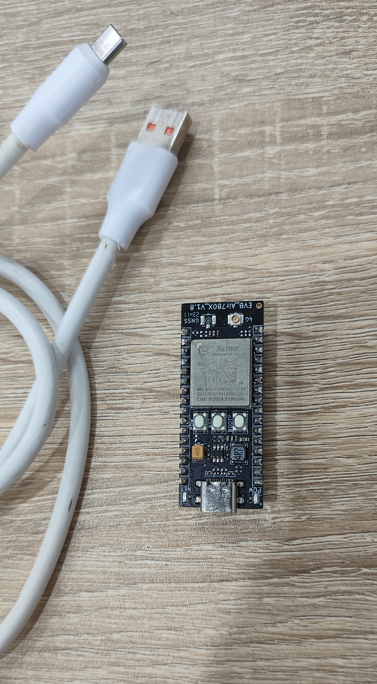
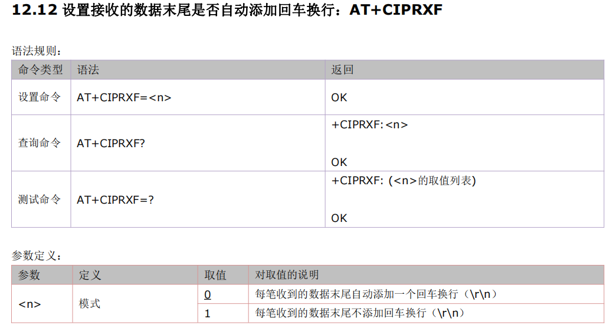
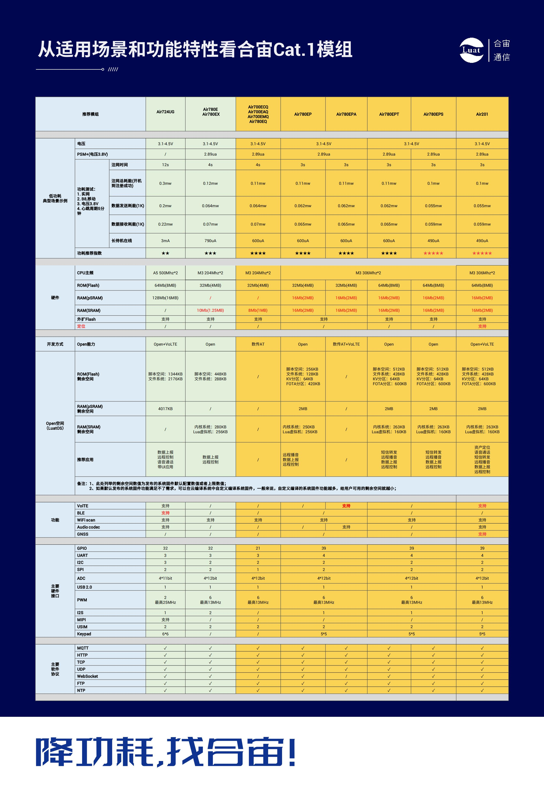

# Air780EP模块AT开发TCP/UDP应用指南

# 简介

> - 关联文档和使用工具：
>
>   - [AT固件获取](https://gitee.com/openLuat/airm2m-ec718-at/releases)
>   - [AT指令手册](https://doc.openluat.com/article/4985)
>

# 材料准备
- [EVB_Air780EP(V)]开发板一套，包括天线SIM卡
- USB线
- PC电脑
- 串口调试工具（如果没有准备，推荐可以使用llcom，下载地址：https://llcom.papapoi.com）
- AT固件获取：https://gitee.com/openLuat/airm2m-ec718-at/releases ，进页面按下Ctrl+F 搜索 **AirM2M_780EP_LTE_AT** 即可找到780EP模块所使用的AT固件，推荐选用该固件名称后面数字版本号最高的最新relase版本进行调试。
- 当前文档示例使用[AirM2M_780EP_V1007_LTE_AT版本固件](https://cdn.openluat-erp.openluat.com/erp_site_file/product_file/sw_file_20240422190620_AirM2M_780EP_V1007_LTE_AT.zip)

 

# TCP 示例
## 1.1 开机

开机以后通过串口循环发送AT直到收到OK

```
AT

OK
```


## 1.2 查询SIM卡状态
发送 **AT+CPIN?** 查询SIM卡状态，直到收到+CPIN: READY，模块主动上报SIM REMOVED和查询返回+CME ERROR: 10 是模块没有检测到SIM卡，如果10s内没有收到建议重启模块，如果重启问题依旧需要检查卡是否有插好，或者排查板子的硬件连接。

```
AT+CPIN?

+CPIN: READY

OK
```


## 1.3 查询模块信号强度
一般信号强度18以上才能稳定通讯；11-17能连接，会有断网的可能，10以下基本连接不上，在不能联网的情况下，可以先参考一下信号强度如何。

```
AT+CSQ

+CSQ: 19,0

OK

AT+CESQ

+CESQ: 99,99,255,255,31,41

OK
```


## 1.4 查询网络注册情况
**AT+CGATT?** 查询是否注册网络收到+CGATT: 1

值是1即为注册成功，正常情况下注册时间不会超过两分钟，如果超过两分钟没有注册可以进入飞行模式五秒后退出再查询，或者直接重启模块。
值是0则没有注册成功

```
AT+CGATT?

+CGATT: 1

OK
```

## 1.5 PDP激活和APN
公网卡，可以不指定APN，自动使用HSS中存储的默认公网APN
专网卡，必须指定正确的APN和鉴权参数

IP地址和APN通过AT+CGDCONT?查看

AT+CGDCONT?

+CGDCONT: 1,"IP","cmiot","10.74.149.48"

OK

## 1.6.1连接TCP

此处使用的是非SSL连接
TCP/UDP测试网页[TCP/UDP测试网页](https://netlab.luatos.com/)

使用AT+CIPSTART来建立连接

```
AT+CIPSTART="TCP","112.125.89.8",42795

OK

CONNECT OK
```

## 1.6.2连接UDP

此处使用的是非SSL连接
TCP/UDP测试网页[TCP/UDP测试网页](https://netlab.luatos.com/)

使用AT+CIPSTART来建立连接

```
AT+CIPSTART="UDP","112.125.89.8",42458

OK

CONNECT OK
```


## 1.7发送数据

AT+CIPSEND可以发送定长或不定长数据，收到>以后就可以发送数据（最大1460字节）。

如果是定长数据，输入数据达到长度会向服务器自动发送数据。

如果是不定长数据，输入数据后发送十六进制1A结束发送，发送完1A以后设备会向服务器发送1A之前的所有数据。

**定长数据，假设这里发送10个字节数据**

AT+CIPSEND=10	输入发送数据


可以看到调试网页已经接收到了数据


**不定长数据**
直接发送AT+CIPSEND，会返回一个>符号，之后可以输入数据，数据输入完毕后，发送十六进制的1A，结束发送，模块会将输入的数据发送到服务器

发送AT+CIPSEND后，可以看到返回了一个>，后续输入的内容没有返回值


此时再发送十六进制的1A来结束发送


返回了SEND OK


再看调试服务器网页，已经收到了刚才发送的数据


## 1.8  接收数据

当连接服务器成功以后，模块默认配置是服务器下发的数据会通过串口自动上报，直接就可以接收数据。

从调试网页发送数据到模块


可以看到模块收到了数据

**其他说明**

最新的AT固件支持开机直接发送AT+CIPSTART联网，不过不推荐使用，推荐根据状态机一步一步实现


# 2、TCP 使用SSL 示例


## 2.1  开机

通过拉低powerkey2秒进行开机，开机以后通过串口循环发送AT直到收到OK，如果90秒没有收到OK请拉低 RESET_IN_N 引脚 150ms 以上。或使用其他方法见模块硬件设计手册张开关机章节。

## 2.2  查询卡状态

**AT+CPIN?**查询卡状态，直到收到+CPIN: READY，如果10s内没有收到建议重启模块

## 2.3  查询网络注册情况

**AT+CGATT?**查询是否注册网络收到+CGATT: 1值是1即为注册成功，正常情况下注册时间不会超过两分钟，如果超过两分钟没有注册可以进入飞行模式五秒后退出再查询，或者直接重启模块。

## 2.4 配置连接

**AT+CIPMUX=0**设置为单链接模式

**AT+CIPQSEND=1**设置为快发

注意：这两条一定要在启用网络之前配置，不然会失败。

## 2.5 激活网络 

**AT+CSTT**配置网络，非私有APN以外Cat1的固件支持根据卡自动配置APN，直接输入AT+CSTT即可，模块会按照自动获取的APN设置CSTT的APN。

**AT+CIICR**激活网络，在IP START的状态使用AT+CIICR激活网络，激活以后通过**AT+CIFSR**查询是否获取IP，如果成功就可以开始配置TCP连接了，如果不成功使用AT+CIPSHUT关闭移动网络，从AT+CSTT重新进行。

## 2.6 配置连接 

**AT+CIPSSL=1**  开启SSL功能开关为开  

**AT+FSCREATE=”server.crt”**  创建CA 证书文件  

**AT+FSCREATE=”client.crt”**创建客户端证书文件

**AT+FSCREATE=”client.key”**创建客户端密钥文件

**AT+FSWRITE=”server.crt”,0,2080,15**文件长度2080只是举例，要根据实际填写。下同。

**AT+FSWRITE=”client.crt”, 0,128,10**输入客户端证书文件

**AT+FSWRITE=”client.key”,0,188,10**输入客户端密钥文件

**AT+SSLCFG=”cacert”,0, ”server.crt”**设置服务器CA 证书SSL 上下文id，在单链接的情况下缺省为0

**AT+SSLCFG=”clientcert”,0, ”client.crt”**设置客户端证书

**AT+SSLCFG=”clientkey”, 0,”client.key”**设置客户端KEY

**AT+SSLCFG=”seclevel”,0,2**设置安全等级

**AT+SSLCFG=”ciphersuite”,0,0X0035**设置加密套件

**AT+SSLCFG=”clientrandom”,0,101B12C3141516171F19202122232425262728293031323334353637**    设置随机数  

## 2.7 连接服务器

**AT+CIPSTART=TCP,tcplab.openluat.com,57513**  连接服务器，请使用自己服务器测试

**AT+CIPSEND=10**发送数据（确定长度）

**AT+CIPSHUT**关闭连接

**AT+CIPSSL=0**关闭SSL

# 3  指令报错的异常处理及示例说明

^MODE: 17,17

+E_UTRAN Service

+CGEV: ME PDN ACT 1

+NITZ: 24/07/23,08:35:01+32,0

//以上是模块开机后主动上报的数据
AT

OK

ATI

AirM2M_780EPV_V1007_LTE_AT

OK

AT+CPIN?

+CME ERROR: 10 //未检测到SIM卡，重新安装sim卡后，需要给模块复位重启才能识别到卡

AT+CPIN?

+CPIN: READY

OK

AT+CSQ

+CSQ: 20,0

OK

AT+CGATT?

+CGATT: 1

OK

AT+CEREG?

+CEREG: 0,1 

OK
//以上为主动查询模块的联网情况， 模块已经附着网络成功

AT+CIPMODE=0

OK   //设置TCPIP 应用模式为非透明传输模式

AT+CIPMUX=0

OK     //设置为单链接模式(默认是单路链接)

AT+CIPQSEND=1

OK    //设置非透传数据为快发送模式

AT+CSTT

OK    //启动任务并设置接入点 APN、用户名、密码(cat1模块内部有写APN，可以不需要设置，默认为空，专网卡、定向卡除外)

AT+CSTT

+CME ERROR: 3    //提示操作错误，相同的指令连续输入2次，会报这个错误，可以通过发

AT+CIPSHUT 关闭移动场景后，在输入此命令

AT+CIICRR

 ERROR  //激活移动场景 （出现这个指令错误，一般都是模块内部没有写这条指令或者指令输入错误）

AT+CIICR

+PDP: DEACT

+CME ERROR: 65535  //查询本地 IP 地址  （在模块附着网络失败后会出现此错误，可以通过AT+CGATT? 来查询，可以走断网异常流程来处理

AT+CIFSR

10.17.70.180

AT+CIPSTART=1,"TCP",”112.125.89.8“,37076

+CME ERROR: 3  //在单路链接的情况下，使用多路链接的指令会出现此错误

AT+CIPSTART="TCP",”112.125.89.8“,37076

OK

STATE: IP STATUS

CONNECT FAIL  //在联网正常的情况下，一直无法链接服务器，可以检查一下指令的符号是否有输入错误，使用中文的符号会导致异常

AT+CIPSTART="TCP","112.125.89.8",37076

OK

CONNECT OK     //链接成功

AT+CIPSEND
    >                    
  //出现此符号后才能发送数据，没有出现时发送数据会异常

666888  //输出数据后，输入HEX格式的大写  1A发送数据
DATA ACCEPT:8

AT+CIPSTATUS

OK
STATE: CONNECT OK  //查询链路状态

AT+CIPSHUT

SHUT OK    //关闭移动场景

#  5  常见问题

- (1) **连接服务器失败**
  1. 服务器必须是公网地址
  2. 使用PC上的TCP UDP测试工具客户端、或者mqtt.fx，连接服务器确认一下是否可以连接成功，排除 服务器故障
  3. 检查下模块信号、网络注册、网络附着、PDP激活状态
  4. 检查下SIM卡是否欠费

- (2)**最多同时支持多少个连接**
  AT版本最多8个连接

- (3) 关于"TCP单/多链接时，刚开始发送数据成功，服务器能收到,**间隔十几分钟，模块端AT+CIPSTATUS查询链接存在，AT+CIPSEND数据发送成功，但服务器却没收到数据**"问题
     用心跳包(HEARTCONFIG)来解决
     详细解释和AT示例，可参考链接[http://doc.openluat.com/shareArticle/9gI328ebaVFSr](http://doc.openluat.com/shareArticle/9gI328ebaVFSr "http://doc.openluat.com/shareArticle/9gI328ebaVFSr")
     
- (4)**780EP 模块tcp联网成功  每次开机都需要重新下发AT指令连接吗？**
  是的，模块不保存已输入AT指令

- (5)**模块上报PDP: DEACT ， 这个要怎么处理**
  4G模块会产生一个+PDP: DEACT的URC提示，出现此提示说明已经激活的PDP承载被网络端去激活了，此时仍然需要向4G模块发送AT+CIPSHUT命令主动关闭PDP，然后再重新激活，再重新连接TCP服务器。

- (6)**重试多次PDP一直激活失败**
  如果重试多次，PDP一直激活失败，则尝试使用如下手段恢复：
  1、使用RESET引脚复位模块
  2、极端情况下，直接给模块断电，再上电，POWER KEY引脚拉低开机

- (7) **如何发送心跳包**
  cat1模块如何发送心跳包[cat1模块如何发送心跳包](https://doc.openluat.com/article/1396 "cat1模块如何发送心跳包")

-  (8) **由数据透传状态转向命令状态，发+++切换不了**
发送时不要勾选回车换行

-  (9) **TCP调试网址**
https://netlab.luatos.com/

- (10) **当我连续发送几百个字节的数据的时候，在里面会夹杂0x0a0x0d这种，如何避免这个呢**
  通过AT+CIPRXF设置接收的数据末尾是否自动添加回车换行（网络连接前设置）

  

-  

-  (11)  **支持什么加密证书**
  支持证书配置，支持单向认证和双向认证
  支持如下六种加密套件：
  0X0035 TLS_RSA_WITH_AES_256_CBC_SHA
  0X002F TLS_RSA_WITH_AES_128_CBC_SHA
  0X0005 TLS_RSA_WITH_RC4_128_SHA
  0X0004 TLS_RSA_WITH_RC4_128_MD5
  0X000A TLS_RSA_WITH_3DES_EDE_CBC_SHA
  0X003D TLS_RSA_WITH_AES_256_CBC_SHA256
* (12)**数据发送接收缓存问题**
使用CIPSTART建立的socket连接，接收数据没有缓存机制，收到数据后，立即通过AT口输出，每包最多1460字节；例如服务器下发一个70KB的文件，模块会连续收到多个包，通过AT口连续多次输出，发送每包最多也为1460字节

----


> - 合宙支持AT功能的模组型号，除本文介绍的Air780EP外，
> - 还有Air780EPA、Air780E、Air780EX、Air724UG、Air201、Air780EQ、Air700ECQ、Air700EAQ、Air780EPT、Air780EPS等型号，
> - 本文介绍的TCP/UDP应用流程，同样也适用于这些型号。



