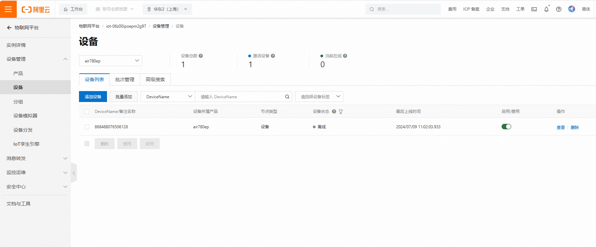
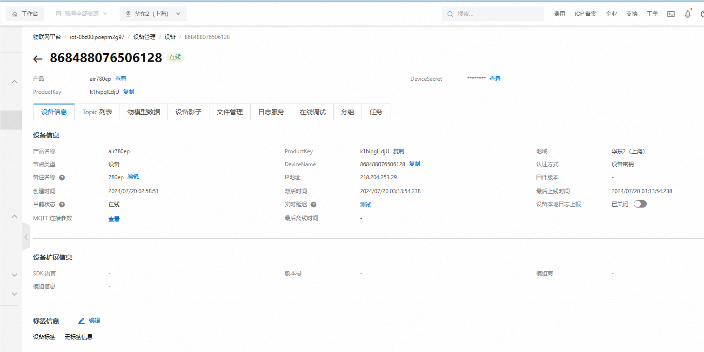
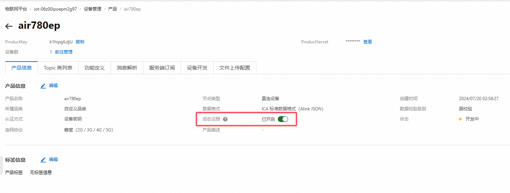
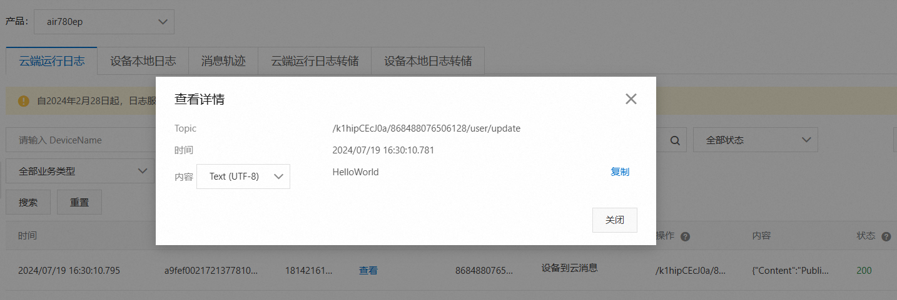
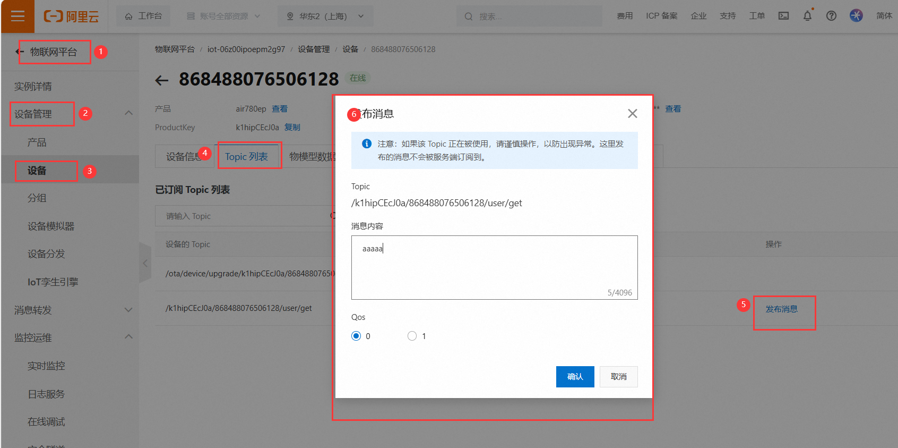

# Air780EP模块AT开发阿里云应用指南

# 简介

> 使用AT方式连接阿里云分为一机一密和一型一密两种方式，其中一机一密又包括HTTP认证二次连接和MQTT直连两种方式
>
> - 关联文档和使用工具：
>   - [AT固件获取](https://gitee.com/openLuat/airm2m-ec718-at/releases)
>   - [在线加/解密工具](http://encode.chahuo.com/)
>   - [阿里云平台](https://www.aliyun.com/)

# 准备工作

1. Air780EP_全IO开发板一套，包括天线SIM卡，USB线，并烧录AT固件

 

2. PC电脑，串口工具

3. 准备设备证书及产品证书
   
   **注意：下方证书信息仅为本教程使用，用户需要使用自己的证书信息**

```lua
--设备证书
{
  "ProductKey": "k1hipglLdjU",
  "DeviceName": "868488076506128",
  "DeviceSecret": "fef32adf6dad46c2c7cbf335d3a7b021"
}
--产品证书
{
    "ProductSecret": "8LQwOYSZMwp3DFBd",
    "ProductKey": "k1hipglLdjU"
}
```

# 阿里云操作

## 产品操作

打开[阿里云平台](https://www.aliyun.com/)找到**物联网平台**，开通业务后进入**控制台**。

点开**设备管理**的**产品页面**，点击**新建产品**。根据需求和图示说明创建产品。

[具体详细介绍见阿里云页面](https://help.aliyun.com/document_detail/73728.html?spm=a2c4g.11174283.6.571.3a8b1668Vmv5CZ)


## 设备操作

创建产品完成后就可以进入设备页面添加设备，在对应产品页面进入设备管理，按照提示添加设备

**（在做正式产品时建议使用imei为devicename，方便后期维护）**

[阿里云设备创建](https://help.aliyun.com/document_detail/73729.html?spm=a2c4g.11186623.6.573.55977b7bAjX04B)



# 连接阿里云

## 一机一密AT HTTP鉴权连接

- 首先需要使用HmacMD5计算哈希值用于签名，使用网址：[在线加/解密工具](http://encode.chahuo.com/)

```
明文： clientId868488076506128deviceName868488076506128productKeyk1hipglLdjU
秘钥： fef32adf6dad46c2c7cbf335d3a7b021
结果： 0f655b12adf519b9a7a2b0a990f398b6
```

- 拼接DOWNLOAD参数

```
productKey=k1hipglLdjU&sign=0f655b12adf519b9a7a2b0a990f398b6&clientId=868488076506128&deviceName=868488076506128
```

- AT交互流程如下所示

1. 激活网络

```
[03:09:17.105]发→◇AT+CGATT?
□
[03:09:17.106]收←◆AT+CGATT?

+CGATT: 1

OK

[03:09:24.575]发→◇AT+SAPBR=3,1,"CONTYPE","GPRS"
□
[03:09:24.579]收←◆AT+SAPBR=3,1,"CONTYPE","GPRS"

OK

[03:09:32.363]发→◇AT+SAPBR=3,1,"APN","CMIOT"
□
[03:09:32.365]收←◆AT+SAPBR=3,1,"APN","CMIOT"

OK

[03:09:38.899]发→◇AT+SAPBR=1,1
□
[03:09:38.901]收←◆AT+SAPBR=1,1

OK
```

2. 初始化HTTP

```
[03:09:43.901]发→◇AT+HTTPINIT
□
[03:09:43.903]收←◆AT+HTTPINIT

OK
```

3. 写入网址URL

```
[03:09:50.783]发→◇AT+HTTPPARA="URL",https://iot-auth.cn-shanghai.aliyuncs.com/auth/devicename
□
[03:09:50.786]收←◆AT+HTTPPARA="URL",https://iot-auth.cn-shanghai.aliyuncs.com/auth/devicename

OK
```

4. 设置本次请求的hearder，**注意"Content-type: " 后面有一个空格**

```
[03:09:57.667]发→◇AT+HTTPPARA="USER_DEFINED","Content-type: application/x-www-form-urlencoded"
□
[03:09:57.671]收←◆AT+HTTPPARA="USER_DEFINED","Content-type: application/x-www-form-urlencoded"

OK
```

5. 配置写入DOWNLOAD参数指令，**注意这个112是DOWNLOAD参数的数据长度（以字节为单位），实际使用时，要根据自己的数据长度进行修改，切记！！！ 待出现DOWNLOAD后发送通过前文计算拼接出来的DOWNLOAD参数**

```
[03:10:05.246]发→◇AT+HTTPDATA=112,20000
□
[03:10:05.249]收←◆AT+HTTPDATA=112,20000

DOWNLOAD
```

6. 写入DOWNLOAD参数，**注意最好自己复制这串数据，然后修改具体的值，不要全部手动输入，否则很容易出问题，切记！！！**

```
[03:10:10.735]发→◇productKey=k1hipglLdjU&sign=0f655b12adf519b9a7a2b0a990f398b6&clientId=868488076506128&deviceName=868488076506128
□
[03:10:10.740]收←◆
OK
```

7. HTTPACTION的信息上报，正常的话会回复状态码200

```
[03:10:16.378]发→◇AT+HTTPACTION=1
□
[03:10:16.381]收←◆AT+HTTPACTION=1

OK
```

8. 收到信息上报正常回复状态码200，收到返回数据长度为124

```
[03:10:18.025]收←◆
+HTTPACTION: 1,200,124
```

9. 读取请求结果，**注意，HTTPREAD返回的数据中有iotId和iotToken，其中iotId的值为MQTT client的用户名，iotToken的值为MQTT client的密码**

```
[03:10:51.867]发→◇AT+HTTPREAD
□
[03:10:51.870]收←◆AT+HTTPREAD

+HTTPREAD: 124
{"code":200,"data":{"iotId":"2BGmgWFvoXlbi1Er9sk4k1hip0","iotToken":"137eb0759ca248b79383a60c0b0e0f80"},"message":"success"}
OK
```

10. 配置连接阿里云，**注意，第一个值为clientId，第二个值为iotId，第三个值为iotToken**

```
[03:13:32.942]发→◇AT+MCONFIG="868488076506128","2BGmgWFvoXlbi1Er9sk4k1hip0","137eb0759ca248b79383a60c0b0e0f80"
□
[03:13:32.945]收←◆AT+MCONFIG="868488076506128","2BGmgWFvoXlbi1Er9sk4k1hip0","137eb0759ca248b79383a60c0b0e0f80"

OK
```

11. 建立连接，**注意，收到CONNECT OK后立刻发送指令建立会话，不然会被踢，一定注意！！！**

```lua
[03:13:51.493]发→◇AT+SSLMIPSTART="a1qsHBbKtmc.iot-as-mqtt.cn-shanghai.aliyuncs.com",1883
□
[03:13:51.496]收←◆AT+SSLMIPSTART="a1qsHBbKtmc.iot-as-mqtt.cn-shanghai.aliyuncs.com",1883

OK

[03:13:52.911]收←◆
CONNECT OK

[03:13:53.182]发→◇AT+MCONNECT=1,120
□
[03:13:53.185]收←◆AT+MCONNECT=1,120

OK

[03:13:53.434]收←◆
CONNACK OK
```

- 连接成功



## 一机一密AT直连MQTT

- 当设备属于公共实例，使用一型一密预注册认证方式时，动态注册参数如下：

```lua
mqttClientId: clientId+"|securemode=3,signmethod=hmacsha1,timestamp=132323232|"
mqttUsername: deviceName+"&"+productKey
mqttPassword: sign_hmac(deviceSecret,content)
```

| 参数         | 说明                                                         |
| :----------- | :----------------------------------------------------------- |
| clientId     | 客户端ID：长度在64个字符内，建议使用IMEI或SN码方便区分不同客户端 |
| securemode   | 安全模式： 2 (TLS直连模式），3 (TCP直连模式)                 |
| signmethod   | 表示签名算法类型。支持hmacmd5，hmacsha1，hmacsha256。默认为hmacmd5 |
| timestamp    | 表示当前时间毫秒值，可以不传递                               |
| mqttPassword | 前文计算的签名值                                             |

- AT交互流程如下所示

1. 配置MQTT参数

```
[03:51:26.001]发→◇AT+MCONFIG="868488076506128|securemode=3,signmethod=hmacmd5|","868488076506128&k1hipglLdjU","0f655b12adf519b9a7a2b0a990f398b6"
□
[03:51:26.004]收←◆AT+MCONFIG="868488076506128|securemode=3,signmethod=hmacmd5|","868488076506128&k1hipglLdjU","0f655b12adf519b9a7a2b0a990f398b6"

OK
```

2. 建立连接，**注意，第一个参数需要根据实际项目productKey修改**

```
[03:51:43.546]发→◇AT+SSLMIPSTART="k1hipglLdjU.iot-as-mqtt.cn-shanghai.aliyuncs.com",1883
□
[03:51:43.549]收←◆AT+SSLMIPSTART="k1hipglLdjU.iot-as-mqtt.cn-shanghai.aliyuncs.com",1883

OK
```

3. 建立会话，**注意，收到 CONNECT OK 后立刻发送指令建立会话，不然会被踢，一定注意！！！**

```
[03:51:45.836]收←◆
CONNECT OK

[03:51:48.961]发→◇AT+MCONNECT=1,120
□
[03:51:48.964]收←◆AT+MCONNECT=1,120

OK

[03:51:49.179]收←◆
CONNACK OK
```

## 一型一密AT方式连接

- 一型一密与一机一密的主要区别在于第一次连接的时候需要根据协议请求秘钥，首先需要在阿里云打开动态注册开关，如下图所示



- 使用到的参数如下所示

```lua
{
    "ProductSecret": "8LQwOYSZMwp3DFBd",
    "ProductKey": "k1hipglLdjU"
    "DeviceName" "868488076506128"
}

明文：deviceName868488076506128productKeyk1hipglLdjUrandom123456
秘钥：8LQwOYSZMwp3DFBd
HmacMD5计算结果：20558baadb2a0b04847767980f0ee67b

DOWNLOAD参数
--random 为随机数，长度不定
productKey=k1hipglLdjU&deviceName=868488076506128&random=123456&sign=20558baadb2a0b04847767980f0ee67b&signMethod=HmacMD5
```

- 当设备属于公共实例，使用一型一密预注册认证方式时，动态注册参数如下：

```lua
mqttClientId: clientId+"|securemode=2,authType=xxxx,random=xxxx,signmethod=xxxx|"
mqttUserName: deviceName+"&"+productKey
mqttPassword: sign_hmac(productSecret,content) 
```

- AT交互流程如下所示

1. 激活网络，**注意，先发送AT+CGATT?查询是否附着上GPRS数据网络，返回+CGATT: 1后，才能执行下面的三个 AT指令。**

```
[04:07:13.901]发→◇AT+CGATT?
□
[04:07:13.902]收←◆AT+CGATT?

+CGATT: 1

OK

[04:07:23.900]发→◇AT+SAPBR=3,1,"CONTYPE","GPRS"
□
[04:07:23.902]收←◆AT+SAPBR=3,1,"CONTYPE","GPRS"

OK

[04:07:31.245]发→◇AT+SAPBR=3,1,"APN","CMIOT"
□
[04:07:31.248]收←◆AT+SAPBR=3,1,"APN","CMIOT"

OK

[04:07:38.659]发→◇AT+SAPBR=1,1
□
[04:07:38.661]收←◆AT+SAPBR=1,1

OK
```

2. 初始化HTTP

```
[04:08:35.329]发→◇AT+HTTPINIT
□
[04:08:35.332]收←◆AT+HTTPINIT

OK
```

3. 写入网址URL

```
[04:08:44.056]发→◇AT+HTTPPARA="URL","https://iot-auth.cn-shanghai.aliyuncs.com/auth/register/device"
□
[04:08:44.061]收←◆AT+HTTPPARA="URL","https://iot-auth.cn-shanghai.aliyuncs.com/auth/register/device"

OK
```

4. 设置本次请求的hearder，**注意"Content-type: " 后面有一个空格**

```
[04:08:54.671]发→◇AT+HTTPPARA="USER_DEFINED","Content-Type: application/x-www-form-urlencoded"
□
[04:08:54.674]收←◆AT+HTTPPARA="USER_DEFINED","Content-Type: application/x-www-form-urlencoded"

OK
```

5. 配置写入DOWNLOAD参数指令，**注意这个120是DOWNLOAD参数的数据长度（以字节为单位），实际使用时，要根据自己的数据长度进行修改，切记！！！ 待出现DOWNLOAD后发送通过前文计算拼接出来的DOWNLOAD参数**

```
[04:09:11.437]发→◇AT+HTTPDATA=120,20000
□
[04:09:11.439]收←◆AT+HTTPDATA=120,20000

DOWNLOAD
```

6. 写入DOWNLOAD参数，**注意最好自己复制这串数据，然后修改具体的值，不要全部手动输入，否则很容易出问题，切记！！！**

```
[04:09:16.944]发→◇productKey=k1hipglLdjU&deviceName=868488076506128&random=123456&sign=20558baadb2a0b04847767980f0ee67b&signMethod=HmacMD5
□
[04:09:16.947]收←◆
OK
```

7. HTTPACTION的信息上报，正常的话会回复状态码200

```
[04:09:26.653]发→◇AT+HTTPACTION=1
□
[04:09:26.656]收←◆AT+HTTPACTION=1

OK
```

8. 收到信息上报正常回复状态码200，收到返回数据长度为149

```
[04:09:28.828]收←◆
+HTTPACTION: 1,200,149
```

9. 读取请求结果

```
[04:09:43.709]发→◇AT+HTTPREAD
□
[04:09:43.711]收←◆AT+HTTPREAD

+HTTPREAD: 149
{"code":200,"data":{"deviceName":"868488076506128","deviceSecret":"fef32adf6dad46c2c7cbf335d3a7b021","productKey":"k1hipglLdjU"},"message":"success"}
OK
```

# 发布与订阅消息

## 发布消息

- 发布Qos0消息

```
[04:58:06.798]发→◇AT+MPUB="/k1hipglLdjU/868488076506128/user/update",0,0,"HelloWorld"
□
[04:58:06.802]收←◆AT+MPUB="/k1hipglLdjU/868488076506128/user/update",0,0,"HelloWorld"

OK
```

- 发布Qos1消息，**注意，Qos1 消息必须等到PUBACK返回，才能发下一条消息**

```
[04:58:43.408]发→◇AT+MPUB="/k1hipglLdjU/868488076506128/user/update",1,0,"HelloWorld"
□
[04:58:43.412]收←◆AT+MPUB="/k1hipglLdjU/868488076506128/user/update",1,0,"HelloWorld"

OK

[04:58:43.709]收←◆
PUBACK
```

- 通过**物联网平台-监控运维-日志服务**可以直接查看日志信息



## 订阅消息

- 订阅主题

```
[05:01:58.568]发→◇AT+MSUB="/k1hipglLdjU/868488076506128/user/get",0
□
[05:01:58.572]收←◆AT+MSUB="/k1hipglLdjU/868488076506128/user/get",0

OK

[05:01:58.887]收←◆
SUBACK
```

- 设置收到数据时的打印方式
  配置为0时主动上报到串口，上报的 URC 为`+MSUB：<topic>,<len>,<message>`
  配置为1时为缓存模式。有新订阅消息时，上报的URC为 `+MSUB：<store_addr>`

```
[05:02:05.102]发→◇AT+MQTTMSGSET=0
□
[05:02:05.105]收←◆AT+MQTTMSGSET=0

OK
```

- 通过阿里云平台发布消息

