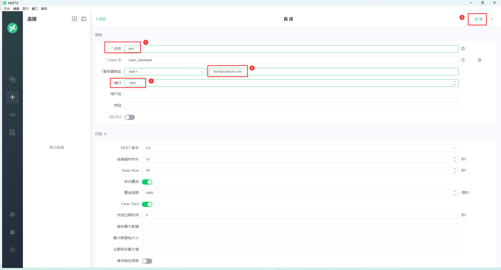
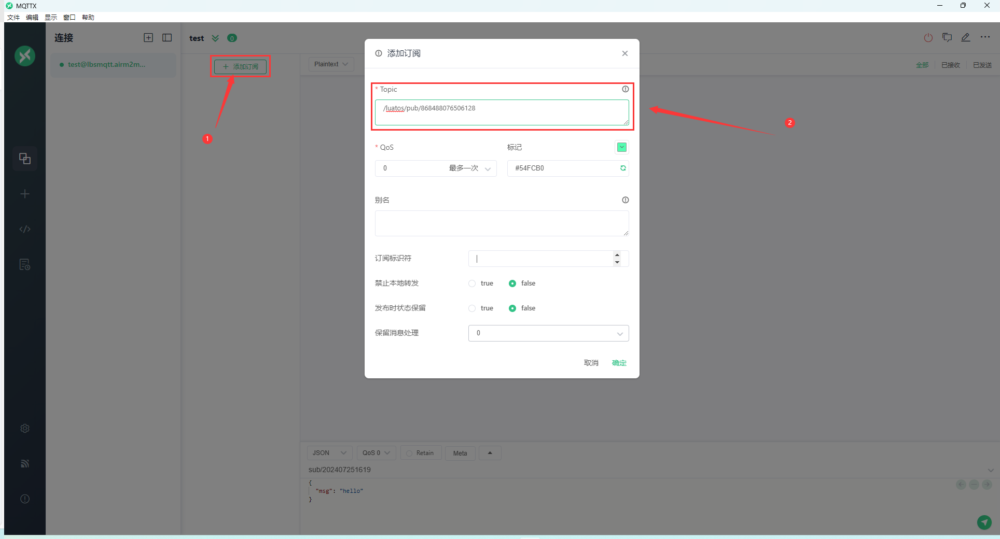
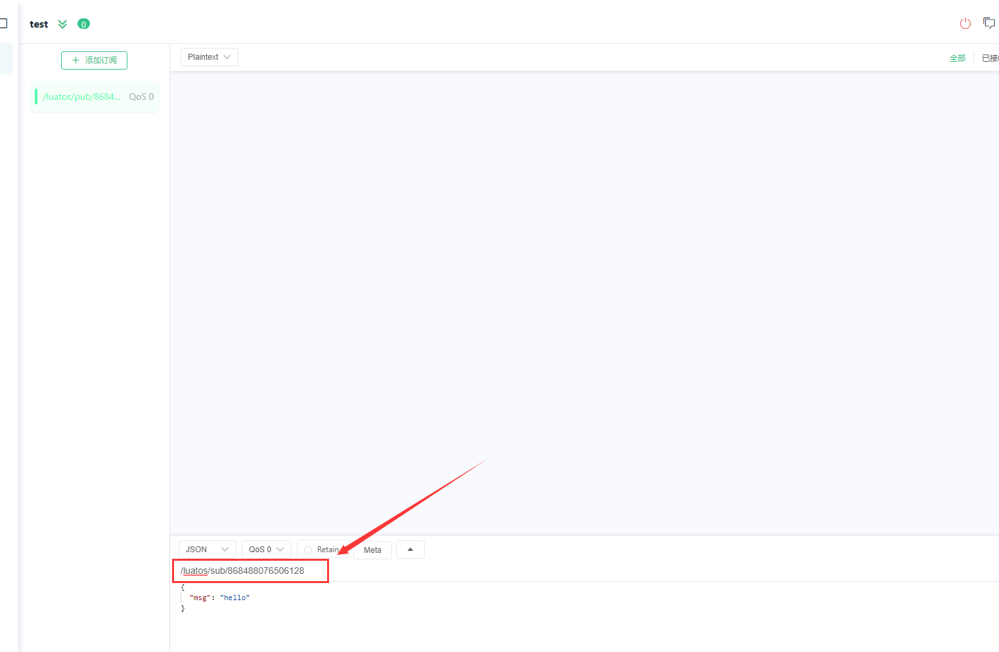
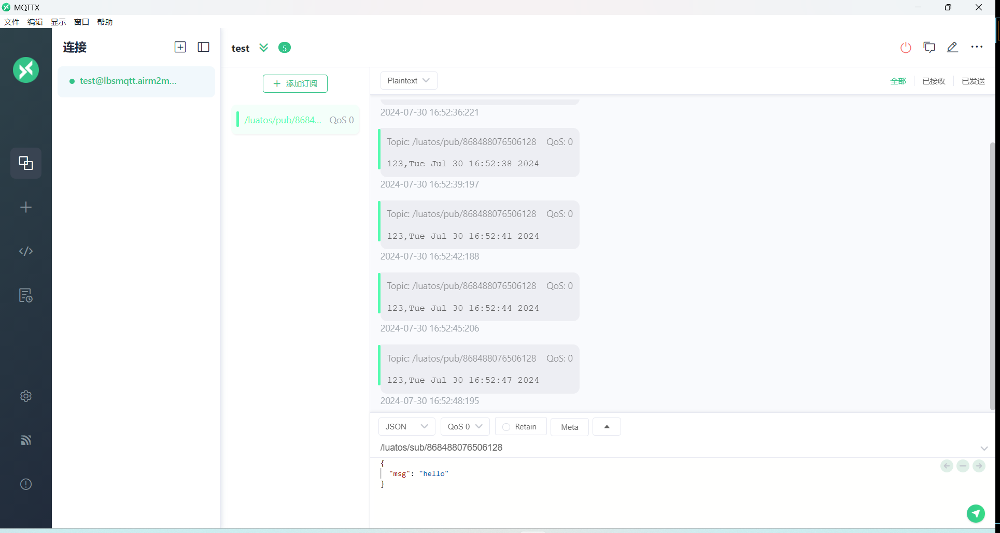
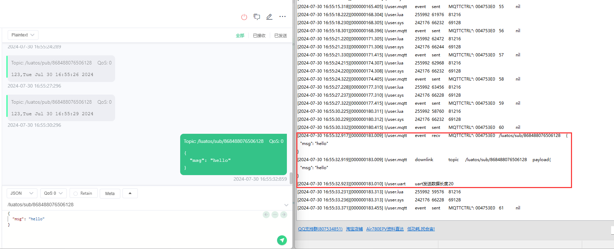
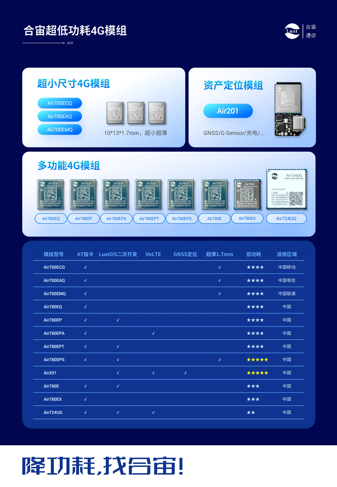

# 780EP_LuatOS_MQTT应用指南

## 简介

**优势**：长连接，低带宽，高可靠。

**实用场景**：需要服务器下发消息给设备，需要及时收到。例如，远程开关，充电桩等


## 材料准备

1. 780EP开发板一套，包括天线SIM卡，USB线
2. PC电脑，以及登录官方IOT后台 [https://iot.openluat.com/](https://gitee.com/link?target=https%3A%2F%2Fiot.openluat.com%2F)
3. 固件和DEMO下载地址 [LuatOS软件包](https://gitee.com/openLuat/LuatOS/releases)

 

## 名词解析

- **user_name**用户名，**password**密码，**client_id**用户标识，MQTT可以通过前两个参数保证连接的安全，通过client_id确保设备唯一性。
- **QOS**表示消息质量，分为0，1，2三个等级，分别表示只发一次，至少收到一次和只收到一次，通过QOS可以根据数据的重要性灵活选择发送方式以节省带宽和保证数据可靠。关于publish时QOS值的说明
  - QOS为0时，压入底层TCP发送堆栈，视为成功
  - QOS为1时，收到服务器回应PUBACK，视为成功
  - QOS为2时，收到服务器响应PUBREC，立即上行PUBCOMP压入TCP发送队列，视为成功
- **mqtt_host**主机，**mqtt_port**端口，MQTT需要连接的服务器参数。mqtt_host可以说是ip或者域名。
- **topic**主题，根据主题区别消息类型和来源，主要用来分类数据。同时mqtt是发布订阅模型，topic是发布和订阅者通信的重要通道。
- **payload**消息内容，发布和订阅的具体数据。
- **retain**保留消息，保留消息是一条将保留标志（retained flag）置为true的普通MQTT消息。broker会针对主题依照QoS级别保留最后一条保留消息，当订阅者订阅主题时会立即收到保留消息。broker仅为每个主题保留一条保留消息。

## API说明

| API接口             | 描述                    |
| :------------------ | ----------------------- |
| mqtt.create()       | 创建一个mqtt client实例 |
| mqttc:connect()     | 连接mqtt服务器          |
| mqttc:subscribe()   | 订阅主题                |
| mqttc:unsubscribe() | 取消订阅主题            |
| mqttc:publish()     | 发布消息                |
| mqttc:disconnect()  | 断开与服务器的连接      |

## 实现流程

### 1. 创建一个Task协程

**接口**

​	sys.taskInit(func, arg1, arg2, argN)

**参数**

| 传入值类型 | 解释                                                 |
| ---------- | ---------------------------------------------------- |
| function   | 待执行的函数,可以是匿名函数, 也可以是local或全局函数 |
| any        | 需要传递的参数1,可选                                 |
| any        | 需要传递的参数2,可选                                 |
| any        | 需要传递的参数N,可选                                 |

**返回值**

| 返回值类型 | 解释     |
| ---------- | -------- |
| task       | 协程对象 |

### 2. 等待网络就绪

### 3. 创建一个mqtt实例

**接口**

​	mqtt.create(adapter,host,port,ssl,isipv6)

**参数**	

| 传入值类型 | 解释                                                         |
| ---------- | ------------------------------------------------------------ |
| int        | 适配器序号, 只能是socket.ETH0, socket.STA, socket.AP,如果不填,会选择平台自带的方式,然后是最后一个注册的适配器 |
| string     | 服务器地址,可以是域名, 也可以是ip                            |
| int        | 端口号                                                       |
| bool/table | 是否为ssl加密连接,默认不加密,true为无证书最简单的加密，table为有证书的加密 server_cert 服务器ca证书数据 client_cert 客户端证书数据 client_key 客户端私钥加密数据 client_password 客户端私钥口令数据 verify 是否强制校验 0不校验/1可选校验/2强制校验 默认2 |
| bool/table | bool 是否为ipv6，默认不是 table mqtt扩展参数, ipv6 是否为ipv6, rxSize 接收缓冲区大小 |

**返回值**

| 返回值类型 | 解释                                   |
| ---------- | -------------------------------------- |
| userdata   | 若成功会返回mqtt客户端实例,否则返回nil |

### 4. 连接服务器

**接口**

​	mqttc:connect()

**参数**

​	无

**返回值**

| 返回值类型 | 解释                            |
| ---------- | ------------------------------- |
| boolean    | 发起成功返回true, 否则返回false |

**注意：**本函数仅代表发起成功, 后续仍需根据ready函数判断mqtt是否连接正常

### 5. 订阅主题

**接口**

​	mqttc:subscribe(topic, qos)

**参数**	

| 传入值类型   | 解释                            |
| ------------ | ------------------------------- |
| string/table | 主题                            |
| int          | topic为string时生效 0/1/2 默认0 |

**返回值**

| 返回值类型 | 解释                                              |
| ---------- | ------------------------------------------------- |
| int        | 消息id,当qos为1/2时有效, 若底层返回失败,会返回nil |

### 6. 发布消息

**接口**

​	mqttc:publish(topic, data, qos, retain)

**参数**

| 传入值类型 | 解释                    |
| ---------- | ----------------------- |
| string     | 主题,必填               |
| string     | 消息,必填,但长度可以是0 |
| int        | 消息级别 0/1 默认0      |
| int        | 是否存档, 0/1,默认0     |

**返回值**

| 返回值类型 | 解释                                                     |
| ---------- | -------------------------------------------------------- |
| int        | 消息id, 当qos为1或2时会有效值. 若底层返回是否, 会返回nil |

### 7. 接收消息

### 8. 断开服务器的连接

**接口**

​	mqttc:disconnect()

**参数**

​	无

**返回值**

| 返回值类型 | 解释                            |
| ---------- | ------------------------------- |
| boolean    | 发起成功返回true, 否则返回false |

## 示例

本文以**demo_lua\LuatOS\demo\mqtt**这个demo为例作为演示，以MQTTX工具来测试MQTT运行状况

1. 在MQTTX软件上建立连接
   

2. 在MQTTX软件上添加订阅

   **注意**：订阅主题格式要求默认为 /luatos/pub/ 加模块的IMEI号，例如 /luatos/pub/868488076506128

   

3. 设置MQTTX软件上发布消息的主题

​	**注意：**格式要求默认为 /luatos/sub/ 加模块的IMEI号，例如 /luatos/sub/868488076506128



4. 烧录脚本，上电开机后模块会自动向服务器发送消息，这是代码默认设置的，若不需要可以删掉

   

5. 模块向服务器发送消息，通过Luatools软件可以看到

   

## 代码分析

- 在代码开头部分，可根据自己的服务器修改指定的参数

  **注意：**user_name、password可填可不填

```lua
--根据自己的服务器修改以下参数
local mqtt_host = "lbsmqtt.airm2m.com"
local mqtt_port = 1884
local mqtt_isssl = false
local client_id = "abc"
local user_name = "user"
local password = "password"

local pub_topic = "/luatos/pub/" .. (mcu.unique_id():toHex())
local sub_topic = "/luatos/sub/" .. (mcu.unique_id():toHex())
```

- 此task实现的是mqtt的连接、订阅消息、发布消息的流程。
  - 要先等待网络就绪之后才可进行mqtt后续操作
  - 待网络就绪之后，根据代码编写情况此时client_id、pub_topic和sub_topic会发生变化，会覆盖掉代码开头部分时的配置，这点需要注意。device_id为模块的IMEI号

```lua
sys.taskInit(function()
    -- 等待联网
    local ret, device_id = sys.waitUntil("net_ready")
    -- 下面的是mqtt的参数均可自行修改
    client_id = device_id
    pub_topic = "/luatos/pub/" .. device_id
    sub_topic = "/luatos/sub/" .. device_id

    -- 打印一下上报(pub)和下发(sub)的topic名称
    -- 上报: 设备 ---> 服务器
    -- 下发: 设备 <--- 服务器
    -- 可使用mqtt.x等客户端进行调试
    log.info("mqtt", "pub", pub_topic)
    log.info("mqtt", "sub", sub_topic)

    -- 打印一下支持的加密套件, 通常来说, 固件已包含常见的99%的加密套件
    -- if crypto.cipher_suites then
    --     log.info("cipher", "suites", json.encode(crypto.cipher_suites()))
    -- end
    if mqtt == nil then
        while 1 do
            sys.wait(1000)
            log.info("bsp", "本bsp未适配mqtt库, 请查证")
        end
    end

    -------------------------------------
    -------- MQTT 演示代码 --------------
    -------------------------------------

    mqttc = mqtt.create(nil, mqtt_host, mqtt_port, mqtt_isssl, ca_file)

    mqttc:auth(client_id,user_name,password) -- client_id必填,其余选填
    -- mqttc:keepalive(240) -- 默认值240s
    mqttc:autoreconn(true, 3000) -- 自动重连机制

    mqttc:on(function(mqtt_client, event, data, payload)
        -- 用户自定义代码
        log.info("mqtt", "event", event, mqtt_client, data, payload)
        if event == "conack" then
            -- 联上了
            sys.publish("mqtt_conack")
            mqtt_client:subscribe(sub_topic)--单主题订阅
            -- mqtt_client:subscribe({[topic1]=1,[topic2]=1,[topic3]=1})--多主题订阅
        elseif event == "recv" then
            log.info("mqtt", "downlink", "topic", data, "payload", payload)
            sys.publish("mqtt_payload", data, payload)
        elseif event == "sent" then
            -- log.info("mqtt", "sent", "pkgid", data)
        -- elseif event == "disconnect" then
            -- 非自动重连时,按需重启mqttc
            -- mqtt_client:connect()
        end
    end)

    -- mqttc自动处理重连, 除非自行关闭
    mqttc:connect()
	sys.waitUntil("mqtt_conack")
    while true do
        -- 演示等待其他task发送过来的上报信息
        local ret, topic, data, qos = sys.waitUntil("mqtt_pub", 300000)
        if ret then
            -- 提供关闭本while循环的途径, 不需要可以注释掉
            if topic == "close" then break end
            mqttc:publish(topic, data, qos)
        end
        -- 如果没有其他task上报, 可以写个空等待
        --sys.wait(60000000)
    end
    mqttc:close()
    mqttc = nil
end)
```

- 此task的功能为模块每3秒向服务器发送一次数据

```lua
-- 这里演示在另一个task里上报数据, 会定时上报数据,不需要就注释掉
sys.taskInit(function()
    sys.wait(3000)
	local data = "123,"
	local qos = 1 -- QOS0不带puback, QOS1是带puback的
    while true do
        sys.wait(3000)
        if mqttc and mqttc:ready() then
            local pkgid = mqttc:publish(pub_topic, data .. os.date(), qos)
            -- local pkgid = mqttc:publish(topic2, data, qos)
            -- local pkgid = mqttc:publish(topic3, data, qos)
        end
    end
end)
```

- 此代码可实现mqtt-uart透传，利用串口工具给服务器发消息或者接收来着服务器的消息
  - 注意要使用串口1，且波特率为9600

```lua
-- 以下是演示与uart结合, 简单的mqtt-uart透传实现,不需要就注释掉
local uart_id = 1
uart.setup(uart_id, 9600)
uart.on(uart_id, "receive", function(id, len)
    local data = ""
    while 1 do
        local tmp = uart.read(uart_id)
        if not tmp or #tmp == 0 then
            break
        end
        data = data .. tmp
    end
    log.info("uart", "uart收到数据长度", #data)
    sys.publish("mqtt_pub", pub_topic, data)
end)
sys.subscribe("mqtt_payload", function(topic, payload)
    log.info("uart", "uart发送数据长度", #payload)
    uart.write(1, payload)
end)
```

----

> 合宙支持LuatOS功能的模组型号，除本文介绍的Air780EP外，
> 还有Air780EPA、Air780E、Air780EX、Air201、Air780EPT、Air780EPS等型号，
> 本文介绍的MQTT应用流程，同样也适用于这些型号。




