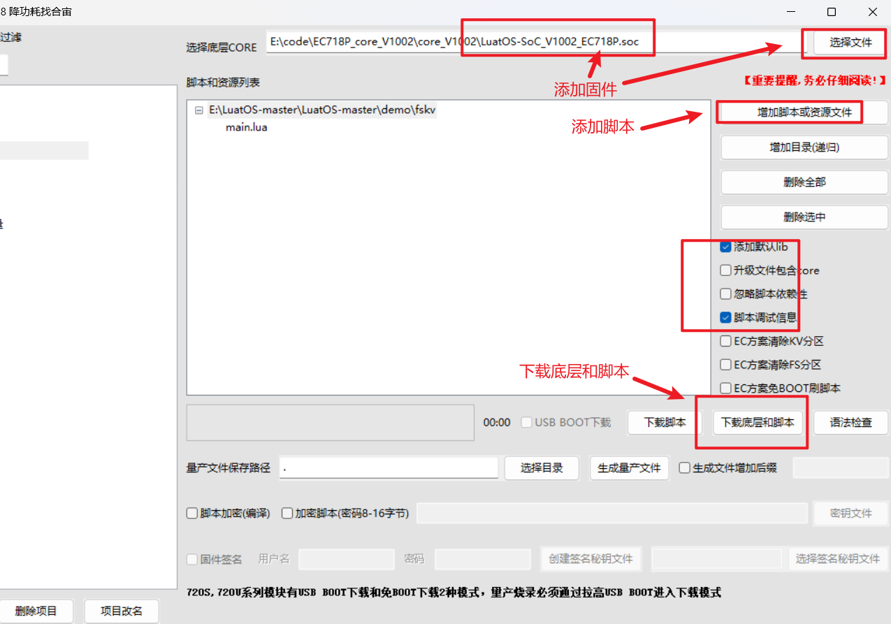
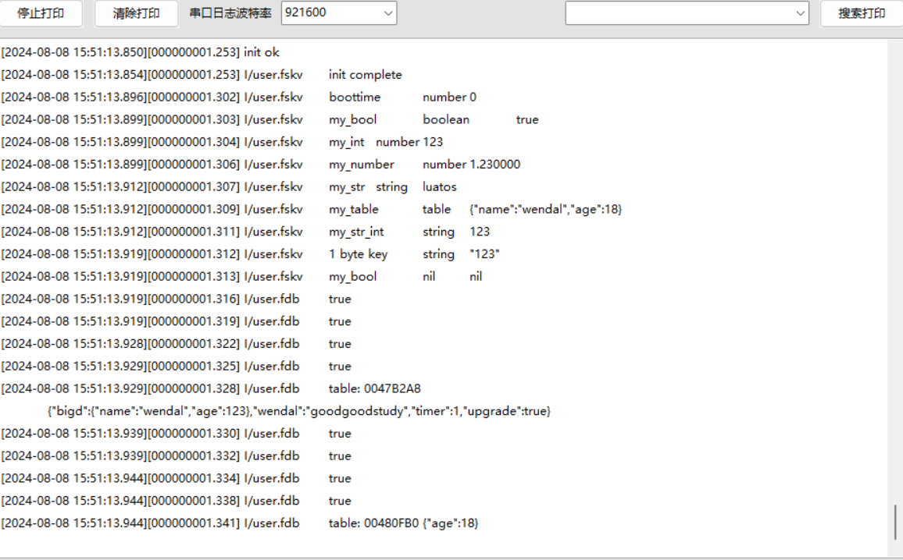

#  Air780EP模块fskv开发示例

## 简介

- 兼容fdb的函数

- 使用fdb的flash空间,启用时也会替代fdb库
- 功能上与EEPROM是类似的

### fskv与fdb的实现机制导致的差异

| 功能             | fskv | fdb                   |
| ---------------- | ---- | --------------------- |
| value长度        | 4096 | 255                   |
| key长度          | 63   | 64                    |
| 空间利用率(对比) | 较低 | 较高                  |
| 读取速度         | 恒定 | 脏数据影响速度,非恒定 |
| 写入数据         | 恒定 | 脏数据影响速度,非恒定 |
| 均衡擦除         | 自动 | 自动                  |

### 1、环境准备

1、780EP开发板一套

## 程序介绍

### API介绍

详细API介绍见：[fskv-API](https://wiki.luatos.com/api/fskv.html#fskv-init)

#### 初始化kv数据库

fskv.init()

**参数**

无

**返回值**

| 返回值类型 | 解释                       |
| ---------- | -------------------------- |
| boolean    | 成功返回true,否则返回false |

#### 设置一对kv数据

fskv.set(key, value)

**参数**

| 传入值类型 | 解释                                                         |
| ---------- | ------------------------------------------------------------ |
| string     | key的名称,必填,不能空字符串                                  |
| string     | 用户数据,必填,不能nil, 支持字符串/数值/table/布尔值, 数据长度最大4095字节 |

**返回值**

| 返回值类型 | 解释                       |
| ---------- | -------------------------- |
| boolean    | 成功返回true,否则返回false |

#### 设置table内的键值对数据

fskv.sett(key, skey, value)

**参数**

| 传入值类型 | 解释                                                         |
| ---------- | ------------------------------------------------------------ |
| string     | key的名称,必填,不能空字符串                                  |
| string     | table的key名称, 必填, 不能是空字符串                         |
| string     | 用户数据,必填,支持字符串/数值/table/布尔值, 数据长度最大4095字节 |

**返回值**

| 返回值类型 | 解释                           |
| ---------- | ------------------------------ |
| boolean    | 成功返回true,否则返回false/nil |

#### 根据key获取对应的数据

fskv.get(key, skey)

**参数**

| 传入值类型 | 解释                                                         |
| ---------- | ------------------------------------------------------------ |
| string     | key的名称,必填,不能空字符串                                  |
| string     | 可选的次级key,仅当原始值为table时有效,相当于 fskv.get(key)[skey] |

**返回值**

| 返回值类型 | 解释                       |
| ---------- | -------------------------- |
| any        | 存在则返回数据,否则返回nil |

#### 根据key删除数据

fskv.del(key)

**参数**

| 传入值类型 | 解释                        |
| ---------- | --------------------------- |
| string     | key的名称,必填,不能空字符串 |

**返回值**

| 返回值类型 | 解释                       |
| ---------- | -------------------------- |
| bool       | 成功返回true,否则返回false |

#### 清空整个kv数据库

fskv.clear()

**参数**

无

**返回值**

| 返回值类型 | 解释                       |
| ---------- | -------------------------- |
| bool       | 成功返回true,否则返回false |

#### kv数据库迭代器

fskv.iter()

**参数**

无

**返回值**

| 返回值类型 | 解释                           |
| ---------- | ------------------------------ |
| userdata   | 成功返回迭代器指针,否则返回nil |

#### kv迭代器获取下一个key

fskv.next(iter)

**参数**

| 传入值类型 | 解释                  |
| ---------- | --------------------- |
| userdata   | fskv.iter()返回的指针 |

**返回值**

| 返回值类型 | 解释                             |
| ---------- | -------------------------------- |
| string     | 成功返回字符串key值, 否则返回nil |

#### 获取kv数据库状态

fskv.status()

**参数**

无

**返回值**

| 返回值类型 | 解释                   |
| ---------- | ---------------------- |
| int        | 已使用的空间,单位字节  |
| int        | 总可用空间, 单位字节   |
| int        | 总kv键值对数量, 单位个 |

## 实现流程

### 使用luatools工具下载固件和脚本到开发板中

### 通过luatools打印查看效果：

由上图可以看出，fskv支持存放布尔，数值，小数，字符串，等均可。还可以存放table类型的值。
但不能存放nil, function, userdata, task类型的值。

## 常见问题：

### NVM坏了的话会不会影响fskv存储？

不同的flash互不影响。

