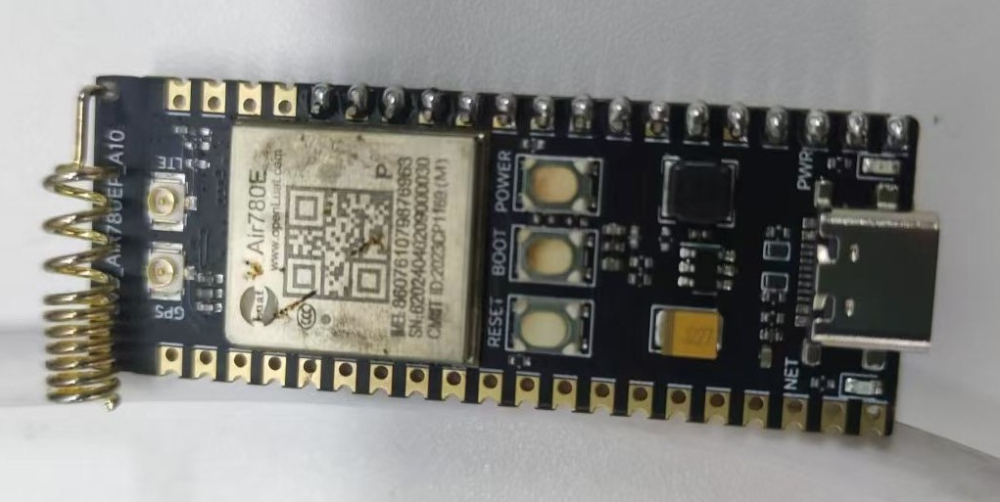
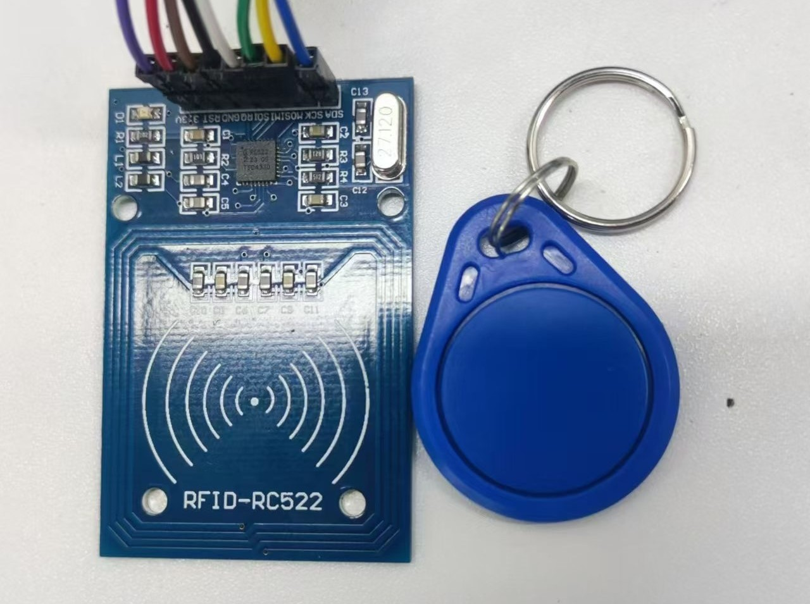
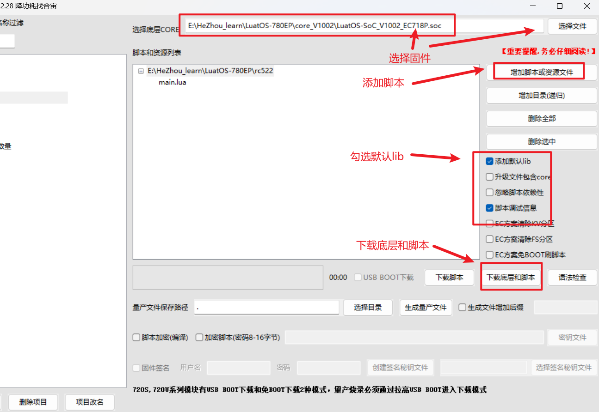
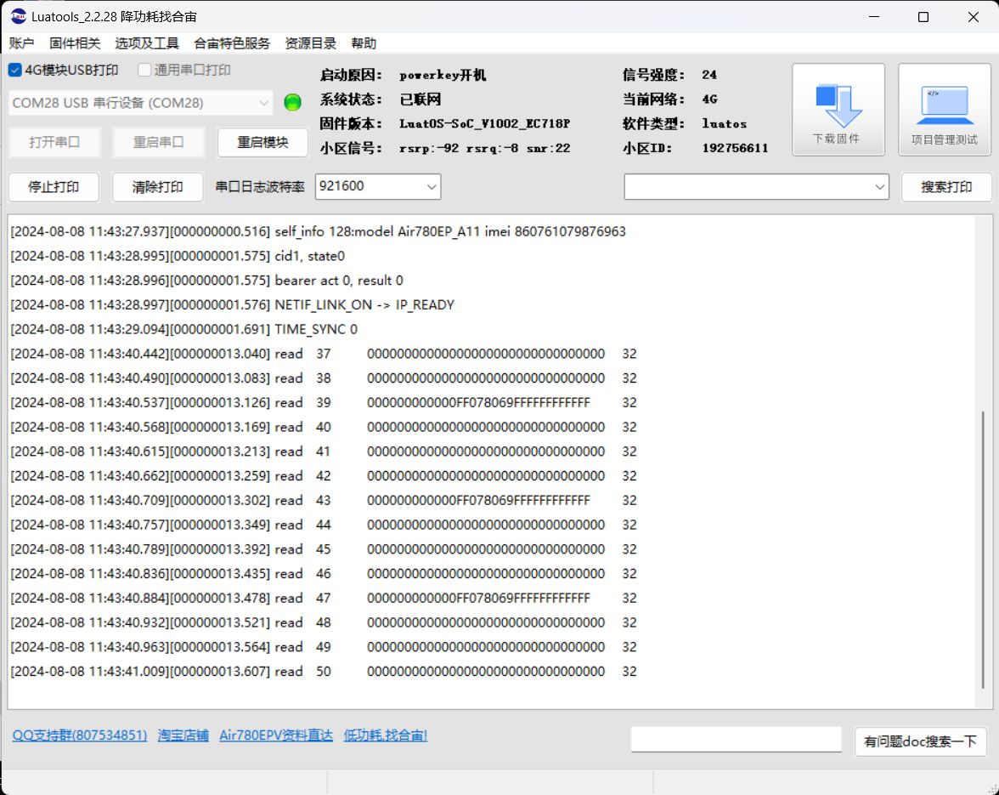

# 4G模组Air780EP开发板RC522实例

- 本文档适用于780EP开发板
- 关联文档和使用工具

  - [LuatOS-Soc固件获取](https://gitee.com/openLuat/LuatOS/releases)
  - [rc522 - rc522 非接触式读写卡驱动 - LuatOS 文档](https://wiki.luatos.com/api/libs/rc522.html)
  - [Luatools下载调试工具](https://gitee.com/openLuat/luatos-doc-pool/blob/master/doc/%E5%BC%80%E5%8F%91%E5%B7%A5%E5%85%B7%E5%8F%8A%E4%BD%BF%E7%94%A8%E8%AF%B4%E6%98%8E/Luatools%E4%B8%8B%E8%BD%BD%E8%B0%83%E8%AF%95%E5%B7%A5%E5%85%B7.md)
## 1、环境准备

1、780EP开发板一套



2、rc522实物一个



## 2、程序详解

### API说明

#### 1、设置并启用SPI

spi.setup(id, cs, CPHA, CPOL, dataw, bandrate, bitdict, ms, mode)

**参数**

| 传入值类型 | 解释                                             |
| ---------- | ------------------------------------------------ |
| int        | SPI号,例如0                                      |
| int        | CS 片选脚,在w600不可用请填nil                    |
| int        | CPHA 默认0,可选0/1                               |
| int        | CPOL 默认0,可选0/1                               |
| int        | 数据宽度,默认8bit                                |
| int        | 波特率,默认2M=2000000                            |
| int        | 大小端, 默认spi.MSB, 可选spi.LSB                 |
| int        | 主从设置, 默认主1, 可选从机0. 通常只支持主机模式 |
| int        | 工作模式, 全双工1, 半双工0, 默认全双工           |

**返回值**

| 返回值类型 | 解释                     |
| ---------- | ------------------------ |
| int        | 成功返回0,否则返回其他值 |

#### 2、rc522初始化

rc522.init(spi_id, cs, rst)

**参数**

| 传入值类型 | 解释             |
| ---------- | ---------------- |
| number     | spi_id spi端口号 |
| number     | cs cs引脚        |
| number     | rst rst引脚      |

**返回值**

| 返回值类型 | 解释       |
| ---------- | ---------- |
| bool       | 初始化结果 |

#### 3、按照rc522操作流程写入16字节数据到块

rc522.write_datablock(addr,data)

**参数**

| 传入值类型 | 解释                                                         |
| ---------- | ------------------------------------------------------------ |
| number     | addr 任意块地址.M1卡总共有16个扇区(每个扇区有：3个数据块+1个控制块),共64个块 |
| table      | data 指向要写入的数据,必须为16个字符                         |

**返回值**

| 返回值类型 | 解释 |
| ---------- | ---- |
| bool       | 结果 |

#### 4、按照rc522操作流程读取块

rc522.read_datablock(addr)

**参数**

| 传入值类型 | 解释                                                         |
| ---------- | ------------------------------------------------------------ |
| number     | addr 任意块地址.M1卡总共有16个扇区(每个扇区有：3个数据块+1个控制块),共64个块 |

**返回值**

| 返回值类型 | 解释             |
| ---------- | ---------------- |
| bool       | string 结果 数据 |

### 调用程序实例

```lua
--[[
@module rc522
@summary rc522 非接触式读写卡驱动
]]
local rc522 = require "rc522"
sys.taskInit(function()
    spi_rc522 = spi.setup(0,nil,0,0,8,10*1000*1000,spi.MSB,1,0)
    rc522.init(0,8,35)
    wdata = {0x01,0x00,0x00,0x00,0x00,0x00,0x00,0x00,0x00,0x00,0x00,0x00,0x00,0x00,0x00,0x00}
    while 1 do
        rc522.write_datablock(8,wdata)
        for i=0,63 do
            local a,b = rc522.read_datablock(i)
            if a then
                print("read",i,b:toHex())
            end
        end
        sys.wait(500)
    end
end)
```


## 实现流程

### 接线

| RC522管脚 | Air780E管脚            |
| --------- | ---------------------- |
| SDA       | SPI_CS                 |
| SCK       | SPI_SCLK               |
| MOSI      | SPI_MOSI               |
| MISO      | SPI_MISO               |
| RST       | 随意，这里接的是GPIO35 |

### 程序下载



### 运行效果



## 代码分析

先初始化spi接口，然后初始化rc522，再然后就可以按照rc522的流程去进行寄存器的读写操作了。

```lua
-- 因为是扩展库，所以使用时需要require
local rc522 = require "rc522"
-- 使用了sys.wait()，所以程序要在sys.taskInit里调用
sys.taskInit(function()
    -- 设置spi接口
    spi_rc522 = spi.setup(0,nil,0,0,8,10*1000*1000,spi.MSB,1,0)
    -- 初始化rc522，参数有spi的id号，cs引脚的io号，ret引脚的io号
    rc522.init(0,8,35)
    -- 存储要发送的16k字节数据
    wdata = {0x01,0x00,0x00,0x00,0x00,0x00,0x00,0x00,0x00,0x00,0x00,0x00,0x00,0x00,0x00,0x00}
    while 1 do
        -- 按照rc522操作流程写入16字节数据到块
        rc522.write_datablock(8,wdata)
        for i=0,63 do
            -- 按照rc522操作流程读取块
            local a,b = rc522.read_datablock(i)
            if a then
                -- 打印读取到的数据
                print("read",i,b:toHex())
            end
        end
        sys.wait(500)
    end
end)
```


