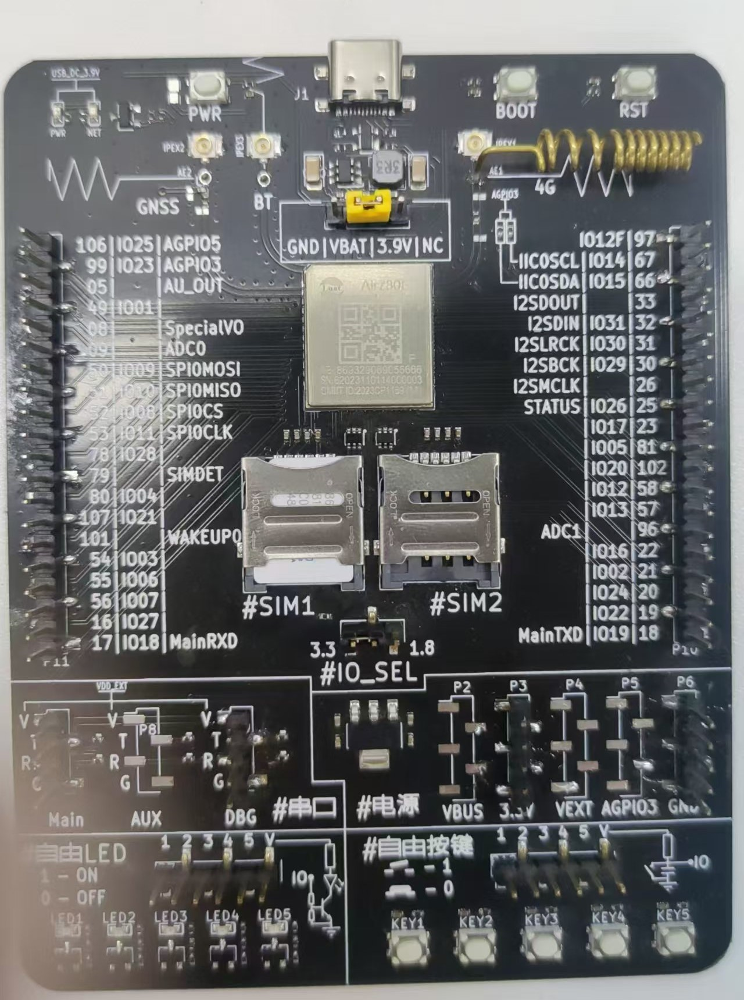
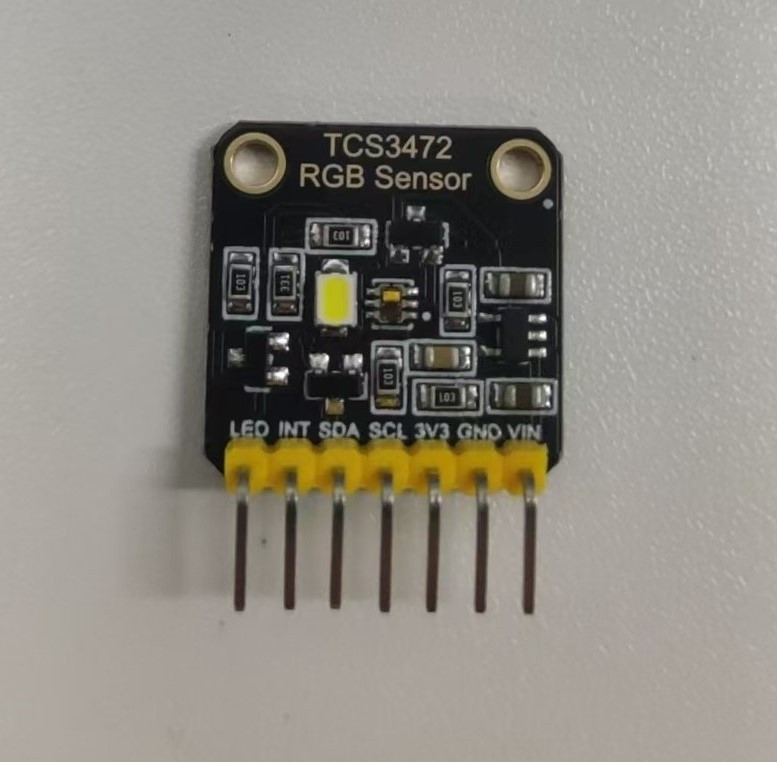
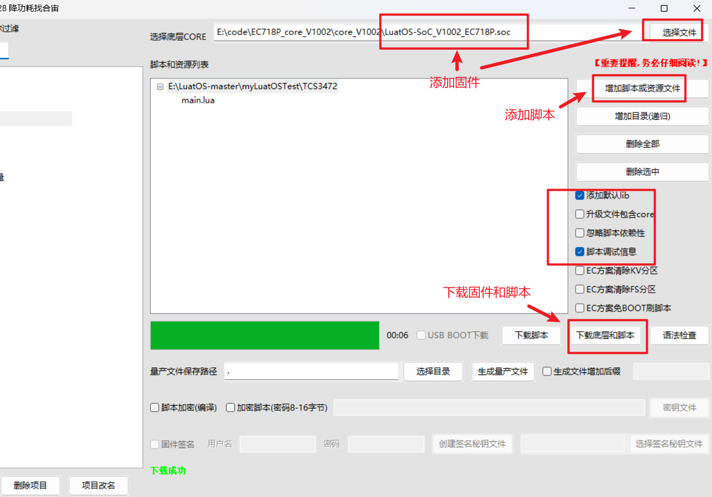
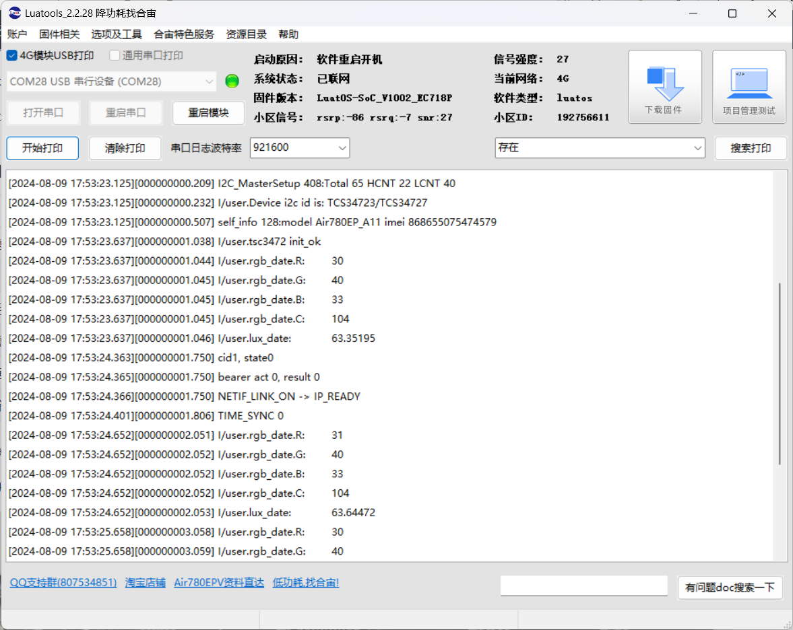

# Air780EP模块LuatOS开发tcs3472开发指南

## 简介

tcs3472颜色传感器能够读取照射到的物体的RGB三种数值，从而识别颜色

- 关联文档和使用工具：

  - [LuatOS 固件获取](https://gitee.com/openLuat/LuatOS/releases)

  - [tcs3472 颜色传感器接口说明](https://wiki.luatos.com/api/libs/tcs3472.html)

  - [Luatools下载调试工具](https://gitee.com/openLuat/luatos-doc-pool/blob/master/doc/开发工具及使用说明/Luatools下载调试工具.md)

## 材料准备

1、Air780EP开发板一套



2、tcs3472模块一个



## 程序介绍

### API说明

#### tcs3472初始化

tcs3472.init(i2c_id)

**参数**

| 传入值类型 | 解释            |
| ---------- | --------------- |
| number     | 所在的i2c总线id |

**返回值**

| 返回值类型 | 解释         |
| ---------- | ------------ |
| bool       | 成功返回true |

#### 获取RGB的数据

tcs3472.get_rgb()

**参数**

无

**返回值**

| 返回值类型 | 解释            |
| ---------- | --------------- |
| table      | tcs3472 rgb数据 |

#### 获取lux的数据

tcs3472.get_lux()

**参数**

| 传入值类型 | 解释             |
| ---------- | ---------------- |
| table      | rgb_data rgb数据 |

**返回值**

| 返回值类型 | 解释    |
| ---------- | ------- |
| number     | lux数据 |

#### 常量

| 常量     | 类型   | 解释 |
| -------- | ------ | ---- |
| i2c.FAST | number | 高速 |
| i2c.SLOW | number | 低速 |

#### i2c初始化

i2c.setup(id, speed, pullup)

**参数**

| 传入值类型 | 解释                                   |
| ---------- | -------------------------------------- |
| int        | 设备id, 例如i2c1的id为1, i2c2的id为2   |
| int        | I2C速度, 例如i2c.FAST                  |
| bool       | 是否软件上拉, 默认不开启，需要硬件支持 |

**返回值**

| 返回值类型 | 解释                  |
| ---------- | --------------------- |
| int        | 成功就返回1,否则返回0 |

### 实现示例

#### main.lua中程序实例

```lua
-- LuaTools需要PROJECT和VERSION这两个信息
PROJECT = "tcs3472"
VERSION = "1.0.0"
-- sys库是标配
_G.sys = require("sys")
--[[
    -- 780EP的IO14与IO15引脚默认是i2cid = 1，
    -- 如果想当做i2cid = 0使用，可以打开复用
    mcu.altfun(mcu.I2C,0,13,2,0)
    mcu.altfun(mcu.I2C,0,14,2,0)
]]
-- tcs3472 颜色传感器
-- 注意:因使用了sys.wait()所有api需要在协程中使用
--[[
    接线示例
    780EP       TCS3472
    IO14        SCL
    IO15        SDA
]]
local tcs3472 = require "tcs3472"
i2cid = 1
i2c_speed = i2c.FAST
sys.taskInit(function()
    i2c.setup(i2cid,i2c_speed)
    tcs3472.init(i2cid)--初始化,传入i2c_id
    while 1 do
        local rgb_date = tcs3472.get_rgb()
        log.info("rgb_date.R:",rgb_date.R)
        log.info("rgb_date.G:",rgb_date.G)
        log.info("rgb_date.B:",rgb_date.B)
        log.info("rgb_date.C:",rgb_date.C)
        local lux_date = tcs3472.get_lux(rgb_date)
        log.info("lux_date:",lux_date)
        sys.wait(1000)
    end
end)

-- 用户代码已结束---------------------------------------------
-- 结尾总是这一句
sys.run()
```

#### 1、创建一个Task协程

```lua
sys.taskInit(function() end)
```

#### 2、初始化i2c

```lua
-- 初始化i2c1，传入id号和速度
i2c.setup(i2cid,i2c_speed) -- id正确就一定成功
-- 如需判断i2c id是否合法, 请使用 i2c.exist 函数
```

#### 3、初始化tcs3472

```lua
tcs3472.init(i2cid)--初始化,传入i2c_id
```

#### 4、读取rgb和lux值并打印

```lua
		local rgb_date = tcs3472.get_rgb()
        log.info("rgb_date.R:",rgb_date.R)
        log.info("rgb_date.G:",rgb_date.G)
        log.info("rgb_date.B:",rgb_date.B)
        log.info("rgb_date.C:",rgb_date.C)
        local lux_date = tcs3472.get_lux(rgb_date)
        log.info("lux_date:",lux_date)
```

## 效果展示

### 1、下载固件和脚本



### 2、在Luatools工具中查看效果




