# 780E开发板ctwing实例

- 本文档适用于780E开发板
- 关联文档和使用工具

  - [LuatOS-Soc固件获取](https://gitee.com/openLuat/LuatOS/releases)
  - [ctwing-demo](https://gitee.com/openLuat/LuatOS/tree/master/demo/ctwing)
  - [Luatools下载调试工具](https://gitee.com/openLuat/luatos-doc-pool/blob/master/doc/%E5%BC%80%E5%8F%91%E5%B7%A5%E5%85%B7%E5%8F%8A%E4%BD%BF%E7%94%A8%E8%AF%B4%E6%98%8E/Luatools%E4%B8%8B%E8%BD%BD%E8%B0%83%E8%AF%95%E5%B7%A5%E5%85%B7.md)
  - [ctwing网站](https://www.ctwing.cn/)
## 1、环境准备

1、780E开发板一套

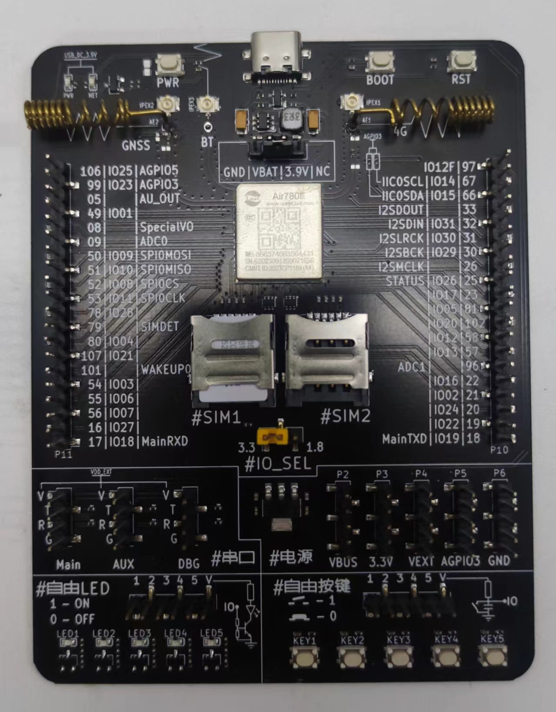

可用的SIM卡一张


## 2、程序介绍

### API说明

| API接口                  | 描述                         |
| :----------------------- | ---------------------------- |
| mqtt.create()            | 创建一个mqtt client实例      |
| mqtt_client:auth()       | mqtt三元组配置及cleanSession |
| mqtt_client:keepalive()  | mqtt心跳设置                 |
| mqtt_client:autoreconn() | 自动重连                     |
| mqtt_client:on()         | 注册mqtt回调                 |
| mqtt_client:connect()    | 连接mqtt服务器               |
| mqtt_client:subscribe()  | 订阅主题                     |
| mqtt_client:publish()    | 发布消息                     |
| mqtt_client:close()      | mqtt客户端关闭               |

### 实现流程

#### 1. 创建一个Task协程

**接口**

	sys.taskInit(func, arg1, arg2, argN)

**参数**

| 传入值类型 | 解释                                                 |
| ---------- | ---------------------------------------------------- |
| function   | 待执行的函数,可以是匿名函数, 也可以是local或全局函数 |
| any        | 需要传递的参数1,可选                                 |
| any        | 需要传递的参数2,可选                                 |
| any        | 需要传递的参数N,可选                                 |

**返回值**

| 返回值类型 | 解释     |
| ---------- | -------- |
| task       | 协程对象 |

#### 2. 获取网络状态

**接口**

```lua
mobile.status()
```

**参数**

无

**返回值**

| 返回值类型 | 解释         |
| ---------- | ------------ |
| int        | 当前网络状态 |

#### 3. 创建一个mqtt实例

**接口**

	mqtt.create(adapter,host,port,ssl,isipv6)

**参数**	

| 传入值类型 | 解释                                                         |
| ---------- | ------------------------------------------------------------ |
| int        | 适配器序号, 只能是socket.ETH0, socket.STA, socket.AP,如果不填,会选择平台自带的方式,然后是最后一个注册的适配器 |
| string     | 服务器地址,可以是域名, 也可以是ip                            |
| int        | 端口号                                                       |
| bool/table | 是否为ssl加密连接,默认不加密,true为无证书最简单的加密，table为有证书的加密 server_cert 服务器ca证书数据 client_cert 客户端证书数据 client_key 客户端私钥加密数据 client_password 客户端私钥口令数据 verify 是否强制校验 0不校验/1可选校验/2强制校验 默认2 |
| bool/table | bool 是否为ipv6，默认不是 table mqtt扩展参数, ipv6 是否为ipv6, rxSize 接收缓冲区大小 |

**返回值**

| 返回值类型 | 解释                                   |
| ---------- | -------------------------------------- |
| userdata   | 若成功会返回mqtt客户端实例,否则返回nil |

#### 4、mqtt三元组配置及cleanSession

**接口**

```lua
mqtt_client:auth(client_id,username,password,cleanSession)
```

**参数**

| 传入值类型 | 解释                                                         |
| ---------- | ------------------------------------------------------------ |
| string     | 设备识别id,对于同一个mqtt服务器来说, 通常要求唯一,相同client_id会互相踢下线 |
| string     | 账号 可选                                                    |
| string     | 密码 可选                                                    |
| bool       | 清除session,默认true,可选                                    |

**返回值**

| 返回值类型 | 解释     |
| ---------- | -------- |
| nil        | 无返回值 |

#### 5、mqtt心跳设置

**接口**

```lua
mqtt_client:keepalive(time)
```

**参数**

| 传入值类型 | 解释                                |
| ---------- | ----------------------------------- |
| int        | 可选 单位s 默认240s. 最先15,最高600 |

**返回值**

| 返回值类型 | 解释     |
| ---------- | -------- |
| nil        | 无返回值 |

#### 6、自动重连

**接口**

```lua
mqtt_client:autoreconn(reconnect, reconnect_time)
```

**参数**

| 传入值类型 | 解释                           |
| ---------- | ------------------------------ |
| bool       | 是否自动重连                   |
| int        | 自动重连周期 单位ms 默认3000ms |

**返回值**

无

#### 7、注册mqtt回调

**接口**

```lua
mqtt_client:on(cb)
```

**参数**

| 传入值类型 | 解释                                                  |
| ---------- | ----------------------------------------------------- |
| function   | cb mqtt回调,参数包括mqtt_client, event, data, payload |

```lua
--[[
event可能出现的值有
  conack -- 服务器鉴权完成,mqtt连接已经建立, 可以订阅和发布数据了,没有附加数据
  recv   -- 接收到数据,由服务器下发, data为topic值(string), payload为业务数据(string).metas是元数据(table), 一般不处理. 
             -- metas包含以下内容
             -- qos 取值范围0,1,2
             -- retain 取值范围 0,1
             -- dup 取值范围 0,1
  sent   -- 发送完成, qos0会马上通知, qos1/qos2会在服务器应答会回调, data为消息id
  disconnect -- 服务器断开连接,网络问题或服务器踢了客户端,例如clientId重复,超时未上报业务数据
]]
```

**返回值**

| 返回值类型 | 解释     |
| ---------- | -------- |
| nil        | 无返回值 |

#### 8. 连接服务器

**接口**

	mqtt_client:connect()

**参数**

	无

**返回值**

| 返回值类型 | 解释                            |
| ---------- | ------------------------------- |
| boolean    | 发起成功返回true, 否则返回false |

**注意：**本函数仅代表发起成功, 后续仍需根据ready函数判断mqtt是否连接正常

#### 9. 订阅主题

**接口**

	mqtt_client:subscribe(topic, qos)

**参数**	

| 传入值类型   | 解释                            |
| ------------ | ------------------------------- |
| string/table | 主题                            |
| int          | topic为string时生效 0/1/2 默认0 |

**返回值**

| 返回值类型 | 解释                                              |
| ---------- | ------------------------------------------------- |
| int        | 消息id,当qos为1/2时有效, 若底层返回失败,会返回nil |

#### 10. 发布消息

**接口**

	mqtt_client:publish(topic, data, qos, retain)

**参数**

| 传入值类型 | 解释                    |
| ---------- | ----------------------- |
| string     | 主题,必填               |
| string     | 消息,必填,但长度可以是0 |
| int        | 消息级别 0/1 默认0      |
| int        | 是否存档, 0/1,默认0     |

**返回值**

| 返回值类型 | 解释                                                     |
| ---------- | -------------------------------------------------------- |
| int        | 消息id, 当qos为1或2时会有效值. 若底层返回是否, 会返回nil |

#### 11、mqtt客户端关闭

**接口**

```lua
mqtt_client:close()
```

mqtt客户端关闭(关闭后资源释放无法再使用)

**参数**

无

**返回值**

无

## 操作示例

### 1、进入[ctwing网站](https://www.ctwing.cn/)并创建一个产品

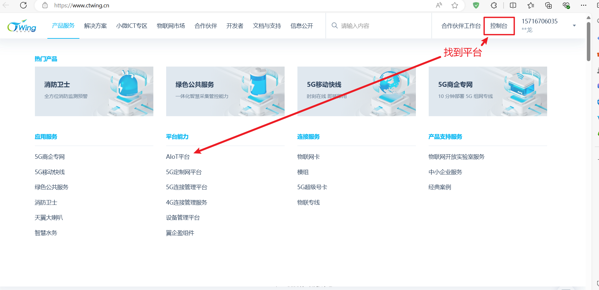

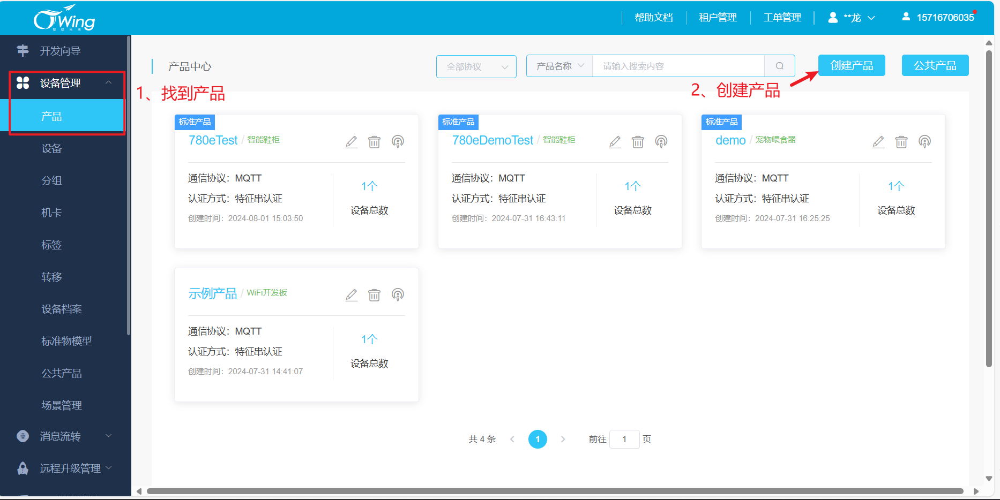

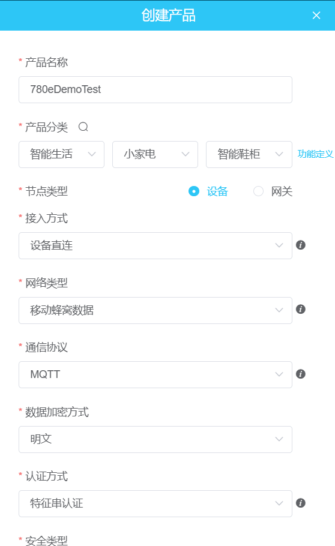

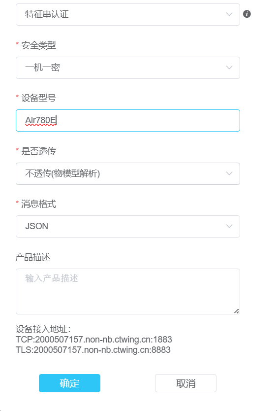

### 2、在产品中添加设备

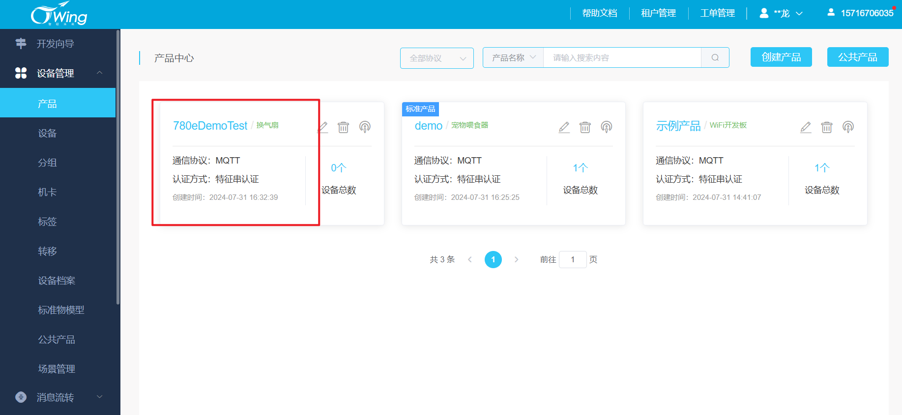

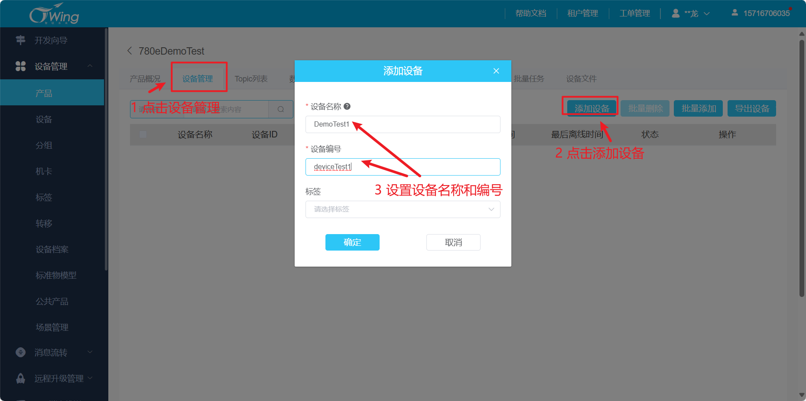

### 3、在程序中添加设备认证信息

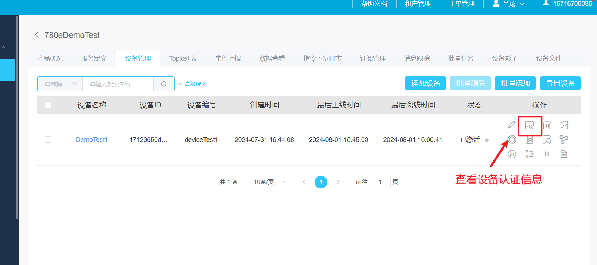

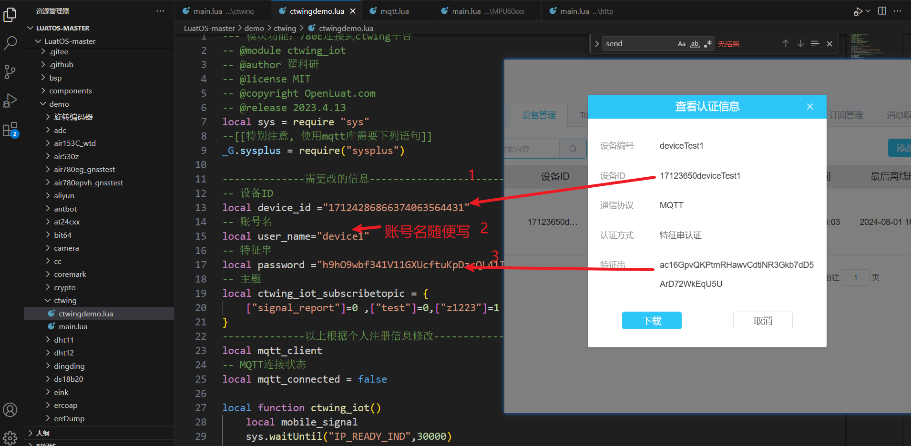

### 4、固件和软件下载

使用[Luatools下载调试工具](https://gitee.com/openLuat/luatos-doc-pool/blob/master/doc/%E5%BC%80%E5%8F%91%E5%B7%A5%E5%85%B7%E5%8F%8A%E4%BD%BF%E7%94%A8%E8%AF%B4%E6%98%8E/Luatools%E4%B8%8B%E8%BD%BD%E8%B0%83%E8%AF%95%E5%B7%A5%E5%85%B7.md)工具

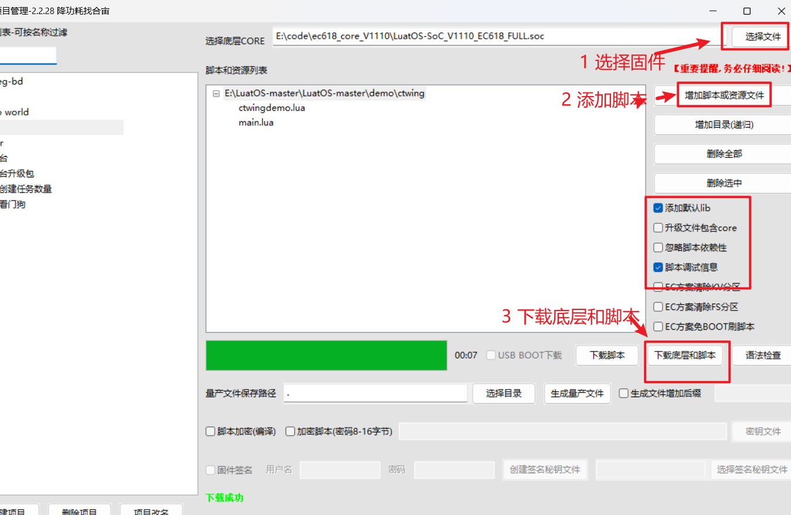

### 5、效果展示

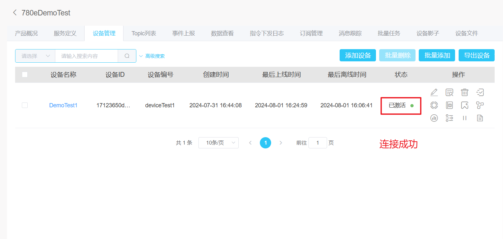

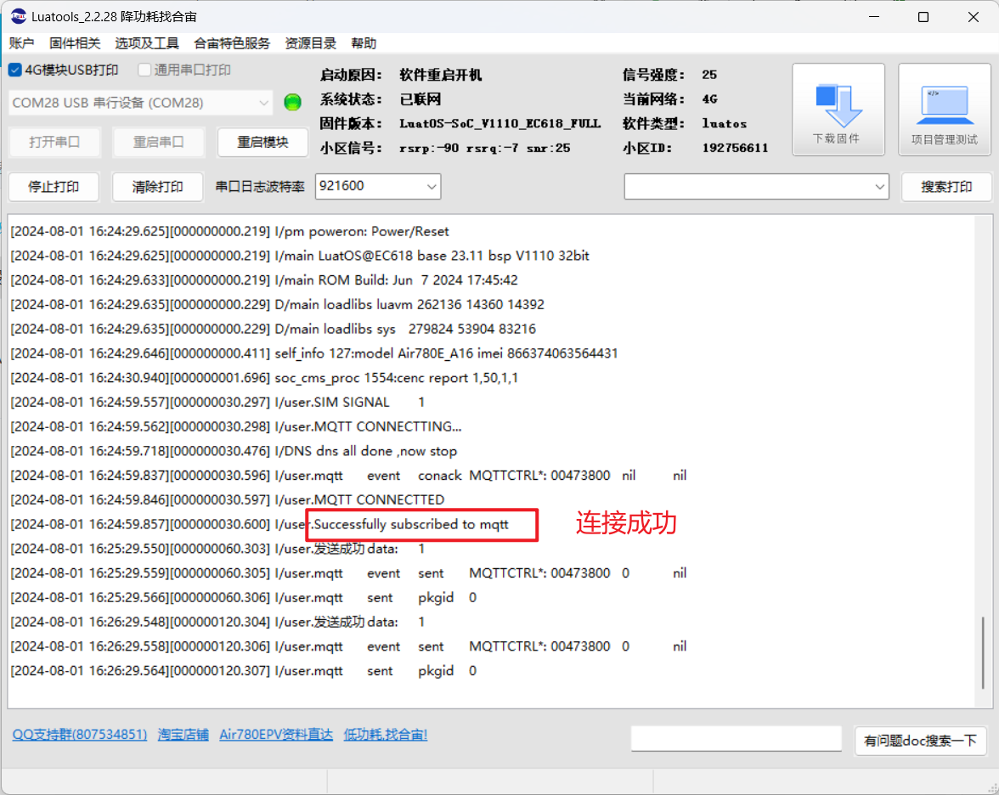


