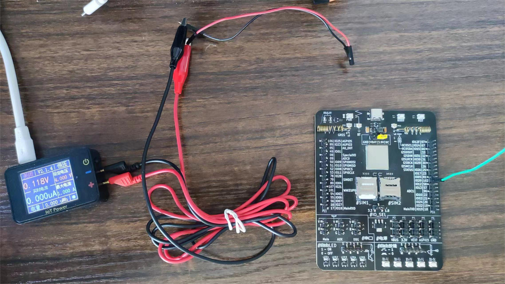
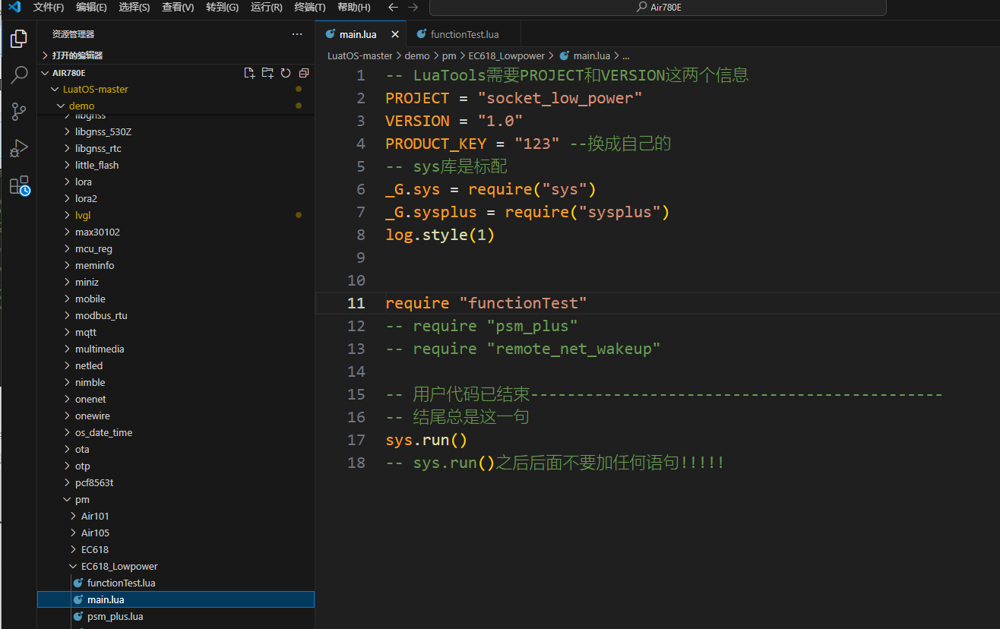
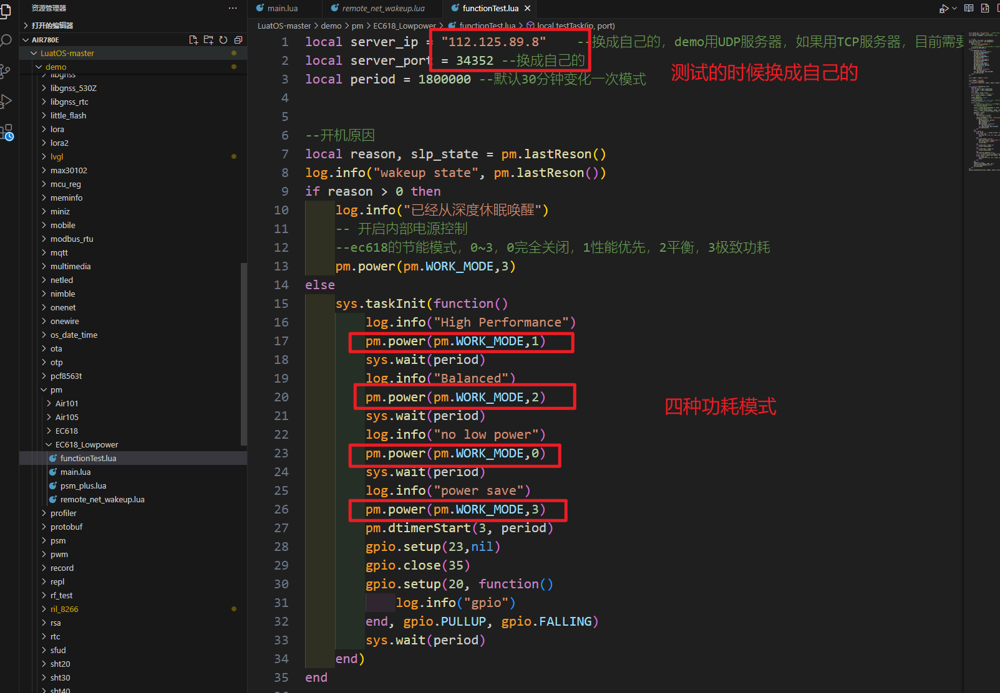
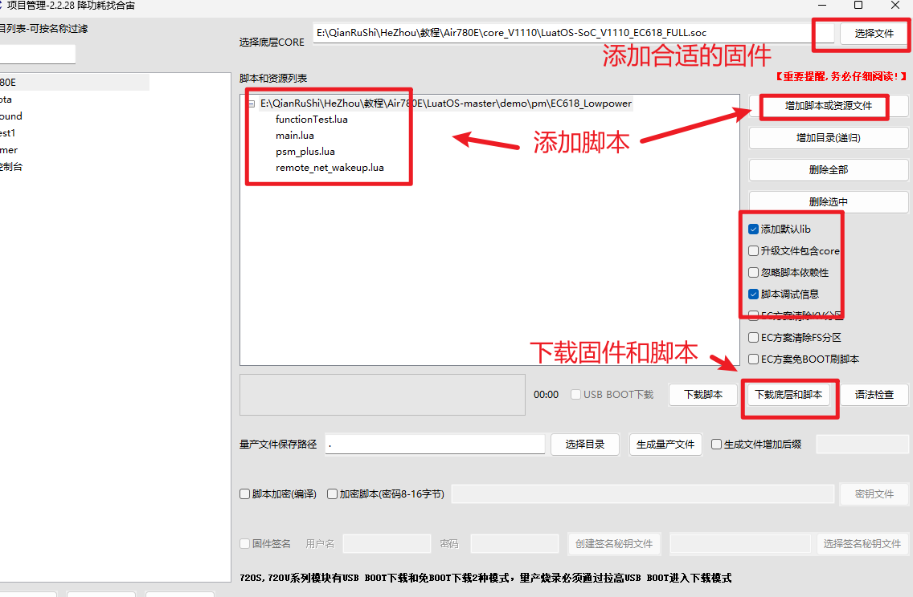
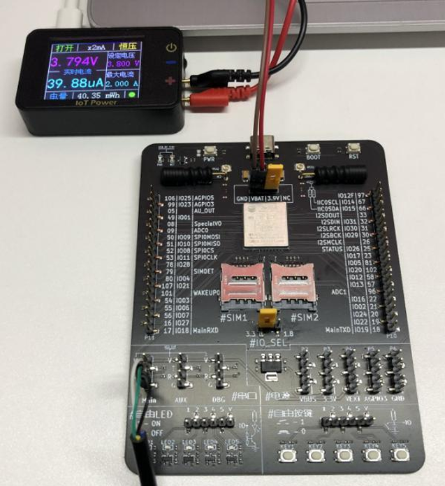
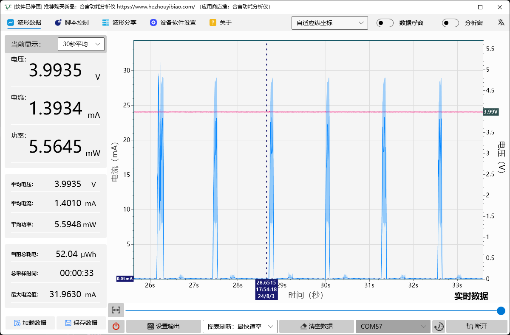
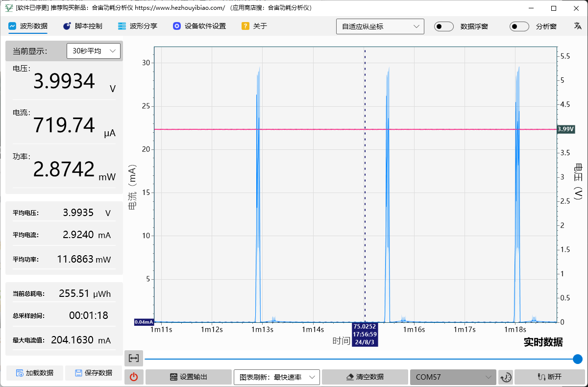
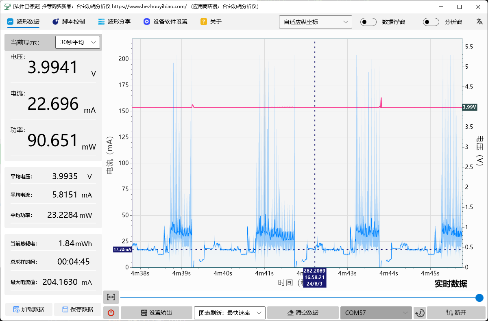
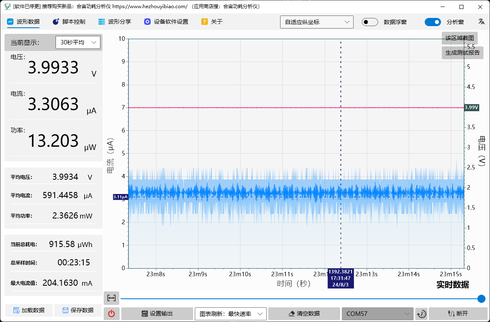
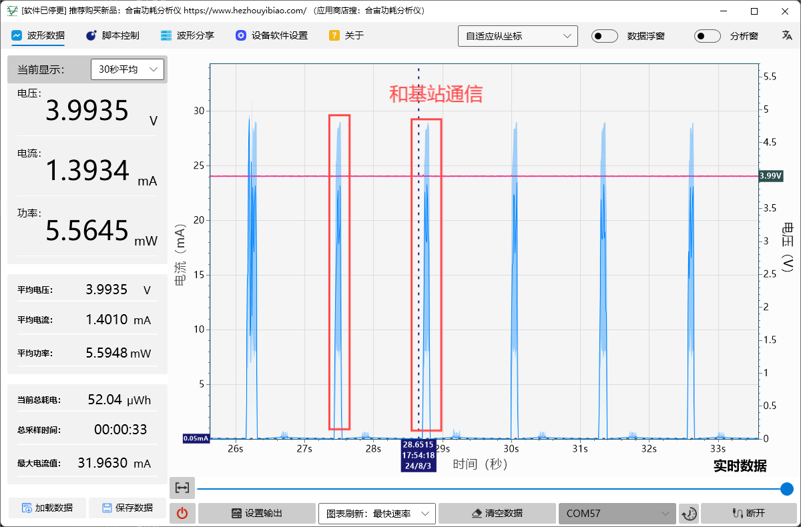

# 780E_LuatOS_pm功耗测试

- 本文档适用于780E开发板

- 关联文档和使用工具

  - [LuatOS-Soc固件获取](https://gitee.com/openLuat/LuatOS/releases)

  - [pm-demo](https://gitee.com/openLuat/LuatOS/tree/master/demo/pm)

  - [Luatools下载调试工具](https://gitee.com/openLuat/luatos-doc-pool/blob/master/doc/%E5%BC%80%E5%8F%91%E5%B7%A5%E5%85%B7%E5%8F%8A%E4%BD%BF%E7%94%A8%E8%AF%B4%E6%98%8E/Luatools%E4%B8%8B%E8%BD%BD%E8%B0%83%E8%AF%95%E5%B7%A5%E5%85%B7.md)
  
  - [IoT Power使用教程](https://wiki.luatos.com/iotpower/power/index.html)

## 1、环境准备

780E开发板一个，IoT Power一个




## 2、程序示例介绍

### API介绍

| API接口                     | 描述                                                         |
| --------------------------- | ------------------------------------------------------------ |
| pm.lastReson()              | 开机原因,用于判断是从休眠模块开机,还是电源/复位开机          |
| pm.power(id, onoff)         | 开启内部的电源控制，注意不是所有的平台都支持，可能部分平台支持部分选项，看硬件 |
| pm.dtimerStart(id, timeout) | 启动底层定时器,在休眠模式下依然生效. 只触发一次，关机状态下无效 |

**常量**

| 常量         | 类型   | 解释                                                         |
| ------------ | ------ | ------------------------------------------------------------ |
| pm.NONE      | number | 不休眠模式                                                   |
| pm.IDLE      | number | IDLE模式                                                     |
| pm.LIGHT     | number | LIGHT模式                                                    |
| pm.DEEP      | number | DEEP模式                                                     |
| pm.HIB       | number | HIB模式                                                      |
| pm.USB       | number | USB电源                                                      |
| pm.GPS       | number | GPS电源                                                      |
| pm.GPS_ANT   | number | GPS的天线电源，有源天线才需要                                |
| pm.CAMERA    | number | camera电源，CAM_VCC输出                                      |
| pm.DAC_EN    | number | Air780E和Air600E的DAC_EN(新版硬件手册的LDO_CTL，同一个PIN，命名变更)，注意audio的默认配置会自动使用这个脚来控制CODEC的使能 |
| pm.LDO_CTL   | number | Air780E和Air600E的LDO_CTL(老版硬件手册的DAC_EN，同一个PIN，命名变更)，Air780EP的LDO_CTL, 注意audio的默认配置会自动使用这个脚来控制CODEC的使能 |
| pm.PWK_MODE  | number | 是否开启ec618的powerkey滤波模式，true开，注意滤波模式下reset变成直接关机 |
| pm.WORK_MODE | number | ec618的节能模式，0~3，0完全关闭，1性能优先，2平衡，3极致功耗 |
| pm.IOVL      | number | 所有GPIO高电平电压控制,当前仅ec618系列可用                   |

**pm.lastReson()**

**参数**

无

**返回值**

| 返回值类型 | 解释                                                         |
| ---------- | ------------------------------------------------------------ |
| int        | 0-上电/复位开机, 1-RTC开机, 2-WakeupIn/Pad/IO开机, 3-未知原因(Wakeup/RTC皆有可能)开机,目前只有air101,air103会有这个返回值 |
| int        | 0-普通开机(上电/复位),3-深睡眠开机,4-休眠开机                |
| int        | 复位开机详细原因：0-powerkey或者上电开机 1-充电或者AT指令下载完成后开机 2-闹钟开机 3-软件重启 4-未知原因 5-RESET键 6-异常重启 7-工具控制重启 8-内部看门狗重启 9-外部重启 10-充电开机 |

**pm.power(id, onoff)**

开启内部的电源控制，注意不是所有的平台都支持，可能部分平台支持部分选项，看硬件

**参数**

| 传入值类型 | 解释                                                     |
| ---------- | -------------------------------------------------------- |
| int        | 电源控制id,pm.USB pm.GPS之类                             |
| boolean    | or int 开关true/1开，false/0关，默认关，部分选项支持数值 |

**返回值**

| 返回值类型 | 解释                        |
| ---------- | --------------------------- |
| boolean    | 处理结果true成功，false失败 |

**pm.dtimerStart(id, timeout)**

启动底层定时器,在休眠模式下依然生效. 只触发一次，关机状态下无效

**参数**

| 传入值类型 | 解释               |
| ---------- | ------------------ |
| int        | 定时器id,通常是0-5 |
| int        | 定时时长,单位毫秒  |

**返回值**

| 返回值类型 | 解释     |
| ---------- | -------- |
| boolean    | 处理结果 |

### 主程序



这段程序中有如下四种模式：



## 3、程序烧录



## 4、效果展示

烧录之后。因为USB供电时无法进入低功耗模式，所以使用GND|VBAT给模组供电，电压3.3V-4.3V。可参考[开发板EVB-Air780E-IO使用说明](https://cdn.openluat-luatcommunity.openluat.com/attachment/20231009103600243_开发板EVB-Air780E-IO使用说明V1.2.0.pdf)




### 1、pm.WORK_MODE=1模式，参考功耗：




### 2、pm.WORK_MODE=2模式，参考功耗：




### 3、pm.WORK_MODE=0模式，参考功耗：




### 4、pm.WORK_MODE=3模式，参考功耗：




### 5、常见问题

## 常见问题

**一、飞行模式和超低功耗模式哪个更省电？**
		飞行模式的功耗更低，但退出飞行模式重新联网需要时间，飞行模式下，没法维持模块与服务器连接，根据实际业务情况选。
		如果开关飞行频率过大，功耗也会增加。
**二、为什么模块无法进入休眠**

1. 查看模块是否插入USB（指USB_VBUS,USB_DM,USB_DP都有电压），USB连接的状态下模块保持唤醒，无法休眠

2. 使用开发板和自己的板子烧录adc的demo进行对比，看模块是否能够进行休眠

3. 使用pm.check()接口查询脚本休眠状态。

4. 定时器的频率会影响到休眠功耗。

   例如：
   sys.wait(10)和sys.wait(100);
   sys.timerStart(function() [log.info](http://log.info/)(“TEST”) end,10)
   和
   sys.timerStart(function() [log.info](http://log.info/)(“TEST”) end,100)

   休眠状态下、定时器的频率越高，模块功耗越高

   要想实现低功耗，不仅要进入低功耗模式，同时代码也要注意尽量少的触发唤醒，否则一直频繁唤醒的话，进入低功耗模式就没有意义了。

```
   如果以上四条排查过以后都无异常，则按照下面两个测试项测试
1：屏蔽自己的代码，看是由哪部分代码使模块无法休眠
2：用模块开发板和自己的硬件烧录同一份软件做对比，排查硬件影响
```

**三、为什么串口1在休眠状态下也能正常收发数据**

```
     uart1在core中做了特殊处理，可以实现休眠状态下接收数据不丢失
```

**四、是否进入低功耗模式要看实际功耗情况，不要只看打印。**

**五、进入低功耗模式1和2时，每个几秒会有一个小尖峰**

​		这是因为模块在和基站通信。




