# Luatools下载调试工具

>作为由合宙所提供的单机版调试工具，Luatools支持最新固件获取、固件打包、trace打印、单机烧录等功能
>
>此工具适用于合宙的SoC、cat1模块、cat4模块、2G模块

# 环境要求

>此工具运行于win7及以上系统，不支持mac和linux
>
>注：EC618（例：Air780E）、EC7XX（例：Air780EP/Air780EQ/Air700ECQ/Air201）芯片平台的模块由于USB驱动适配，不支持在win10以下系统上使用

# 下载与安装

## Luatools下载

1. 直接下载：[Luatools下载调试工具](https://luatos.com/luatools/download/last)
2. 工具大全：[LuatOS工具大全](http://www.openluat.com/Product/file/luatoolsV2-redirect.html)

## Luatools安装

1. 工具下载后的文件名为：Luatools_v2.exe

 

2. 在win系统--D盘（或其他盘）推荐在根目录下新建文件名并重命名为 LuaTools，目录太深可能会导致工具某些功能会出问题。

 

3. 将下载的Luatools_v2.exe拷贝或移动到新建的LuaTools文件夹内
   **注意：若出现危险提醒，无需理会，继续下载即可**

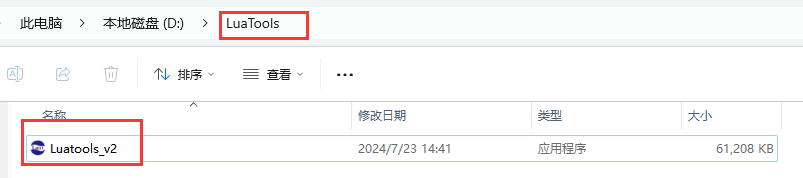

4. 鼠标左键单击Luatools_v2.exe后右键发送快捷方式到桌面即可

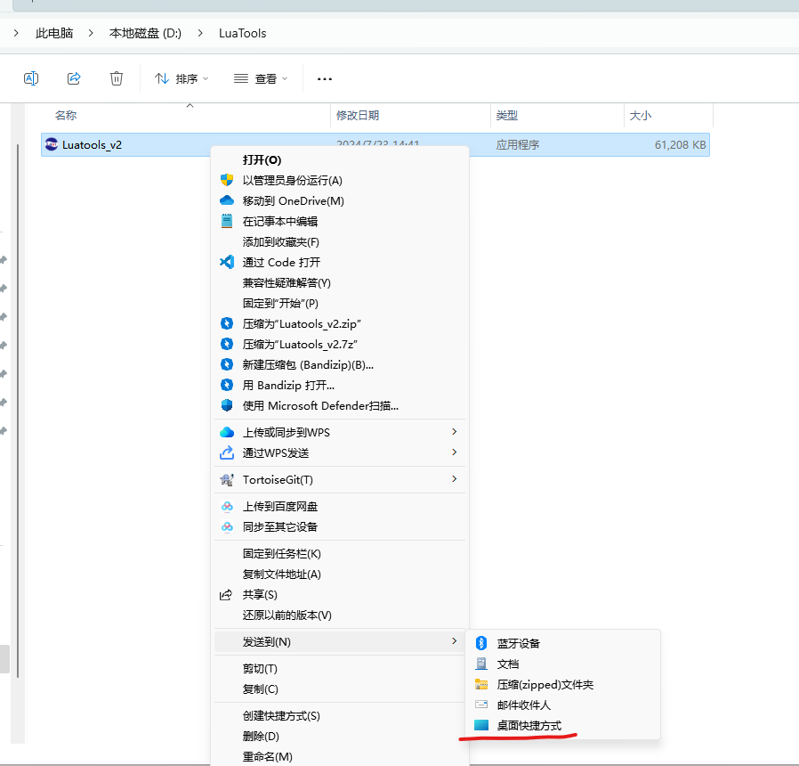

5. 双击Luatools_v2.exe启动程序并更新
   **注意：如果有杀软拦截，请务必通过！！！务必通过！！！务必通过！！！**

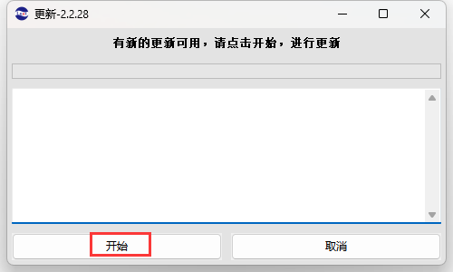

6. 更新完成后，LuaTools文件夹会生成几个文件夹

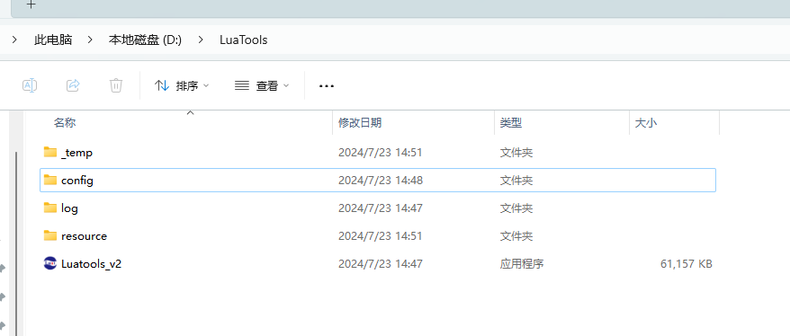

# 功能介绍

## 文件夹功能介绍

1. _temp 文件夹：临时文件

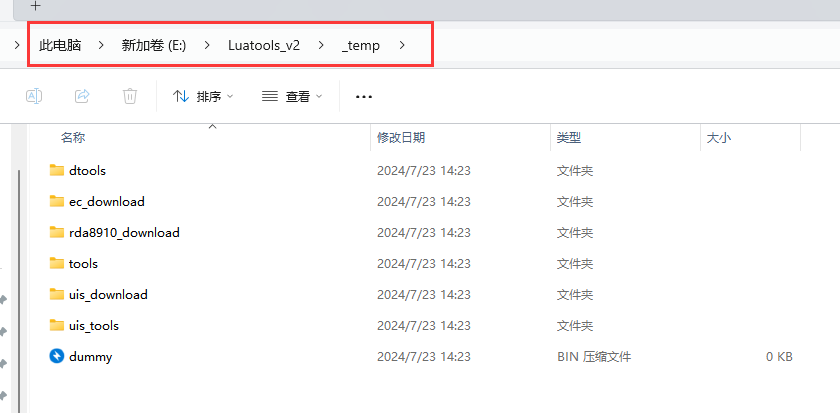

2. config 文件夹：对Luatools_v2进行的一些配置会存放到这个文件夹

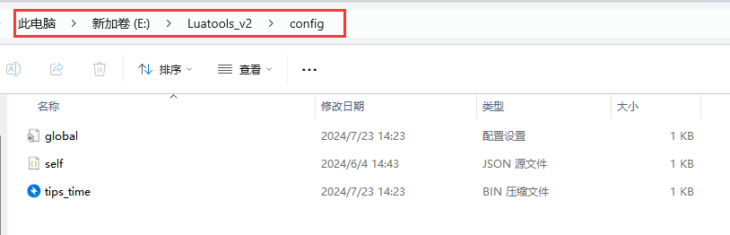

3. log 文件夹：里面存放有模块输出的各种日志信息，当模块出现问题需要向合宙技术人员寻求技术支持的时候，就需要提交这个目录下的文件
   - 4gdiag 文件夹：ap和cp日志
   - ramdump 文件夹：死机dump文件
   - main_xxxxxx：模块输出的调试日志
   - trace_xxxxxx：Luatools工具输出的日志

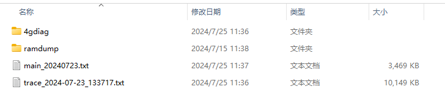

4. resource 文件夹：合宙模块相关的AT固件，LuaTask开发的Core底层固件，Lib库和demo脚本
   - aa_bb_lod 文件夹：aa表示芯片平台，bb表示开发方式（at / lua）
   - 8910_script 文件夹：展锐8910平台的demo和Lib
   - soc_script 文件夹：gitee luatos主仓库更新的demo和Lib

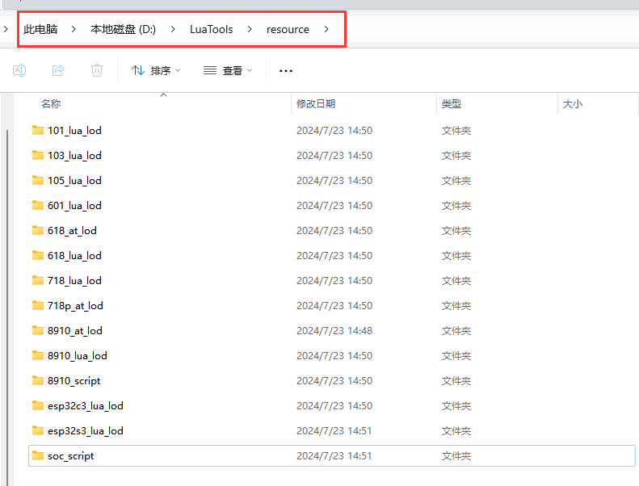

5. project 文件夹：使用项目管理后会自动生成这个目录，用于管理下载项目

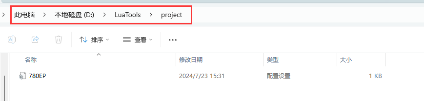

## 主界面介绍

1. 账户
   - 登录：使用购买时销售为你自动创建的erp账号登陆，可以在技术人员（FAE）远程支持客户时协助抓取本机log
   - 合宙商城：链接至[合宙商城](https://appc6kjfor22343.h5.xiaoeknow.com/)
   - Luat物联平台：远程升级或debug时用，链接至[合宙云平台](https://iot.openluat.com/cloud/main?from=luatools)
   - 经纬度查询：开发基站定位时会用到，链接至[定位查询](http://bs.openluat.com/bs?from=luatools)
   - 模块生产信息查询：查询模块出厂信息时用，链接至[合宙售后管理系统](https://aftersale.openluat.com/?redirect=https%3A%2F%2Faftersale.openluat.com%2Findex%2Fwelcome)
   - 官方淘宝店：合宙官方的淘宝店，链接至[上海合宙LuatOS官方企业店](https://luat.taobao.com/)
   - DTU管理平台：链接至[DTU管理系统](https://dtu.openluat.com/)
   - Exit：退出工具

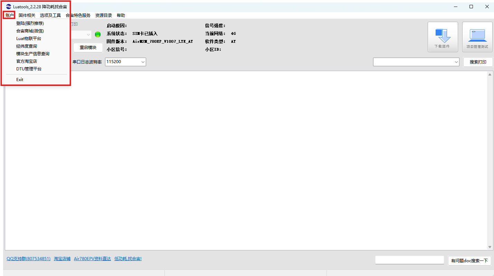

2. 固件相关

   - 4G-Cat.1：4G-Cat.1模组固件相关的操作

   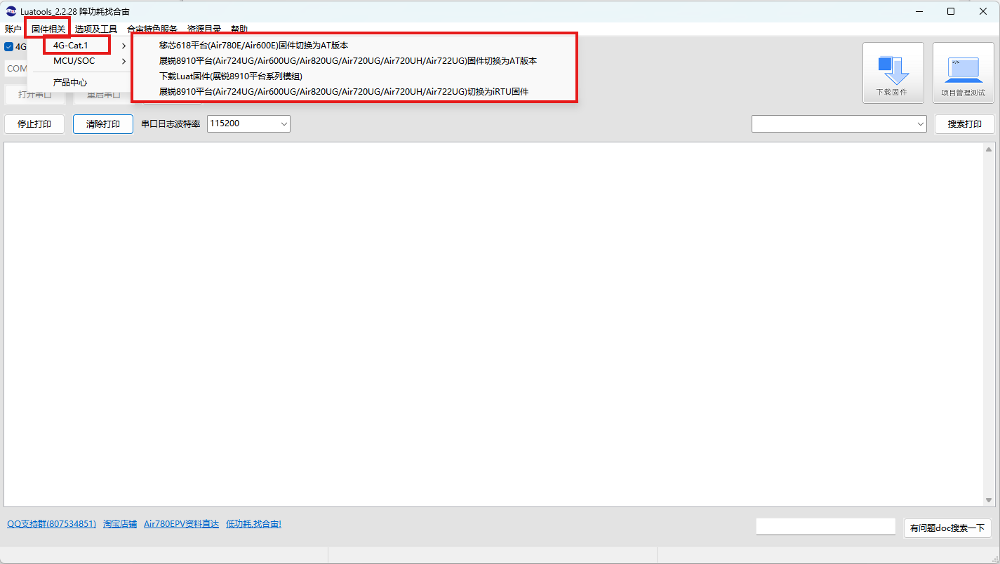

   - MCU/SOC：MCU/SOC相关资料与文档

   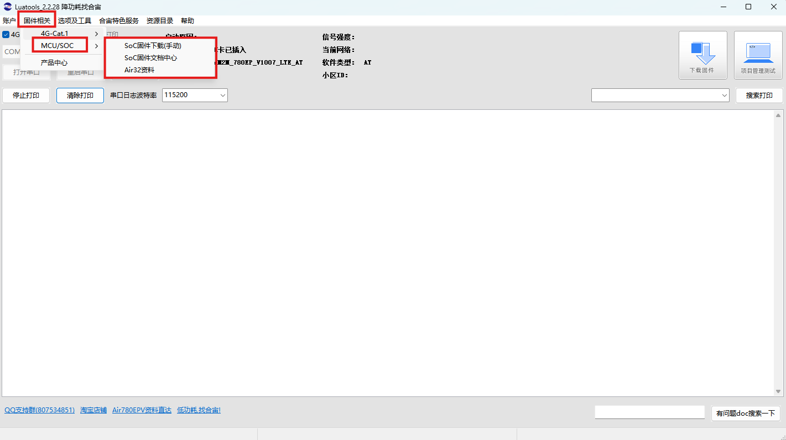

   - 产品中心：合宙官网，链接至[上海合宙通信](https://official.openluat.com/)

   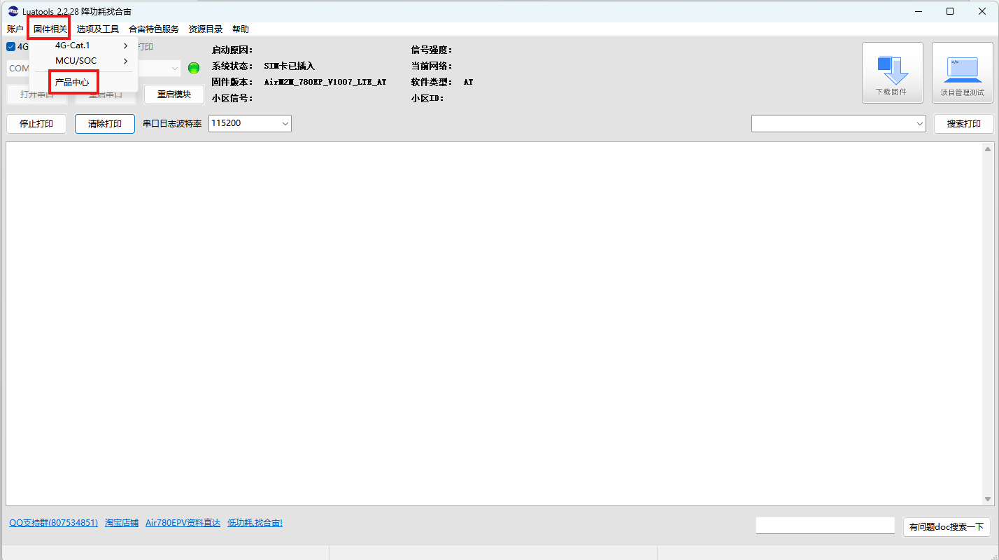

3. 选项与工具

   - 工具配置：点击log，当配合技术人员抓取bug日志时在此页面打开log功能，例如AP与CP日志，若使用工具经常遇到蓝屏，可先关闭底层日志的抓取

   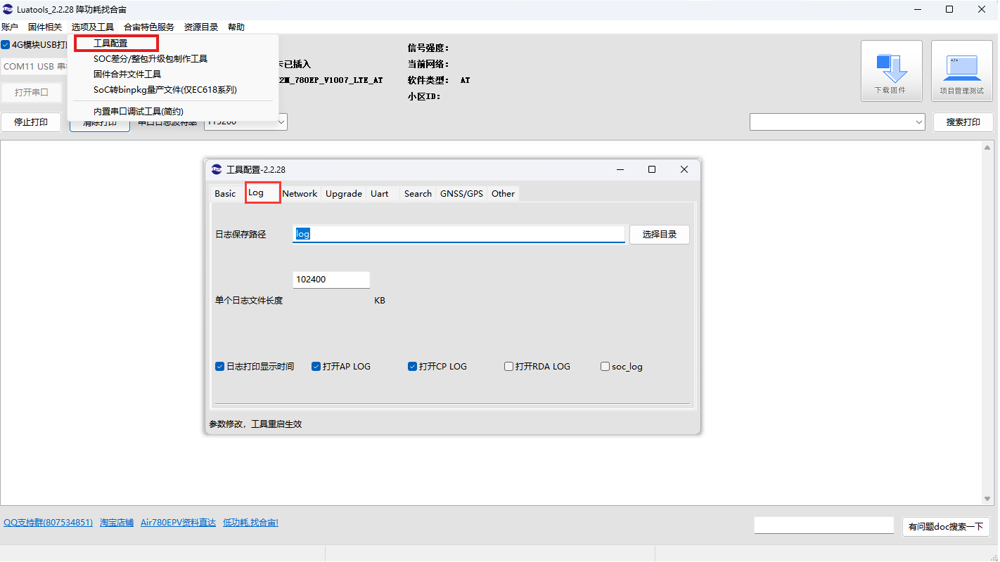

   - SOC差分/整包升级包制作工具：可生成差分包或整包，用于FOTA远程升级使用，**由于部分模块不支持在该工具上生成，具体以各模块FOTA远程升级例程上的要求为准**
   
   
   
   - 固件合并文件工具：固件合入bin文件，**EC618（例如780E等）使用xxx.binpkg，EC7XX（例如780EP等）使用xxx.soc**
   
   
   
   - Soc转binpkg量产文件：
   
   
   
   - 内置串口调试工具（简约）
   
   

4. 合宙特色服务

   - ERP模块生产记录：输入IMEI号可直接查询模块生产信息

   

   - FOTA远程升级服务：在IOT平台通过一系列操作后可对模块进行FOTA远程升级操作，与之同时还可以进行实时调试等操作。链接至：[合宙云平台 ](https://iot.openluat.com/cloud/main)

   

   - LBS基站定位服务：

   

   - NetLab公网透传调试：可进行TCP/UDP透传测试。链接至：[LuatOS 网络测试工具](https://netlab.luatos.com/)

   

   - Air7xxUx系列差分服务：用于Air7xxUx系列差分包生成服务。链接至：[差分包服务](https://gitee.com/openLuat/web-dtool-service)

   

   - DTU透传固件（iRTU）：链接至：[iRTU](https://gitee.com/hotdll/iRTU)

   

   - IotProxy云平台密钥分发服务：各云平台密钥分发。链接至：[iot-regproxy](https://gitee.com/openLuat/iot-regproxy)

   

5. 资源目录
   - 固件和demo目录：[文件夹功能介绍](# 文件夹功能介绍)中所提及的resource文件夹
   - 本地日志目录：[文件夹功能介绍](# 文件夹功能介绍)中所提及的log文件夹
   - 本地项目目录：[文件夹功能介绍](# 文件夹功能介绍)中所提及的project文件夹
   - Iot自助绑定固件：
   - 历史版本工具和固件下载：工具、固件、文档等一系列资料。链接至：[合宙云盘目录](https://pan.air32.cn/s/DJTr?path=%2F)

6. 帮助
   - LuaTools教程：LuaTools 上手教程。链接至：[LuaTools 上手教程](https://doc.openluat.com/article/1719/0?from=luatools)
   - Luat社区：各种模块资料、lua入门教程和工具等。链接至：[Luat社区](https://doc.openluat.com/wiki/21?wiki_page_id=5822)
   - LuatOS-Air入门教程：LuatOS-Air二次开发入门教程。链接至：[Luat入门教程](https://doc.openluat.com/wiki/26?wiki_page_id=3020)
   - 技术支持QQ群：有解决不了的问题可加群询问。群号807534851
   - wiki：链接至：[LuatOS文档](https://wiki.luatos.com/)
   - 销售总监：有需要购买可联系陆总（18616258958）
   - 检查新版本：启动软件时会自动检查是否有新版本，也可通过手动点击检查
   - 每日tips

7. 日志打印窗口

   

   - 支持4G模块USB（默认）打印和通用串口打印日志
   - 在非USB打印时，可选择通用串口工具在windows设备管理器对应的端口号，例如USB-TTL：

    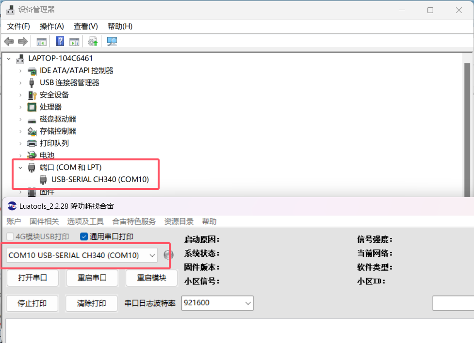

   - 开始/停止打印可以暂停文本区的自动滚动打印
   - 清除打印可以清空文本区的打印日志，但是不会删除log文件夹下的文件内容

8. 模块状态显示窗口
   - 启动原因：模块开机原因
   - 系统状态：如果文本区中存在对应的日志，这里会显示SIM卡、网络注册等信息
   - 固件版本：这里仅仅显示core的版本信息，例如AT或者Luat的版本信息，不显示Lib和用户脚本的版本号
   - 小区信号：显示模块接入主小区 RSRQ、RSRP、SNR 信号值
   - 信号强度：这里显示GSM的信号强度。**信号强度与卡是否欠费无关，不插卡也可以有信号强度**
   - 当前网络：网络类型，例如 4G网络
   - 软件类型：这里是指Core的类型，例如Luatask或者AT
   - 小区ID：显示模块接入主小区的cellid

9. 下载固件入口
   - 除第二步点击选择文件后选择固件外，也可以直接拖动固件至该界面
   - 除AT固件外，可根据自己需要选择是否操作第三步，不需要可跳过第三步

10. 项目管理入口
    - 详细操作教程在[项目管理](# 项目管理)

11. 搜索打印
    - 通过关键词搜索可直接跳转到与之相匹配内容行

12. 底部链接
    - 鼠标悬停至窗口四个边或四个角，可对窗口进行大小缩放

# 日志查看

1. 使用Luatools文本区查看日志

   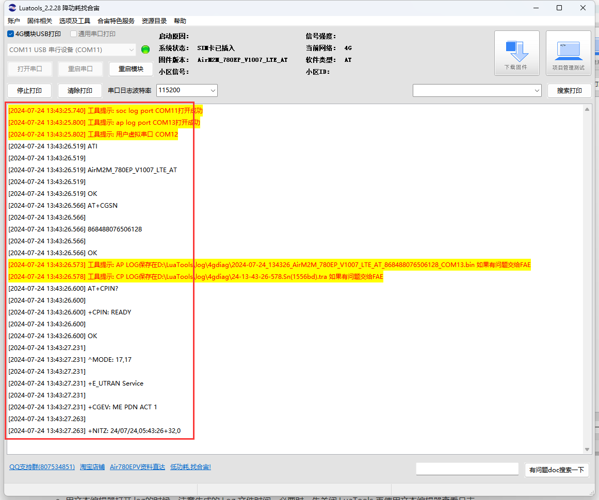

2. 使用文本编辑器直接查看log日志

   - LuaTools 的日志是 USB-TTL 或者 USB-VCOM 提供的，因此可能会独占串口
   - 用文本编辑器打开 log的时候，注意生成的 Log 文件时间，必要时，先关闭 LuaTools 再使用文本编辑器查看日志

   

   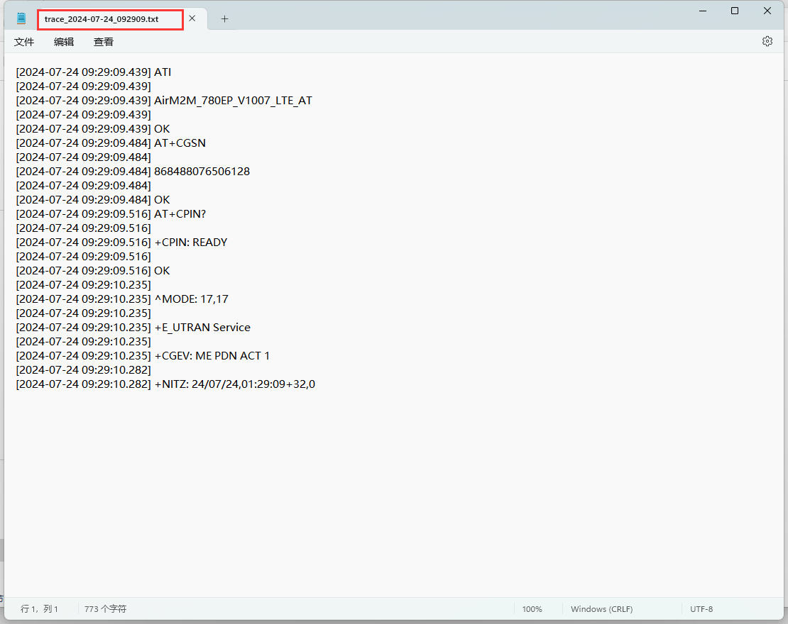

# 项目管理

> 在使用LuaTools下载源码时，强烈建议使用项目管理来进行下载，每个下载都用一个项目来区分。

## 新建项目

1. 创建项目

   

2. 输入TestSocket然后确定

   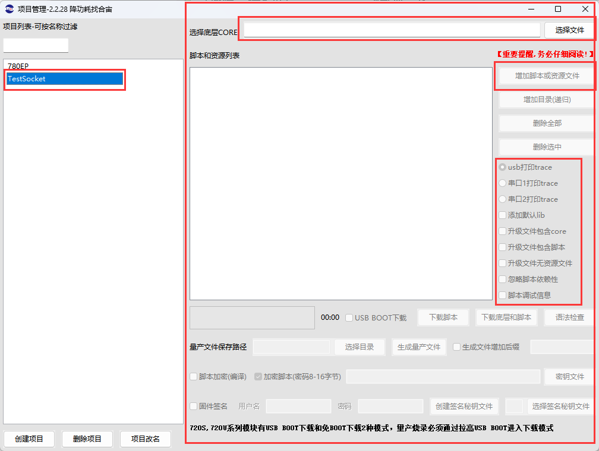

3. 单击TestSocket项目，在右侧分别填入
   - 底层Core：Lua开发的底层Core
   - 增加脚本或资源文件：添加用户脚本、数据及Lib库
   - 默认USB打印trace，trace三个选项是用来选择打印输出方式的
   - 添加默认lib：不建议勾选
   - 升级文件包含core：用于项目打包，可按需选择
   - 升级文件包含脚本：用于项目打包，建议直接勾选
   - 升级文件无资源文件：用于项目打包，不选
   - USB BOOT下载：使用Boot模式下载
   - 下载脚本：只下载脚本列表中的数据
   - 下载底层和脚本：底层core和脚本列表中的数据都下载
   - 语法检查：单独检查用户编写的脚本有无语法错误

4. **注意，首次下载时，强烈建议直接下载底层和脚本**

# 固件烧录（USB烧录）

> 首先USB连接PC，保持上电不开机状态

## AT开发

1. 点击`下载固件`按钮。

2. 选中要下载的AT固件

3. 如果是开发板按住下载模式按键（boot 键）不放，同时再长按开机键开机，这时开发板会进入下载模式，Luatools下载进度条会开始跑，这时可以松开 boot 按键。直到工具提示下载完成。

4. 如果是自己画板，需要将模块boot引脚按照对应硬件手册要求，拉高到对应电平，再按住boot按键，上电开机，这时板子会进入下载模式，Luatools下载进度条会开始跑，这时可以松开 boot 按键。直到工具提示下载完成。

## LuatOS开发

1. 在Luatools工具主界面点击"项目管理测试"

2. 如果没有新建过项目，需要先建立一个项目

3. 选择底层固件 .soc文件

4. 添加脚本以及资源文件

5. 勾选添加默认lib

6. 如果模块是第一次还没有烧录过固件，或固件更换过，需要点击"下载固件和脚本"进行烧录。如果固件不需要更改，只有脚本变动，只需要点击"下载脚本"烧录即可。

7. 如果是开发板按住下载模式按键（boot 键）不放，同时再长按开机键开机，这时开发板会进入下载模式，Luatools下载进度条会开始跑，这时可以松开 boot 按键。直到工具提示下载完成。

8. 如果是自己画板，需要将模块boot引脚按照对应硬件手册要求，拉高到对应电平，再按住boot按键，上电开机，这时板子会进入下载模式，Luatools下载进度条会开始跑，这时可以松开 boot 按键。直到工具提示下载完成。

**如果，未能成功进入下载模式，而是进入正常开模式，这时可以按住 boot 键，再短按复位按键，让开发板重启，重新进入下载模式。**

**如何判断有没有进入下载模式:可以通过 PC 端的设备管理器中虚拟出来的 USB 断开数量来判断：**

- 正常开机模式：
  
- 下载模式：
  

## 视频烧录教程

[【LuatOS-Air】Air780E烧录教程](https://www.bilibili.com/video/BV1ae4y177jo/)

# 固件烧录（Uart烧录）

## 注意事项

- Cat.1模块只有780E/780EP/780EQ/700ECQ...移芯芯片平台的支持串口烧录，也只能通过main_uart（uart1）串口进行烧录，其他串口不行
- 使用串口的前提是模块可以正常工作，所以串口烧录不能救砖。需要救砖还是要用usb+boot的方式烧录
- AT开发如果main_uart可以通过115200波特率正常通讯AT指令，那么可以不用重启，只点击下载，模块会自动进入下载模式。
- LuatOS开发串口烧录时需要重启下，才可进入下载模式。

## AT开发

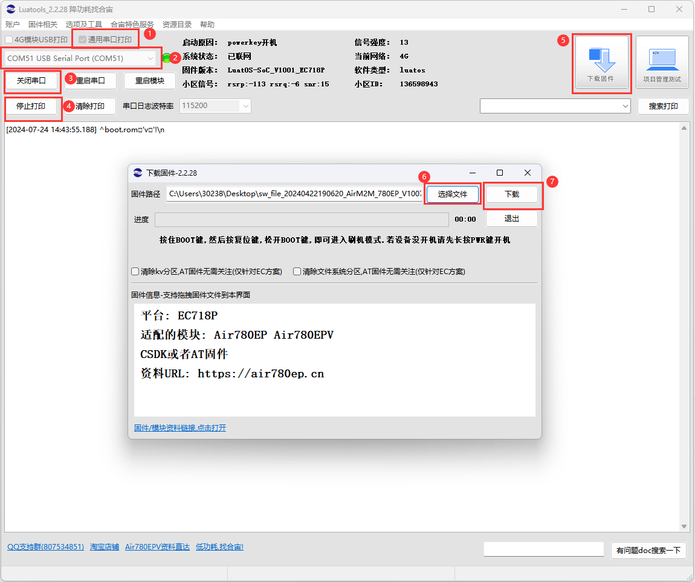

0. 获取对应模块的AT固件
    **获取方式（其一）：**[文件夹功能介绍](# 文件夹功能介绍)中的resource文件夹
1. 勾选`通用串口打印`
2. 选择对应的串口号
3. 打开串口
4. 开始打印
5. 点击`下载固件`
6. 点击`选择文件`，选择对应的AT固件
   1. 如果main_uart可以通过115200波特率正常通讯AT指令，点击下载，模块会自动进入下载模式。
   2. 如果不能通讯，请确保模块复位或者下上电通过main_uart 115200波特率可以看到"RDY"的URC上报（串口功能正常），随后点击下载，如果模块没有进入下载状态，则按下复位或者重新上下电开机，则可以进入下载状态。

## LuatOS开发

- 选择开发用到的core+脚本+lib后，生成LuatOS量产固件（后缀为 .soc）
- 8910平台量产固件生成路径在 "Luatools工具目录\4G量产文件"
- 618/718P/716E/716S平台量产固件生成路径在 "Luatools工具目录\SOC量产及远程升级文件\xxx对应芯片平台文件夹内"
- 得到固件之后，仿照AT开发的固件烧录教程进行烧录即可

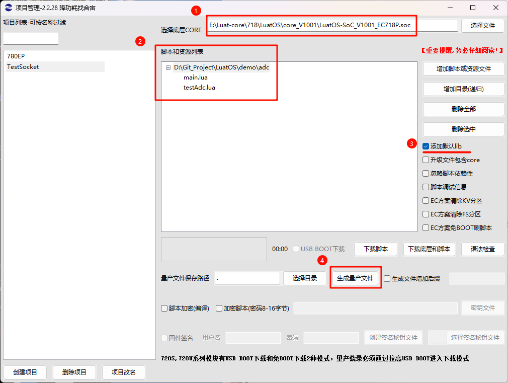

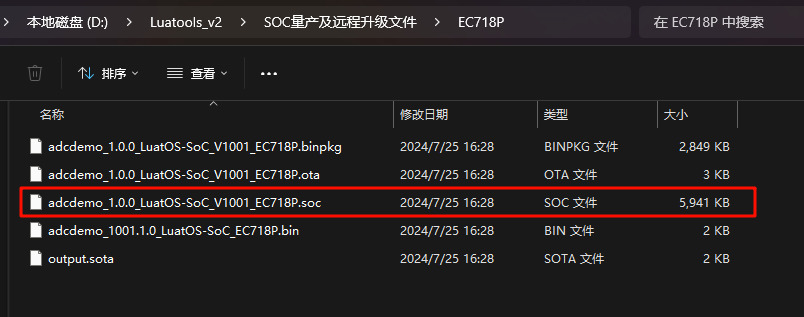

# EC方案免boot刷脚本教程

> 仅限模块在原有底层固件基础上烧录新的脚本使用，若底层固件不一致请先根据前面教程通过`下载固件和脚本`进行操作

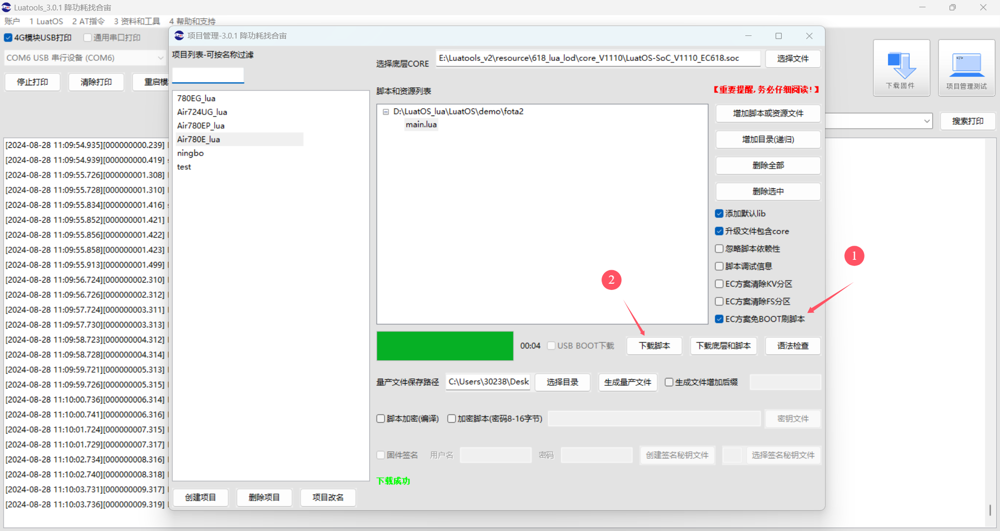

**使用流程**

1. 勾选`EC方案免BOOT刷脚本`
2. 点击`下载脚本`后，等待下载成功即可。

**特别说明**

1. 在烧录固件/脚本时，支持自动进入boot模式（要求能正常开机、正常工作）的模块有以下几种：

   - 718P芯片平台的780EP等模块；
   - 718U芯片平台的780EPT、780EPS等模块；

   对于上诉几种模块在烧录固件/脚本时，用户只需点击下载后等待自动进入boot模块即可完成烧录。

2. 在烧录脚本时，可以通过免boot下载脚本功能，直接烧录脚本到模块，
   在烧录固件时只能通过boot模块烧录，且不支持自动进入boot模式（要求能正常开机、正常工作）的模块有以下几种：

   - 618芯片平台的780E、780EX、780EG等模块；

   对于上诉几种模块在烧录固件/脚本时，用户需要点击下载后通过手动进入boot模式后才能完成烧录操作。

